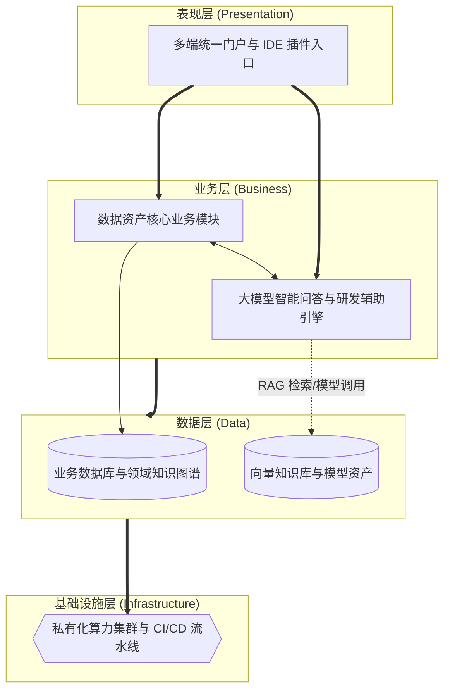

# 论大模型及 AI Coding 技术在数据资产智能管理平台中的应用

## 1. 摘要
2024年3月，我参与了某航空集团数据资产智能管理平台建设。该项目面向集团总部、5大区域中心和23个分公司，服务数据治理委员会、数据管家及运维人员等角色，提供数据资产目录、数据质量、数据安全、血缘分析、数据共享和智能问答等核心功能。在项目中，我担任系统架构师，负责平台总体架构设计和落地。本文围绕大模型及 AI Coding 技术应用展开论述，通过私有化大模型与 RAG 知识工程实现数据治理问答闭环与脱敏访问控制，基于 IDE 与 CI/CD 集成的 AI Coding 及人机协同门禁保障安全关键代码可审计交付，结合领域知识图谱与分级采纳机制抑制模型幻觉并落实安全合规审查。系统于 2025 年 8 月正式上线，截至目前稳定运行，各项功能完善、性能指标优良，有力保障业务平稳开展。

## 2. 项目背景
某航空集团业务涵盖航空客运、旅客服务、机务维修、地面服务等领域，总部数据中心、5 大区域中心及 23 家分公司长期积累了大量分散在数据库、数据仓库中的多模态数据资产。依据民航局智慧民航数据管理相关政策标准，集团启动数据资产智能管理平台建设，亟需构建统一的数据资产目录、质量规则库、安全策略库、血缘图谱及智能知识库，实现资产盘点、共享申请、质量治理、安全管控、智能运营一体化管理。平台需适配集团统一治理、区域分级运营、分公司轻量接入架构，支撑 10 万 + 资产目录、5000 条质量规则、年 10 亿次以上数据服务调用，同时满足 5000 并发用户、页面查询 2 秒内响应、系统可用性 99.99% 以上等高并发、高一致性技术指标。
本人作为中标方系统架构师，负责平台总体技术路线设计。经分析，平台热点集中于资产检索、智能问答、标签管理、脱敏策略等读多写少、高频访问场景。平台不仅面临海量数据的并发压力，更重要的是，航司数据资产包含旅客身份、航班动态、机组涉密信息等极高敏感度数据。若依赖公网大模型裸用将面临严重的数据出境与合规风险；同时，平台研发过程中，复杂的血缘分析算法、脱敏规则逻辑迭代频繁，纯手写难以跟上业务节奏，但涉及安全底线的核心代码绝不能“生成即上线”。平台亟需在智能化研发提效与数据安全合规之间建立可审计、可回滚的工程化边界。
所以我们团队决定基于私有化大模型及 AI Coding 技术建设该平台。平台 2025 年 8 月顺利上线，稳定支撑总部—区域多级协同访问，高峰期运行平稳，全面达成建设目标。

## 3. 问题2回应 + 过渡
由于本项目面临数据资产敏感度极高导致公网模型不可用，同时平台研发提效需求迫切但安全关键路径必须可签核、可追溯的双重挑战，所以我们选用大模型及 AI Coding 技术作为平台智能化演进和架构治理的重要支撑手段。其核心包括：第一，私有化 LLM 与 RAG、提示工程及脱敏访问控制，将智能问答与质量预警等能力限制在内网与合规边界内；第二，AI Coding 与 CI/CD、代码评审联动，突出核心算法与安全敏感点变更的人机协同；第三，领域知识图谱与规则约束、分级采纳与专家抽检，抑制幻觉并明确“效率提升不能以牺牲数据安全复核为代价”。

在本项目实施中，我们正是通过私有化知识工程保障数据治理基线、AI Coding 门禁保障关键代码可审计、分级治理保障模型输出可信，完成了大模型及 AI Coding 技术的建设与应用，具体实践如下。

## 4. 正文部分

### 4.1 基于私有化 LLM 与 RAG、提示工程及脱敏访问控制，解决智能问答与共享申请的内网闭环和合规边界问题
在“跨域数据资产检索与共享申请”业务场景中，平台存在的核心痛点为：用户希望通过自然语言快速检索资产目录、质量规则和血缘信息，但相关数据涉及旅客身份、航班动态和机组排班等高敏内容，无法直接交由公网模型处理。若持续采用公网大模型直连与通用知识库问答的传统模式，极易引发数据出境、越权召回和答案失真等各类风险，进而制约平台智能检索与共享服务能力的发展目标。为破解上述难题，我们将对该场景进行私有化大模型与 RAG 知识工程升级，同时在体系架构层面重点推进内网部署、权限过滤、脱敏入库和引用可追溯机制落地。在实际落地执行中，我们先聚焦知识入库与检索增强环节，依托本地 LLM 推理集群、向量检索和条款级知识切片开展工作；再联动租户隔离、数据域授权和前端引用水印机制形成闭环推进。经此优化设计，平台在智能问答与共享申请辅助维度取得显著提升，不仅实现了 5000 名用户的毫秒级自然语言检索体验，更确保了全部问答过程始终运行在内网合规边界内，充分印证了私有化大模型与 RAG 方案在核心主链路场景中的应用价值。

### 4.2 通过AI Coding 与 CI/CD、代码评审联动，解决后台核心模块研发提效与关键代码可审计问题
在“月末全量数据质量检测与血缘解析”这一场景下，平台面临的核心矛盾是：后台核心模块迭代频繁、交付周期紧张，研发团队急需借助 AI 提升编码效率，但血缘解析、脱敏校验和权限控制等模块又属于安全关键路径，绝不能让生成代码未经审核直接进入生产。如果继续沿用纯人工开发或“生成即合入”的方式，就容易出现效率低下、审核失守和缺陷扩散等问题，从而影响平台关键能力的稳定交付。针对上述问题，我们将 AI Coding 引入该场景，并在架构上重点落实了辅助生成、自动提示、人机协同和强制签核机制。在具体实施过程中，我们在内部 IDE 中集成经安全审核的 AI Coding 插件，由其生成 CRUD 骨架、单元测试和接口 Mock；再结合 CI/CD 流水线中的 AI 辅助 Code Review 以及安全关键代码清单，对高风险模块实行双人复核与强制签核。通过上述设计，平台在研发提效与交付可控方面取得了明显成效，既将样板代码编写和单测覆盖效率提升约 40%，又建立了“谁生成、谁修改、谁复核”的完整追溯链路，验证了 AI Coding 在后台核心模块迭代场景中的工程化价值。

### 4.3 采用领域知识图谱与规则约束、分级采纳和专家抽检，解决模型幻觉与数据安全合规审查问题
立足“敏感数据脱敏策略与访问控制”应用场景，平台当前亟待解决的核心矛盾是：大模型虽然能够提升规则解释与 SQL 生成效率，但一旦出现“幻觉”，就可能输出错误的脱敏建议、共享策略甚至编造字段。若持续采取“模型直接给答案、人工凭经验判断”的运行模式，极易滋生前后不一致、边界漏判和合规失守等各类问题，直接影响平台数据安全治理的核心发展效能。围绕上述痛点，我们将对该场景实施知识图谱与规则引擎联动优化重塑，并在底层架构层面重点夯实规则裁决、分级采纳和对抗回归建设工作。在具体落地推进过程中，我们先行布局知识图谱和规则判定环节，以“模型负责建议、规则负责决定”为核心实施路径；同步融合三级采纳策略、极端样例回归测试和专家抽检机制强化整体落地成效。凭借该套优化设计方案，平台在安全策略智能辅助领域取得显著成效，既实现了模型能力可控使用的核心目标，也达成了幻觉误导导致违规操作率为零的发展预期，有力验证了规则约束下使用大模型在敏感场景中的可行性。

## 5. 总结
在某航空集团数据资产智能管理平台建设中，我通过私有化航务知识工程、AI Coding 人机协同门禁、幻觉与合规分级治理为核心，完成大模型及 AI Coding 技术架构设计落地。平台自2025年8月正式上线以来，已稳定运行至今，成功支撑超10万项资产目录管理、5000余条质量规则执行以及年10亿次以上数据服务调用，核心热点查询响应时间稳定控制在300毫秒级，智能问答准确率达90%以上，系统整体可用性达到99.99%以上，取得了优异的建设效果。

项目复盘发现架构存在不足：一是随着知识库规模的快速膨胀，向量检索与大模型推理的资源消耗呈指数级上升，在早高峰集中查询时偶现排队延迟；二是 AI Coding 工具目前主要停留在单点代码辅助层面，对于跨微服务、跨库的复杂架构级重构建议能力依然薄弱。后续将针对性优化：引入 vLLM 等高效推理框架及模型量化技术（如 INT8/AWQ），并结合大模型算力动态路由调度，提升高峰期的推理并发吞吐量；同时探索基于多智能体（Multi-Agent）协同的研发辅助模式，结合全局代码库上下文（Repository-level Context），进一步提升跨模块重构与复杂业务编排的自动化生成能力，持续深化智能化技术融合，助力该航空集团数字化高质量发展。

## 6. 系统架构设计图

结合平台在私有化大模型及 AI Coding 技术应用场景中的实践，整体架构按照表现层、业务层、数据层和基础设施层自上而下进行设计。以下为该系统架构的简化版概览图：

