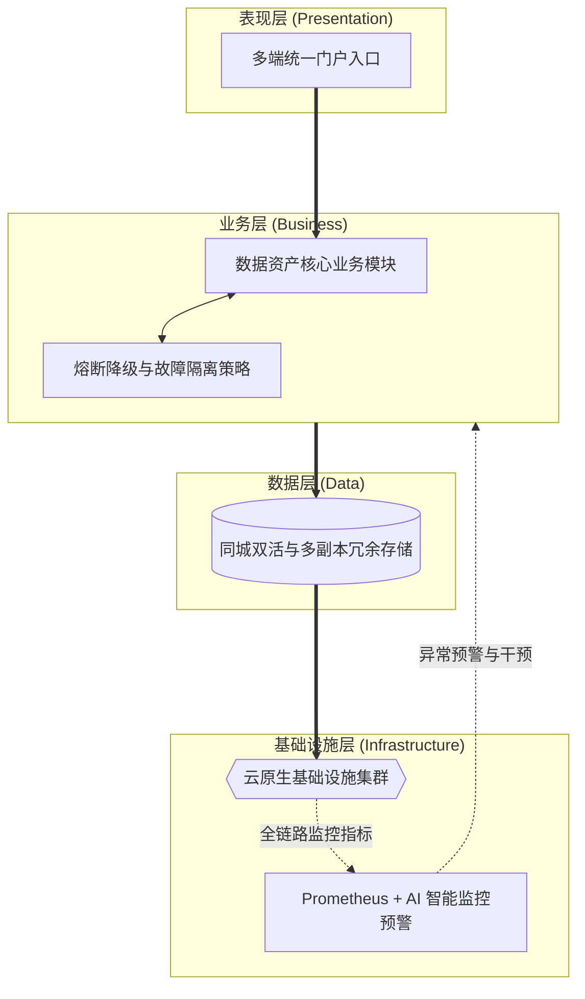

# 论云原生架构下数据资产智能管理平台的可靠性设计

## 1. 摘要
2024年3月，我参与了某国有航空集团数据资产智能管理平台建设。该项目面向集团总部、5大区域中心和23个分公司，服务数据治理委员会、数据管家、安全管理员及运维人员等多类角色，提供数据资产目录管理、数据质量管理、数据安全治理、血缘分析、数据共享和智能问答等核心功能。在项目中，我担任系统架构师，负责平台总体架构设计和关键技术落地。本文围绕云原生架构下的可靠性设计展开论述，通过硬件+软件冗余设计消除单点故障风险，依托微服务边界划分与防雪崩隔离控制问题扩散范围，结合Prometheus与大模型实现主动监控与智能预警，防患于未然。系统于2025年8月正式上线，截至2026年5月已稳定运行10个月，各项功能和性能指标良好，获得客户高度认可。

## 2. 项目背景
某国有航空集团业务涵盖航空客运、旅客服务、机务维修、地面服务等领域，总部数据中心、5 大区域中心及 23 家分公司长期积累了大量分散在数据库、数据仓库中的多模态数据资产。依据民航局智慧民航数据管理相关政策标准，集团启动数据资产智能管理平台建设，亟需构建统一的数据资产目录、质量规则库、安全策略库、血缘图谱及智能知识库，实现资产盘点、共享申请、质量治理、安全管控、智能运营一体化管理。平台需适配集团统一治理、区域分级运营、分公司轻量接入架构，支撑 10 万 + 资产目录、5000 条质量规则、年 10 亿次以上数据服务调用，同时满足 5000 并发用户、简单查询 2 秒内响应、系统可用性 99.99% 以上等高并发、高一致性技术指标。
本人作为中标方系统架构师，负责平台总体技术路线设计。经分析，平台热点集中于资产检索、详情展示、标签管理、规则模板、脱敏策略、审批状态、智能问答等读多写少、高频访问数据；直连主数据库与图数据库会造成主库压力过载、区域就近访问体验差，同时目录变更、规则发布、授权审批等业务又要求极高的稳定性和容灾能力，避免核心数据节点宕机导致的授权错误、规则失效及全集团数据治理停滞风险。
所以我们团队决定基于云原生可靠性设计建设该平台。平台 2025 年 8 月顺利上线，稳定支撑总部—区域多级协同访问，高峰期运行平稳，全面达成建设目标。

## 3. 问题2回应 + 过渡
由于本项目面临资产目录、规则策略和审批授权等热点数据访问量大、跨区域访问链路长、主库承压明显，同时又存在目录变更、规则更新和权限调整必须时刻保持高可用的要求，所以我们选用云原生可靠性设计体系作为平台性能优化和架构治理的重要支撑手段。可靠性设计旨在通过架构层面的规划，减少系统受异常影响的概率。其核心包括：第一，冗余设计，通过硬件+软件同城双活与多副本消除单点故障；第二，故障隔离，通过服务限流与降级控制问题扩散范围；第三，主动监控与预警，通过Prometheus结合大模型实现异常指标的提前预判。

在本项目实施中，我们正是通过软硬件冗余部署、基于Sentinel配置限流降级、依托Prometheus+AI模型搭建监控预警体系，完成了可靠性设计方案的建设与应用，具体实践如下。

## 4. 正文部分

### 4.1 基于硬件+软件同城双活与多副本冗余设计，解决跨域检索与共享申请中的单点故障问题
在“跨域数据资产检索与共享申请”业务场景中，平台存在的核心痛点为：资产目录库和血缘数据库承载着全集团最核心的查询与审批流量，任何单点故障都会直接中断总部、区域中心和分公司的日常协同。若持续采用单机数据库和单副本服务部署的传统模式，极易引发节点宕机、机房异常和主链路长时间不可用等各类风险，进而制约平台连续服务与高可用保障的发展目标。为破解上述难题，我们将对该场景进行云原生可靠性体系升级，同时在体系架构层面重点推进双活机房、多副本部署、强一致存储和自动切换机制落地。在实际落地执行中，我们先聚焦基础设施冗余与核心服务部署环节，依托同城双活数据中心、Kubernetes StatefulSet 和 Pod 反亲和策略开展工作；再联动 TiDB 多副本集群与图数据库高可用模式形成闭环推进。经此优化设计，平台在核心业务链路高可用维度取得显著提升，不仅能够在机房或节点异常时实现秒级切换，更将“跨域检索与申请”主链路稳定支撑在 99.99% 可用性水平，充分印证了冗余设计在该平台高频访问场景中的必要性。

### 4.2 通过服务限流与降级隔离，解决月末跑批场景中的资源争抢和故障扩散问题
在“月末全量数据质量检测与血缘解析”这一场景下，平台面临的核心矛盾是：后台跑批任务会瞬时占用大量计算和连接资源，而前台用户的检索、门户访问和资产详情查询又必须持续在线。如果继续沿用缺乏隔离和降级策略的共享资源方式，就容易出现跑批抢占资源、目录服务 OOM 和局部故障向全站蔓延等问题，从而影响平台在高峰期的稳定运行。针对上述问题，我们将故障隔离与服务降级机制引入该场景，并在架构上重点落实了资源隔离、接口限流、熔断降级和影响收敛机制。在具体实施过程中，我们在 Kubernetes 层为各微服务精细配置 Requests 与 Limits，由其保证质量检测服务不会挤占目录服务等核心前台资源；再结合 Sentinel 对血缘分析、质量检测等耗时接口配置熔断与降级规则，在连续超阈值时由网关直接返回缓存结果或友好提示。通过上述设计，平台在后台重负载任务期间取得了明显成效，既有效控制了跑批任务对在线业务的冲击，又避免了局部故障演变为全局雪崩，验证了隔离与降级策略在复杂微服务场景中的实用价值。

### 4.3 采用 Prometheus 结合智能预警，解决敏感场景中的隐性故障发现滞后问题
立足“敏感数据脱敏策略与访问控制”应用场景，平台当前亟待解决的核心矛盾是：鉴权与脱敏服务既承担安全红线职责，又长期运行在跨域网络和高频调用环境中，许多风险并不会立刻表现为宕机，而是以内存泄漏、延迟抬升和错误率缓慢增长的方式逐步累积。若持续采取人工巡检和事后告警的运行模式，极易滋生风险发现滞后、故障响应被动和安全隐患放大等各类问题，直接影响平台安全稳定保障的核心发展效能。围绕上述痛点，我们将对该场景实施主动监控与智能预警优化重塑，并在底层架构层面重点夯实全链路采集、基线识别、趋势预判和提前干预建设工作。在具体落地推进过程中，我们先行布局指标采集与基线建模环节，以 Prometheus 汇聚节点、容器、JVM 和业务指标并接入集团自建大模型分析引擎为核心实施路径；同步融合异常趋势识别与预警推送机制强化整体落地成效。凭借该套优化设计方案，平台在隐性故障发现与风险前移领域取得显著成效，既实现了安全类异常由“事后发现”向“事前预警”转变的核心目标，也达成了隐性故障发现率提升 80% 的发展预期，有力验证了主动监控体系在敏感场景下的可靠性保障作用。

## 5. 总结
在国有航空集团数据资产智能管理平台建设中，我通过硬件与软件冗余设计、微服务故障隔离、主动监控与智能预警为核心，完成云原生可靠性架构设计落地。平台自2025年8月上线以来，已稳定运行10个月，成功支撑超10万项资产目录管理、5000余条质量规则执行以及年10亿次以上数据服务调用，核心热点查询响应时间稳定控制在300毫秒级，数据库读压力显著下降，系统整体可用性达到99.99%以上，取得了较好的建设效果。

项目复盘发现架构存在不足：一是跨区域多活架构下的数据同步延迟问题，在网络条件较差的分公司节点，部分大体积数据字典的同步偶发延迟，影响了本地查询的一致性；二是大模型智能预警的算力调度仍不够灵活，在夜间跑批高峰期，分析引擎自身占用了较多算力资源；三是自动化运维能力有待完善，部分灾备演练和配置更新依赖人工操作，存在人为操作风险。后续将针对性优化：引入更高效的增量同步与边缘缓存机制，降低跨域同步延迟；优化大模型推理资源池的弹性调度策略，错峰执行预警分析任务；同时完善全流程自动化运维体系，实现灾备切换自动化、部署流水线化，降低人工干预成本与操作风险，持续提升架构可靠性与运维效率，助力该航空集团数字化高质量发展。

## 6. 系统架构设计图

结合平台在云原生架构下的可靠性设计与实践，整体架构按照表现层、业务层、数据层和基础设施层自上而下进行设计。以下为该系统可靠性架构的简化版概览图：

