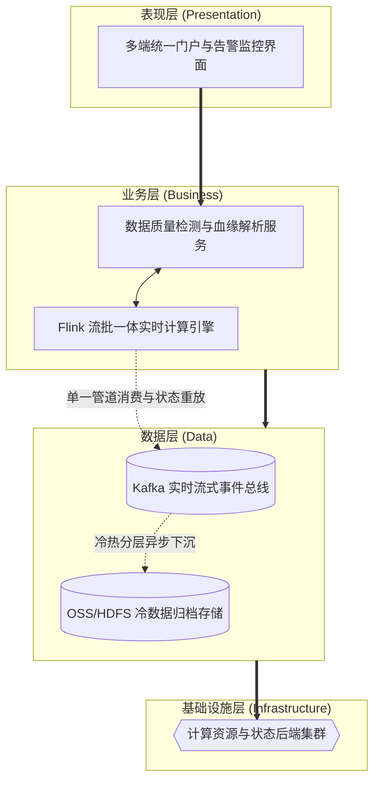

# 论大数据 Kappa 架构在数据资产智能管理平台中的设计与应用

## 1. 摘要
2024年3月，我参与了某国有航空集团数据资产智能管理平台建设。该项目面向集团总部、5大区域中心和23个分公司，服务数据治理委员会、数据管家、安全管理员及运维人员等多类角色，提供数据资产目录管理、数据质量管理、数据安全治理、血缘分析、数据共享和智能问答等核心功能。在项目中，我担任系统架构师，负责平台总体架构设计和关键技术落地。本文围绕大数据 Kappa 架构在数据资产血缘解析与质量实时检测中的设计与应用展开论述，通过以 Kafka 为可重放日志总线、Flink 流批一体计算实现数据血缘解析“一条管道一套语义”，基于与传统 Lambda 架构对比下的重算与单栈运维显著降低了质量规则检测的口径漂移与运维成本，结合 Topic 保留、状态后端管理与冷热分层存储，在合规与成本约束下支撑了秒级质量告警与历史资产回溯。系统于2025年8月正式上线，截至2026年5月已稳定运行10个月，各项功能和性能指标良好，获得客户高度认可。

## 2. 项目背景
某国有航空集团业务涵盖航空客运、旅客服务、机务维修、地面服务等领域，总部数据中心、5 大区域中心及 23 家分公司长期积累了大量分散在数据库、数据仓库中的多模态数据资产。依据民航局智慧民航数据管理相关政策标准，集团启动数据资产智能管理平台建设，亟需构建统一的数据资产目录、质量规则库、安全策略库、血缘图谱及智能知识库，实现资产盘点、共享申请、质量治理、安全管控、智能运营一体化管理。平台需适配集团统一治理、区域分级运营、分公司轻量接入架构，支撑 10 万 + 资产目录、5000 条质量规则、年 10 亿次以上数据服务调用，同时满足 5000 并发用户、简单查询 2 秒内响应、系统可用性 99.99% 以上等高并发、高一致性技术指标。
本人作为中标方系统架构师，负责平台总体技术路线设计。经分析，平台在“数据血缘实时解析”与“数据质量动态检测”业务上存在极高的技术挑战：一方面，数据库的 DDL 变更事件和数据接入日志必须被实时解析并更新至图数据库，以保证血缘图谱的低延迟；另一方面，当某条质量检测规则发生更新时，又需要对历史数据进行全量重算。若采用传统的流批两套逻辑并行处理，极易出现指标口径不一致与双倍的运维负担。我们需要将元数据变更日志视为可重放的无限流，统一实时增量与历史全量的分析语义。
所以我们团队决定基于大数据 Kappa 架构建设该平台核心计算层。平台 2025 年 8 月顺利上线，稳定支撑总部 — 区域多级协同访问，高峰期运行平稳，全面达成建设目标。

## 3. 问题2回应 + 过渡
由于本项目面临实时血缘更新与历史质量规则重算需同源语义，传统 Lambda 双栈维护成本高、指标易漂移，且原始元数据变更流需支持可审计重放且存储成本可控的双重挑战，所以我们选用大数据 Kappa 架构作为平台数据处理和架构治理的重要支撑手段。其核心包括：第一，贯彻 Kappa 核心思想，利用 Kafka 日志型总线与 Flink 流批一体引擎实现单管道语义；第二，相对 Lambda 架构，通过消费位点重算替代传统离线批处理，降低运维成本并消除双栈口径漂移；第三，落地平台级存储与状态管理，通过 Kafka Topic 保留周期、Flink 状态后端与冷热分层，实现秒级实时态势与历史回溯能力的成本平衡。

在本项目实施中，我们正是通过统一管道与语义、迁移核对与降本、秒级质量告警与资产回溯能力，完成了 Kappa 数据计算平台的建设与应用，具体实践如下。

## 4. 正文部分

### 4.1 基于 Kafka 与 Flink 的单流式处理体系，解决跨域状态同步中的口径不一致问题
在“跨域数据资产检索与共享申请”业务场景中，平台存在的核心痛点为：总部与区域中心之间的资产目录、共享申请状态和授权结果变化频繁，用户希望检索到的始终是最新数据，但传统定时同步或“实时一套、离线一套”的增量处理方式很容易造成各区域展示口径不一致。若持续采用多链路分散同步的传统模式，极易引发目录状态滞后、审批结果延迟和跨域检索前后不一致等各类风险，进而制约平台核心业务链路实时协同的发展目标。为破解上述难题，我们将对该场景进行 Kappa 单流式处理体系升级，同时在体系架构层面重点推进统一事件总线、状态实时分发和按位点重放校正机制落地。在实际落地执行中，我们先聚焦目录变更、申请流转和授权结果处理环节，依托 Kafka 可重放日志总线与 Flink 单流式计算开展工作；再联动时间戳与 Offset 重放机制形成闭环推进。经此优化设计，平台在跨域状态同步维度取得显著提升，不仅实现了总部与区域侧数据口径一致，更显著降低了多套同步程序并存带来的维护复杂度，充分印证了 Kappa 架构在高频事件驱动场景中的适用性。

### 4.2 通过单管道语义与消费位点重算机制，解决质量检测与血缘解析中的批流口径漂移问题
在“月末全量数据质量检测与血缘解析”这一场景下，平台面临的核心矛盾是：实时血缘更新和月末全量重算本质上处理的是同一批元数据变更与作业日志，但如果采用 Lambda 式的流批双栈实现，就容易在规则调整后出现“实时正常、月末不一致”的口径漂移。如果继续沿用两套计算语义并行维护的方式，就容易出现定义分裂、排障困难和运维成本持续攀升等问题，从而影响平台后台核心计算链路的可信度。针对上述问题，我们将 Kappa 架构的单管道思想引入该场景，并在架构上重点落实了统一日志入口、统一计算语义、消费位点重算和双跑核对迁移机制。在具体实施过程中，我们把 DDL 变更日志、ETL 作业日志和质量检测事件统一接入 Kafka，由 Flink 复用同一套 SQL 和解析算子同时支撑实时增量与月末重算；再结合消费位点回放和两周并行双跑核对，平稳下线旧有批处理链路。通过上述设计，平台在质量检测与血缘解析场景中取得了明显成效，既真正实现了“一条管道、一套语义”，又使计算层研发与运维综合成本下降了约 50%，验证了 Kappa 架构对复杂数据治理场景的统一处理能力。

### 4.3 采用冷热分层存储与统一流式回放，解决合规审计场景中的成本与追溯平衡问题
立足“敏感数据脱敏策略与访问控制”应用场景，平台当前亟待解决的核心矛盾是：法务与安全部门要求长期保留访问日志、脱敏规则变更轨迹和审计上下文，以便事后追溯，但如果将全部原始流永久保留在 Kafka 中，存储成本又将极其高昂。若持续采取“全部热存储”或“审计数据单独再做一套离线归档”的运行模式，极易滋生成本失控、追溯链路割裂和处理一致性下降等各类问题，直接影响平台合规审计能力建设的核心发展效能。围绕上述痛点，我们将对该场景实施冷热分层存储优化重塑，并在底层架构层面重点夯实热数据短保留、冷数据低成本归档、统一流式读取和审计可回放建设工作。在具体落地推进过程中，我们先行布局访问日志与脱敏轨迹留存环节，以 Kafka 保留近 7 天热数据、历史数据异步沉淀为 Parquet 文件落入 OSS 为核心实施路径；同步融合 Flink 统一读取冷数据回放机制强化整体落地成效。凭借该套优化设计方案，平台在合规留痕与审计回溯领域取得显著成效，既实现了总体存储成本可控的核心目标，也达成了安全告警由分钟级压缩至秒级、任意时点精准审计回溯的发展预期，有力验证了 Kappa 架构在合规场景下的成本与能力平衡优势。

## 5. 总结
在国有航空集团数据资产智能管理平台建设中，我通过以 Kafka+Flink 为核心的单管道语义、相对 Lambda 架构的重算降本机制，以及结合冷热分层与状态管理的存储体系，完成了大数据 Kappa 架构的设计与落地。平台自2025年8月上线以来，已稳定运行10个月，成功支撑超10万项资产目录管理、5000余条质量规则执行以及年10亿次以上数据服务调用，核心热点查询响应时间稳定控制在300毫秒级，实时质量告警延迟压缩至秒级，系统整体可用性达到99.99%以上，取得了较好的建设效果。

项目复盘发现架构存在不足：一是对于部分跨度长达数年的超大规模历史数据重算任务，纯流式重放的计算效率相比传统离线引擎（如 Spark）仍显不足，重算周期较长；二是随着质量规则的不断增加，Flink 集群在处理复杂多流 Join 时的状态膨胀依然明显，导致部分节点的 RocksDB 磁盘 I/O 偶现瓶颈。后续将针对性优化：引入基于 Apache Paimon 或 Iceberg 的新一代数据湖架构，向流批融合的“Kappa+”架构演进，利用数据湖的高效列式存储加速超大时间跨度的历史重算；同时搭建智能资源调度平台，通过动态调优 Flink 算子的并发度与状态 TTL，持续提升集群的资源利用率与抗突发能力，助力该航空集团数字化高质量发展。

## 6. 系统架构设计图

结合平台在 Kappa 大数据架构下的应用与实践，整体计算与存储体系按照表现层、业务层、数据层和基础设施层自上而下进行设计。以下为该系统 Kappa 架构的简化版概览图：

