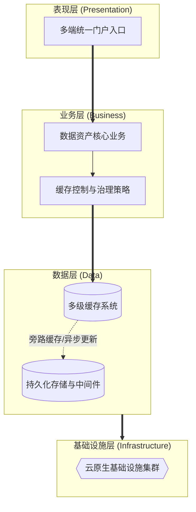

# 论云原生架构下数据资产智能管理平台的缓存技术应用与实践

## 1. 摘要
2024年3月，我参与了某国有航空集团数据资产智能管理平台建设。该项目面向集团总部、5大区域中心和23个分公司，服务数据治理委员会、数据管家、安全管理员及运维人员等多类角色，提供数据资产目录管理、数据质量管理、数据安全治理、血缘分析、数据共享和智能问答等核心功能。在项目中，我担任系统架构师，负责平台总体架构设计和关键技术落地。本文围绕云原生缓存技术应用展开论述，通过构建多级分布式缓存架构与热点策略，降低主数据库压力并提升响应速度；基于落实缓存与数据库一致性及失效策略，保障业务数据的准确与实时性；结合实现缓存层高可用与弹性扩展，支撑高并发与故障自愈。系统于2025年8月正式上线，截至2026年5月已稳定运行10个月，各项功能和性能指标良好，获得客户高度认可。

## 2. 项目背景
某国有航空集团业务涵盖航空客运、旅客服务、机务维修、地面服务等领域，总部数据中心、5 大区域中心及 23 家分公司长期积累了大量分散在数据库、数据仓库中的多模态数据资产。依据民航局智慧民航数据管理相关政策标准，集团启动数据资产智能管理平台建设，亟需构建统一的数据资产目录、质量规则库、安全策略库、血缘图谱及智能知识库，实现资产盘点、共享申请、质量治理、安全管控、智能运营一体化管理。平台需适配集团统一治理、区域分级运营、分公司轻量接入架构，支撑 10 万+ 资产目录、5000 条质量规则、年 10 亿次以上数据服务调用，同时满足 5000 并发用户、简单查询 2 秒内响应、系统可用性 99.99% 以上等高并发、高一致性技术指标。
本人作为中标方系统架构师，负责平台总体技术路线设计。经分析，平台热点集中于资产检索、详情展示、标签管理、规则模板、脱敏策略、审批状态、智能问答等读多写少、高频访问数据；直连主数据库与图数据库会造成主库压力过载、区域就近访问体验差，同时目录变更、规则发布、授权审批等业务又要求缓存技术来抵御流量洪峰，避免授权错误、规则失效及审计风险。
所以我们团队决定基于云原生缓存技术建设该平台。平台 2025 年 8 月顺利上线，稳定支撑总部—区域多级协同访问，高峰期运行平稳，全面达成建设目标。

## 3. 问题2回应 + 过渡
由于本项目面临资产目录、规则策略和审批授权等热点数据访问量大、跨区域访问链路长、主库承压明显，同时又存在目录变更、规则更新和权限调整必须及时同步的要求，所以我们选用云原生缓存技术作为平台性能优化和架构治理的重要支撑手段。其核心包括：第一，构建多级分布式缓存架构与热点策略，解决了节假日流量洪峰导致的数据库 I/O 瓶颈问题；第二，落实缓存与数据库一致性及失效策略，解决了数据脏读风险及雪崩/击穿/穿透问题；第三，实现缓存层高可用与弹性扩展，解决单点故障及固定容量无法应对流量激增的问题。

在本项目实施中，我们正是通过多级缓存架构、一致性策略、高可用体系，完成了云原生缓存技术的建设与应用，具体实践如下。

## 4. 正文部分

### 4.1 基于多级分布式缓存与热点预热策略，解决跨域检索场景中的数据库访问瓶颈问题
在“跨域数据资产检索与共享申请”业务场景中，平台存在的核心痛点为：节假日和月底高峰期会有超 5000 名并发用户频繁查询资产目录、共享权限和审批状态，而这些请求大多属于读多写少的热点访问。若持续采用所有请求直连数据库的传统模式，极易引发连接池耗尽、磁盘 I/O 打满和跨域检索明显变慢等各类风险，进而制约平台核心主链路访问体验提升的发展目标。为破解上述难题，我们将该场景进行多级缓存体系升级，同时在体系架构层面重点推进本地缓存、分布式缓存、热点预热和逐级回退机制落地。在实际落地执行中，我们先聚焦高频热点数据访问环节，依托 Caffeine 本地缓存与 Redis 集群缓存开展实施落地；再联动低峰期预热机制和逐级回退访问策略形成闭环推进。经此优化设计，平台在高频读性能维度取得显著提升，不仅将跨域资产目录检索平均响应时间从 800 毫秒压缩到 100 毫秒以内，更使底层主数据库 QPS 压力下降了 70% 以上，充分印证了多级缓存对平台核心资产检索业务链路提效的直接价值。

### 4.2 通过缓存层高可用与弹性扩展机制，解决月末跑批场景中的容量与故障冲击问题
在“月末全量数据质量检测与血缘解析”这一场景下，平台面临的核心矛盾是：跑批任务会瞬时涌入大量元数据读取和规则比对请求，缓存层本身也会遭遇容量和可用性双重压力。如果继续沿用单点缓存节点和固定容量配置的方式，就容易出现主节点故障、连接数暴涨和缓存击穿回压数据库等问题，从而影响平台后台批处理任务的连续运行。针对上述问题，我们将缓存层高可用与弹性扩展机制引入该场景，并在架构上重点落实了主从冗余、自动切换、弹性扩容和客户端降级机制。在具体实施过程中，我们将 Redis 集群以 StatefulSet 方式部署在 Kubernetes 中，由主从复制加哨兵模式保障故障切换能力；再结合 HPA 自动扩缩容和客户端侧熔断降级逻辑，在高峰期优先保护核心查询链路。通过上述设计，平台在月末高并发跑批期间取得了明显成效，既实现了秒级故障自愈和无缝扩容，又避免了缓存瓶颈向数据库层传导，验证了高可用缓存体系对后台重负载场景的支撑能力。

### 4.3 采用缓存一致性与失效治理策略，解决敏感场景中的脏读与越权风险问题
立足“敏感数据脱敏策略与访问控制”应用场景，平台当前亟待解决的核心矛盾是：脱敏等级、授权结果和访问策略一旦发生变化，就必须让各区域缓存立即失效，否则就可能出现脏读并导致用户看到未脱敏的敏感数据。若持续采取简单 TTL 和粗放式更新缓存的运行模式，极易滋生一致性窗口过大、缓存雪崩和恶意穿透等各类问题，直接影响平台安全合规保障的核心发展效能。围绕上述痛点，我们将对该场景实施缓存一致性与失效治理优化重塑，并在底层架构层面重点夯实旁路缓存、延迟双删、广播失效和风险防护建设工作。在具体落地推进过程中，我们先行布局缓存更新与失效同步环节，以 Cache-Aside 模式、延迟双删和 RocketMQ 广播失效消息为核心实施路径；同步融合 TTL 抖动与布隆过滤器机制强化整体落地成效。凭借该套优化设计方案，平台在复杂脱敏与鉴权缓存治理领域取得显著成效，既实现了鉴权拦截不因缓存脏读而失效的核心目标，也达成了上线 10 个月零缓存越权事故的发展预期，有力验证了一致性策略在安全红线场景中的关键作用。

## 5. 总结
在国有航空集团数据资产智能管理平台建设中，我通过多级分布式缓存架构、严格的一致性与失效策略以及高可用弹性扩展体系为核心，完成了云原生缓存技术的架构设计落地。平台自2025年8月上线以来，已稳定运行10个月，成功支撑超10万项资产目录管理、5000余条质量规则执行以及年10亿次以上数据服务调用，核心热点查询响应时间稳定控制在100毫秒级，数据库读压力显著下降，系统整体可用性达到99.99%以上，取得了较好的建设效果。

项目复盘发现架构存在不足：一是平台架构在跨区域（总部与5大区域中心）的缓存数据同步上偶有延迟，在网络抖动时可能影响区域节点的实时体验；二是自动化运维能力有待完善，部分缓存集群的配置调优与版本更新仍依赖人工操作，存在人为操作风险。后续将针对性优化：引入跨地域的 Redis 多活复制机制，降低跨域数据同步延迟；同时完善全流程自动化运维体系，实现缓存配置自动化、部署流水线化，降低人工干预成本与操作风险，持续提升架构灵活性与运维效率，助力该航空集团数字化高质量发展。

## 6. 系统架构设计图

结合平台在云原生架构下的多级分布式缓存技术应用与实践，整体架构按照表现层、业务层、数据层和基础设施层自上而下进行设计。为满足不同场景的展示需求，以下提供简化版与详细版两份架构图。

### 6.1 架构图

