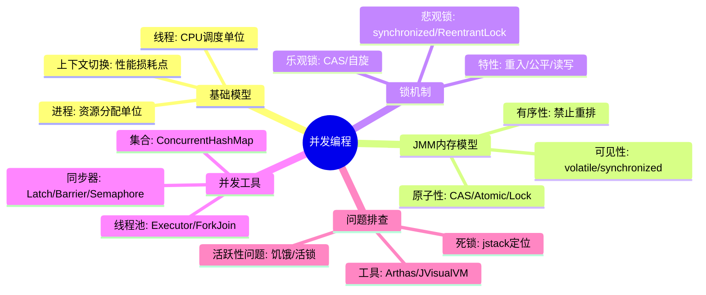
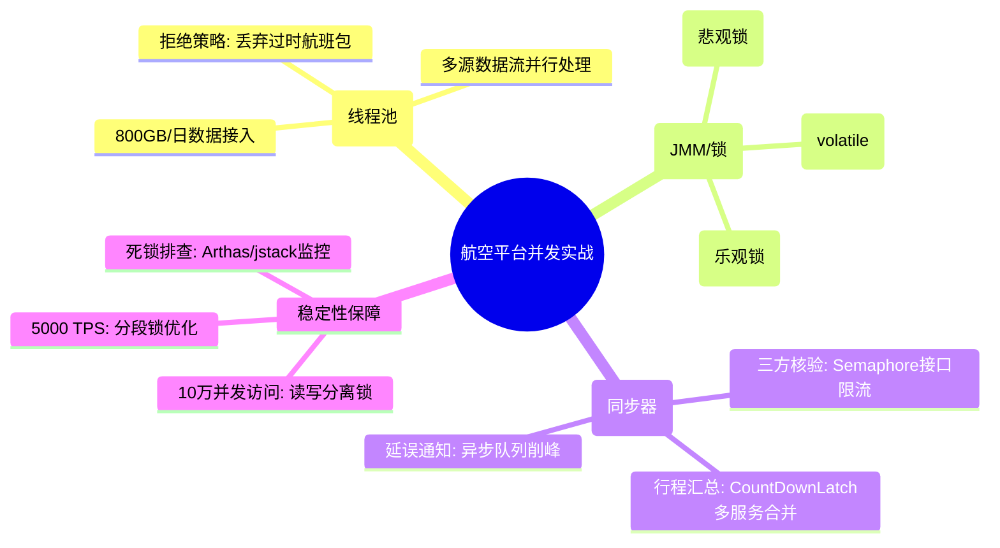

# 并发编程核心知识

## 1. 核心文字版

### 线程与进程模型
- **进程**: 操作系统分配资源的基本单位，拥有独立的地址空间。
- **线程**: CPU 调度的基本单位，是进程内的一个执行流，共享进程资源。
- **上下文切换**: 寄存器和程序计数器状态的保存与恢复，是并发性能的主要消耗点。

### 内存管理 (JMM)
- **主内存与工作内存**: 线程间通信必须通过主内存。
- **三大特性**: 
  - **可见性**: 一个线程修改变量，其他线程能立即看到（volatile, synchronized）。
  - **原子性**: 操作不可分割（CAS, synchronized）。
  - **有序性**: 防止指令重排（volatile 屏障）。

### 各类锁机制
- **乐观锁 vs 悲观锁**: CAS vs synchronized/ReentrantLock。
- **公平锁 vs 非公平锁**: 是否按申请顺序获取。
- **可重入锁**: 同一线程可多次获取同一把锁。
- **自旋锁**: 循环尝试获取，减少线程挂起开销。

### 语言级并发工具 (Java)
- **线程池**: ThreadPoolExecutor，解决资源频繁创建销毁问题。
- **同步工具**: CountDownLatch (倒计时), CyclicBarrier (屏障), Semaphore (信号量)。
- **并发集合**: ConcurrentHashMap, CopyOnWriteArrayList。

### 并发安全问题排查
- **死锁**: 四个必要条件（互斥、请求保持、不可剥夺、循环等待）。
- **竞态条件**: 多个线程同时操作共享资源导致结果不确定。
- **排查工具**: jstack (查看线程栈), jconsole/VisualVM (监控), Arthas (动态诊断)。

---

## 2. 思维脑图版 (基础理论)

---

## 3. 核心理论与项目实战 (航空运营管理平台案例)

> **项目背景**：在“航空运营智能管理平台”中，并发编程不仅是提升性能的手段，更是保障票务交易一致性、航班调度实时性的核心技术。

### 3.1 线程模型实战：航班动态实时采集
- **场景**：日均处理 800GB 的航班动态、票务交易及设备运行数据。
- **方案**：采集服务内部开启多个自定义线程池，分别对接不同机场和传感器的原始数据流。利用多线程并行处理，确保秒级数据接入延迟，避免单线程因某个慢 IO 源导致全局数据积压。

### 3.2 JMM 特性实战：检修预警阈值实时生效
- **场景**：运营团队在后台动态调整“AI 智能分析服务”的检修预警阈值。
- **方案**：阈值变量使用 `volatile` 修饰。确保当管理端修改阈值后，所有分布在不同 CPU 核心上的分析线程能立即从主内存获取最新值，防止因工作内存缓存导致故障预警延迟。

### 3.3 锁机制实战：票务库存与调度冲突
- **座控库存扣减（悲观锁）**：在节假日票务高峰期（5000+ TPS），使用 `ReentrantReadWriteLock` 实现读写分离。海量用户查询余票时加读锁，下单扣减库存时加写锁，极大提升了查询并发度并严防“超卖”。
- **航班计划变更（乐观锁）**：调度员修改航班状态时，利用数据库版本号（CAS 思想）进行校验。若两个调度员同时修改同一航班，第二个提交者会因版本冲突而失败，确保数据一致性。

### 3.4 并发工具实战：业务协同与限流
- **行程单生成 (CountDownLatch)**：并行调用“旅客服务”、“航班服务”、“票务服务”获取数据，使用 `CountDownLatch(3)` 等待所有子任务完成后再统一渲染行程单。
- **三方系统限流 (Semaphore)**：对接“民航局身份核验系统”时，受限于对方接口并发上限。使用 `Semaphore` 控制平台同时发起的请求数，起到自我保护和尊重下游资源的作用。
- **延误通知推送 (线程池 + 队列)**：突发大面积航班延误时，数万条通知进入 `ArrayBlockingQueue`，由专门的推送线程池异步消费。通过阻塞队列实现流量削峰，保障核心购票业务不受推送压力影响。

### 3.5 线上故障排查实战
- **死锁排查**：在票务交易涉及跨库锁竞争时，若出现响应超时，使用 **Arthas** 的 `thread -b` 命令一键定位死锁线程。
- **性能监控**：通过 **jstack** 定期采集高峰期线程快照，观察是否存在大量 `WAITING` 状态线程，以此作为动态调整线程池核心参数的依据。

---

## 4. 思维脑图版 (实战版)

