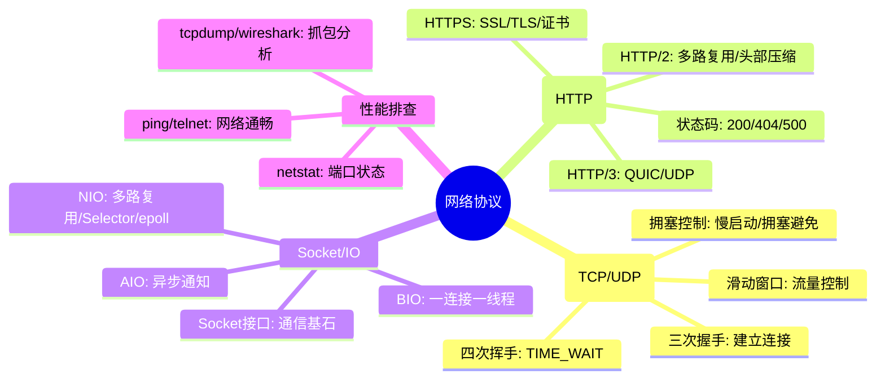
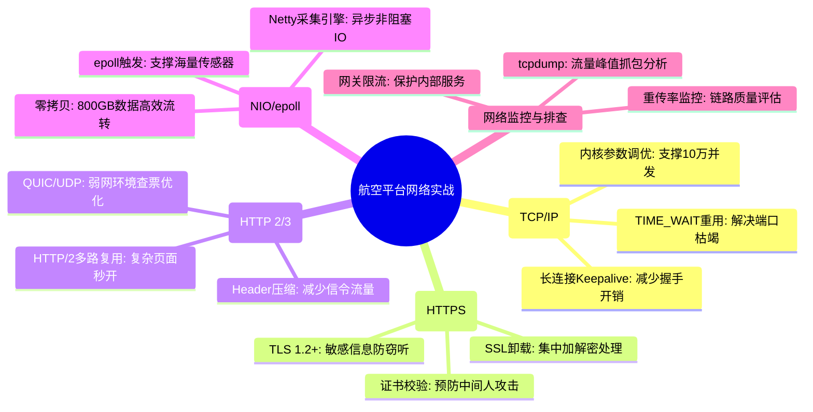

# 网络协议核心知识

## 1. 核心文字版

### TCP/IP 握手与挥手
- **三次握手**: 客户端发送 SYN -> 服务端回复 SYN-ACK -> 客户端回复 ACK。**目的**: 确认双方收发能力均正常。
- **四次挥手**: 一方发 FIN -> 另一方回复 ACK -> 另一方处理完后发 FIN -> 第一方回复 ACK。**重点**: TIME_WAIT 状态（确保最后一个 ACK 送达且等待旧连接包失效）。

### Socket 编程
- **抽象层**: 应用程序与传输层协议（TCP/UDP）之间的接口。
- **基本流程**: `socket()` -> `bind()` -> `listen()` -> `accept()` (服务端) / `connect()` (客户端)。

### HTTP/HTTPS 原理
- **HTTP**: 超文本传输协议，明文，基于 TCP。
- **HTTPS**: HTTP over SSL/TLS。**核心流程**: 非对称加密协商密钥 -> 对称加密传输数据。**证书**: 防止中间人攻击。
- **HTTP 1.1 vs 2.0 vs 3.0**: 
  - **1.1**: 持久连接，管道化。
  - **2.0**: 多路复用 (二进制分帧)，头部压缩，服务端推送。
  - **3.0**: 基于 QUIC (UDP)，解决 TCP 队头阻塞。

### NIO 模型 (非阻塞 IO)
- **核心组件**: **Selector** (多路复用器), **Channel** (双向通道), **Buffer** (缓冲区)。
- **优势**: 单线程处理多个连接，减少线程切换开销。
- **IO 多路复用机制**: `select`, `poll`, `epoll` (Linux 高效模型，事件触发)。

---

## 2. 思维脑图版 (基础理论)

---

## 3. 核心理论与项目实战 (航空运营管理平台案例)

> **项目背景**：在“航空运营智能管理平台”中，网络协议不仅是数据传输的通道，更是保障 10 万并发访问稳定性、PB 级数据同步实时性及旅客隐私安全的关键。

### 3.1 TCP 调优实战：应对 10 万并发票务峰值
- **场景**：节假日（春节、国庆）每日 9-11 点，数十万用户集中查询、预订。
- **方案**：
    - **内核参数优化**：调整 `tcp_tw_reuse` 为 1，加速 TIME_WAIT 状态连接的重用，防止高并发下因可用端口耗尽导致无法建立新连接。
    - **连接管理**：采用 Nginx 负载均衡，通过 Keepalive 保持与后端微服务的长连接，减少 TCP 频繁握手带来的 CPU 和网络开销。

### 3.2 HTTPS 实战：旅客敏感信息安全传输
- **场景**：旅客身份证号、银行卡号等敏感信息的加密传输。
- **方案**：
    - **SSL/TLS 强制加密**：全站启用 HTTPS（TLS 1.2+），确保数据在传输过程中不被窃听或篡改。
    - **证书管理**：对接权威机构证书，防止中间人攻击。
    - **安全卸载**：在 Nginx 侧统一处理 SSL 握手（SSL Termination），减轻后端业务服务的加解密压力。

### 3.3 HTTP 演进实战：多终端访问体验优化
- **场景**：旅客通过手机 App、机场自助机、官网多端同步查询。
- **方案**：
    - **HTTP/2 应用**：开启多路复用，解决传统 HTTP/1.1 的线头阻塞问题，加速包含大量航班图标、旅客偏好数据的复杂页面渲染。
    - **HTTP/3 (QUIC) 预研**：针对机场等移动弱网环境，QUIC 的 0-RTT 建连和更优的丢包重传机制，能显著提升突发航班变动时旅客查票的响应速度。

### 3.4 NIO/epoll 实战：PB 级数据实时接入
- **场景**：日均 800GB（峰值 15MB/s+）的航班动态、设备运行数据实时采集。
- **方案**：
    - **基于 Netty 的采集引擎**：利用 Java NIO 的 `Selector` 和 `epoll` 机制，以极少的线程资源处理成千上万个传感器或外部接口的并发连接。
    - **零拷贝技术**：配合 Kafka 等组件，在数据落盘或转发过程中减少内核态与用户态的拷贝，支撑 PB 级数据集的秒级同步延迟。

### 3.5 网络排查实战：突发变动下的流量预警
- **场景**：恶劣天气导致航班大面积变动，流量突增。
- **方案**：
    - **全链路监控**：通过 Prometheus 实时监控 TCP 连接数、重传率。
    - **抓包分析**：若出现购票响应延迟 > 1s，利用 `tcpdump` 在网关侧抓包，结合 `Wireshark` 分析是否由于 TCP 拥塞控制导致的窗口缩减。

---

## 4. 思维脑图版 (实战版)

