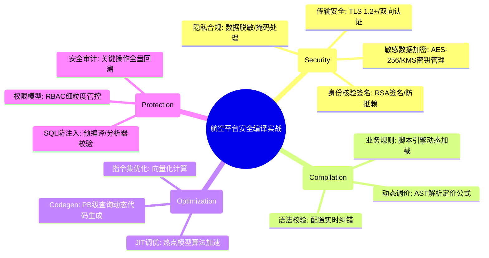

# 安全与编译核心知识

## 1. 核心文字版

### 哈希算法 (Hashing)
- **特点**: 单向、不可逆、固定长度输出、抗碰撞（MD5, SHA-256）。
- **常见用途**: 密码存储（结合加盐 Salt）、文件完整性验证、数据签名、一致性哈希。

### 对称与非对称加密
- **对称加密 (Symmetric)**: 双方使用同一密钥。**优点**: 速度快，适合传输大量数据。**算法**: AES, DES。
- **非对称加密 (Asymmetric)**: 公钥加密，私钥解密；或私钥签名，公钥验证。**优点**: 安全解决密钥分发问题。**算法**: RSA, ECC。
- **混合加密**: 使用非对称加密协商对称密钥，再用对称加密传输数据。

### 编译原理基础 (高级程序员必备)
- **前端 (Front-end)**: 
  - **词法分析 (Lexical)**: 将字符流转为 Token 流。
  - **语法分析 (Syntax)**: 构建抽象语法树 (AST)。
  - **语义分析 (Semantic)**: 检查类型、变量作用域等逻辑。
- **后端 (Back-end)**: 
  - **中间表示 (IR)**: 与平台无关的指令序列（如 LLVM IR, JVM Bytecode）。
  - **代码优化**: 死代码删除、循环展开、常量折叠。
  - **代码生成**: 最终生成机器码或字节码。

---

## 2. 思维脑图版 (基础理论)

```mermaid
mindmap
  root((安全与编译))
    数据安全 (Cryptography)
      哈希 (Hash): MD5/SHA/Salt
      对称加密: AES/DES/密钥共享
      非对称加密: RSA/ECC/公私钥对
      数字签名: 防篡改/防抵赖
    编译原理 (Compilation)
      前端流程: 词法/语法/语义
      AST: 抽象语法树
      IR: 中间代码/LLVM/字节码
      优化: 常量折叠/内联
      代码生成: 目标平台指令
    应用场景
      HTTPS安全: 证书/混合加密
      反射/注解: 动态编译/AST处理
      JIT编译: 运行时热点代码优化
```

---

## 3. 核心理论与项目实战 (航空运营管理平台案例)

> **项目背景**：在“航空运营智能管理平台”中，安全是系统的红线（涉及旅客隐私与交易合规），而编译原理的应用则隐藏在高性能大数据处理与智能决策引擎之中。

### 3.1 密码学实战：旅客敏感数据全生命周期保护
- **场景**：旅客身份证号、银行卡号的存储与核验。
- **方案**：
    - **加盐哈希 (Salted Hash)**：用户登录密码严禁明文，采用 `BCrypt` 或 `PBKDF2` 进行加盐哈希存储，有效防御彩虹表攻击。
    - **对称加密存储 (AES-256)**：身份证、银行卡等敏感信息采用 AES-256 算法加密存储。密钥管理采用 KMS（密钥管理服务）进行定期轮换。
    - **脱敏处理**：在用户画像分析与报表统计模块，对敏感数据进行掩码处理（如：1101**********1234），确保符合数据隐私合规要求。

### 3.2 身份核验实战：非对称加密与数字签名
- **场景**：与民航局系统进行旅客身份核验接口调用。
- **方案**：
    - **数字签名 (RSA/ECDSA)**：平台向民航局发起请求时，使用私钥对请求内容进行签名，民航局使用平台公钥验证签名。确保请求来源不可抵赖，且内容未被篡改。
    - **混合加密通讯**：建立 SSL/TLS 通道（基于非对称加密协商对称密钥），保障 10 万并发下的高效安全传输。

### 3.3 编译应用实战：动态规则引擎与表达式解析
- **场景**：票务管理模块中的“动态定价策略”与“自动退改签规则”。
- **方案**：
    - **AST (抽象语法树) 解析**：运营人员通过 UI 配置复杂的定价公式（如：`base_price * seasonal_factor + airport_fee`）。系统利用编译原理的前端技术，将公式解析为 AST。
    - **表达式执行**：通过 `Aviator` 或 `Groovy` 等脚本引擎，将解析后的逻辑转化为字节码运行，实现毫秒级的票价动态计算。

### 3.4 性能优化实战：JIT 与大数据流处理
- **场景**：日均 800GB 实时数据的流式计算与异常识别。
- **方案**：
    - **JIT (即时编译) 调优**：针对频繁执行的设备故障预警模型算法，通过热点代码探测，触发 JVM 的 C2 编译器进行深度优化，提升 CPU 运算效率。
    - **代码生成技术**：在 SQL 查询引擎处理 PB 级数据集时，利用类似 Spark SQL 的代码生成 (Codegen) 技术，动态生成针对特定查询的机器码，大幅减少虚函数调用开销。

### 3.5 安全防护实战：防御注入与异常监控
- **场景**：防范 SQL 注入、XSS 跨站脚本攻击。
- **方案**：
    - **语义分析预检测**：在 SQL 执行前，利用分析器确保 SQL 结构合法且符合预编译（Prepared Statement）规范，从根源消除 SQL 注入风险。
    - **自动审计**：记录所有权限变更与敏感操作日志，保留 1 年以上，支持基于安全合规要求的追溯查询。

---

## 4. 思维脑图版 (实战版)


