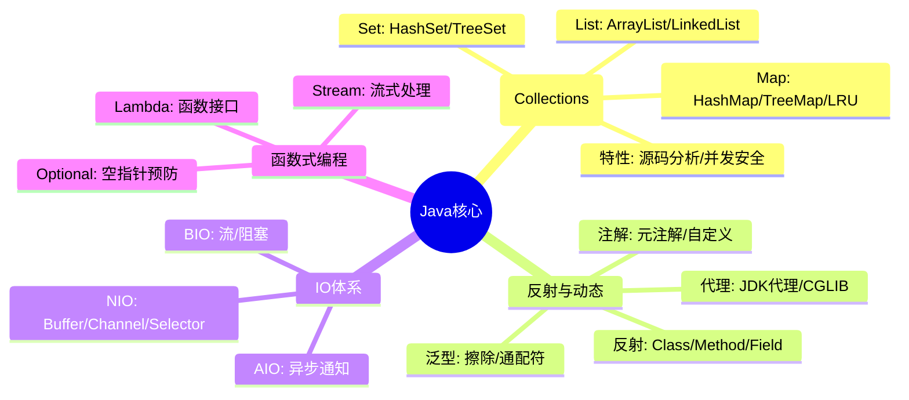
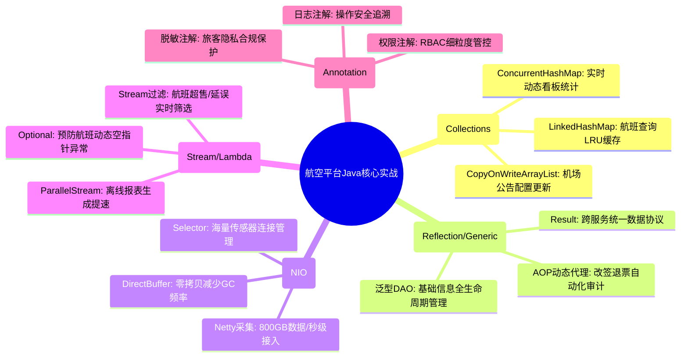

# Java 核心知识

## 1. 核心文字版

### 集合类源码 (Collection Framework)
- **List**: 
  - **ArrayList**: 动态数组，随机访问快，插入删除慢（需移动元素）。
  - **LinkedList**: 双向链表，插入删除快，随机访问慢。
- **Map**: 
  - **HashMap**: 数组+链表+红黑树。关键点：哈希碰撞（链表转树阈值为 8），扩容机制（2倍扩容，重新分布）。
  - **TreeMap**: 基于红黑树，有序（按 Key 排序）。
  - **LinkedHashMap**: 维护插入顺序或访问顺序（LRU 基础）。

### 泛型与反射 (Generics & Reflection)
- **泛型**: 编译时类型检查。**类型擦除**: 运行时泛型信息会被擦除。**通配符**: `? extends T` (上界), `? super T` (下界)。
- **反射**: 运行时获取类信息、调用方法。**用途**: 框架开发（Spring IOC/AOP）、动态代理、序列化。

### IO / NIO
- **IO (BIO)**: 面向流、阻塞式。适合连接数少且长连接的场景。
- **NIO**: 面向缓冲区、非阻塞、选择器多路复用。适合高并发短连接场景。

### 注解 (Annotation)
- **元注解**: `@Retention` (生命周期), `@Target` (作用范围)。
- **自定义注解**: 配合反射或 AOP，实现权限控制、日志记录、自动配置。

### Lambda 与 Stream
- **Lambda**: 函数式接口（只有一个抽象方法的接口）。
- **Stream API**: 声明式数据处理。**常用操作**: `filter`, `map`, `flatMap`, `reduce`, `collect`。

---

## 2. 思维脑图版 (基础理论)

---

## 3. 核心理论与项目实战 (航空运营管理平台案例)

> **项目背景**：在“航空运营智能管理平台”中，Java 核心技术是支撑海量航班数据处理、复杂票务业务逻辑及高并发多终端访问的核心动力。

### 3.1 集合实战：高效缓存与实时状态跟踪
- **场景**：最近查询航班的快速检索与实时运力监控。
- **方案**：
    - **LRU 缓存 (LinkedHashMap)**：利用 `LinkedHashMap` 的访问顺序特性，实现“最近查询航班”的本地缓存，减少对 Redis 或数据库的频繁请求。
    - **并发安全容器 (ConcurrentHashMap)**：在“数据服务模块”中，使用 `ConcurrentHashMap` 实时维护全量航班的动态状态（如：延误、起飞、登机中），支撑 50 万+ 并发实时数据接入的内存态统计。

### 3.2 反射与泛型实战：解耦微服务与通用化处理
- **场景**：微服务架构下的统一返回结果与动态权限校验。
- **方案**：
    - **通用泛型返回 (`Result<T>`)**：通过泛型定义标准的 API 返回结构，确保“票务管理”、“旅客管理”等子服务在多终端适配时，前端能获得统一的数据解析逻辑。
    - **动态代理与反射**：利用 Spring AOP（基于 JDK/CGLIB 动态代理）实现全局日志记录与敏感操作（如：改签、退票）的自动化审计，开发者只需在方法上添加注解，无需侵入业务逻辑。

### 3.3 NIO 实战：PB 级数据采集引擎
- **场景**：日均产生 800GB（峰值 15MB/s+）的航班动态、设备运行数据。
- **方案**：
    - **基于 Netty 的异步采集**：利用 NIO 的 `Selector` 多路复用机制，单个采集节点即可维持数万个传感器/外部接口的长连接，将采集延迟控制在 1 秒以内。
    - **Direct Buffer (零拷贝)**：在处理高频实时数据流时，使用 NIO 的直接内存（堆外内存），减少数据在内核空间与 JVM 堆之间的拷贝开销，显著降低高峰期（9-11 点）的 GC 压力。

### 3.4 注解实战：细粒度权限管控与合规审计
- **场景**：基于 RBAC 模型的权限校验与操作安全。
- **方案**：
    - **自定义权限注解 (@RequirePermission)**：在 Controller 层方法上标注权限点，结合拦截器与反射机制，在执行购票、退票等核心业务前进行实时权限校验。
    - **日志追踪注解 (@LogAudit)**：自动记录旅客敏感信息访问日志，支持保留 1 年以上的操作追溯，满足民航局合规要求。

### 3.5 Lambda 与 Stream 实战：复杂业务逻辑处理
- **场景**：航班列表的多维度过滤、排序与统计。
- **方案**：
    - **声明式数据处理**：在“数据可视化服务”中，利用 Stream API 对 PB 级数据集的聚合结果进行二次处理（如：按航空公司分组、按延误时长排序、过滤超售风险航班），代码简洁且易于维护。
    - **并行流应用**：在离线报表生成（T+1）任务中，利用 `parallelStream()` 充分利用多核 CPU 性能，加速航线需求预测模型的预处理阶段。

---

## 4. 思维脑图版 (实战版)

