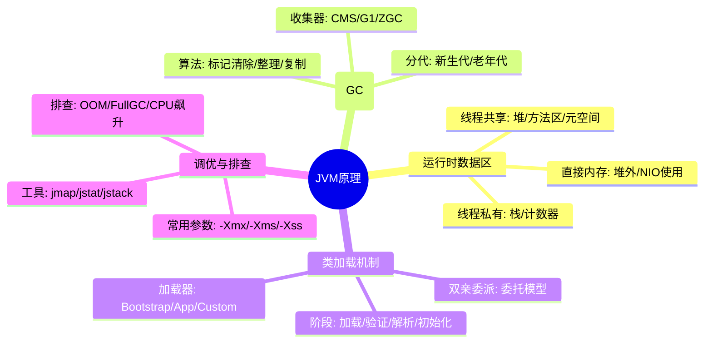
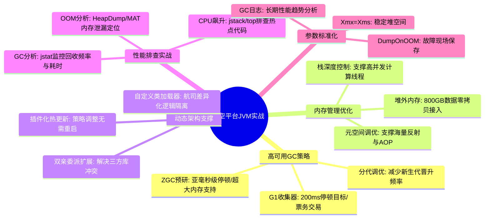

# JVM 原理核心知识

## 1. 核心文字版

### 垃圾回收 (Garbage Collection)
- **对象存活判断**: **引用计数法**（循环引用问题）与 **可达性分析法**（从 GC Roots 开始搜索）。
- **回收算法**: 
  - **标记-清除**: 产生碎片。
  - **标记-整理**: 解决碎片，效率稍低。
  - **复制算法**: 适合新生代（Eden, Survivor）。
- **常见回收器**: 
  - **CMS**: 并发收集，低停顿，会有碎片。
  - **G1**: 划分 Region，可预测停顿时间。
  - **ZGC**: 几乎无停顿（亚毫秒级），支持超大内存。

### 内存模型 (JMM)
- **运行时数据区**: 
  - **线程共享**: 堆 (Heap), 方法区 (Method Area/Metaspace)。
  - **线程私有**: 虚拟机栈 (JVM Stack), 本地方法栈 (Native Method Stack), 程序计数器 (PC Register)。
- **直接内存 (Direct Memory)**: 不在 JVM 堆内，NIO 常用（零拷贝基础）。

### 类加载机制 (Class Loading)
- **加载过程**: 加载 -> 验证 -> 准备 -> 解析 -> 初始化。
- **双亲委派模型**: 向上委托，向下加载。**目的**: 保证核心类库安全，防止同名类冲突。
- **类加载器**: Bootstrap (启动), Extension (扩展), Application (应用), Custom (自定义)。

### JVM 性能调优
- **常用参数**: `-Xms` (初始堆), `-Xmx` (最大堆), `-Xss` (栈深度), `-XX:MetaspaceSize` (元空间)。
- **分析工具**: `jstat` (监控GC), `jmap` (生成Dump), `jstack` (线程分析), `Arthas` (动态诊断)。

---

## 2. 思维脑图版 (基础理论)

---

## 3. 核心理论与项目实战 (航空运营管理平台案例)

> **项目背景**：在“航空运营智能管理平台”中，JVM 的稳定性直接关系到票务交易的吞吐量及 PB 级数据处理的效率。

### 3.1 垃圾回收实战：支撑 5000+ TPS 的低延迟票务交易
- **场景**：节假日高峰期，票务管理模块需处理海量并发下单请求。
- **方案**：
    - **选用 G1 收集器**：针对 10 万并发访问，配置 `-XX:+UseG1GC`，并设置 `-XX:MaxGCPauseMillis=200`，通过 Region 划分和增量回收，确保购票/改签请求的响应时间 ≤1 秒。
    - **对象分配优化**：通过 Arthas 监控发现高峰期 `Young GC` 过于频繁，调大新生代比例（`-XX:G1NewSizePercent`），减少短命对象进入老年代，降低 `Full GC` 风险。

### 3.2 内存布局实战：800GB 实时数据的堆外流转
- **场景**：数据采集服务需实时接入 800GB/日 的航班与设备数据。
- **方案**：
    - **直接内存应用**：在基于 Netty 的采集引擎中，大量使用 `Unpooled.directBuffer()`。数据从网卡读取后直接在堆外内存处理并转发至 Kafka，避免了在 JVM 堆内产生大量临时字节数组对象，极大减轻了 Heap 区的压力和 GC 抖动。
    - **元空间监控**：由于系统采用了大量动态代理（Spring AOP）和反射，调大 `-XX:MetaspaceSize`，防止频繁的元空间扩容触发全局停顿。

### 3.3 类加载实战：多航司差异化逻辑的动态加载
- **场景**：不同航空公司（如：国航、东航）在票价计算和行李策略上有差异化逻辑。
- **方案**：
    - **自定义类加载器 (Custom ClassLoader)**：实现一套插件化架构。将各航司特有的业务逻辑打包成独立的 JAR 包，通过自定义类加载器动态加载。
    - **热部署与隔离**：当某航司策略调整时，只需重新加载对应的子类加载器，无需重启整个航空平台，实现了业务逻辑的物理隔离与动态演进。

### 3.4 性能调优实战：离线分析任务的 OOM 排查
- **场景**：T+1 离线分析任务在处理 PB 级历史数据时，偶发内存溢出。
- **方案**：
    - **堆转储分析**：配置 `-XX:+HeapDumpOnOutOfMemoryError`。在发生 OOM 时自动生成 Dump 文件，使用 `jvisualvm` 或 `MAT` 分析，发现是由于航线预测模型在加载 50 亿条历史记录时未做分页。
    - **参数调优**：根据物理机配置，合理设定 `-Xmx` 与 `-Xms` 相等，减少堆动态扩容的性能损耗；针对计算密集型任务，适当减小 `-Xss` 以支撑更多计算线程。

### 3.5 稳定性保障：线上 CPU 飙升排查
- **场景**：突发航班变动时，系统响应变慢，CPU 使用率接近 100%。
- **方案**：
    - **排查路径**：使用 `top -Hp <pid>` 找到占用 CPU 最高的线程 ID，再利用 `printf "%x\n" <tid>` 转为十六进制，最后通过 `jstack <pid> | grep <hex_tid>` 定位到代码行。
    - **结论**：发现是由于在高并发查询下，某个未命中索引的复杂正则表达式在不断触发自旋重试，优化正则逻辑后 CPU 恢复正常。

---

## 4. 思维脑图版 (实战版)

