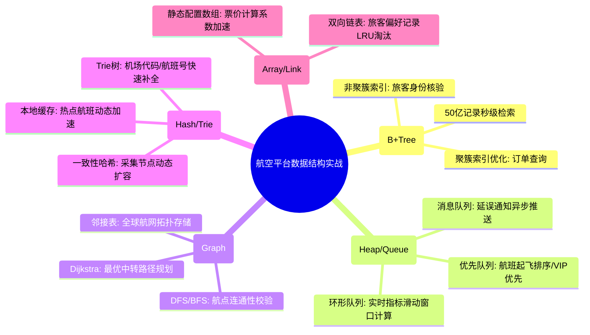

# 常用数据结构核心知识

## 1. 核心文字版

### 线性结构 (Linear Structures)
- **数组 (Array)**: 连续内存，支持 O(1) 随机访问，插入/删除慢。
- **链表 (Linked List)**: 非连续内存，指针连接。单向、双向、循环链表。
- **栈 (Stack)**: 后进先出 (LIFO)。应用：函数调用栈、表达式求值。
- **队列 (Queue)**: 先进先出 (FIFO)。应用：任务队列、广度优先搜索。

### 树形结构 (Tree Structures)
- **二叉树 (Binary Tree)**: 每个节点最多两个子节点。
- **二叉搜索树 (BST)**: 左小右大。**问题**: 可能退化为链表。
- **平衡树 (AVL / 红黑树)**: 自动平衡，保持查询 O(log N)。
- **堆 (Heap)**: 大顶堆/小顶堆。应用：优先队列、堆排序。
- **B/B+ 树**: 多路平衡查找树。应用：数据库索引（磁盘友好）。

### 图结构 (Graph Structures)
- **表示法**: 邻接矩阵、邻接表。
- **遍历**: 深度优先 (DFS), 广度优先 (BFS)。
- **关键算法**: 最短路径 (Dijkstra), 最小生成树 (Prim/Kruskal)。

### 散列表 (Hash Table)
- **核心**: 通过哈希函数将 Key 映射到数组索引。
- **碰撞解决**: 拉链法（数组+链表）、开放寻址法（线性探测）。

---

## 2. 思维脑图版 (基础理论)

```mermaid
mindmap
  root((常用数据结构))
    线性结构
      数组: O(1)访问/固定空间
      链表: 动态/单双向
      栈与队列: LIFO/FIFO
      跳表: Redis使用/多级索引
    树结构
      二叉树: 基础/递归
      红黑树: 自动平衡/HashMap
      B+树: 磁盘IO/数据库
      堆: 优先队列/TopK
    散列与集合
      HashMap: 数组+链表+红黑树
      HashSet: 基于HashMap
      一致性哈希: 分布式使用
    图论
      表示: 邻接矩阵/邻接表
      搜索: DFS/BFS
      路径: 最短路径/生成树
```

---

## 3. 核心理论与项目实战 (航空运营管理平台案例)

> **项目背景**：在“航空运营智能管理平台”中，高效的数据结构是支撑 50 亿条级票务交易检索、秒级航线规划及实时航班动态分析的底层基座。

### 3.1 线性结构实战：高并发通知队列与快速查表
- **场景**：突发航班变动时的海量旅客通知。
- **方案**：
    - **队列 (Queue)**：在“辅助管理模块”中，使用分布式消息队列（Kafka）作为缓冲，将数万条延误通知任务排队，由后端异步消费处理，实现流量削峰。
    - **数组 (Array)**：在“票价管理服务”中，对常用固定汇率、基础机型系数等数据采用内存数组存储，利用 O(1) 的随机访问速度支撑 5000+ TPS 的票价计算。

### 3.2 树形结构实战：海量数据索引与优先级调度
- **场景**：50 亿条级票务记录检索与航班起飞优先级排序。
- **方案**：
    - **B+ 树 (B+ Tree)**：在数据库底层，利用 B+ 树索引结构，确保在 PB 级数据集中，通过“订单号”或“旅客证件号”查询历史记录的响应时间 ≤5 秒。
    - **优先队列 (Heap)**：在“航班信息管理服务”中，利用大顶堆（PriorityQueue）维护航班起飞队列。根据延误时长、航线等级、VIP 旅客数量等维度动态计算优先级，实现智能化的航班调配。
    - **Trie 树 (前缀树)**：在搜索框实现机场代码（如：PEK, SHA）或航班号的实时补全，将前缀匹配的时间复杂度降低到与字符串长度相关。

### 3.3 图结构实战：全球航线网格建模与路径优化
- **场景**：航线规划与中转联程路径计算。
- **方案**：
    - **邻接表表示法**：将全球机场视为节点，航线视为带权重的边（权重包含飞行时间、燃油成本、准点率）。由于航线网格相对稀疏，采用邻接表存储以节省空间。
    - **Dijkstra 算法优化**：在“航线信息管理服务”中，利用 Dijkstra 算法计算中转次数最少或成本最低的联程路径，支撑管理层进行年度运力配置方案的制定。

### 3.4 散列表实战：秒级数据接入与热点缓存
- **场景**：50 万+ 并发实时数据接入的去重与缓存。
- **方案**：
    - **分布式哈希 (Consistent Hashing)**：在数据采集引擎的集群扩容时，利用一致性哈希算法，确保新增节点时只有极少量的航班流数据需要迁移，保障系统 99.99% 的可用性。
    - **ConcurrentHashMap**：在“数据服务模块”中，作为本地一级缓存，存储热点航班的实时状态（如：登机口变动），确保 QPS 高峰期无需频繁查询分布式缓存。

---

## 4. 思维脑图版 (实战版)


