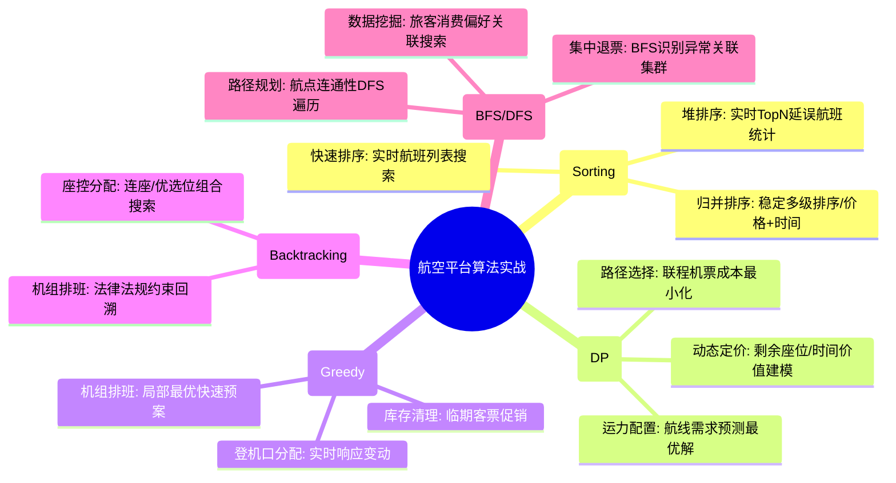

# 经典算法思想核心知识

## 1. 核心文字版

### 排序算法 (Sorting)
- **O(N²)**: 冒泡、插入、选择（面试常考基础）。
- **O(N log N)**: 
  - **快排 (Quick Sort)**: 分治思想，原地排序。
  - **归并 (Merge Sort)**: 分治思想，稳定排序。
  - **堆排 (Heap Sort)**: 利用堆结构。

### 分治思想 (Divide & Conquer)
- **核心**: 大问题拆分为独立的小问题，递归解决，最后合并。
- **应用**: 归并排序、快速排序、二分查找、二叉树遍历。

### 动态规划 (Dynamic Programming)
- **核心**: 将原问题分解为相对独立的子问题，利用子问题的解。**重叠子问题** + **最优子结构**。
- **三要素**: 状态定义、状态转移方程、边界条件。
- **应用**: 背包问题、最长公共子序列、爬楼梯。

### 贪心算法 (Greedy)
- **核心**: 每一步都采取当前状态下的最优选择（局部最优），希望导致全局最优。
- **局限**: 不能保证全局最优（如某些路径问题）。
- **应用**: 最小生成树 (Prim), 赫夫曼编码。

### 搜索与回溯 (Backtracking)
- **DFS (深度优先)**: 走到底，不通则退回。应用：全排列、迷宫求解。
- **BFS (广度优先)**: 按层遍历。应用：最短路径（非加权）。

---

## 2. 思维脑图版 (基础理论)

```mermaid
mindmap
  root((经典算法思想))
    排序与查找
      排序: 快排/归并/堆排
      查找: 二分查找/哈希查找
    分治与递归
      思想: 拆分/解决/合并
      案例: 二叉树处理/分治排序
    动态规划 (DP)
      核心: 状态转移/最优子结构
      技巧: 备忘录/迭代
      案例: 背包/路径/编辑距离
    贪心与回溯
      贪心: 局部最优/赫夫曼
      回溯: DFS/状态撤销/全排列
    复杂度分析
      时间: O(1)/O(logN)/O(N)/O(N²)
      空间: 内存占用/额外空间
```

---

## 3. 核心理论与项目实战 (航空运营管理平台案例)

> **项目背景**：在“航空运营智能管理平台”中，算法思想不仅用于数据排序，更是支撑动态票价定价、航线需求预测及实时故障预警的底层逻辑。

### 3.1 排序与分治实战：多维度航班列表处理
- **场景**：旅客查询航班时，需要按价格、时长、准点率进行多维度实时排序。
- **方案**：
    - **稳定排序 (Merge Sort)**：在处理具备多级排序需求的航班列表时，采用归并排序，确保在按“价格”排序后，原本按“起飞时间”排序的相对顺序不被破坏。
    - **分布式处理 (Divide & Conquer)**：在离线分析 T+1 数据时，利用分治思想将 PB 级历史数据切分为多个数据块，在多个计算节点并行处理后再进行结果合并，支撑 50 亿条级数据的统计分析。

### 3.2 动态规划实战：收益管理与动态定价
- **场景**：根据剩余座位数、距离起飞时间、历史消费偏好，实时调整机票价格。
- **方案**：
    - **最优子结构**：将长期的航班收益最大化问题分解为每个时间点的定价决策子问题。利用 DP 算法计算当前库存下的最优价格路径，支撑“票价管理服务”的动态定价策略。
    - **状态转移**：`dp[i][j]` 表示在剩余 `i` 天、剩余 `j` 个座位时的最大预期收益，通过状态转移方程不断优化销售策略。

### 3.3 贪心算法实战：实时登机口分配与资源调度
- **场景**：机场登机口资源有限，需在航班变动时快速重新分配。
- **方案**：
    - **局部最优**：在突发航班变动时，采用贪心策略优先为即将起飞或延误时间最长的航班分配最近的登机口，以快速缓解机场运行压力。虽然不一定是全局最优，但能保证极高的实时响应速度。

### 3.4 搜索与回溯实战：机组排班与座控复杂约束
- **场景**：在满足飞行时长限制、休息时间要求等复杂约束下进行机组排班。
- **方案**：
    - **回溯搜索**：利用深度优先搜索（DFS）遍历所有可能的排班组合。当发现某条路径违反民航局安全法规时，立即回溯（Backtracking）尝试其他组合，确保输出符合合规要求的排班方案。

### 3.5 BFS 算法实战：异常数据模式识别
- **场景**：秒级识别“集中退票峰值”等异常行为。
- **方案**：
    - **广度优先搜索**：在数据流分析中，将旅客操作视为节点，关联操作视为边。利用 BFS 算法快速识别出在短时间内频繁发生关联操作的异常集群，即时生成告警信息并推送至客服部门。

---

## 4. 思维脑图版 (实战版)


