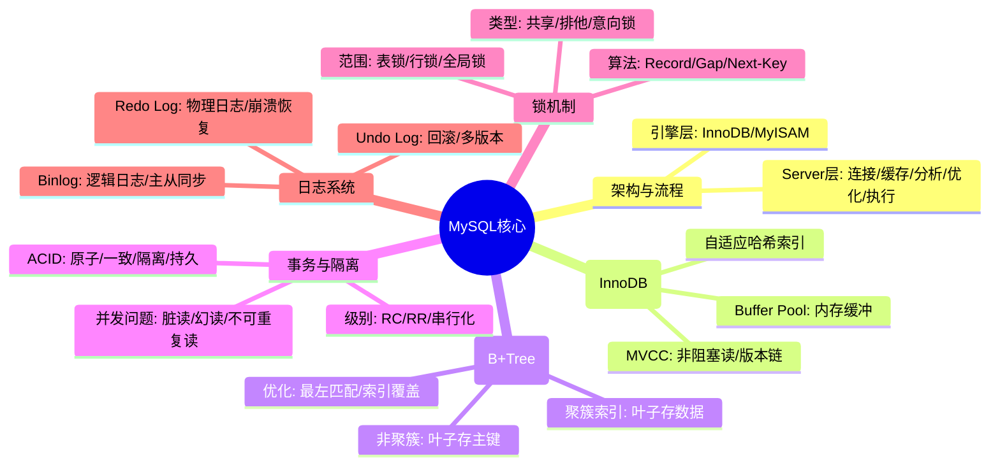
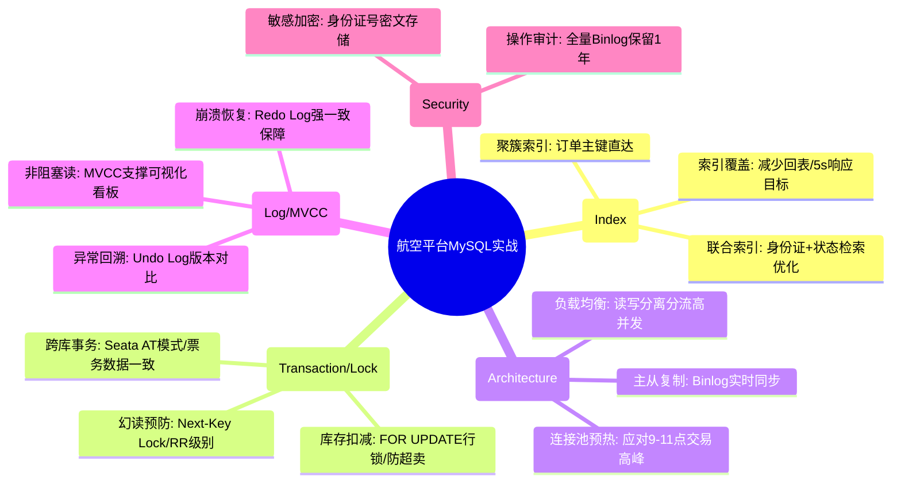

# 数据库 MySQL 核心知识

## 1. 核心文字版

### 架构与执行流程
- **连接器**: 权限校验、连接管理。
- **查询缓存**: 命中则直接返回（MySQL 8.0 已移除）。
- **分析器**: 词法分析、语法分析。
- **优化器**: 生成执行计划、选择索引。
- **执行器**: 操作存储引擎、返回结果。

### 存储引擎: InnoDB
- **事务支持**: 支持 ACID。
- **行级锁**: 提高并发能力。
- **外键约束**: 保证数据完整性。
- **MVCC (多版本并发控制)**: 实现非阻塞读，解决不可重复读。

### 索引原理 (B+Tree)
- **为什么用 B+Tree**: 磁盘读写代价低、查询效率稳定、范围查询性能极佳。
- **聚簇索引 vs 非聚簇索引**: 数据是否与索引存储在一起。
- **最左前缀原则**: 联合索引的生效规则。

### 事务与锁
- **ACID 特性**: 原子性、一致性、隔离性、持久性。
- **隔离级别**: 读未提交、读已提交、可重复读 (默认)、串行化。
- **锁分类**: 全局锁、表级锁、行级锁（记录锁、间隙锁、临键锁）。

### 日志系统
- **Redo Log (重做日志)**: InnoDB 特有，物理日志，用于崩溃恢复 (Crash-safe)。
- **Binlog (归档日志)**: MySQL Server 层，逻辑日志，用于备份和主从复制。
- **Undo Log (回滚日志)**: 用于事务回滚和 MVCC。

---

## 2. 思维脑图版 (基础理论)

---

## 3. 核心理论与项目实战 (航空运营管理平台案例)

> **项目背景**：在“航空运营智能管理平台”中，MySQL 承担着旅客信息、票务订单、航班动态等核心业务数据的持久化任务。高并发场景下（5000+ TPS）的数据强一致性与 50 亿级数据的快速查询是其核心挑战。

### 3.1 索引优化实战：50 亿级订单的高效检索
- **场景**：旅客在“购票/改签/退票”流程中，需要根据订单号、身份证号、航班号多维度快速查询。
- **方案**：
    - **聚簇索引设计**：将 `order_id` 设为主键，利用聚簇索引特性使订单详情查询达到 O(log N) 性能。
    - **覆盖索引优化**：针对“根据身份证号查询历史订单”的高频场景，建立 `(passenger_id, order_status, create_time)` 联合索引。利用索引覆盖减少回表操作，将查询响应时间控制在 5s 以内。
    - **避免长事务**：在节假日票务高峰期，通过控制事务粒度，防止索引页被长时间锁定。

### 3.2 事务与锁实战：核心票务库存扣减（座控）
- **场景**：保障票务交易全流程顺畅，防止“超卖”，确保数据强一致性。
- **方案**：
    - **乐观锁扣减库存**：在更新库存时使用版本号校验（`WHERE version = old_version`），适用于写冲突较低的普通航线。
    - **悲观锁保障强一致**：针对热门航线（5000+ TPS），使用 `SELECT ... FOR UPDATE` 锁定特定航班的库存行。配合 **Next-Key Lock** 防止幻读，确保库存扣减的原子性。
    - **分布式事务 (Seata)**：在“票务管理”跨“数据服务”更新库存时，采用 Seata AT 模式保障跨库事务的最终一致性。

### 3.3 MVCC 与日志实战：实时监控看板与审计回溯
- **场景**：数据可视化平台支持 1000+ 用户并发查看实时运营数据，且关键操作需记录日志保留 ≥1 年。
- **方案**：
    - **MVCC 非阻塞读**：利用 InnoDB 的 MVCC 机制，使管理端在进行大数据量统计（如：日均 800GB 数据流转分析）时，不会阻塞正常的购票写操作，实现读写分离。
    - **Binlog 主从同步**：利用 Binlog 实现主从复制，读写分离。主库负责票务写入，从库负责数据挖掘与可视化展示，数据同步延迟控制在 3s 以内。
    - **Undo Log 审计回溯**：在发生异常退票纠纷时，结合 Undo Log 与审计日志，回溯数据修改的历史版本，定位异常变更点。

### 3.4 架构保障实战：高并发场景下的稳定性
- **场景**：支持 ≥10 万用户并发访问核心功能，系统可用性 ≥99.99%。
- **方案**：
    - **读写分离与负载均衡**：通过 Nginx 配合数据库中间件，将查询压力分流至多个从库，主库专注处理高频写入。
    - **连接池调优**：优化 Druid/HikariCP 连接池参数，针对票务高峰（9-11 点）预热连接，防止连接风暴压垮数据库。

---

## 4. 思维脑图版 (实战版)

