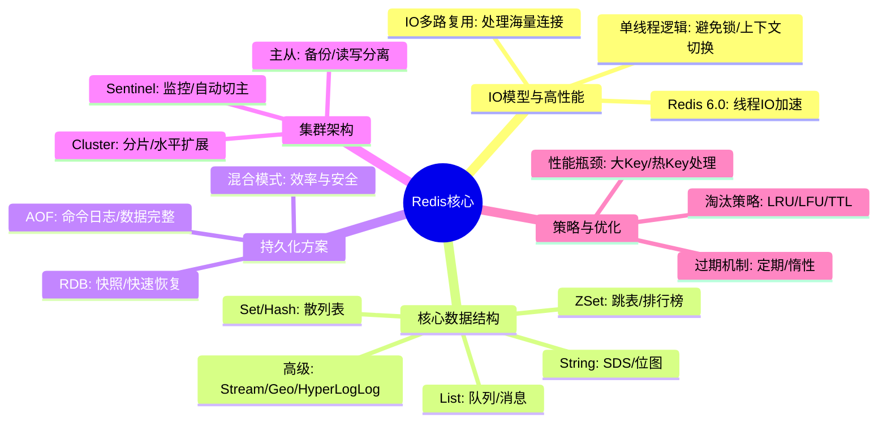
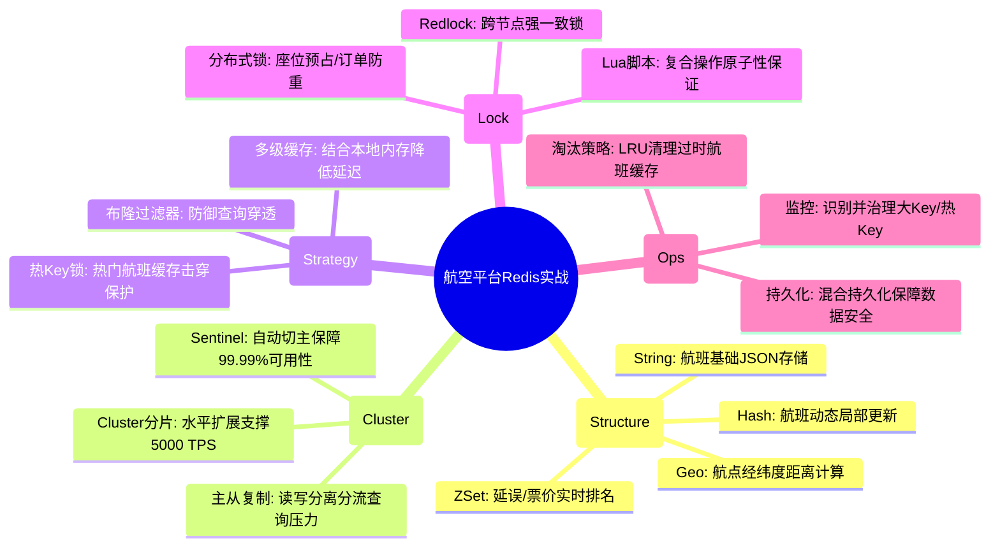

# 缓存 Redis 核心知识

## 1. 核心文字版

### IO 模型
- **单线程模型**: 核心网络 IO 和键值对读写是单线程的。避免了上下文切换和锁争用，利用 IO 多路复用处理高并发。
- **多线程 IO (Redis 6.0+)**: 用于加速网络数据读写，但核心逻辑仍为单线程。

### 数据结构
- **String**: 简单动态字符串 (SDS)。
- **List**: 双向链表/压缩列表 (Quicklist)。
- **Set**: 散列表 (Hashtable) / 整数集合 (Intset)。
- **Hash**: 散列表 (Hashtable) / 压缩列表 (Ziplist)。
- **ZSet**: 跳表 (SkipList) + 散列表 (Hashtable)。

### 持久化机制
- **RDB (快照)**: 定时保存全量数据到磁盘。快，但易丢数据。
- **AOF (追加日志)**: 保存写命令。数据全，但文件大，恢复慢。
- **混合持久化 (Redis 4.0+)**: RDB 全量 + AOF 增量。

### 过期与淘汰策略
- **过期删除策略**: 定期删除 + 惰性删除。
- **内存淘汰策略 (Eviction)**: LRU (最近最少使用), LFU (最不经常使用), Random, TTL。

### 集群与高可用
- **主从复制**: 数据备份。
- **哨兵 (Sentinel)**: 自动故障转移。
- **Cluster 集群**: 数据分片 (16384个槽位)，去中心化。

---

## 2. 思维脑图版 (基础理论)

---

## 3. 核心理论与项目实战 (航空运营管理平台案例)

> **项目背景**：在“航空运营智能管理平台”中，Redis 作为高性能缓存层，支撑着数十万旅客的并发查询、实时航班状态同步及多终端 Session 共享。

### 3.1 数据结构实战：多维度航班信息缓存
- **场景**：支撑 ≥10 万用户并发查询核心航班信息，响应时间 ≤1s。
- **方案**：
    - **String 类型存储基础信息**：将航班的基础静态信息（如：机型、航线）序列化为 JSON 存储在 String 中，并设置合理的 TTL（过期时间）。
    - **Hash 类型存储实时动态**：利用 Hash 存储航班的动态变更（如：延误时间、登机口、载客量）。通过 `HSET` 局部更新，避免全量覆盖，支持秒级采集数据接入。
    - **ZSet 实现延误排行榜**：利用 ZSet 的分值（Score）存储延误分钟数，实时生成“全航网延误航班 Top 10”监控看板。

### 3.2 稳定性实战：应对突发流量与高可用
- **场景**：恶劣天气导致航班大面积变动，大量旅客同步查询。
- **方案**：
    - **缓存穿透防护**：针对查询不存在的航班号，采用 **布隆过滤器 (Bloom Filter)** 进行预检测，防止非法请求穿透到数据库。
    - **缓存击穿防护**：针对热门航线（热 Key），采用永不过期策略或配合分布式锁，确保在缓存失效瞬间只有一个线程去数据库加载。
    - **Cluster 集群扩容**：利用 Redis Cluster 的水平扩展能力，在节假日票务高峰期动态增加 Slot 分片，保障系统处理能力 ≥5000 TPS。

### 3.3 分布式锁实战：座控库存与支付状态
- **场景**：在高并发购票场景下，保障座位库存扣减的原子性。
- **方案**：
    - **Redlock 分布式锁**：在进行座位预占或修改订单状态时，使用基于 Redis 的分布式锁。配合 Lua 脚本实现加锁与解锁的原子性，防止超卖。
    - **过期自动释放**：为锁设置合理的过期时间，防止因某个微服务宕机导致的死锁，确保“用户→订单→支付”流程的鲁棒性。

### 3.4 性能优化实战：大 Key 与热 Key 治理
- **场景**：日均 800GB 数据的秒级采集与展示。
- **方案**：
    - **大 Key 拆分**：针对包含数千个子项的“全国机场配置表”，将其拆分为多个小 Hash 存储，避免 `HGETALL` 导致的单线程阻塞。
    - **多级缓存架构**：在 Web 侧使用 Caffeine 作为本地一级缓存，Redis 作为二级缓存。针对热点航班数据，优先命中本地内存，进一步降低网络延迟。

---

## 4. 思维脑图版 (实战版)

