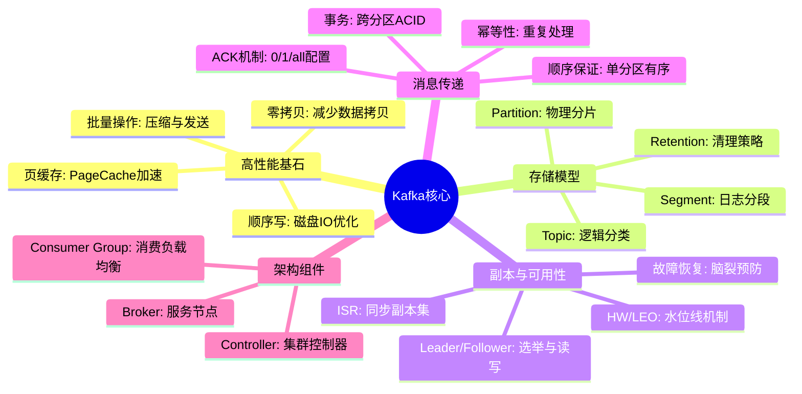
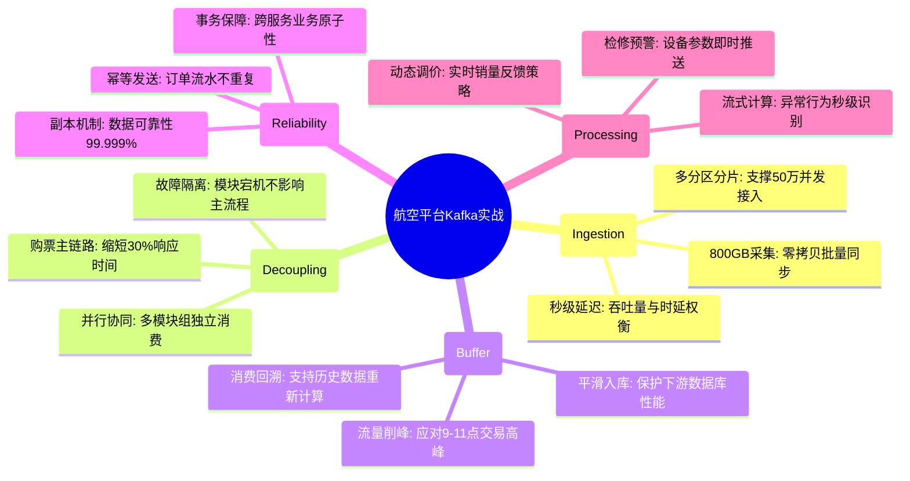

# 消息队列 Kafka 核心知识

## 1. 核心文字版

### 高性能机制
- **零拷贝 (Zero Copy)**: 利用 `sendfile` 系统调用，减少用户态与内核态数据拷贝，极大提升吞吐。
- **磁盘顺序写**: 将随机 IO 转化为顺序 IO，速度接近内存读写。
- **分区分片**: Topic 被分为多个 Partition，支持水平扩展和高并发处理。

### 持久化方案
- **Log Segment**: 消息以日志文件形式存储，过期后会被删除。
- **副本机制 (Replica)**: 一个 Leader，多个 Follower。Leader 处理读写请求，Follower 同步数据。

### 分区与伸缩
- **Partition**: 物理上的分区，增加 Partition 可提高并发度。
- **Consumer Group**: 消费者组，每个 Partition 只能由组内一个消费者消费，保证顺序性。

### 顺序性与重复性
- **消息顺序性**: 只能保证单个 Partition 内的消息顺序。
- **重复性与幂等性**: 
  - **幂等性 (Idempotent Producer)**: 保证单分区内单会话消息不重复。
  - **事务性 (Transactions)**: 跨分区多消息处理的原子性。

### 集群架构
- **Zookeeper (传统)**: 元数据管理、Controller 选举、集群协调。
- **Kraft (新版)**: 移除 Zookeeper，自选举 Controller。

---

## 2. 思维脑图版 (基础理论)

---

## 3. 核心理论与项目实战 (航空运营管理平台案例)

> **项目背景**：在“航空运营智能管理平台”中，Kafka 作为数据总线，承担着日均 800GB 实时数据的流转、系统间的异步解耦及突发高峰流量的削峰填谷任务。

### 3.1 高性能实战：800GB 实时数据的秒级流转
- **场景**：秒级采集航班动态、设备运行及旅客操作数据（峰值 15MB/s+）。
- **方案**：
    - **零拷贝与批量发送**：利用 Kafka 的零拷贝技术，结合 `batch.size` 与 `linger.ms` 参数调优，将海量传感器的小包数据聚合发送，支撑 PB 级数据集的低延迟同步。
    - **分区水平扩展**：针对“航班动态”核心 Topic，根据采集节点的并发数合理设置 Partition 数量，实现多 Broker 节点的负载均衡。

### 3.2 异步解耦实战：购票流程的性能优化
- **场景**：旅客购票成功后，需同步更新库存、生成行程、推送通知。
- **方案**：
    - **异步处理链路**：票务服务在订单支付成功后，仅同步更新订单状态，随后发送消息至 Kafka。
    - **模块并行消费**：数据服务、旅客管理、通知公告等模块作为独立的 Consumer Group，并行消费该消息。将购票主流程响应时间缩短 30% 以上，实现各模块的高效协同。

### 3.3 削峰填谷实战：应对节假日票务交易高峰
- **场景**：节假日每日 9-11 点，交易请求峰值 ≥5000 TPS。
- **方案**：
    - **消息缓冲**：将瞬时爆发的订单同步、数据分析请求暂存在 Kafka Partition 中。
    - **平滑消费**：后端“数据挖掘与分析服务”根据自身处理能力，匀速拉取并处理消息，防止因瞬间流量过大导致数据库连接池耗尽或系统崩溃。

### 3.4 强一致性实战：票务库存与流水审计
- **场景**：保障订单数据同步与库存更新的最终一致性。
- **方案**：
    - **幂等性生产者**：开启 `enable.idempotence=true`，确保在网络波动导致重发时，单分区内不产生重复订单流水。
    - **事务性消息**：在“多模块联动业务”中，利用 Kafka 事务保障“订单同步”与“库存预警”操作的原子性，确保财务对账数据 100% 准确。

---

## 4. 思维脑图版 (实战版)

