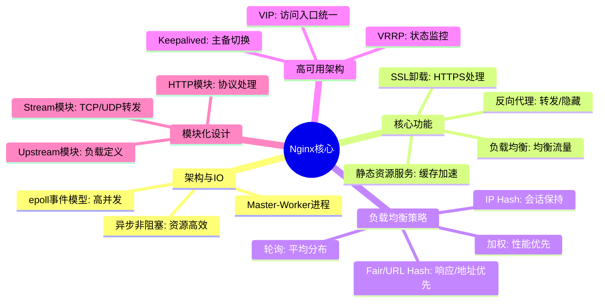
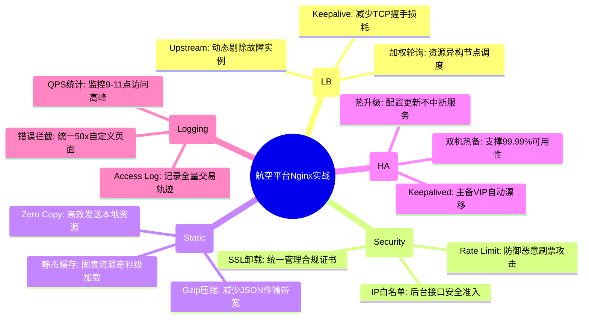

# 网关 Nginx 核心知识

## 1. 核心文字版

### IO 模型
- **事件驱动与异步非阻塞**: 利用 `epoll` (Linux) 机制，单个 Worker 进程可以处理数万个并发连接。
- **Master-Worker 进程结构**: 
  - **Master**: 接收信号、管理 Worker。
  - **Worker**: 处理网络请求，互不影响。

### 反向代理 (Reverse Proxy)
- **概念**: 代理服务器接收客户端请求，转发给内部服务器，并将结果返回给客户端。
- **作用**: 隐藏后端细节、负载均衡、缓存静态资源、SSL 卸载。

### 负载均衡策略
- **轮询 (Round Robin)**: 默认方式。
- **加权轮询 (Weight)**: 根据后端服务器性能分配。
- **IP Hash**: 同一 IP 的请求定向到同一服务器（解决 Session 共享问题）。
- **最少连接 (Least Connections)**: 将请求发给连接数最少的服务器。

### 高可用方案 (Keepalived)
- **VRRP 协议**: 虚拟路由冗余协议，实现多个 Nginx 节点的主备切换。
- **VIP (Virtual IP)**: 客户端访问虚拟 IP，由 Keepalived 动态映射到存活的 Nginx。

---

## 2. 思维脑图版 (基础理论)

---

## 3. 核心理论与项目实战 (航空运营管理平台案例)

> **项目背景**：在“航空运营智能管理平台”中，Nginx 作为统一入口网关，承担着 10 万并发流量的分发、旅客隐私数据的 SSL 卸载及 PB 级数据可视化平台的静态资源加速任务。

### 3.1 负载均衡实战：应对 10 万并发票务访问
- **场景**：节假日高峰期，海量旅客通过多终端集中查询、预订。
- **方案**：
    - **加权轮询 (Weight)**：根据后端微服务节点的规格（如：8核 vs 16核），动态调整权重，确保票务计算服务负载均衡。
    - **Keepalive 长连接**：在 Nginx 配置中开启 `proxy_keepalive`，保持网关与后端微服务之间的 TCP 长连接，减少高并发下的建连开销，将购票请求响应时间控制在 1s 以内。

### 3.2 反向代理与安全实战：SSL 卸载与合规防护
- **场景**：旅客敏感信息（身份证、银行卡）的全流程安全传输。
- **方案**：
    - **SSL Termination (SSL 卸载)**：在 Nginx 侧统一配置 SSL 证书并进行加解密处理。后端微服务通过 HTTP 通信，极大降低了业务服务的 CPU 损耗。
    - **限制敏感接口访问**：利用 `location` 指令配合 `allow/deny`，仅允许内部 IP 访问“系统日志”与“运维管理”等后台管理接口，保障合规安全。

### 3.3 性能优化实战：PB 级可视化平台的静态加速
- **场景**：数据可视化平台展示 PB 级数据集的聚合图表，前端资源包较大。
- **方案**：
    - **静态资源缓存**：开启 `proxy_cache` 机制，将常用的航班图标、航线地图瓦片及前端 JS/CSS 资源缓存在 Nginx 内存中，大幅提升页面加载速度。
    - **Gzip 压缩**：开启 `gzip` 模块，对 API 返回的 PB 级数据集查询结果（JSON 格式）进行实时压缩，减少网络带宽占用，提升查询响应效率。

### 3.4 高可用实战：系统全年 99.99% 可用性保障
- **场景**：防止网关单点故障导致全平台瘫痪。
- **方案**：
    - **Nginx + Keepalived 架构**：通过 VRRP 协议虚拟出 VIP。当主 Nginx 节点故障时，VIP 自动漂移至备节点，实现无感知切换。
    - **健康检查**：利用 `upstream` 的 `max_fails` 与 `fail_timeout` 机制，自动剔除故障的后端微服务实例，确保流量始终流向健康的业务节点。

---

## 4. 思维脑图版 (实战版)

