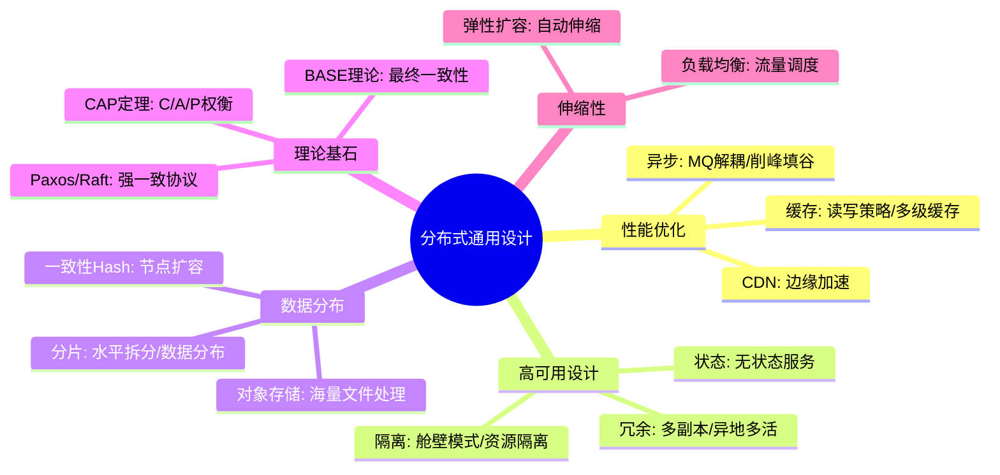
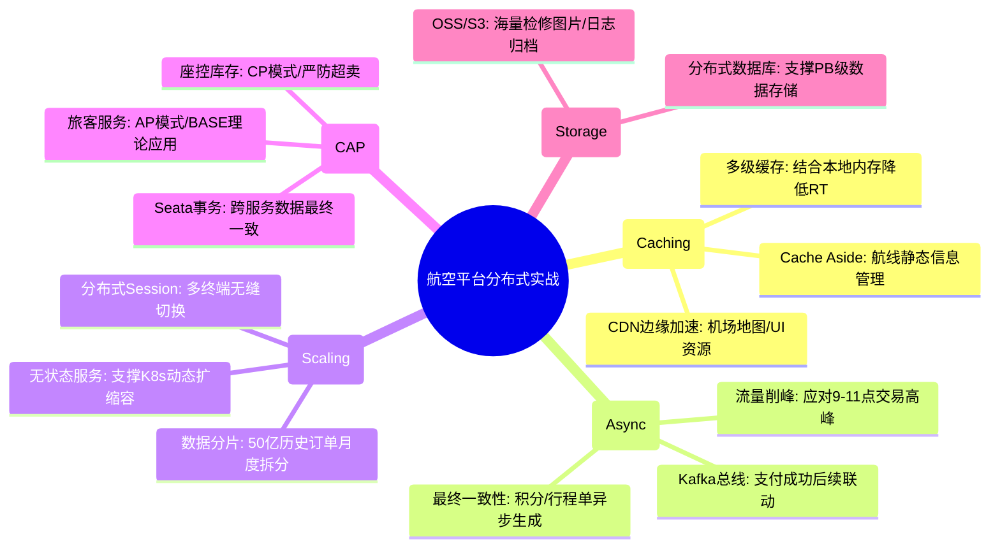

# 分布式通用设计核心知识

## 1. 核心文字版

### 缓存策略
- **Cache Aside (旁路缓存)**: 读缓存 -> 没中则读库并写缓存；写库 -> 删缓存。最常用，保证数据一致性。
- **Read/Write Through (读/写穿透)**: 缓存层负责读写库，对应用透明。
- **Write Back (写回)**: 写操作只写缓存，异步刷库。快，但有丢数据风险。

### 异步化
- **解耦**: 生产者只发消息，不关心后续。
- **削峰填谷**: MQ 缓冲瞬时高流量，后端平滑处理。
- **最终一致性**: 通过消息重试机制保证最终结果一致。

### 水平扩展 (Horizontal Scaling)
- **去中心化**: 节点间地位平等，无单点故障。
- **分片 (Sharding)**: 数据按规则分布在不同节点。
- **无状态设计 (Stateless)**: 节点不保存 Session 等本地状态，支持任意扩缩容。

### CDN 与对象存储
- **CDN**: 内容分发网络，边缘节点就近访问静态资源。
- **OSS/S3**: 云端海量、安全、低成本的非结构化数据存储。

### 一致性协议 (CAP/BASE)
- **CAP 定理**: 强一致性 (C), 可用性 (A), 分区容错性 (P)。三者不可兼得，分布式环境必选 P。
- **BASE 理论**: 基本可用 (Basically Available), 软状态 (Soft state), 最终一致性 (Eventually consistent)。是 CAP 中 AP 的延伸。

---

## 2. 思维脑图版 (基础理论)

---

## 3. 核心理论与项目实战 (航空运营管理平台案例)

> **项目背景**：在“航空运营智能管理平台”中，分布式通用设计是确保系统弹性、高可用及全球化部署的基石。面对日均 800GB 的海量数据和 10 万级的并发访问，合理的架构设计至关重要。

### 3.1 缓存与 CDN 实战：提升 30% 运营效率
- **场景**：旅客频繁查询航班计划、机型信息及机场指引。
- **方案**：
    - **Cache Aside 策略**：在“航空信息管理模块”中，对静态航线数据采用旁路缓存。查询时优先命中 Redis，更新时先写数据库再删除缓存，确保数据最终一致。
    - **CDN 全球加速**：利用 CDN 将静态的机场地图、值机指南及各航司 LOGO 推送至边缘节点。旅客就近访问，将 PB 级可视化界面的首屏加载时间从 5s 降低至 1s 以内。

### 3.2 异步化实战：购票链路的极致响应
- **场景**：旅客支付成功后，需触发积分更新、行程单生成及短信通知。
- **方案**：
    - **消息驱动解耦**：支付完成后，票务服务发送一条“支付成功”消息至 Kafka。
    - **削峰填谷**：在节假日交易高峰（5000+ TPS），通知模块通过 Kafka 缓冲请求，平滑处理推送任务，避免瞬间流量拖垮核心交易链路。

### 3.3 水平扩展与无状态实战：应对 10 万并发峰值
- **场景**：系统需支持 ≥10 万用户并发访问，且具备全年 99.99% 的可用性。
- **方案**：
    - **服务无状态化**：所有微服务节点不保存本地 Session，统一存储于 Redis 集群中。支持 K8s 根据 CPU/内存占用进行自动扩缩容（HPA），实现秒级弹性伸缩。
    - **数据分片 (Sharding)**：针对 50 亿条历史票务数据，按“年份+月份”进行物理分片存储，解决单表查询性能瓶颈。

### 3.4 CAP 与 BASE 实战：业务一致性的权衡
- **场景**：座控库存的强一致性 vs 旅客积分的最终一致性。
- **方案**：
    - **强一致性 (CP)**：在核心“票务库存扣减”环节，优先保证强一致性（C），利用分布式锁或强一致协议（如：Raft），宁可短时间不可用，也绝不产生超卖。
    - **最终一致性 (AP)**：在“旅客积分增加”环节，采用 BASE 理论。通过可靠消息投递保障最终积分到账，允许秒级的软状态延迟，以提升用户支付流程的响应速度（A）。

---

## 4. 思维脑图版 (实战版)

