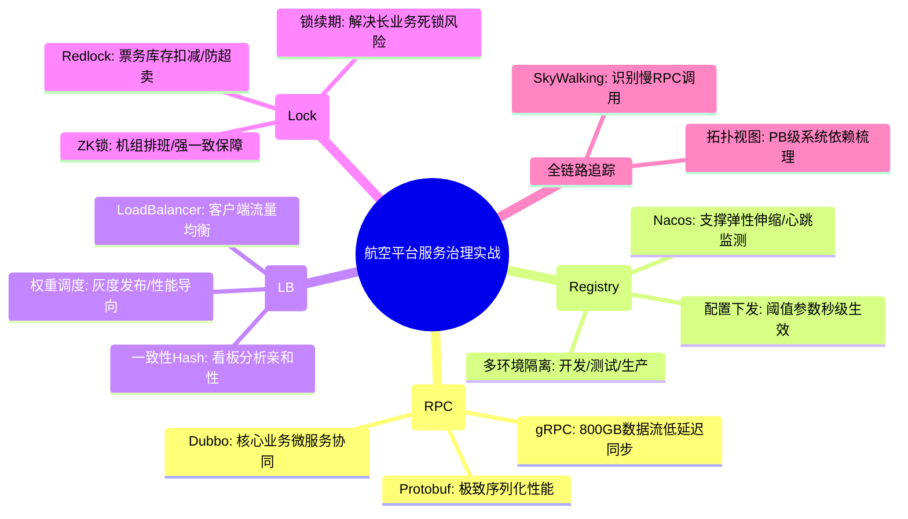

# 服务治理核心知识

## 1. 核心文字版

### RPC 框架原理
- **基本组件**: 客户端 (Stub), 序列化, 网络传输 (TCP/HTTP), 核心逻辑处理。
- **主流框架**: Dubbo, gRPC (基于 HTTP/2), Thrift。

### 服务发现
- **注册中心**: Nacos, Zookeeper, Consul, Eureka。
- **工作机制**: 服务提供者启动注册 -> 消费者订阅并缓存地址 -> 注册中心变更实时推送。

### 负载均衡 (Load Balancing)
- **客户端负载均衡**: Ribbon, gRPC 内部实现。消费者自行选择节点。
- **服务端负载均衡**: Nginx, F5。外部设备负责分发流量。

### 分布式锁
- **Redis (Redlock)**: 性能高，适用于大多数业务场景。
- **Zookeeper**: 顺序临时节点机制，可靠性极高。
- **数据库 (MySQL)**: 悲观锁或乐观锁，性能低，仅适用于低频。

---

## 2. 思维脑图版 (基础理论)

```mermaid
mindmap
  root((服务治理))
    RPC通信
      协议: gRPC/Dubbo/Thrift
      序列化: JSON/Protobuf/Hessian
      传输: Netty/HTTP2
    服务注册与发现
      注册中心: Nacos/ZK/Eureka
      健康检查: 心跳检测
      动态路由: 实时变更
    负载均衡
      策略: 轮询/随机/一致性Hash
      方式: 客户端(Ribbon)/服务端(Nginx)
    分布式锁
      Redis: SETNX/Lua脚本/Redlock
      Zookeeper: 临时顺序节点/Watcher
      DB: 事务/唯一索引
    配置中心
      动态更新: 实时下发
      版本控制: 回滚机制
      权限管控: 环境隔离
```

---

## 3. 核心理论与项目实战 (航空运营管理平台案例)

> **项目背景**：在“航空运营智能管理平台”中，服务治理确保了跨区域、跨机房的上百个微服务能够高效协同。无论是秒级的航班动态同步，还是高频的票务交易，都依赖于健壮的服务治理体系。

### 3.1 RPC 实战：高性能跨服务调用
- **场景**：数据采集服务将 800GB/日 的航班流数据实时推送到分析引擎。
- **方案**：
    - **gRPC (基于 HTTP/2)**：利用其二进制协议和多路复用特性，实现低延迟的数据传输。通过 Protobuf 定义接口，降低序列化开销，支撑峰值 15MB/s+ 的数据同步。
    - **Dubbo 应用**：在票务、旅客等业务系统内部，利用 Dubbo 的高性能服务治理能力，实现复杂的业务逻辑调用。

### 3.2 服务发现实战：弹性伸缩与健康监测
- **场景**：节假日高峰期，自动扩容 50% 的“票务管理”实例。
- **方案**：
    - **Nacos 注册中心**：所有微服务实例启动后自动注册到 Nacos。通过 Nacos 的心跳检测机制，实时发现并剔除故障节点，确保 10 万并发流量始终流向健康的实例。
    - **灰度发布**：利用 Nacos 的权重配置，实现航司差异化策略的灰度上线，平滑验证新功能。

### 3.3 负载均衡实战：应对高并发访问
- **场景**：旅客通过多终端（App、官网、自助机）集中查票。
- **方案**：
    - **客户端负载均衡 (Spring Cloud LoadBalancer)**：在网关层集成，根据实例健康状况和负载情况，动态选择最优的后端节点。
    - **一致性 Hash 策略**：在“实时看板服务”中，利用一致性 Hash 确保同一航线的监控请求尽量落到同一分析节点，提升本地缓存命中率。

### 3.4 分布式锁实战：严防库存超卖
- **场景**：多个旅客同时抢购同一架航班的最后一张票。
- **方案**：
    - **Redis Redlock**：在座控库存扣减环节，使用 Redlock 实现分布式锁。配合 Lua 脚本保障加锁、业务处理、解锁的原子性，将超卖风险降低为零。
    - **Zookeeper 临时顺序节点**：在“机组排班”等对一致性要求极高、并发相对较低的场景，利用 ZK 锁的强一致性特性，防止排班冲突。

---

## 4. 思维脑图版 (实战版)


