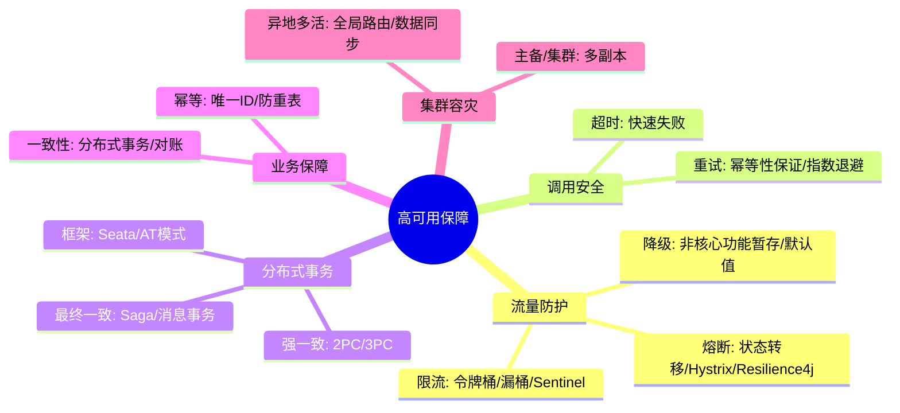
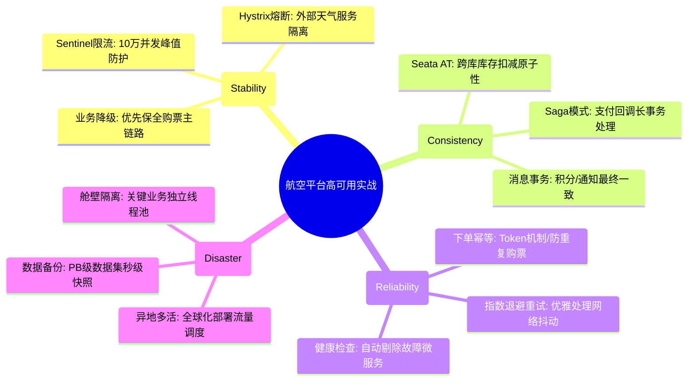

# 高可用保障核心知识

## 1. 核心文字版

### 限流 (Rate Limiting)
- **目的**: 防止瞬时大流量压垮系统。
- **常见算法**: 固定窗口、滑动窗口、漏桶算法、令牌桶算法（允许突发流量）。

### 熔断 (Circuit Breaker)
- **状态**: 开启 (Open)、关闭 (Closed)、半开启 (Half-Open)。
- **机制**: 错误率达到阈值后熔断，后续请求直接返回错误；一段时间后尝试部分放行，若正常则关闭熔断。

### 降级 (Fallback)
- **策略**: 丢弃非核心业务（如评论、推荐），保证核心业务（如登录、下单）可用。

### 超时与重试 (Timeout & Retry)
- **原则**: 必须设置超时时间；重试要考虑幂等性，且重试次数不宜过多，应有指数级退避策略。

### 分布式事务
- **2PC/3PC**: 强一致性，性能较差。
- **TCC (Try-Confirm-Cancel)**: 业务补偿型，开发量大。
- **Saga**: 最终一致性，长事务推荐。
- **Seata**: 主流开源方案，支持 AT、TCC 等多种模式。

### 幂等性设计
- **核心**: 同一操作执行多次结果相同。
- **实现**: 数据库唯一索引、Token 机制、乐观锁版本号。

---

## 2. 思维脑图版 (基础理论)

---

## 3. 核心理论与项目实战 (航空运营管理平台案例)

> **项目背景**：在“航空运营智能管理平台”中，高可用保障是系统的“生命线”。面对突发天气导致的航班变动流量激增、 PB 级数据的实时处理压力，必须通过全方位的流量防护与一致性保障确保系统不崩溃。

### 3.1 流量防护实战：应对 10 万并发查票峰值
- **场景**：节假日每日 9-11 点，查票流量瞬间暴涨至平时的 10 倍。
- **方案**：
    - **Sentinel 限流 (令牌桶)**：在网关层针对“航班查询”接口设置 QPS 阈值。当流量超过系统承载能力时，自动触发限流，返回友好的“系统繁忙”提示，保护后端微服务。
    - **Hystrix 熔断 (断路器)**：当“外部天气服务”响应缓慢或大量报错时，自动熔断对该服务的调用，避免线程池耗尽，实现快速失败。

### 3.2 业务降级实战：极端情况下的核心保全
- **场景**：因突发状况导致系统负载过高，需优先保障“旅客购票”核心链路。
- **方案**：
    - **非核心降级**：暂时关闭“历史足迹”、“辅助商城推荐”等非核心功能，释放 CPU 和内存资源。
    - **静态化兜底**：当“实时航班看板”压力过大时，切换为展示 5 分钟前的静态快照数据，保障管理层基本监控能力。

### 3.3 分布式事务实战：票务交易的一致性闭环
- **场景**：旅客支付成功后，涉及“订单状态更新”、“座控库存扣减”、“积分发放”跨库操作。
- **方案**：
    - **Seata AT 模式**：在“票务管理”微服务中，通过 `@GlobalTransactional` 开启全局事务。利用 Seata 自动解析 SQL 并生成回滚日志，保障跨库操作的原子性。
    - **Saga 模式 (长事务)**：在涉及第三方支付回调等长周期流程中，采用 Saga 补偿机制，确保即使支付成功后的后续逻辑失败，也能通过重试或逆向操作达成最终一致。

### 3.4 幂等性与重试实战：解决网络抖动下的重复提交
- **场景**：旅客在 App 上连续点击“下单”按钮，或由于网络超时触发了微服务的自动重试。
- **方案**：
    - **Token 机制**：进入下单页面前下发唯一 Token。提交时校验 Token 并将其失效（Redis 原子操作），确保同一请求只处理一次。
    - **指数级退避重试**：在调用外部“核验系统”时，若遇超时，采用 1s, 2s, 4s... 的指数级退避策略进行有限次数重试，避免因盲目重试加剧下游服务压力。

---

## 4. 思维脑图版 (实战版)

