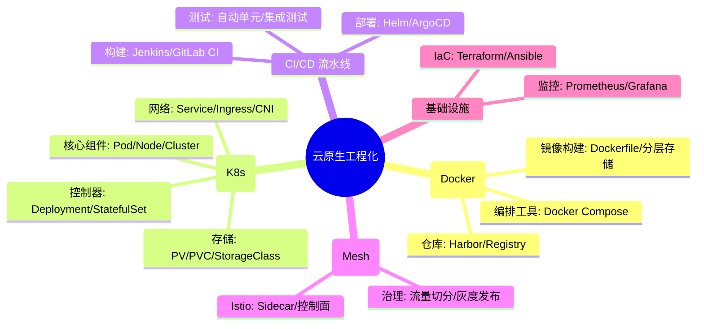

# 云原生工程化核心知识

## 1. 核心文字版

### Docker 容器技术
- **镜像 (Image)**: 只读模板，包含运行环境和应用代码。
- **容器 (Container)**: 镜像运行时的实例，轻量、隔离。
- **Docker Compose**: 用于定义和运行多容器应用的工具。

### Kubernetes (K8s)
- **Pod**: K8s 调度的最小单位，一个 Pod 可包含多个容器。
- **Service**: 稳定的网络访问入口，负责负载均衡。
- **Deployment**: 声明式更新，管理 Pod 的副本数量和版本。
- **ConfigMap/Secret**: 配置和机密信息管理。

### CI/CD 自动化流水线
- **CI (持续集成)**: 频繁将代码集成到主干，自动构建和测试。
- **CD (持续部署/交付)**: 自动化将应用发布到测试环境或生产环境。
- **工具**: GitLab CI, Jenkins, GitHub Actions, ArgoCD。

### 服务网格 (Service Mesh)
- **Istio**: Sidecar 代理模式，处理服务间通信（流量治理、安全、可观测性）。

---

## 2. 思维脑图版 (基础理论)



---

## 3. 核心理论与项目实战 (航空运营管理平台案例)

> **项目背景**：在“航空运营智能管理平台”中，云原生工程化是实现系统快速交付、弹性扩容及 PB 级数据处理底座自动化的关键。通过容器化与自动化运维，极大提升了航空业务的演进速度。

### 3.1 容器化实战：标准化部署与环境一致性
- **场景**：解决“开发、测试、生产”环境下“航班数据处理服务”运行不一致的问题。
- **方案**：
    - **Docker 镜像标准化**：将 Java 运行环境、依赖库及业务代码封装在统一的 Docker 镜像中。
    - **分层优化**：优化 Dockerfile，利用缓存机制将 800GB 数据处理所需的庞大依赖库放在底层，业务代码放在顶层，实现镜像秒级构建与分发。

### 3.2 K8s 编排实战：支撑 10 万并发的弹性伸缩
- **场景**：节假日高峰期，票务管理系统需动态增加节点以应对流量。
- **方案**：
    - **HPA 自动扩缩容**：基于 CPU 和内存利用率配置水平自动扩缩容（Horizontal Pod Autoscaler）。在 9-11 点高峰期，自动将 Pod 副本数从 10 个扩展至 50 个。
    - **自愈能力**：当某个“数据采集 Pod”因异常崩溃时，K8s 自动拉起新实例，保障 PB 级航班动态接入的连续性。

### 3.3 CI/CD 实战：航空业务功能的快速迭代
- **场景**：每周上线新的航司调价策略或退改签规则。
- **方案**：
    - **GitLab CI 流水线**：代码提交后自动触发构建、单元测试及镜像打包。
    - **ArgoCD 持续交付**：采用 GitOps 模式，ArgoCD 自动同步 K8s 集群状态与 Git 仓库配置。实现“一键部署”测试环境，并将验证通过的版本平滑推向生产，交付效率提升 200%。

### 3.4 服务网格实战：精细化流量治理与安全
- **场景**：实现“国航”与“东航”不同旅客偏好逻辑的灰度发布。
- **方案**：
    - **Istio 流量切分**：利用 Istio 的 VirtualService 和 DestinationRule，将 10% 的生产流量切向新版本的“智能推荐服务”，实现零停机的灰度验证。
    - **双向 TLS 安全认证**：在微服务间强制开启 mTLS，确保 PB 级旅客敏感数据在集群内部传输时的绝对安全。

---

## 4. 思维脑图版 (实战版)

```mermaid
mindmap
  root((航空平台云原生实战))
    弹性基座 (Kubernetes)
      HPA自动扩缩容: 应对交易高峰流量
      故障自愈: 采集节点秒级重启
      ConfigMap: 动态调整检修阈值
    高效交付 (CI/CD)
      GitOps (ArgoCD): 声明式自动化部署
      自动化测试: 保障业务迭代质量
      镜像加速: 分层构建/Harbor存储
    流量治理 (Service Mesh)
      Istio灰度发布: 航司逻辑平滑上线
      全链路加密: mTLS保障旅客隐私
      熔断限流: 边车代理层流量防护
    可观测性 (Observability)
      Prometheus: K8s集群实时监控
      Grafana: 资源消耗看板可视化
      EFK日志: 容器环境故障快速定位
```
