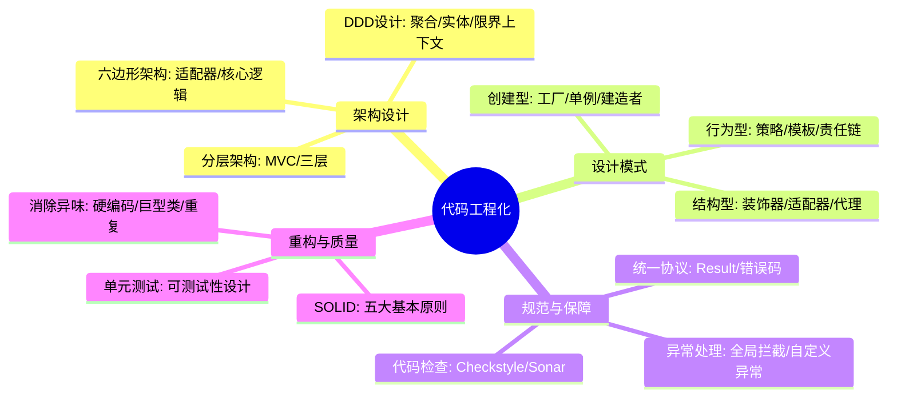
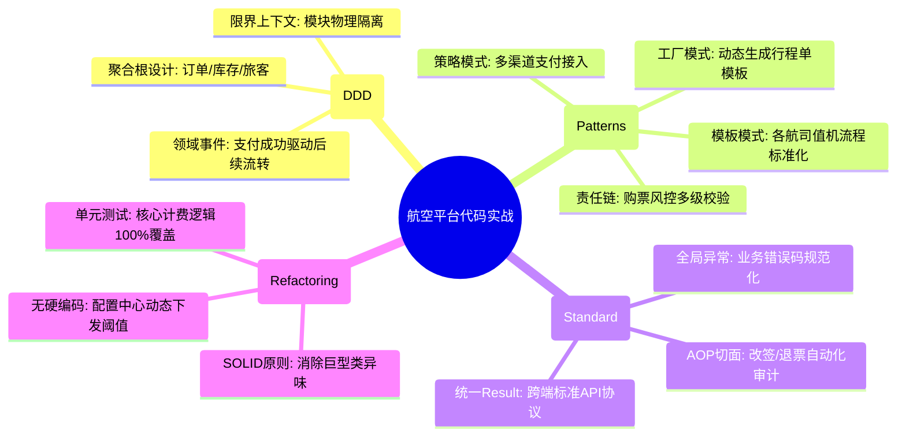

# 代码工程化核心知识

## 1. 核心文字版

### 代码规范与结构
- **MVC/分层架构**: Controller (入口), Service (业务), DAO (数据), DTO/VO (数据传输)。
- **DDD (领域驱动设计)**: 领域模型为核心，划分聚合根、实体、值对象，解耦复杂业务逻辑。

### 设计模式 (实战最常用)
- **策略模式**: 消除冗长的 `if-else`，动态切换算法。
- **模板模式**: 定义算法骨架，子类实现具体步骤（如：支付流程）。
- **工厂模式**: 封装对象的创建过程。
- **责任链模式**: 将请求沿链传递，每个节点决定是否处理（如：拦截器、审批流）。

### 异常体系与统一返回
- **统一异常处理**: `@ControllerAdvice` + `@ExceptionHandler`，捕获全局异常，返回标准格式。
- **统一返回结果**: 定义 `Result<T>` 类，包含 `code`, `message`, `data`。
- **业务码规范**: 定义标准的错误码枚举类。

### 重构原则
- **SOLID 原则**: 单一职责、开闭原则、里氏替换、接口隔离、依赖倒置。
- **代码整洁之道**: 命名清晰、函数简短、无硬编码。

---

## 2. 思维脑图版 (基础理论)

---

## 3. 核心理论与项目实战 (航空运营管理平台案例)

> **项目背景**：在“航空运营智能管理平台”中，代码工程化是保障 PB 级复杂业务逻辑不乱、不崩、可长期维护的关键。通过 DDD 思想与设计模式的深度应用，支撑了多航司、多场景的灵活业务扩展。

### 3.1 架构设计实战：票务系统的 DDD 建模
- **场景**：解决传统 MVC 模式下“票务逻辑”过于臃肿、难以维护的问题。
- **方案**：
    - **领域驱动设计 (DDD)**：将票务系统划分为“订单聚合”、“库存聚合”和“营销聚合”。
    - **限界上下文**：明确各聚合间的边界，通过领域事件（Domain Event）驱动库存扣减与积分发放，实现复杂业务逻辑的物理解耦。

### 3.2 设计模式实战：多渠道支付与动态值机
- **场景**：支持支付宝、微信、银联等多种支付方式，及各航司差异化的值机流程。
- **方案**：
    - **策略模式 (Strategy)**：定义统一的 `PaymentStrategy` 接口，根据旅客选择动态切换支付算法，消除冗长的 `if-else`。
    - **模板模式 (Template Method)**：在“值机流程”中，定义标准的“身份核验 -> 座位选择 -> 登机牌生成”骨架。子类（各航司实现）只需实现特定的座位分配规则，极大提升了代码复用率。
    - **责任链模式 (Chain of Responsibility)**：在“购票风控校验”中，将实名校验、黑名单拦截、库存余额检查串联成链，每个环节独立维护。

### 3.3 规范保障实战：统一异常体系与协议
- **场景**：跨团队协作时，前后端及微服务间对错误信息的理解不一致。
- **方案**：
    - **全局异常拦截**：通过 `@ControllerAdvice` 统一捕获“余额不足”、“航班已起飞”等业务异常，并映射为标准的 `BusinessException`。
    - **Result 包装类**：定义标准的 API 返回格式。即使后端抛错，也能返回带有 `code: 50012`（对应“库存不足”）的 JSON，方便前端及移动端进行差异化逻辑处理。

### 3.4 代码重构实战：消除“巨型类”异味
- **场景**：重构一个拥有 3000 行代码的“航班计划处理类”。
- **方案**：
    - **单一职责 (SRP)**：将数据校验、数据库持久化、外部系统推送逻辑拆分到独立的 Component 中。
    - **依赖倒置 (DIP)**：通过接口注入实现与底层存储引擎的解耦。使该模块能无缝从 MySQL 迁移至 PB 级分布式数据库，而无需修改核心业务逻辑。

---

## 4. 思维脑图版 (实战版)

