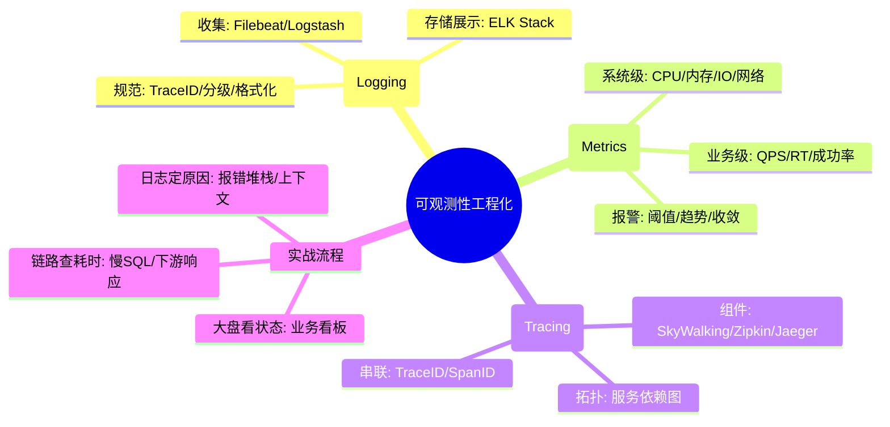
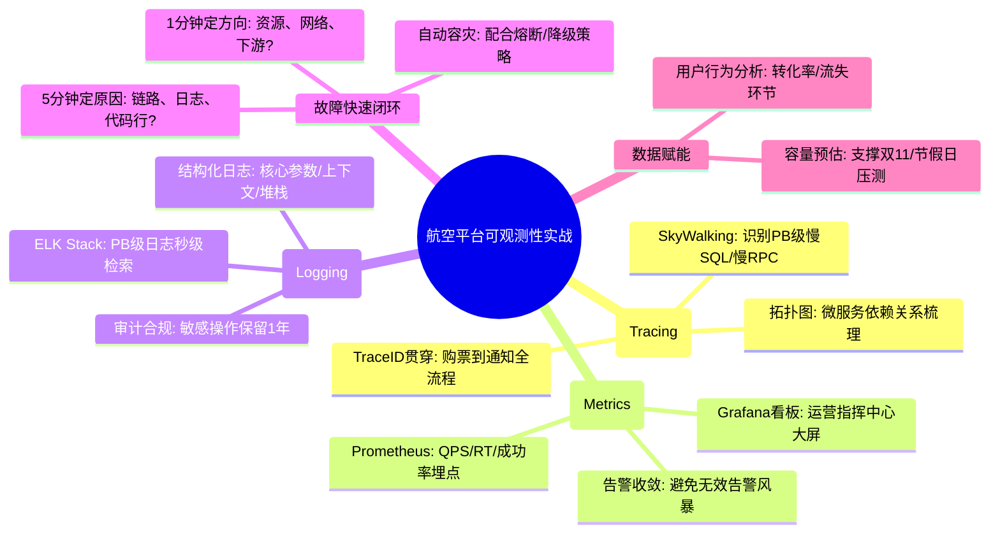

# 可观测性工程化核心知识

## 1. 核心文字版

### 日志规范 (Logging)
- **级别**: DEBUG (开发调试), INFO (关键流程), WARN (业务预期异常), ERROR (系统故障)。
- **规范**: 包含 TraceID, 核心参数, 关键步骤, 堆栈信息。
- **技术栈**: ELK (Elasticsearch, Logstash, Kibana)。

### 监控指标 (Metrics)
- **核心指标**: QPS (吞吐量), RT (响应时间), Error Rate (错误率), CPU/Memory (资源消耗)。
- **技术栈**: Prometheus (数据收集) + Grafana (看板展示)。

### 链路追踪 (Tracing)
- **原理**: 通过 TraceID 串联一个请求经过的所有微服务，记录每个环节的耗时。
- **技术栈**: SkyWalking (无侵入), Zipkin, Jaeger。

### 线上问题定位流程
- **1分钟定位方向**: 通过看板确认是 CPU、内存、网络还是下游依赖问题。
- **5分钟找到原因**: 通过链路追踪定位到具体服务，通过日志定位到代码行。

---

## 2. 思维脑图版 (基础理论)

---

## 3. 核心理论与项目实战 (航空运营管理平台案例)

> **项目背景**：在“航空运营智能管理平台”中，可观测性是保障系统稳定运行的“眼睛”。面对 PB 级数据流和 10 万并发访问，必须建立全方位的监控与链路追踪体系，确保故障能秒级发现、分钟级定位。

### 3.1 日志实战：PB 级数据的全链路追踪
- **场景**：旅客投诉“购票扣款成功但未生成行程单”。
- **方案**：
    - **统一 TraceID**：在网关层生成唯一 TraceID，并随请求流转透传至票务、支付、行程、通知等所有微服务。
    - **ELK 日志检索**：通过 Kibana 根据 TraceID 一键检索全链路日志。发现支付回调由于网络抖动在“行程单生成”环节超时，从而快速发起手动补单。

### 3.2 监控实战：节假日峰值流量的实时预警
- **场景**：节假日 9-11 点，查票流量激增，需实时监控系统健康度。
- **方案**：
    - **Prometheus 业务指标监控**：自定义埋点监控“每秒购票数”、“库存查询延迟”等核心业务指标。
    - **Grafana 看板可视化**：在大屏上实时展示 QPS、RT 及错误率。当 RT 超过 1s 阈值时，自动通过钉钉/邮件触发告警，提醒运维团队进行 HPA 扩容。

### 3.3 链路追踪实战：定位 PB 级数据集查询缓慢
- **场景**：数据可视化大屏展示“年度航线收益”时，加载时间超过 10s。
- **方案**：
    - **SkyWalking 拓扑分析**：利用 SkyWalking 发现该请求在经过“数据挖掘服务”时，由于底层 SQL 未命中索引导致了 8s 的慢查询。
    - **性能瓶颈定位**：通过链路图清晰看到耗时分布，精准定位到具体的 SQL 语句，优化后响应时间降至 2s。

### 3.4 线上故障排查实战：1-5 分钟快速闭环
- **场景**：突发航班变动导致通知服务大面积报错。
- **方案**：
    - **1分钟看大盘**：通过 Grafana 确认通知服务的 Error Rate 飙升，而 CPU/内存正常，排除硬件故障。
    - **5分钟定原因**：在 SkyWalking 链路中发现报错节点集中在“短信网关调用”环节，查看该节点日志显示“三方接口欠费”。由于建立了标准的排查流程，故障在 5 分钟内即被准确定位并解决。

---

## 4. 思维脑图版 (实战版)

