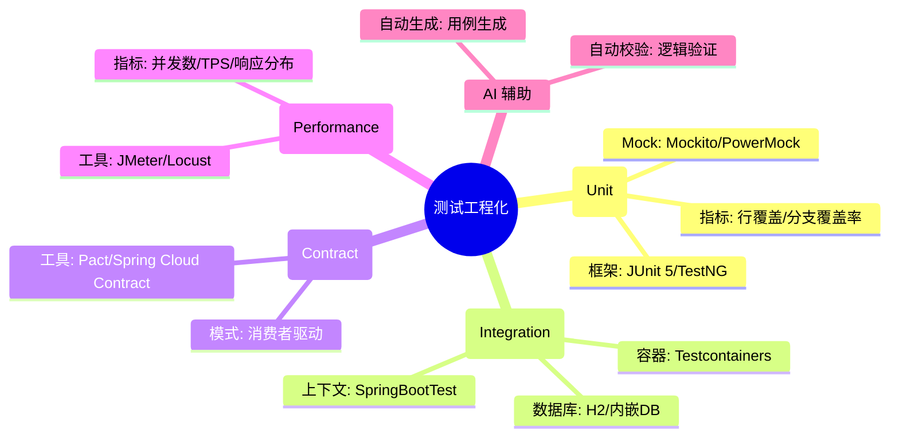
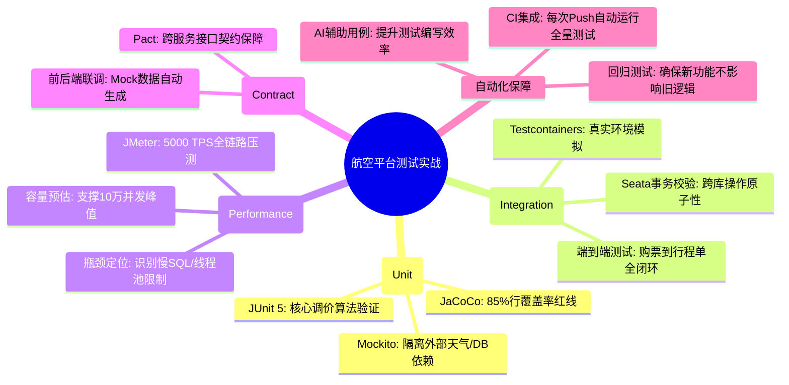

# 测试工程化核心知识

## 1. 核心文字版

### 单元测试 (JUnit 5)
- **目标**: 验证最小业务逻辑单元。
- **核心组件**: 断言 (Assertions), 生命周期注解 (`@BeforeEach`, `@AfterEach`)。

### Mock 框架 (Mockito)
- **目的**: 隔离外部依赖（如数据库、第三方 API）。
- **用法**: `when(...).thenReturn(...)` 定义模拟行为。

### 接口测试
- **目的**: 验证整个接口的输入输出。
- **工具**: Postman, RestAssured, Spring TestContext Framework。

### 契约测试 (Pact)
- **目的**: 验证微服务之间接口契约的稳定性，防止一方修改破坏另一方。

### AI 辅助测试
- **AI 写保障**: AI 生成代码，开发者编写自动化测试一键验证。
- **自动化回归**: 每次代码变更后自动运行所有测试用例。

---

## 2. 思维脑图版 (基础理论)

---

## 3. 核心理论与项目实战 (航空运营管理平台案例)

> **项目背景**：在“航空运营智能管理平台”中，测试工程化是保障 PB 级复杂系统稳定性的“最后一道防线”。通过全方位的自动化测试体系，确保了系统在面对 10 万并发访问及频繁业务迭代时的零故障交付。

### 3.1 单元测试实战：保障计费规则的 100% 准确
- **场景**：验证复杂的“航司动态调价算法”。
- **方案**：
    - **JUnit 5 + Mockito**：针对定价逻辑编写海量单元测试用例。通过 Mockito 模拟数据库中的基础票价和外部天气系数，确保核心算法在各种极端场景（如：库存为 0、燃油费突增）下的计算结果 100% 正确。
    - **覆盖率监控**：在 CI 流水线中集成 JaCoCo，强制要求核心业务模块的行覆盖率 ≥85%。

### 3.2 集成测试实战：复杂业务流的端到端验证
- **场景**：验证“用户下单 -> 支付成功 -> 库存扣减 -> 行程单生成”的完整闭环。
- **方案**：
    - **Testcontainers 应用**：在测试代码中动态启动 MySQL 和 Redis 容器，模拟真实的运行环境。
    - **SpringBootTest**：启动完整的 Spring 上下文进行集成测试。确保各微服务间的接口调用及分布式事务（Seata）在真实数据库交互下能正常工作，解决“Mock 无法发现数据库约束问题”的痛点。

### 3.3 性能测试实战：支撑节假日 5000+ TPS 压力
- **场景**：模拟春运期间 10 万旅客同时抢票。
- **方案**：
    - **JMeter 分布式压测**：在测试集群中部署多个 JMeter 节点，模拟高并发请求流。
    - **全链路压测分析**：配合 SkyWalking 和 Grafana 观察系统在 5000 TPS 压力下的表现。发现并优化了“身份证核验”接口的性能瓶颈，将 RT 从 2s 降低至 500ms。

### 3.4 契约测试实战：微服务演进的稳定性保障
- **场景**：当“旅客管理服务”修改了 API 字段时，防止导致“票务服务”崩溃。
- **方案**：
    - **Pact 契约测试**：定义消费者（票务服务）对提供者（旅客服务）的接口期望。在每次 CI 构建时自动校验契约，实现微服务间的解耦验证，确保 PB 级系统在频繁迭代中不会因接口变更引发生产事故。

---

## 4. 思维脑图版 (实战版)

