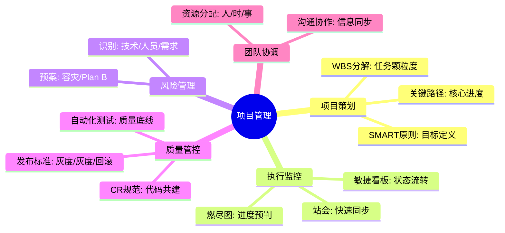
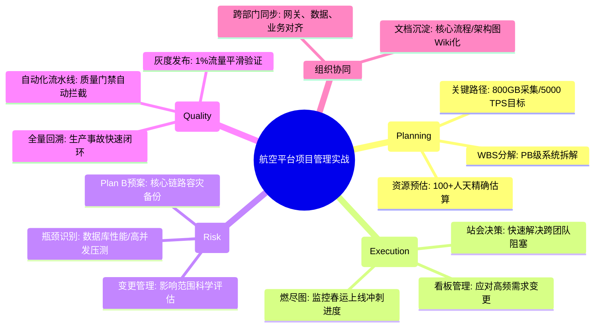

# 项目管理核心知识

## 1. 核心文字版

### 计划制定 (Planning)
- **目标设定**: SMART 原则 (明确、可衡量、可达成、相关、有时限)。
- **WBS (任务分解)**: 将项目分解为可管理的小任务。
- **里程碑**: 设定关键交付节点。

### 进度跟踪 (Execution & Tracking)
- **每日站会**: 沟通进展、发现阻塞点。
- **燃尽图**: 监控剩余工作量与时间的关系。
- **看板 (Kanban)**: 可视化任务流转状态（To Do, In Progress, Done）。

### 风险控制 (Risk Management)
- **风险识别**: 技术瓶颈、资源短缺、需求变更。
- **应对方案**: 规避、减轻、转移、接受。

### 质量保证 (Quality Assurance)
- **Code Review**: 团队代码质量共建。
- **测试覆盖**: 确保核心路径通过测试。
- **发布规范**: 灰度发布、回滚机制。

---

## 2. 思维脑图版 (基础理论)

---

## 3. 核心理论与项目实战 (航空运营管理平台案例)

> **项目背景**：在“航空运营智能管理平台”这种大型复杂工程中，项目管理是确保 PB 级系统按时交付、高质量运行的关键。通过科学的管理手段，协调了 100+ 开发人员、PB 级数据处理需求及高频业务变更。

### 3.1 计划制定实战：PB 级系统的 WBS 分解
- **场景**：规划“全国航班动态实时分析系统”的研发周期。
- **方案**：
    - **WBS 分解**：将大系统拆分为“采集引擎”、“流处理中心”、“数据可视化”三个子项目。
    - **里程碑设定**：设定“10月30日前完成日均 800GB 数据接入验证”、“11月15日前实现 5000 TPS 压测达标”等关键节点，确保进度透明可控。

### 3.2 进度跟踪实战：应对高频业务变更
- **场景**：临近上线，民航局发布了新的退改签合规要求。
- **方案**：
    - **敏捷看板管理**：将突发的需求变更加入待办池，利用看板可视化评估任务优先级。
    - **每日站会同步**：在 15 分钟站会中快速同步变更影响，协调后端（票务、旅客）与前端（App、Web）的并行开发，确保新规准时上线。

### 3.3 风险控制实战：技术瓶颈与资源预警
- **场景**：发现分布式数据库在处理 50 亿条历史订单时性能未达标。
- **方案**：
    - **风险识别与 Plan B**：提前识别数据库查询瓶颈。
    - **应对方案**：启动“备选分片存储方案”调研，并在 1 周内完成原型验证。通过增加资源投入（规避）与优化索引结构（减轻），成功化解系统瘫痪风险。

### 3.4 质量保障实战：金融级可靠性的发布标准
- **场景**：购票主链路代码变更后的安全发布。
- **方案**：
    - **自动化 CR 规范**：集成 Sonar 进行静态代码扫描，强制要求 CR 覆盖率 100%。
    - **灰度发布标准**：核心模块必须经过“内网测试 -> 预发验证 -> 1% 流量灰度 -> 全量发布”的严格流程。配合 ELK 和 SkyWalking 的实时回滚预警，确保线上 0 事故。

---

## 4. 思维脑图版 (实战版)

