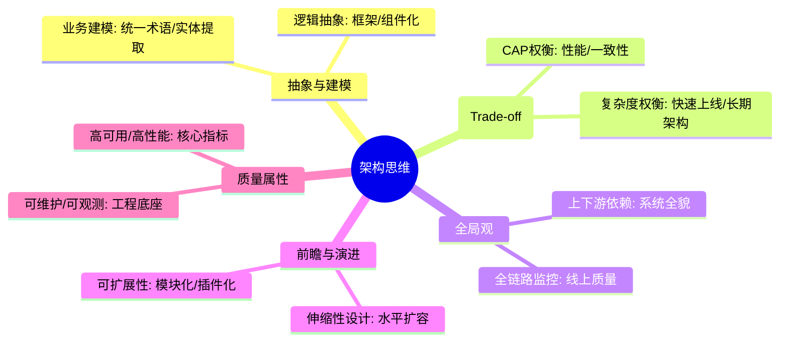
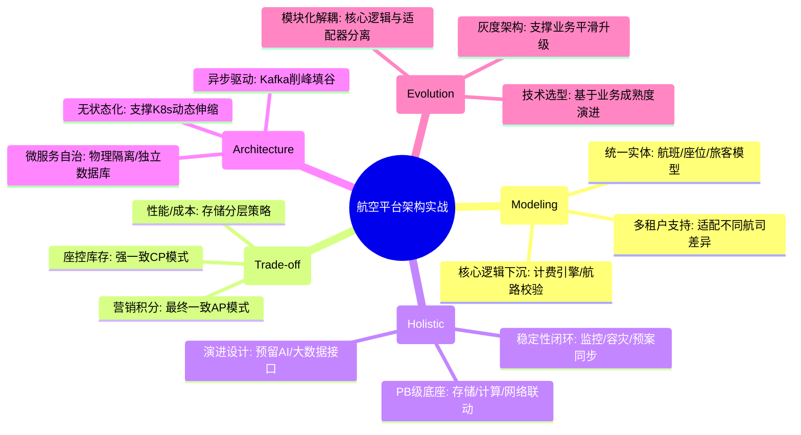

# 架构设计思维核心知识

## 1. 核心文字版

### 抽象能力 (Abstraction)
- **概念**: 从复杂的现实业务中提取出通用的模型和逻辑。
- **实践**: 统一业务术语、提取共性逻辑到中间件或框架中。

### 权衡利弊 (Trade-off)
- **核心**: 架构设计没有完美的方案，只有最适合当前业务的方案。
- **考量**: 性能 vs 成本, 开发效率 vs 系统稳定性, 强一致性 vs 最终一致性。

### 系统化思考
- **整体观**: 不仅关注代码，还要关注数据库、网络、部署环境、监控及后续演进。
- **前瞻性**: 预估未来一到两年的业务增长，预留扩展接口和水平扩容能力。

### 常用设计模式在架构中的应用
- **微服务**: 解耦、自治。
- **分层设计**: 逻辑清晰、职责单一。

---

## 2. 思维脑图版 (基础理论)

---

## 3. 核心理论与项目实战 (航空运营管理平台案例)

> **项目背景**：在“航空运营智能管理平台”这种 PB 级复杂系统的架构设计中，思维的深度直接决定了系统的生命周期。通过抽象业务本质、精细化权衡及前瞻性布局，支撑了日均 800GB 数据流处理与 10 万并发访问。

### 3.1 抽象能力实战：建立全航网统一业务模型
- **场景**：解决不同航司、不同机场之间数据格式不一、业务逻辑碎片化的问题。
- **方案**：
    - **业务实体抽象**：提炼出通用的“航班 (Flight)”、“座位 (Seat)”、“旅客 (Passenger)”领域模型。
    - **逻辑组件化**：将“票价计算”、“航路校验”等通用逻辑下沉为公共服务，支撑上层“App 查票”、“自助机值机”、“柜台退改”等多个差异化场景。

### 3.2 权衡利弊实战：强一致性 vs 系统可用性
- **场景**：在“座控库存扣减”与“旅客积分发放”中进行技术选型。
- **方案**：
    - **核心链路选 CP**：针对“座控库存”，宁可牺牲部分可用性，也要保障强一致性，采用分布式锁严防超卖。
    - **辅助链路选 AP**：针对“积分发放”，采用 BASE 理论，追求最终一致性。通过 MQ 异步化提升系统吞吐量（A），允许积分到账有秒级延迟。

### 3.3 系统化思考实战：PB 级数据处理的整体布局
- **场景**：设计一个能支撑未来 3 年 50% 业务增长的实时分析架构。
- **方案**：
    - **整体观布局**：不仅关注流处理算法，还同步规划了 PB 级分布式存储扩容方案、基于 K8s 的计算节点弹性伸缩，以及全链路的可观测性监控。
    - **前瞻性设计**：预留了 AI 模型接入的标准化接口。当后续引入“航线需求预测模型”时，无需重构现有数据流水线，仅需通过插件形式注入即可。

### 3.4 微服务实战：解耦复杂业务逻辑
- **场景**：将原有的“巨石型”票务系统拆分为微服务。
- **方案**：
    - **限界上下文划分**：按照业务边界将系统拆分为“票务中心”、“支付中心”、“数据中心”。
    - **自治性保障**：每个服务拥有独立的数据库，通过标准的 gRPC 协议通信，实现了业务的物理隔离与独立演进。

---

## 4. 思维脑图版 (实战版)

