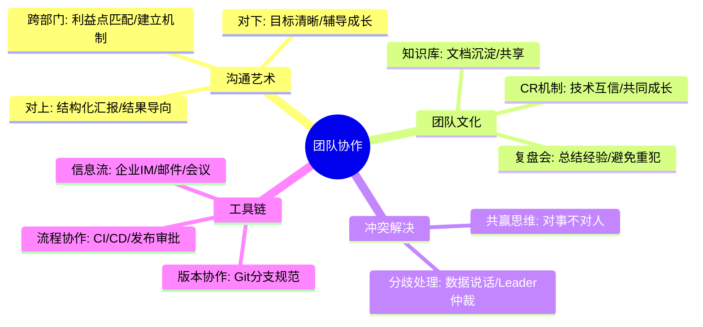
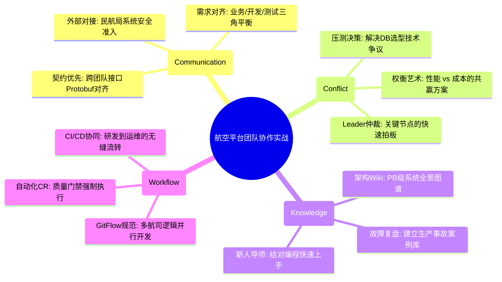

# 团队协作核心知识

## 1. 核心文字版

### 沟通表达
- **向上沟通**: 结果导向、方案对比、风险同步。
- **向下沟通**: 目标明确、充分授权、及时反馈。
- **跨团队沟通**: 建立信任、利益一致、明确分工。

### 冲突处理
- **原则**: 对事不对人。
- **方法**: 寻找共同利益点、引入第三方（如：Leader）决策。

### 知识共享
- **Wiki/文档**: 核心逻辑和流程必须沉淀为文档。
- **技术分享 (Tech Talk)**: 定期交流新技术和实战经验。

### 协作工具
- **版本管理**: Git。
- **任务管理**: Jira, Trello。
- **文档管理**: Confluence, 语雀。

---

## 2. 思维脑图版 (基础理论)

---

## 3. 核心理论与项目实战 (航空运营管理平台案例)

> **项目背景**：在“航空运营智能管理平台”这种涉及 100+ 开发人员、跨越“网关、业务、数据、运维”多个职能团队的巨型项目中，协作的效率直接决定了 PB 级系统的交付质量。通过构建标准化的协作流程，保障了复杂业务的平稳运行。

### 3.1 跨团队沟通实战：对接“民航局核验系统”
- **场景**：平台需与外部民航局系统对接，涉及接口协议对齐、压力测试及安全准入。
- **方案**：
    - **明确接口契约**：组织网关团队、票务团队与外部专家共同定义标准的 Protobuf 契约，避免联调阶段的语义偏差。
    - **风险预警机制**：当发现外部系统并发上限无法支撑 10 万并发访问时，及时向架构组反馈，推动“前端限流 + 后端异步队列”的组合方案落地。

### 3.2 冲突处理实战：数据存储方案之争
- **场景**：针对“50 亿条历史订单”的存储，数据团队主张使用列式数据库，业务团队倾向于分库分表。
- **方案**：
    - **数据说话**：组织两方进行 POC 压测，对比查询响应时间（RT）与存储成本。
    - **寻找平衡点**：最终达成共识，核心交易使用分库分表（保障一致性），历史归档数据导出至列式库（保障离线分析性能），成功化解技术分歧。

### 3.3 知识共享实战：沉淀 PB 级系统的“百科全书”
- **场景**：新成员入职后，难以快速理解复杂的航班动态采集逻辑。
- **方案**：
    - **架构 Wiki 化**：在 Confluence 上沉淀全量架构图、数据流向图及 100+ 微服务的接口文档。
    - **Tech Talk 常态化**：每周举办“航空技术沙龙”，分享“G1 调优实战”、“Kafka 事务应用”等核心经验，将个人能力转化为组织资产。

### 3.4 协作工具实战：保障春运冲刺的代码质量
- **场景**：春运前夕，多航司逻辑高频迭代，代码合并冲突频发。
- **方案**：
    - **Git Flow 规范**：严格执行 `feature -> develop -> release -> master` 的分支管理流。
    - **强制 CR 流程**：在 GitLab 中配置 Merge Request 必须经过 2 位资深架构师审核（Review），确保核心计费、退改代码的 0 缺陷合入。

---

## 4. 思维脑图版 (实战版)

