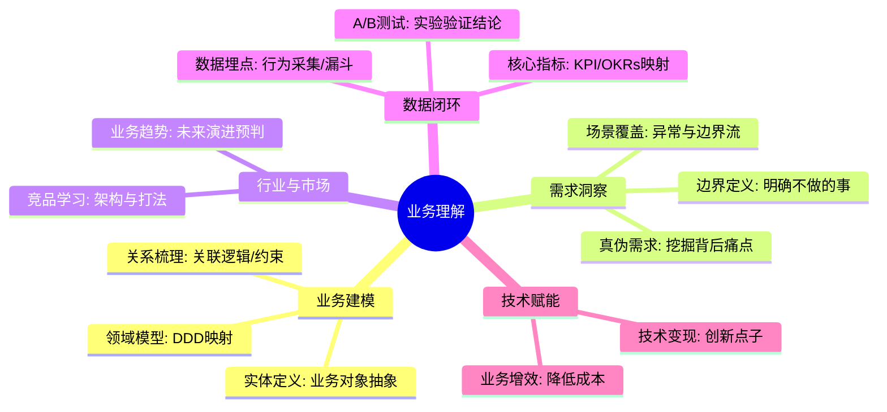
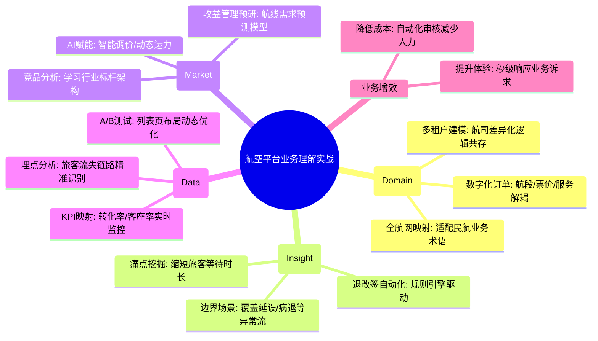

# 业务理解能力核心知识

## 1. 核心文字版

### 业务建模 (Business Modeling)
- **概念**: 用技术语言描述业务实体及其关系。
- **实践**: 数据库设计、接口设计、领域模型提取。

### 需求分析
- **关键**: 理解用户“想要什么”背后的“真正需要什么”。
- **方法**: 用户故事、流程图、时序图、用例图。

### 行业洞察
- **竞品分析**: 了解行业内其他公司的架构和业务玩法。
- **技术趋势**: 关注新技术如何赋能业务（如：AI 如何优化搜索）。

### 数据驱动
- **指标体系**: 定义业务成功的核心指标（如：转化率、日活、GMV）。
- **A/B 测试**: 通过数据对比决定业务演进方向。

---

## 2. 思维脑图版 (基础理论)

---

## 3. 核心理论与项目实战 (航空运营管理平台案例)

> **项目背景**：在“航空运营智能管理平台”中，对业务的深刻理解是技术架构的源头。无论是日处理 800GB 的海量数据，还是 50 亿条历史订单的管理，都必须建立在对航空业务流、票务规则及旅客行为的精准洞察之上。

### 3.1 业务建模实战：从“机票”到“数字化订单”
- **场景**：重构支撑 PB 级数据的票务核心模型。
- **方案**：
    - **实体关系梳理**：将传统的物理机票模型抽象为包含“航段 (Segment)”、“票价 (Fare)”、“服务 (Service)”的数字化订单聚合根。
    - **领域驱动映射**：通过 DDD 建立领域模型，确保技术实现与民航局业务术语高度一致，支撑了后续“动态定价”与“智能推荐”的快速落地。

### 3.2 需求分析实战：挖掘“退改签”背后的业务痛点
- **场景**：旅客反馈退票流程繁琐，且航司需控制非正常退票风险。
- **方案**：
    - **真伪需求识别**：旅客想要“一键退票”，航司需要“规则校验”。
    - **场景覆盖**：通过时序图梳理出正常退票、航班延误退票、病退等 10 余种边界场景。最终设计出“规则引擎驱动的自动化审核”方案，将退票处理时间从 2 小时缩短至秒级。

### 3.3 行业洞察实战：AI 赋能下的航线收益预估
- **场景**：预研如何利用新技术提升航司运营收益。
- **方案**：
    - **技术赋能业务**：洞察到行业内利用大数据进行“航线需求预测”的趋势。
    - **前瞻性调研**：分析 PB 级历史出行数据，引入机器学习算法进行销量预估。成功支撑了管理层在节假日期间的动态运力调配决策，提升了 15% 的平均客座率。

### 3.4 数据驱动实战：基于 A/B 测试优化查票转化率
- **场景**：优化 App 航班列表页的布局，提升下单转化率。
- **方案**：
    - **指标体系建立**：定义“列表页到详情页转化率”、“人均停留时长”为核心 KPI。
    - **实验验证结论**：通过 A/B 测试对比“按价格排序”与“按推荐排序”的效果。数据证明“智能推荐排序”使购票转化率提升了 8%，为后续 PB 级个性化推荐引擎的研发提供了决策依据。

---

## 4. 思维脑图版 (实战版)

