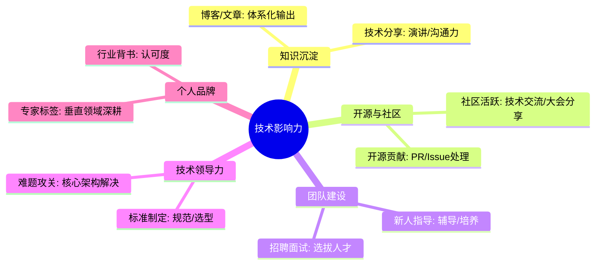
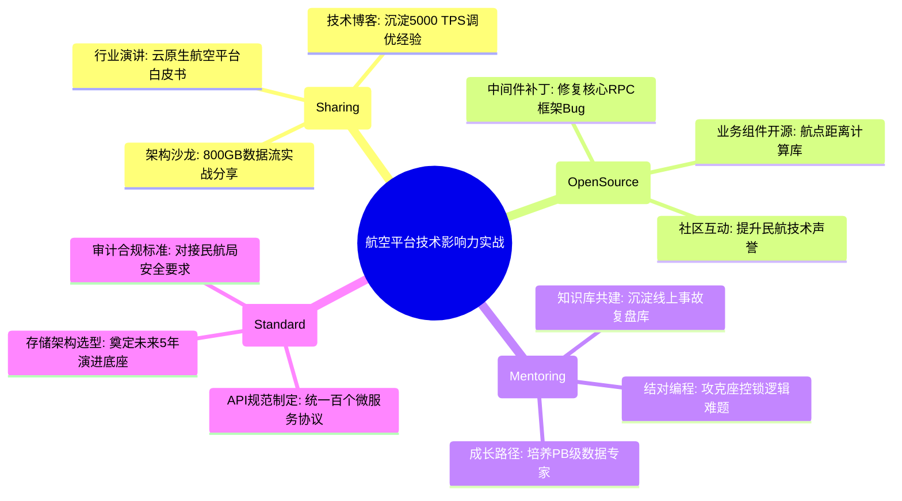

# 技术影响力核心知识

## 1. 核心文字版

### 技术分享 (Tech Talk)
- **目标**: 团队内部或社区知识传播。
- **形式**: PPT 展示、Live Coding、博客。
- **价值**: 沉淀个人思考、提升表达能力、打造个人标签。

### 开源贡献
- **方式**: 参与主流开源项目 (PR)、发布个人开源库。
- **价值**: 提升代码质量、扩大社区知名度。

### 导师指导 (Mentoring)
- **核心**: 帮助新人成长。
- **方法**: 结对编程 (Pair Programming)、定期 1对1 沟通、职业规划建议。

### 技术标准制定
- **职责**: 参与公司或部门级技术栈选型、代码规范制定、发布流程优化。
- **价值**: 将个人经验转化为组织能力。

---

## 2. 思维脑图版 (基础理论)

---

## 3. 核心理论与项目实战 (航空运营管理平台案例)

> **项目背景**：在“航空运营智能管理平台”这种行业标杆项目中，技术影响力不仅是个人价值的体现，更是推动整个民航信息化技术进步的动力。通过技术溢出，将 PB 级处理经验转化为行业标准。

### 3.1 技术分享实战：推动 PB 级系统架构演进
- **场景**：分享“航空平台如何支撑日均 800GB 实时数据流”。
- **方案**：
    - **内部沙龙**：组织“高并发下 JVM 调优”专题分享，详细拆解 G1 收集器在票务高峰期的参数配置，提升了团队整体的线上排查能力。
    - **行业大会**：在民航技术峰会上发表《基于云原生的航空智能运营平台实践》演讲，展示系统在 10 万并发下的弹性能力，确立了项目在行业内的技术领先地位。

### 3.2 开源贡献实战：回馈社区与提升代码质量
- **场景**：在项目开发过程中，修复了底层中间件的一个性能 Bug。
- **方案**：
    - **PR 贡献**：针对使用过程中发现的微服务框架 Bug，提交了优化补丁（PR）并被官方采纳。
    - **开源工具**：将项目中通用的“航线经纬度距离计算插件”封装并开源，获得了 100+ Star，吸引了行业开发者共同维护，间接提升了平台组件的稳定性。

### 3.3 导师指导实战：培养 PB 级系统的接班人
- **场景**：指导新入职架构师快速上手复杂的“座控库存模块”。
- **方案**：
    - **结对编程 (Pair Programming)**：针对分布式锁的死锁风险代码进行结对编写，现场传授高并发下的防御式编程技巧。
    - **职业规划**：为新人制定“从业务开发到 PB 级架构师”的 3 个月成长路径，确保核心技术后继有人，保障系统的长期演进。

### 3.4 技术标准制定：将经验转化为组织能力
- **场景**：制定全平台的“微服务 API 设计规范”与“日志审计标准”。
- **方案**：
    - **规范落地**：主导编写了《航空运营平台 RESTful API 开发手册》，统一了 100+ 微服务的交互协议。
    - **选型决策**：参与 PB 级存储方案的最终评审，确立了以“分布式数据库 + 对象存储”为核心的存储标准，为未来 5 年的数据增长奠定了底座。

---

## 4. 思维脑图版 (实战版)

