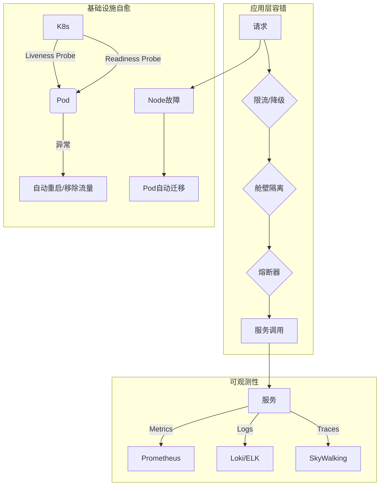

# 云原生架构下的可靠性设计 (航空运营智能管理平台实战)

## 一、 项目背景与可靠性挑战

**项目概述**：航空运营智能管理平台是一个为全球多家航司、近百个机场提供核心业务支撑的复杂系统。它承载着旅客服务、票务交易、航班调度、检修预警等关键功能，年服务旅客超 3000 万人次，任何服务中断都将引发巨大的经济损失和品牌声誉危机。

**核心可靠性挑战**：
- **服务雪崩**：在微服务架构下，单个非核心服务（如：积分查询）的故障，可能因服务间调用链路的级联失败，最终拖垮整个核心交易系统。
- **基础设施故障**：底层物理服务器、网络交换机的硬件故障或云厂商的可用区（AZ）中断，都可能导致服务不可用。
- **“未知”的未知**：在复杂的分布式环境中，总会存在意料之外的“黑天鹅”事件，如何快速发现、定位并恢复这些未知故障，是可靠性设计的终极考验。

---

## 二、 可靠性设计理念与核心原则

- **Design for Failure (为失败而设计)**：从架构设计之初就假定任何组件（服务、节点、网络）都随时可能失败，并以此为前提构建容错和自愈机制。
- **多层防御 (Defense in Depth)**：可靠性不是单一技术点的堆砌，而是从应用层、中间件层到基础设施层构建的多层次、纵深化的防御体系。
- **爆炸半径控制 (Blast Radius Control)**：通过服务隔离、资源隔离和故障域划分，将任何故障的影响范围限制在最小的、可控的单元内，防止单点故障演变为全局灾难。
- **MTTR 优先于 MTBF**：在复杂的分布式系统中，绝对避免故障（提高 MTBF）是极其困难且昂贵的。因此，架构设计的重点应转向如何快速地从故障中恢复（降低 MTTR - 平均修复时间）。

---

## 三、 分层可靠性架构详解

### 3.1 应用层：微服务的容错设计

这是防止服务雪崩的第一道防线，核心在于实现服务间的“优雅降级”与“自我保护”。

- **服务隔离与熔断 (Sentinel)**：
    - **舱壁隔离**：为不同服务间的调用设置独立的线程池或信号量。例如，对“三方天气接口”的调用被隔离，即使该接口超时，也只会耗尽其自身线程池，绝不会影响到核心的“查票”、“下单”线程。
    - **动态熔断**：当“旅客积分服务”的错误率或响应时间超过预设阈值（如：5s 内错误率 > 50%），Sentinel 会自动熔断对其的调用，后续请求在一定时间窗口内直接返回降级逻辑（如：提示“积分服务繁忙”），避免无效等待和资源消耗。
- **请求限流与降级**：
    - **QPS 限流**：在流量入口（网关层）和核心服务（如：订单服务）设置精准的 QPS 限制，防止因突发流量（如：春运抢票）压垮后端系统。
    - **优雅降级**：当核心链路出现拥堵时，优先保障核心功能。例如，在购票流程中，可以暂时关闭“推荐相关航班”等非核心功能，确保“支付”和“出票”的绝对稳定。
- **重试与幂等性**：
    - **超时重试**：对于因网络抖动导致的临时性失败，客户端或服务调用方应配置合理的重试机制（如：带指数退避的重试）。
    - **幂等性保障**：所有涉及写操作的接口（如：创建订单、支付）必须设计为幂等的。这确保了重试请求不会导致重复下单或重复扣款等严重业务错误。

### 3.2 中间件与数据层：高可用保障

- **数据库高可用**：
    - **主从复制与读写分离**：采用 MySQL 主从架构，主库负责写操作，多个从库负责读操作，并通过数据库中间件实现读流量的负载均衡。当主库故障时，可秒级切换至从库，保障数据服务的连续性。
    - **跨可用区部署**：将数据库主库和从库部署在不同的可用区（AZ），有效抵御单数据中心的电力或网络故障。
- **消息队列 (Kafka) 可靠性**：
    - **多副本与 ISR**：Topic 的每个 Partition 设置多个副本（通常为 3），并要求消息至少被写入到 ISR (In-Sync Replicas) 列表中的大多数副本后才算成功，确保消息不丢失。
    - **消息事务**：在“下单后发送出票通知”等关键场景，利用 Kafka 的事务消息能力，确保业务操作与消息发送这两个动作的原子性。

### 3.3 基础设施层：Kubernetes 的自愈能力

Kubernetes 是云原生可靠性的基石，它提供了强大的自动化运维和故障自愈能力。

- **健康检查与自动重启 (Liveness & Readiness Probes)**：
    - **Liveness Probe (存活探针)**：K8s 定期检查 Pod 是否“活着”。如果一个 Pod 陷入死锁或无响应，K8s 会自动杀死并重启该 Pod，实现进程级的自愈。
    - **Readiness Probe (就绪探针)**：K8s 检查 Pod 是否“准备好”接收流量。如果一个 Pod 正在启动或因依赖的服务未就绪而无法正常工作，K8s 会暂时将其从 Service 的后端列表中移除，待其恢复后再重新加入。
- **弹性伸缩与自动扩容**：
    - **HPA (Horizontal Pod Autoscaler)**：根据 CPU 或内存使用率，自动增减 Pod 的数量。在票务高峰期，系统能自动从 10 个实例扩容至 50 个，高峰过后自动缩容，兼顾性能与成本。
    - **VPA (Vertical Pod Autoscaler)**：自动调整 Pod 的 CPU 和内存请求值（Request）与限制值（Limit），优化资源利用率。
- **故障转移与多区域部署**：
    - **节点故障自动迁移**：当某个 K8s Node 节点宕机时，该节点上的所有 Pod 会被调度器自动迁移到其他健康节点上，实现基础设施级的故障转移。
    - **联邦集群 (Federation)**：通过将 K8s 集群部署在多个地理区域（Region），并利用集群联邦或类似技术，可以实现区域级的容灾，这是最高级别的可靠性保障。

---

## 四、 可观测性：故障预警与快速定位的“眼睛”

一个无法被观测的系统，其可靠性无从谈起。全链路可观测性是实现低 MTTR 的关键。

- **日志 (Logging)**：所有服务输出结构化的 JSON 日志，包含 TraceID，便于在 ELK 或 Loki 中进行聚合、检索和分析。
- **指标 (Metrics)**：通过 Prometheus 采集系统和业务的黄金指标（延迟、流量、错误率、饱和度），并利用 Grafana 进行可视化展示和告警。
- **追踪 (Tracing)**：基于 SkyWalking 或 Jaeger 实现全链路追踪。一次旅客的购票请求，从 App 点击到后端数据库 SQL 执行的完整调用链都清晰可见，能将故障定位时间从小时级缩短至分钟级。

---

## 五、 结论

在云原生时代，系统的可靠性不再是运维团队的专属职责，而是需要架构师、开发人员从设计之初就深度参与的系统工程。通过在 **应用层** 构建完善的微服务容错体系，在 **基础设施层** 充分利用 Kubernetes 的故障自愈能力，并配合 **全链路可观测性** 体系，我们成功为航空运营智能管理平台构建了一个多层次、具备深度防御能力的可靠性架构，确保在复杂多变的生产环境中，系统依然能够持续、稳定地提供服务。

---
*文档编制日期：2026-03-26*
*适用范围：云原生架构下的高可靠、高可用系统设计*