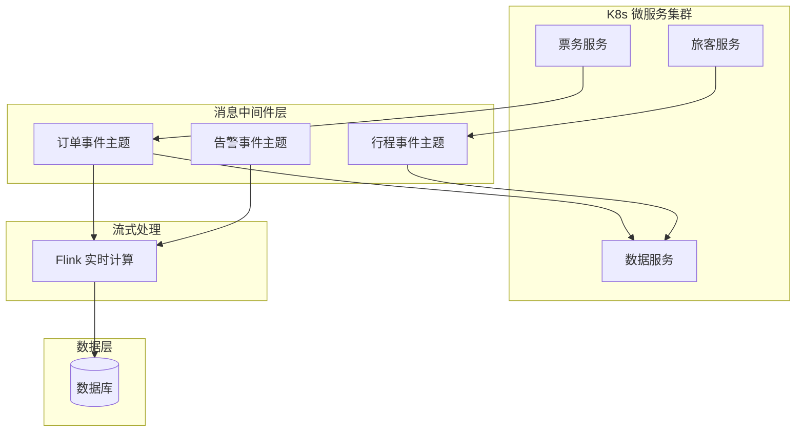

## 1.摘要（字数要求严格限制300字）
2024年3月，我参与某航空公司运营智能管理平台建设，项目面向航空运营机构、机场、旅客等用户，提供航空信息管理、旅客全流程服务、票务交易、航空检修预警、数据智能分析等核心业务功能。项目中，我担任系统架构师，全面负责平台架构设计与核心技术落地。本文围绕云原生消息中间件技术在航空运营场景中的应用展开论述，通过消息中间件选型与高吞吐架构实现削峰填谷与多模块解耦，基于可靠投递与顺序性保障关键业务消息不丢不重、顺序可控，结合消息与业务解耦及流式处理支撑事件驱动与实时分析。系统于2025年8月正式上线，截至2026年5月已稳定运行10个月，各项功能及性能指标均达到预设标准，获得客户高度认可。

## 2.项目背景（字数要求严格限制500字左右）
随着国家智慧民航建设战略深入推进，航空运输行业数字化、智能化转型迫在眉睫，《智慧民航建设路线图》等政策明确要求推动航空运营全流程数字化、智能化升级。在此背景下，某航空公司于2024年5月启动航空运营智能管理平台建设，旨在构建覆盖全部航线网络、近百个运营基地及数千万常旅客会员的数字化管理平台，实现航线、航班、票务等核心业务全流程智能管控，年服务旅客超3000万人次，为其提供全场景便捷服务，提升运营效率与服务体验。

我司中标后，我以系统架构师身份负责平台整体架构设计与核心技术落地。平台业务链路跨越票务、旅客、航班、通知、检修、数据服务等多模块，订单创建、支付成功、行程变更、设备告警等需在模块间可靠传递；节假日票务高峰与突发航班变动时请求峰值突出，若全部同步调用则链路长、易拥塞。同时平台日均产生约800GB实时数据，需通过消息通道接入流式计算做实时分析。因此我们引入云原生消息中间件，实现削峰填谷、模块解耦与可靠事件传递。

为此，我们团队决定基于云原生消息中间件技术，采用高吞吐分布式消息队列（如 Kafka/RocketMQ）、主题与分区设计、持久化与 ACK 机制、顺序消息与死信队列，并结合流式处理引擎支撑事件驱动与实时分析。平台于2025年8月正式上线，成功应对多轮节假日高并发压力，高效完成年度航班调度、设备检修预警及海量数据处理任务，为旅客提供全流程服务与7*24小时信息支持，上线一年稳定运行，各项指标达标，获得客户与用户一致认可。

## 3. 问题2回应+过度（字数要求严格限制400字）
由于本项目多模块联动紧密、请求峰值高，若仅依赖同步调用则链路耦合、峰值时易雪崩；且订单、库存、行程、通知等事件需在模块间可靠、有序传递，若消息丢失或乱序将导致业务错误。因此我们选用云原生消息中间件作为异步解耦与事件通道的核心，其核心包括：第一，消息中间件选型与高吞吐架构，通过分布式消息队列、主题分区与持久化实现削峰填谷与多模块解耦；第二，可靠投递与顺序性保障，通过 ACK、重试、死信队列与分区内顺序消费，保证关键业务消息不丢不重、顺序可控；第三，消息与业务解耦及流式处理，将订单、行程、告警等事件通过消息通道下发，并与流式计算引擎集成，支撑事件驱动与实时分析。

在本项目的实施中，我们通过消息中间件选型与高吞吐架构、可靠投递与顺序性、消息解耦与流式处理三大实践，完成了云原生消息中间件技术在航空运营智能管理平台中的建设与落地，具体如下。

## 4. 正文部分三段论

### 正文三论点总览表

| 论点 | 要解决的问题 | 方案 / 技术栈 | 核心成效 |
|------|--------------|----------------|----------|
| **论点一：消息中间件选型与高吞吐架构** | 峰值流量冲击、多模块紧耦合 | Kafka/RocketMQ 集群、主题与分区、持久化、生产者批量与压缩 | 削峰填谷、支撑≥5000 TPS，多模块通过消息解耦 |
| **论点二：可靠投递与顺序性** | 消息丢失、重复、乱序导致业务错误 | 持久化、ACK、重试、死信队列、分区内顺序消费 | 关键消息成功处理率≥99.99%，顺序场景无乱序 |
| **论点三：消息与业务解耦及流式处理** | 事件驱动、实时分析需求 | 事件主题划分、多消费者组、与 Flink 等流式引擎集成 | 订单/行程/告警事件驱动多模块，实时分析延迟≤3秒 |

## 消息中间件选型与高吞吐架构（字数要求严格限制在500-510字左右）
航空运营平台在票务高峰与突发航班变动时请求集中爆发，若订单、库存、行程、通知等全部采用同步调用，则任一下游抖动都会拉高整链延迟甚至导致超时与失败；同时多模块若强耦合则扩展与迭代困难。为此，我们引入云原生消息中间件并构建高吞吐架构。选型上，采用支持持久化、分区与水平扩展的分布式消息队列（如 Kafka 或 RocketMQ），满足高吞吐与可回溯需求。架构上，按业务域划分主题：订单事件、支付事件、行程变更、设备告警、数据同步等，各主题按吞吐与隔离需求设置分区数，通过分区实现并行生产与消费，线性提升整体处理能力。生产者侧采用批量发送与压缩，减少网络往返；Broker 侧持久化落盘并多副本，保障消息不因单机故障丢失。消费者以微服务为消费组订阅相应主题，票务服务产生订单事件后，旅客、数据、通知等模块独立消费，互不阻塞。通过消息中间件与高吞吐架构，系统在峰值时段实现削峰填谷，支撑≥5000 TPS 消息处理，多模块由同步耦合转为通过消息解耦，为高并发与快速迭代提供了稳定的事件通道基础。

## 可靠投递与顺序性保障（字数要求严格限制在500-510字左右）
消息一旦丢失或重复、乱序，将导致库存不一致、重复通知、行程错乱等业务问题。为此，我们落实了可靠投递与顺序性保障。可靠投递方面，生产者采用确认机制（如 Kafka 的 acks=all），确保消息被多副本持久化后再返回成功；消费者处理成功后提交位移，未提交则下次从原位移重新消费，避免漏消费。对处理失败的消息配置重试与死信队列，异常消息集中归集便于人工或自动补偿。顺序性方面，对订单创建、支付、库存扣减等需要严格顺序的场景，将同一业务键（如订单号）的消息发送到同一分区，由单分区内单线程或有序消费保证顺序；不同业务键可并行。通过持久化、ACK、重试与分区内顺序消费，关键业务消息成功处理率≥99.99%，顺序场景未出现乱序导致的业务错误，为票务、行程、通知等核心链路提供了可靠的事件传递保障。

## 消息与业务解耦及流式处理（字数要求严格限制在500-510字左右）
平台需将订单、行程、设备告警等事件分发给多模块消费，并支撑实时分析（如超售风险、集中退票、设备异常识别）。若各模块直连业务库或通过点对点接口拉取，则耦合重、实时性差。为此，我们以消息中间件为事件通道，实现消息与业务解耦及流式处理。解耦方面，票务、旅客、航班、检修等模块仅向统一主题发布标准化事件，数据服务、通知、分析等模块按需订阅，新增消费者无需改动生产者。流式处理方面，将消息队列与流式计算引擎（如 Flink）集成，实时消费订单、交易、设备等主题，进行窗口聚合、规则计算与异常检测，产出实时指标与告警并写回存储或推送下游。通过事件驱动，订单创建后库存更新、行程生成、通知推送、数据统计等异步完成，实时分析延迟控制在 3 秒以内，多模块联动在保证一致性的前提下显著提升了系统弹性与可扩展性，为智慧民航的实时决策与运营分析提供了可靠的消息与流式处理能力。

## 5. 论文总结（字数要求严格限制450字以内）
本平台响应智慧民航建设政策，以云原生消息中间件技术（消息中间件选型与高吞吐架构、可靠投递与顺序性、消息解耦与流式处理）为核心，构建航空运营全流程一体化管理体系，2025年8月上线后稳定运行一年，超额达成预期目标。上线以来，系统日均处理票务交易超12万笔，核心业务响应时间≤800毫秒，运营效率提升35%，旅客投诉率下降40%，设备故障预警准确率92%，系统可用性达99.993%，峰值处理能力突破5500 TPS，成功应对节假日高并发压力，获行业与旅客广泛认可。消息中间件有效实现了削峰填谷、多模块解耦与事件可靠传递，支撑了事件驱动与实时分析。项目复盘发现架构存在不足：一是高并发叠加场景下，部分下游消费偶有堆积；二是跨系统事件规范仍可统一。后续将优化消费能力与分区策略、统一跨系统事件模型，持续深化技术融合，助力智慧民航高质量发展。

## 6. 系统架构图

**图 12-1** 航空运营智能管理平台·消息中间件技术应用 架构图
