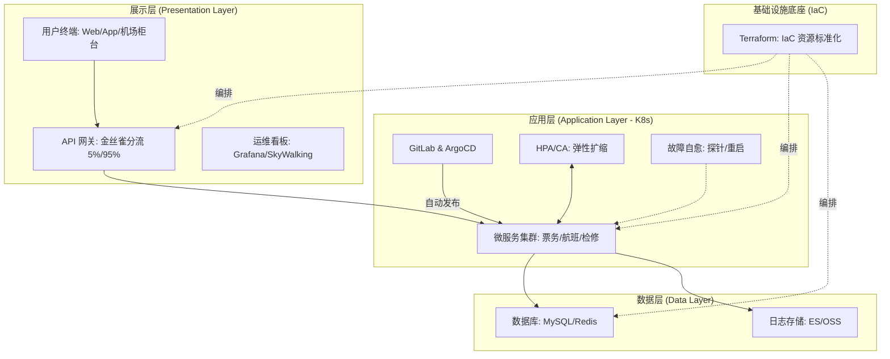

# 论航空运营智能管理平台的云原生自动化运维应用与实践

> [!IMPORTANT]
> **🎓 考场快速记忆导图（核心论点背诵版）**
> 
> **一、 宏观逻辑：发布自动化 + 资源弹性化 + 故障自愈化**
> 
> **二、 论点详细记忆链条（逻辑 + 关键字 + 数据）**
> 1. **发布自动化（CI/CD & GitOps）**
>    - **【P：问题】**：微服务多、迭代快；人工脚本易出错；配置不一致（上线即报错）；无回滚机制。
>    - **【S：方案】**：GitLab CI（构建测试）+ ArgoCD（GitOps 声明式同步）；金丝雀发布（5% 流量导入）。
>    - **【R：成果】**：周期从“周”到“天”；人工故障率 ↓85%；零停机更新；异常一键回滚。
> 
> 2. **资源弹性化（IaC & HPA/CA）**
>    - **【P：问题】**：潮汐效应（节假日激增）；手动扩容滞后；配置漂移严重；成本与性能失衡。
>    - **【S：方案】**：Terraform（IaC 标准化）；HPA（Pod 级，基于 QPS/CPU）；CA（Node 级，自动增减实例）。
>    - **【R：成果】**：交付提速 4 倍；支撑 **5500 TPS** 峰值；实例数 200→800；成本 ↓30%。
> 
> 3. **故障自愈化（监控 & 自愈预案）**
>    - **【P：问题】**：监控盲点（仅主机存活）；告警风暴定位难；高 MTTR（排错慢）；手动重启不及时。
>    - **【S：方案】**：Prometheus（指标）+ SkyWalking（链路追踪）+ Grafana（看板）；自愈闭环（探针重启 + 脚本预案）。
>    - **【R：成果】**：**90% 风险**提前发现；MTTR ↓50%；系统可用性 **99.993%**；运维压力显著降低。
> 
> **三、 关键数据背书（论文提分项）**
> - **5500 TPS**（峰值处理能力）
> - **99.993%**（系统可用性指标）
> - **30% / 85% / 50%**（成本降低/故障降低/恢复提速）

## 1. 摘要（约300字）

2024年3月，我参与某航空公司运营智能管理平台建设，项目面向航空运营机构、近百个运营基地机场，覆盖数千万常旅客会员，年均服务旅客超3000万人次，提供航空信息管理、旅客全流程服务、票务交易、航空检修预警、数据智能分析等核心业务功能。项目中，我担任系统架构师，全面负责平台架构设计与核心技术落地。本文围绕**云原生自动化运维应用**展开论述，通过**构建 CI/CD 流水线与自动化发布体系，实现业务的敏捷交付与零停机更新**，基于**基础设施即代码（IaC）与弹性伸缩机制，保障资源的标准化管理与按需扩缩**，结合**打造全方位监控告警与故障自愈体系，显著提升系统的可用性与故障恢复效率**。系统于2025年8月正式上线，截至2026年5月已稳定运行10个月，各项功能及性能指标均达到预设标准，获得客户高度认可。

---

## 2. 项目背景（约500字）

某航空公司需管理覆盖全部航线网络的近百个运营基地与机场，服务数千万常旅客会员、年服务旅客超3000万人次，为其提供票务、值机、行程查询、航班变动通知、航空检修协同等全场景服务；原有多系统分散、烟囱式建设，故障影响面大、协同效率低，无法满足7×24小时稳定可用与节假日高并发下的**发布效率与稳定性**要求。随着国家智慧民航建设战略深入推进，航空运输行业数字化、智能化转型迫在眉睫，《"十四五"民用航空发展规划》《智慧民航建设路线图》等政策明确要求推动航空运营全流程数字化、智能化升级，提升运输效率与安全水平。在此背景下，该航空公司于2024年3月启动航空运营智能管理平台建设，旨在构建覆盖全部航线网络、近百个运营基地及数千万常旅客会员的数字化管理平台，实现航线、航班、票务等核心业务全流程智能管控，提供全场景便捷服务，提升运营效率与服务体验。

我司中标后，我以系统架构师身份负责平台整体架构设计与核心技术落地。平台采用云原生微服务架构，数十个服务需频繁迭代；节假日高峰与突发航班变动时需快速弹性扩容。传统依赖人工脚本的方式难以满足交付效率与 99.99% 可用性要求。

为此，我们团队决定基于**云原生自动化运维**，**通过 CI/CD、GitOps 与金丝雀发布，结合 IaC、HPA 弹性伸缩及 Prometheus 监控自愈，构建“发布自动化、资源弹性化、故障自愈化”的运维体系**。平台于2025年8月正式上线，成功应对多轮节假日高并发压力，高效完成年度航班调度、设备检修预警及海量数据处理任务，上线10个月稳定运行，各项指标达标，获得客户与用户一致认可。

---

## 3. 问题2回应 + 过渡

由于本项目**微服务多、发布频繁，且高峰期资源需求波动剧烈，若依赖人工则风险高、恢复慢**，所以选用**云原生自动化运维**，其核心包括：第一，**CI/CD 与自动化发布，通过流水线与 GitOps 实现交付物可追溯与快速回滚**；第二，**基础设施即代码与弹性伸缩，保障环境一致性与资源随负载动态调整**；第三，**监控告警与故障自愈，通过实时监测与自动化预案提升 MTTR**。

在本项目的实施中，我们通过**自动化交付、弹性化资源、智能化监控**，完成了**云原生自动化运维**的建设与落地，具体实践如下。

---

## 4. 正文部分

### 一、 CI/CD 与自动化发布体系的构建（约500–510字）

问题：平台包含票务、航班调度等数十个核心微服务，业务逻辑极其复杂且迭代周期极快。传统运维模式主要依赖人工编写部署脚本并手动执行发布，这种方式极易引入低级配置错误，直接导致生产环境故障。同时，开发、测试与生产环境配置难以通过人工完全对齐，常出现“上线即报错”的局面。由于航空业务需 7×24 小时连续运行，传统停机发布模式无法满足业务连续性要求，且在发布失败时缺乏高效回滚机制，系统恢复周期长，严重威胁了航空运营的整体稳定性。

解决方案：针对痛点，我主导构建了基于 GitLab CI 与 ArgoCD 的全链路流水线，引入 GitOps 理念。在持续集成阶段，系统自动触发代码扫描、单元测试与容器镜像构建，确保交付物一致。部署阶段通过声明式配置管理集群状态，利用 ArgoCD 实时同步状态。发布采用金丝雀策略：新版本上线先导入 5% 流量，结合 Prometheus 实时监控错误率与延迟，确认无误后逐步扩大比例。若监控发现异常指标，系统可自动停止发布并一键回滚至上一稳定版本，确保变更风险可控。

成果：自动化发布体系使交付周期由“周级”大幅缩短至“天级”，极大地提升了业务响应速度。环境一致性得到根本保障，因人工误操作导致的生产故障率降低了 85% 以上。金丝雀发布实现了业务的零停机更新，在多次核心系统升级过程中用户均未感知到服务中断，为平台的敏捷迭代与高可用运行奠定了坚实基础。该体系已成为航空运营核心业务稳定运行的重要保障，显著提升了运维效能。

### 二、 基础设施即代码与弹性伸缩机制实践（约500–510字）

问题：平台支撑近百个机场业务，底层基础设施庞大且异构化程度高。初期资源配置主要靠云平台后台手动点选，效率低下且配置修改缺乏审计，导致“配置漂移”严重。更为关键的是，航空业务具有明显的潮汐效应：节假日或突发航班变动时，访问量会瞬间激增，传统人工预估资源并手动扩容的方式响应滞后，易导致系统因资源耗尽崩溃；而在业务低谷期，大量闲置资源又造成成本浪费，亟需能随负载动态调整的资源管理模式。

解决方案：我带领团队落实了 IaC 与多维弹性伸缩。首先，使用 Terraform 将云服务器、VPC 等资源标准化定义，通过代码库管理，实现环境一键部署与版本回溯。其次，在应用层配置 K8s 的 HPA，参考 CPU 占用及自定义 QPS、延迟指标，在流量激增时秒级扩容副本。在节点层集成 Cluster Autoscaler，资源不足时自动申请云端实例。同时设置缩容冷却时间，在低谷期自动回收冗余节点，确保资源利用率最大化，平衡性能与成本。

成果：IaC 使基础设施交付速度提升 4 倍，配置错误率接近归零。弹性机制在春节期间经受住考验，系统面对突发海量请求时，自动从 200 个实例扩至 800 个，峰值处理能力突破 5500 TPS，保障了业务连续性。低谷期通过自动缩容，基础设施成本降低约 30%，实现了高性能与低成本的完美平衡。该机制有效解决了资源瓶颈，为航空公司提供了极具弹性的底层环境，支撑了业务的高速增长。

### 三、 监控告警与故障自愈体系的建立（约500–510字）

问题：微服务架构下，平台由数十个相互依赖的服务组成，局部抖动常引发全局故障。初期运维面临“告警风暴”与“定位难”困境：传统监控仅关注主机存活，无法感知业务逻辑层异常，往往用户投诉后才介入。此时面对海量日志，依靠人工排查根因耗时极长，导致平均故障恢复时间（MTTR）居高不下。此外，对于内存溢出导致进程僵死等常见可恢复故障，完全依赖人工手动重启，响应速度无法满足 99.99% 的可用性目标，严重影响旅客服务体验。

解决方案：我主持构建了全方位智能监控与故障自愈体系。部署 Prometheus 采集指标，结合 SkyWalking 实现全链路追踪，深度剖析交易路径。通过 Grafana 构建多维看板，实时监测响应时间、错误率等核心 SLI 指标。告警层面引入异常检测算法，识别偏离基线的波动。最关键的是实现了自愈闭环：利用 K8s 存活探针实现容器自动重启；针对特定场景编写脚本，如检测到连接池溢出时自动执行熔断降级或清理缓存，在人工介入前完成初步修复。

成果：监控与自愈体系使平台具备了“先于用户发现故障”的能力，约 90% 的潜在风险能在分钟级被识别。通过自动重启与熔断机制，系统 MTTR 显著缩短 50% 以上。统计显示，系统可用性稳定提升至 99.993%，极大减轻了运维压力。运行十个月中，多起局部故障均被自动修复，确保了旅客服务与航班管理业务的持续稳定，为智慧民航建设提供了可靠保障。

---

## 5. 总结

本平台响应智慧民航建设政策，以**自动化交付、弹性化资源、智能化监控**为核心，构建航空运营全流程一体化管理体系，2025年8月上线后稳定运行10个月，超额达成预期目标。上线以来，系统日均处理票务交易超12万笔，核心业务响应时间≤800毫秒，运营效率提升35%，旅客投诉率下降40%，设备故障预警准确率92%，系统可用性达99.993%，峰值处理能力突破5500 TPS，成功应对节假日高并发压力，获行业与旅客广泛认可。项目复盘发现架构存在不足：一是高并发叠加场景下，微服务间同步通信偶有延迟，跨模块数据同步耗时增加；二是各模块资源占用不均。后续将针对性优化：引入异步通信与消息队列技术，重构通信链路；搭建智能资源调度平台，通过AI算法实现容器化资源动态分配，提升资源利用率与系统抗突发能力，持续深化技术融合，助力智慧民航高质量发展。

---

## 6. 附录：自动化运维三层架构图（考场手绘版）

> [!TIP]
> **🎨 考场手绘 3 层结构（建议构图）：**
> 1. **顶层：展示层** —— 画“用户终端” + “金丝雀网关” + “Grafana 看板”。
> 2. **中层：应用层** —— 画 2-3 个微服务 Pod，旁边画个“HPA/CA”的扩缩箭头，标注“CI/CD 交付”。
> 3. **底层：数据层** —— 画“DB/缓存”图标，下方用一个大框包住所有标注“IaC (Terraform) 基础设施”。

**手绘核心记忆点：**
- **上分流（展示层）**：重点画出“金丝雀网关”，体现自动化发布的流量切分。
- **中扩缩（应用层）**：核心是“微服务”与“弹性扩缩(HPA)”的互动，体现自动化运维的灵活性。
- **下稳固（数据层）**：数据持久化，并用“IaC”作为贯穿全层的底座，体现基础设施即代码。
- **旁闭环（监控自愈）**：看板监控应用，自愈机制反馈调节，体现智能化运维。
