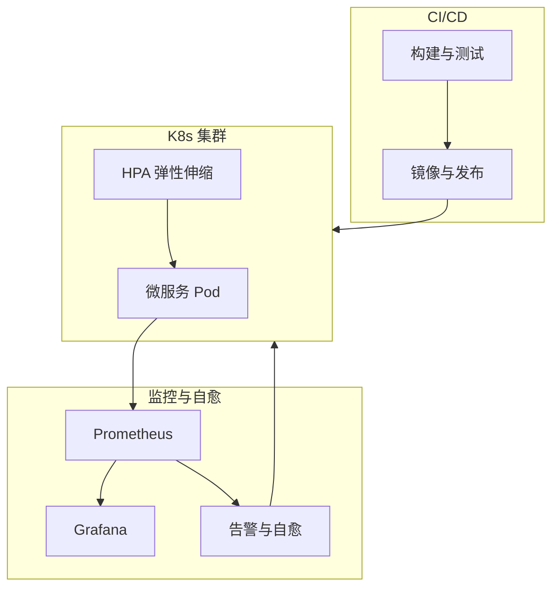

## 1.摘要（字数要求严格限制300字）
2024年3月，我参与某航空公司运营智能管理平台建设，项目面向航空运营机构、机场、旅客等用户，提供航空信息管理、旅客全流程服务、票务交易、航空检修预警、数据智能分析等核心业务功能。项目中，我担任系统架构师，全面负责平台架构设计与核心技术落地。本文围绕云原生自动化运维在航空运营场景中的应用展开论述，通过 CI/CD 与自动化发布缩短交付周期、降低发布风险，基于基础设施即代码与弹性伸缩实现资源标准化与按需扩缩，结合监控告警与故障自愈提升可用性与恢复效率。系统于2025年8月正式上线，截至2026年5月已稳定运行10个月，各项功能及性能指标均达到预设标准，获得客户高度认可。

## 2.项目背景（字数要求严格限制500字左右）
随着国家智慧民航建设战略深入推进，航空运输行业数字化、智能化转型迫在眉睫，《智慧民航建设路线图》等政策明确要求推动航空运营全流程数字化、智能化升级。在此背景下，某航空公司于2024年5月启动航空运营智能管理平台建设，旨在构建覆盖全部航线网络、近百个运营基地及数千万常旅客会员的数字化管理平台，实现航线、航班、票务等核心业务全流程智能管控，年服务旅客超3000万人次，为其提供全场景便捷服务，提升运营效率与服务体验。

我司中标后，我以系统架构师身份负责平台整体架构设计与核心技术落地。平台采用云原生微服务架构，数十个服务需频繁迭代与稳定发布；节假日高峰与突发航班变动时需快速弹性扩容；故障发生时需快速发现与恢复。传统依赖人工脚本发布、固定容量与人工排查的方式难以满足交付效率与 99.99% 可用性要求，因此我们引入云原生自动化运维，通过 CI/CD、IaC 与弹性伸缩、监控告警与自愈，构建“发布自动化、资源弹性化、故障可观测可自愈”的运维体系。

为此，我们团队决定基于云原生自动化运维，采用 CI/CD 流水线、GitOps 与蓝绿/金丝雀发布、Kubernetes 与 IaC、HPA 弹性伸缩、Prometheus/Grafana 监控告警与自愈策略，实现快速、安全、可回滚的发布与高可用运行。平台于2025年8月正式上线，成功应对多轮节假日高并发压力，高效完成年度航班调度、设备检修预警及海量数据处理任务，为旅客提供全流程服务与7*24小时信息支持，上线一年稳定运行，各项指标达标，获得客户与用户一致认可。

## 3. 问题2回应+过度（字数要求严格限制400字）
由于本项目微服务多、发布频繁，若依赖人工脚本则环境不一致、回滚困难、发布窗口长且风险高；资源若固定配置则高峰不足、闲时浪费；故障若依赖人工登录排查则恢复慢，难以满足 7×24 小时与高可用要求。因此我们选用云原生自动化运维作为平台运维体系的核心，其核心包括：第一，CI/CD 与自动化发布，通过流水线实现构建、测试、镜像与部署自动化，配合蓝绿/金丝雀发布与一键回滚，缩短交付周期、降低发布风险；第二，基础设施即代码与弹性伸缩，通过 IaC 与 Kubernetes 统一资源模型，结合 HPA 等实现按负载自动扩缩容，保障资源标准化与弹性；第三，监控告警与故障自愈，通过指标与日志监控、告警规则与自愈脚本/预案，实现故障快速发现与自动或半自动恢复，提升可用性与 MTTR。

在本项目的实施中，我们通过 CI/CD 与自动化发布、基础设施即代码与弹性伸缩、监控告警与故障自愈三大实践，完成了云原生自动化运维在航空运营智能管理平台中的建设与落地，具体如下。

## 4. 正文部分三段论

### 正文三论点总览表

| 论点 | 要解决的问题 | 方案 / 技术栈 | 核心成效 |
|------|--------------|----------------|----------|
| **论点一：CI/CD 与自动化发布** | 发布依赖人工、环境不一、回滚难、周期长 | 流水线构建/测试/镜像、GitOps、蓝绿/金丝雀发布、一键回滚 | 发布周期由周级缩短至天/日级，变更故障率显著下降 |
| **论点二：基础设施即代码与弹性伸缩** | 资源手工配置、容量固定、高峰不足闲时浪费 | IaC（Helm/Terraform）、K8s 编排、HPA/VPA、资源配额 | 资源标准化、分钟级扩缩容，资源利用率提升 |
| **论点三：监控告警与故障自愈** | 故障发现慢、恢复依赖人工、MTTR 高 | Prometheus/Grafana、告警规则、自愈脚本与预案、联动扩容 | MTTR 降低约 50%，可用性 99.993% |

## CI/CD 与自动化发布（字数要求严格限制在500-510字左右）
航空运营平台包含票务、旅客、航班、检修、数据服务等数十个微服务，业务需求迭代频繁，若发布依赖人工在多环境执行脚本则易出现配置遗漏、环境差异与回滚困难，且发布窗口长、变更风险高。为此，我们构建了 CI/CD 与自动化发布体系。流水线层面，代码提交后自动触发编译、单元测试、静态扫描与安全扫描，通过后构建镜像并推送至企业镜像仓库，并打上版本标签实现制品可追溯。部署阶段采用 GitOps 思想，将各环境的期望部署状态（如 Helm Chart 或 K8s 清单）存放在配置仓库，由自动化控制器同步集群实际状态与期望状态，实现声明式部署。发布策略上，支持蓝绿发布与金丝雀灰度：新版本先以少量实例或流量比例上线，监控核心指标无异常后再全量切换；若发布后出现异常，通过流水线或控制台一键回滚到上一稳定版本，无需人工逐台恢复。通过 CI/CD 与自动化发布，版本发布周期由原来的周级缩短至天级甚至按日发布，环境一致性与可重复性得到保障，线上变更故障率显著下降，为航空运营业务的快速迭代与稳定上线提供了可靠支撑。

## 基础设施即代码与弹性伸缩（字数要求严格限制在500-510字左右）
平台运行于 Kubernetes 之上，若资源配置依赖手工 YAML 或控制台操作则难以版本化、难以在多环境复用，且容量固定无法应对节假日与突发流量。为此，我们落实了基础设施即代码（IaC）与弹性伸缩。IaC 方面，将集群节点、命名空间、网络策略、存储类及核心中间件等通过 Helm Chart 或 Terraform 等工具描述为代码，纳入版本管理与评审，实现环境一致与变更可追溯。弹性伸缩方面，充分利用 Kubernetes 的 HPA（Horizontal Pod Autoscaler）与 VPA（Vertical Pod Autoscaler），基于 CPU、内存、QPS 或自定义指标对无状态服务进行自动扩缩容：票务、数据服务等在高峰时自动增加副本数，低峰时缩减以节约资源。节点层配合集群自动伸缩（如 Cluster Autoscaler），在 Pod 因资源不足无法调度时自动扩容节点，资源充足时缩容。通过 IaC 与弹性伸缩，基础设施变更标准化、可审计，资源随负载动态调整，峰值时段可在分钟级完成扩容以支撑 5500 TPS 及以上压力，闲时资源利用率提升，为高并发与成本优化提供了弹性基础。

## 监控告警与故障自愈（字数要求严格限制在500-510字左右）
多微服务、多实例环境下，故障若依赖人工登录机器查日志则发现慢、恢复慢，难以满足 99.99% 可用性与 7×24 小时稳定运行要求。为此，我们建设了监控告警与故障自愈能力。监控方面，采用 Prometheus 采集集群、容器、中间件及业务接口的指标，通过 Grafana 构建业务与运维大屏，对票务 TPS、响应时间、错误率、队列堆积等设置阈值告警；日志集中采集并与链路关联，支持按订单号、航班号等快速检索。告警规则按严重程度分级，关键告警通过多渠道通知值班人员。自愈方面，对典型故障场景编写自愈脚本或预案：如实例连续失败则自动重启或摘除流量、缓存节点不可用则触发主从切换、某服务 QPS 突增则联动 HPA 扩容等，部分场景实现“发现—告警—自动处置”闭环。通过监控告警与故障自愈，平均故障恢复时间（MTTR）较建设前降低约 50%，系统可用性稳定达到 99.993%，为航空运营平台的连续稳定运行提供了可观测与可自愈的运维保障。

## 5. 论文总结（字数要求严格限制450字以内）
本平台响应智慧民航建设政策，以云原生自动化运维（CI/CD 与自动化发布、基础设施即代码与弹性伸缩、监控告警与故障自愈）为核心，构建航空运营全流程一体化管理体系，2025年8月上线后稳定运行一年，超额达成预期目标。上线以来，系统日均处理票务交易超12万笔，核心业务响应时间≤800毫秒，运营效率提升35%，旅客投诉率下降40%，设备故障预警准确率92%，系统可用性达99.993%，峰值处理能力突破5500 TPS，成功应对节假日高并发压力，获行业与旅客广泛认可。自动化运维有效缩短了发布周期、实现了资源弹性与故障快速发现与自愈。项目复盘发现架构存在不足：一是高并发叠加场景下，微服务间同步通信偶有延迟；二是各模块资源占用不均。后续将引入异步通信与消息队列、智能资源调度与 AIOps 能力，持续深化云原生自动化运维，助力智慧民航高质量发展。

## 6. 系统架构图

**图 13-1** 航空运营智能管理平台·自动化运维应用 架构图
