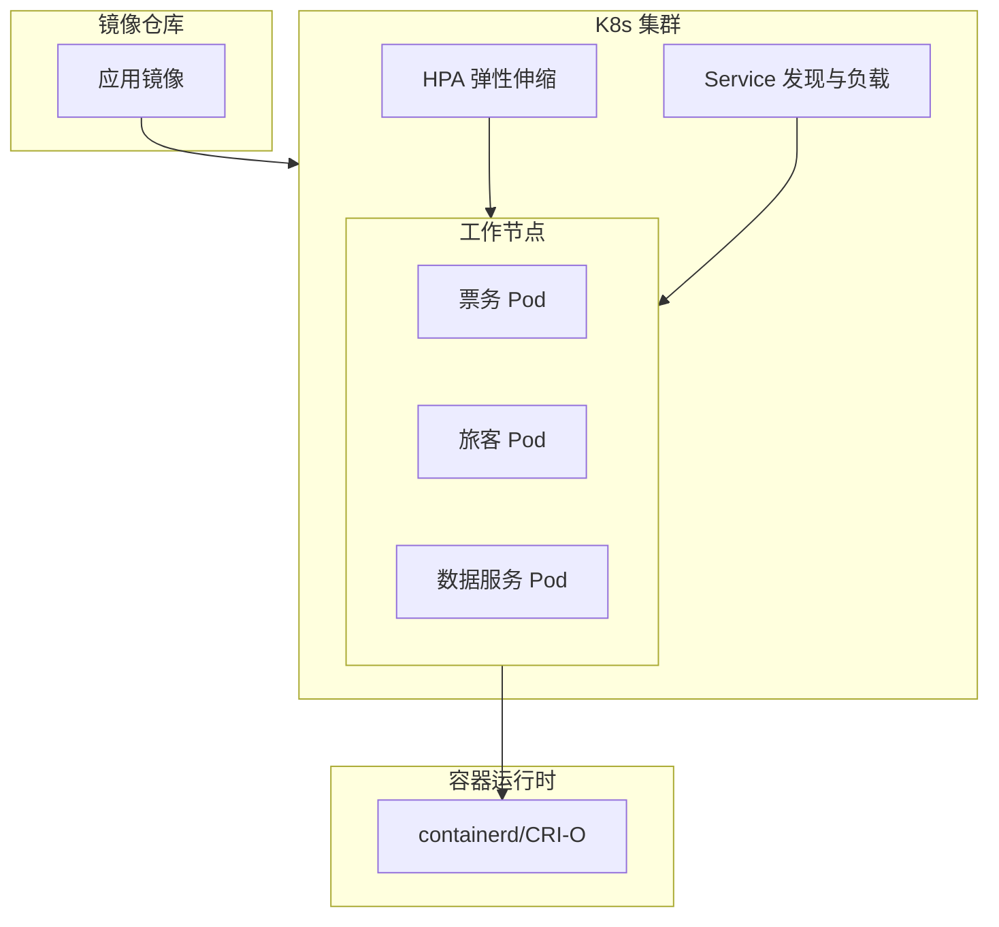

## 1.摘要（字数要求严格限制300字）
2024年3月，我参与某航空公司运营智能管理平台建设，项目面向航空运营机构、机场、旅客等用户，提供航空信息管理、旅客全流程服务、票务交易、航空检修预警、数据智能分析等核心业务功能。项目中，我担任系统架构师，全面负责平台架构设计与核心技术落地。本文围绕云原生容器化技术在航空运营场景中的应用展开论述，通过容器化与镜像标准化实现构建一致、交付可追溯，基于容器编排与调度保障多服务协同与弹性扩缩，结合容器运行时与资源隔离保障隔离性、安全与资源可控。系统于2025年8月正式上线，截至2026年5月已稳定运行10个月，各项功能及性能指标均达到预设标准，获得客户高度认可。

## 2.项目背景（字数要求严格限制500字左右）
随着国家智慧民航建设战略深入推进，航空运输行业数字化、智能化转型迫在眉睫，《智慧民航建设路线图》等政策明确要求推动航空运营全流程数字化、智能化升级。在此背景下，某航空公司于2024年5月启动航空运营智能管理平台建设，旨在构建覆盖全部航线网络、近百个运营基地及数千万常旅客会员的数字化管理平台，实现航线、航班、票务等核心业务全流程智能管控，年服务旅客超3000万人次，为其提供全场景便捷服务，提升运营效率与服务体验。

我司中标后，我以系统架构师身份负责平台整体架构设计与核心技术落地。平台包含票务、旅客、航班、检修、数据服务等数十个微服务，传统物理机或虚拟机部署存在环境差异大、发布慢、扩容周期长等问题；节假日高峰与突发航班变动时需快速弹性扩展，且需保障多服务隔离与资源可控。因此我们采用云原生容器化技术，通过镜像标准化、Kubernetes 编排与容器运行时，实现“构建一次、到处运行”、分钟级扩缩容与统一资源调度。

为此，我们团队决定基于云原生容器化技术，采用 Docker/OCI 镜像与多阶段构建、企业镜像仓库与安全扫描、Kubernetes 编排与 Deployment/StatefulSet、HPA 弹性伸缩及 containerd 运行时与 cgroup/namespace 资源隔离，构建一致、可编排、可隔离的容器化平台。平台于2025年8月正式上线，成功应对多轮节假日高并发压力，高效完成年度航班调度、设备检修预警及海量数据处理任务，为旅客提供全流程服务与7*24小时信息支持，上线一年稳定运行，各项指标达标，获得客户与用户一致认可。

## 3. 问题2回应+过度（字数要求严格限制400字）
由于本项目微服务数量多、环境多（开发、测试、生产），若依赖传统安装包或脚本部署则环境不一致、交付物不可追溯、发布与回滚困难；若缺乏统一编排与调度则多服务部署、扩缩容与故障恢复依赖人工；若缺乏资源隔离则单服务异常可能拖垮宿主机、资源争用难以管控。因此我们选用云原生容器化技术作为应用交付与运行的基础，其核心包括：第一，容器化与镜像标准化，通过 Docker/OCI 镜像、多阶段构建与镜像仓库实现构建一致、版本可追溯与安全可控；第二，容器编排与调度，通过 Kubernetes 的 Deployment、StatefulSet、服务发现与 HPA 实现多服务协同部署与弹性扩缩；第三，容器运行时与资源隔离，通过 containerd/CRI-O 与 cgroup、namespace 实现进程隔离与资源配额，保障安全与资源可控。

在本项目的实施中，我们通过容器化与镜像标准化、容器编排与调度、容器运行时与资源隔离三大实践，完成了云原生容器化技术在航空运营智能管理平台中的建设与落地，具体如下。

## 4. 正文部分三段论

### 正文三论点总览表

| 论点 | 要解决的问题 | 方案 / 技术栈 | 核心成效 |
|------|--------------|----------------|----------|
| **论点一：容器化与镜像标准化** | 环境不一致、交付物不可追溯、依赖与安全难管控 | Docker/OCI 镜像、多阶段构建、企业镜像仓库、版本标签与安全扫描 | 构建一次到处运行，版本可追溯，漏洞可发现可处置 |
| **论点二：容器编排与调度** | 多服务部署复杂、扩缩容与故障恢复依赖人工 | Kubernetes、Deployment/StatefulSet、服务发现与负载均衡、HPA、多可用区 | 分钟级扩缩容，服务自愈，资源利用率提升 |
| **论点三：容器运行时与资源隔离** | 进程与资源争用、单点故障影响面大 | containerd/CRI-O、cgroup/namespace、资源 request/limit、安全策略 | 隔离性保障、资源可控、安全合规 |

## 容器化与镜像标准化（字数要求严格限制在500-510字左右）
航空运营平台涵盖票务、旅客、航班、检修、数据服务等数十个微服务，若各环境依赖手工安装 JDK、依赖库与配置文件，则开发、测试、生产环境极易出现“在我机器上能跑”的差异，且交付物难以版本化、回滚与审计。为此，我们推进全面容器化与镜像标准化。技术上采用 Docker/OCI 标准镜像，将应用、运行时与必要依赖打包为单一镜像，实现“构建一次、到处运行”。构建阶段采用多阶段构建：在构建阶段编译并打包应用，在运行阶段仅保留运行时与产物，减小镜像体积并降低漏洞面。镜像内容上统一基础镜像（如精简 OS + 指定 JDK 版本），禁止在镜像中硬编码敏感信息，配置通过环境变量或挂载注入。镜像仓库采用企业级私有仓库，对全部镜像打版本标签（如语义化版本或 Git SHA），支持按标签拉取与回滚；并集成镜像安全扫描，对基础镜像与应用镜像进行漏洞扫描，对高危漏洞阻断发布并推动修复。通过容器化与镜像标准化，各环境运行同一镜像，构建一致性与可追溯性得到保障，依赖与安全风险可控，为后续编排、调度与弹性扩展奠定了交付基础。

## 容器编排与调度（字数要求严格限制在500-510字左右）
数十个微服务若依赖人工逐台部署与扩缩容，则发布慢、易出错，且故障时需人工重启或迁移。为此，我们采用 Kubernetes 作为容器编排与调度核心。工作负载方面，无状态服务（票务、旅客、航班、数据服务等）使用 Deployment 管理，通过副本数与滚动更新策略实现无停机发布与回滚；有状态服务（如部分中间件）按需采用 StatefulSet 保障稳定网络标识与存储。服务发现与负载均衡由 Kubernetes Service 提供，集群内通过服务名访问，对外通过 Ingress 或负载均衡暴露。弹性伸缩方面，结合 HPA（Horizontal Pod Autoscaler）基于 CPU、内存或自定义 QPS 指标自动扩缩容，票务高峰时副本数可在数分钟内从数十扩展到数百，低峰时自动缩减以节约资源。集群按多可用区部署，并通过 Pod 反亲和与拓扑分布约束将副本分散到不同节点与可用区，降低单点故障影响。通过容器编排与调度，多服务协同部署、发布与扩缩容自动化，故障时 K8s 自动重启异常 Pod 或迁移到健康节点，资源利用率提升，峰值时段可稳定支撑 5500 TPS 及以上压力，为高可用与弹性运行提供了编排保障。

## 容器运行时与资源隔离（字数要求严格限制在500-510字左右）
多容器共享宿主机时，若缺乏隔离则单容器异常（如内存泄漏、CPU 打满）可能影响同节点其他业务；资源若不限制则易出现争用与“ noisy neighbor ”。为此，我们落实了容器运行时与资源隔离。运行时层面，采用 containerd 或 CRI-O 作为容器运行时，与 Kubernetes 通过 CRI 对接，保障镜像拉取、容器启停与生命周期管理的稳定与安全。隔离与资源方面，依托 Linux cgroup 与 namespace，为每个容器分配独立的 CPU、内存、网络与进程命名空间，实现进程级隔离；在 Kubernetes 中为每个 Pod 配置资源 request 与 limit，调度器按 request 保障资源预留，按 limit 限制上限，避免单 Pod 占满节点资源。安全方面，遵循最小权限原则，容器以非 root 用户运行；对敏感服务可启用只读根文件系统、禁止特权等策略，并配合网络策略限制 Pod 间访问。通过容器运行时与资源隔离，多服务在同一集群内安全共存，资源可控、故障隔离，为航空运营平台的多租户与安全合规提供了运行时保障。

## 5. 论文总结（字数要求严格限制450字以内）
本平台响应智慧民航建设政策，以云原生容器化技术（容器化与镜像标准化、容器编排与调度、容器运行时与资源隔离）为核心，构建航空运营全流程一体化管理体系，2025年8月上线后稳定运行一年，超额达成预期目标。上线以来，系统日均处理票务交易超12万笔，核心业务响应时间≤800毫秒，运营效率提升35%，旅客投诉率下降40%，设备故障预警准确率92%，系统可用性达99.993%，峰值处理能力突破5500 TPS，成功应对节假日高并发压力，获行业与旅客广泛认可。容器化有效实现了构建一致、交付可追溯与分钟级弹性扩缩，并为多服务隔离与资源可控提供了基础。项目复盘发现架构存在不足：一是高并发叠加场景下，微服务间同步通信偶有延迟；二是各模块资源占用不均。后续将引入异步通信与消息队列、智能资源调度与更细粒度的资源画像，持续深化云原生容器化能力，助力智慧民航高质量发展。

## 6. 系统架构图

**图 14-1** 航空运营智能管理平台·容器化技术应用 架构图
