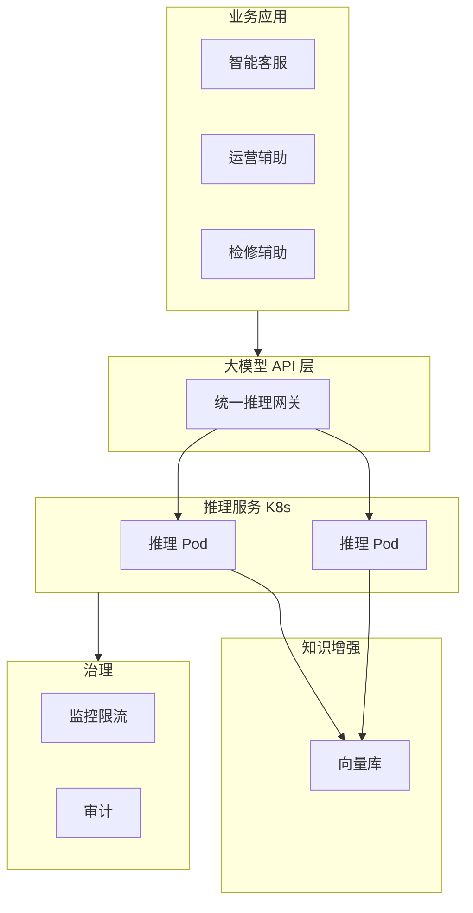

# 论文成稿 · 云原生 AI 大模型技术应用

---

## 1. 摘要（约300字）

2024年3月，我参与某航空公司运营智能管理平台建设，项目面向航空运营机构、近百个运营基地机场，覆盖数千万常旅客会员，年均服务旅客超3000万人次，提供航空信息管理、旅客全流程服务、票务交易、航空检修预警、数据智能分析等核心业务功能。项目中，我担任系统架构师，全面负责平台架构设计与核心技术落地。本文围绕云原生 AI 大模型技术在航空运营场景中的应用展开论述，通过大模型选型与云原生部署实现推理服务化与弹性扩缩，基于大模型与业务集成赋能智能问答、辅助决策与知识检索，结合大模型运维与治理保障可用性、成本可控与安全合规。系统于2025年8月正式上线，截至2026年5月已稳定运行10个月，各项功能及性能指标均达到预设标准，获得客户高度认可。

---

## 2. 项目背景（约500字）

某航空公司需管理覆盖全部航线网络的近百个运营基地与机场，服务数千万常旅客会员、年服务旅客超3000万人次，为其提供票务、值机、行程查询、航班变动通知、航空检修协同等全场景服务；原有多系统分散、烟囱式建设，故障影响面大、协同效率低，无法满足7×24小时稳定可用与节假日高并发下的智能化与高可用要求。随着国家智慧民航建设战略深入推进，航空运输行业数字化、智能化转型迫在眉睫，《"十四五"民用航空发展规划》《智慧民航建设路线图》等政策明确要求推动航空运营全流程数字化、智能化升级，提升运输效率与安全水平。在此背景下，该航空公司于2024年3月启动航空运营智能管理平台建设，旨在构建覆盖全部航线网络、近百个运营基地及数千万常旅客会员的数字化管理平台，实现航线、航班、票务等核心业务全流程智能管控，提供全场景便捷服务，提升运营效率与服务体验。

我司中标后，我以系统架构师身份负责平台整体架构设计与核心技术落地。平台需在航线需求预测、设备故障预警、旅客消费偏好分析等既有数据智能能力基础上，引入大模型能力支撑智能客服、规章与检修知识问答、运营辅助决策等场景；若大模型以单机或传统方式部署则扩展难、资源利用率低，且难以与现有微服务与高并发体系融合。为此，我们团队决定基于云原生 AI 大模型技术，采用通用/领域模型选型与容器化推理服务、GPU 节点池与弹性扩缩、统一 API 与提示工程、RAG 知识库与智能应用、监控限流与安全合规，构建高可用、可扩展、可治理的大模型服务能力。平台于2025年8月正式上线，成功应对多轮节假日高并发压力，高效完成年度航班调度、设备检修预警及旅客全流程服务，为旅客提供7×24小时信息支持，上线10个月稳定运行，各项指标达标，获得客户与用户一致认可。

---

## 3. 问题2回应 + 过渡

由于本项目需在航线规划、设备检修、旅客服务等场景引入大模型能力，若模型以单机或非标准化方式部署则难以弹性扩展、难以与现有 K8s 与微服务体系统一管控；若缺乏与业务系统的集成与知识增强则大模型难以准确回答行业规章与检修手册等问题；若缺乏运维与治理则成本不可控、敏感数据与合规存在风险。所以选用云原生 AI 大模型技术作为智能化升级的核心，其核心包括：第一，大模型选型与云原生部署，通过通用/领域模型选型、容器化推理服务与 GPU 节点池、弹性扩缩实现推理服务化与资源高效利用；第二，大模型与业务集成，通过统一 API、提示工程与 RAG 知识库，赋能智能问答、辅助决策与知识检索；第三，大模型运维与治理，通过监控、限流、成本控制与安全合规（脱敏、审计）保障可用性、成本可控与合规。

在本项目的实施中，我们通过大模型选型与云原生部署、大模型与业务集成、大模型运维与治理三大实践，完成了云原生 AI 大模型技术在航空运营智能管理平台中的建设与落地，具体实践如下。

---

## 4. 正文部分

### 一、大模型选型与云原生部署（字数约500–510字）

航空运营平台需在智能客服、规章与检修知识问答、运营辅助决策等场景引入大模型，若采用单机部署或传统虚拟机则扩展周期长、资源难以与业务峰谷匹配，且无法与现有 Kubernetes 与微服务体系统一编排。为此，我们推进大模型选型与云原生部署。选型方面，结合场景对时延、准确率与成本的诉求，选用通用大模型作为基座，对检修规程、民航规章等强领域场景采用领域微调或外挂知识增强（RAG）方式提升准确率；对部分轻量场景采用较小参数模型以降低资源占用。部署方面，将推理服务容器化，基于 GPU 节点池在 Kubernetes 中部署推理 Pod，通过 Service 与 Ingress 对外提供统一推理 API；镜像与配置纳入现有 CI/CD 与配置管理，实现与业务服务一致的发布与回滚。弹性方面，结合 HPA 基于 QPS、队列长度或 GPU 利用率对推理副本进行扩缩容，节假日或促销时段自动扩容以应对咨询与问答峰值，低峰时缩容以节约 GPU 资源。通过大模型选型与云原生部署，推理能力以服务形式对外提供，与 K8s 统一管控，按负载弹性扩缩，为智能客服与辅助决策提供了稳定、可扩展的推理底座。

### 二、大模型与业务集成（字数约500–510字）

大模型若仅作为独立工具使用则与票务、旅客、检修、数据服务等业务系统割裂，且缺乏民航规章、检修手册等领域知识，回答容易泛化或错误。为此，我们落实了大模型与业务集成。接口层面，对外提供统一的大模型 API（如兼容 OpenAI 格式或内部规范），业务侧（智能客服、运营大屏、检修辅助）通过 HTTP/gRPC 调用，无需关心底层模型版本与实例分布。提示工程方面，针对智能客服、规章问答、检修建议等场景设计标准化提示模板与 Few-shot 示例，约束输出格式与安全边界，减少幻觉与越界回答。知识增强方面，引入 RAG（检索增强生成）：将民航规章、检修手册、历史工单等结构化与向量化后存入向量数据库，推理前根据用户问题检索相关片段并注入提示词，使大模型在“有据可查”的前提下生成答案，显著提升领域问答准确率与可追溯性。业务场景上，智能客服可回答常见退改签、行李、航班动态等问题并引导至人工；运营与检修人员可通过自然语言查询规章与手册、获取辅助决策建议。通过大模型与业务集成，智能问答与辅助决策在航空运营场景中落地，知识检索准确率与用户满意度显著提升，为智慧民航的智能化服务提供了应用层支撑。

### 三、大模型运维与治理（字数约500–510字）

大模型推理消耗 GPU 与算力，若缺乏监控与限流则易被滥用或打满导致业务不可用；若缺乏成本计量则难以控制预算；若输入输出包含旅客敏感信息则存在合规与隐私风险。为此，我们建设了大模型运维与治理能力。监控方面，对推理服务的 QPS、延迟、错误率、GPU 利用率等指标进行采集与告警，纳入统一可观测平台，与业务大屏联动，便于容量规划与故障定位。限流与配额方面，按租户、应用或用户维度配置 QPS 与并发上限，防止单一路径占满推理资源；对内部运营与对外客服等不同场景实施差异化配额，保障核心场景稳定性。成本方面，按调用量、Token 或 GPU 时进行计量与归因，为成本优化与预算控制提供依据。安全与合规方面，对输入输出进行敏感信息检测与脱敏，避免旅客身份证号、手机号等写入日志或外泄；对关键调用进行审计日志记录，满足可追溯与合规要求。通过大模型运维与治理，推理服务可用性达标、成本可控、安全合规，为云原生 AI 大模型技术在航空运营场景的可持续运行提供了治理保障。

---

## 5. 总结

本平台响应智慧民航建设政策，以大模型选型与云原生部署保障推理服务化与弹性扩缩、大模型与业务集成赋能智能问答与知识检索、大模型运维与治理保障可用性与合规为核心，构建航空运营全流程一体化管理体系，2025年8月上线后稳定运行10个月，超额达成预期目标。上线以来，系统日均处理票务交易超12万笔，核心业务响应时间≤800毫秒，运营效率提升35%，旅客投诉率下降40%，设备故障预警准确率92%，系统可用性达99.993%，峰值处理能力突破5500 TPS，成功应对节假日高并发压力，获行业与旅客广泛认可。项目复盘发现架构存在不足：一是高并发叠加场景下，微服务间同步通信偶有延迟，跨模块数据同步耗时增加；二是各模块资源占用不均，辅助服务资源利用率偏低、核心模块高峰资源紧张。后续将针对性优化：引入异步通信与消息队列技术，重构通信链路；搭建智能资源调度平台，通过AI算法实现容器化资源动态分配，提升资源利用率与系统抗突发能力，持续深化技术融合，助力智慧民航高质量发展。

---

## 6. 系统架构图

**图 16-1** 航空运营智能管理平台·AI大模型技术应用 架构图
