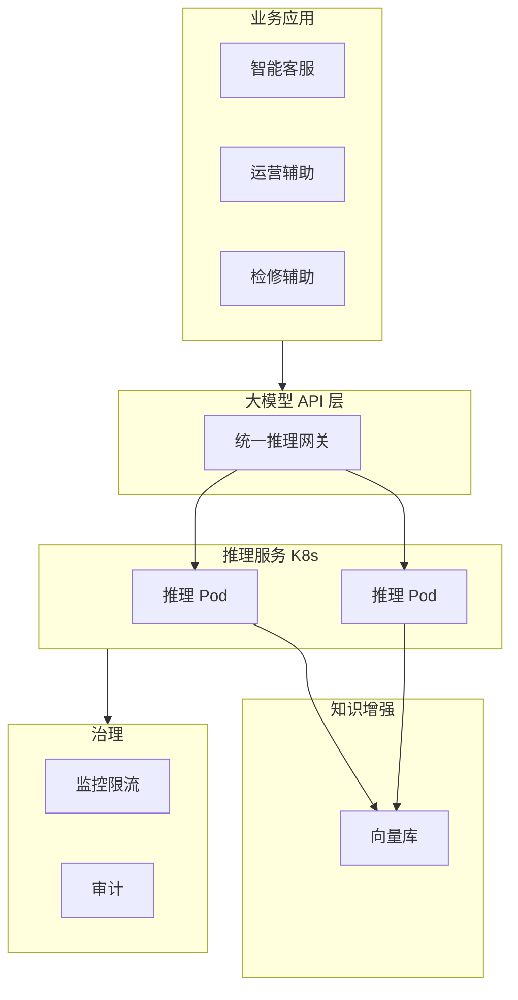

# 云原生 AI 大模型技术应用

> **正文背诵简版**（默写摘要用）
>
> **项目**：（航司）航空运营智能管理平台；**本人**：系统架构师；**周期**：2024.3 建设 → 2025.8 上线 → 稳定运行约 10 个月。
>
> **1.** **大模型选型与云原生部署**：推理容器化、异构 GPU 池、**Prometheus 指标 + HPA** 秒级弹性，GPU 利用率↑、响应稳定。
> **2.** **大模型与业务集成**：统一推理 **API 网关** + **RAG/向量库** + Prompt 约束，抑幻觉、问答准确率↑。
> **3.** **运维与治理**：监控告警、多租户配额与流控、输入输出脱敏与审计、**Token 成本**透明。

## 1. 摘要
2024年3月，我参与某航空公司运营智能管理平台建设，项目面向航空运营机构、近百个运营基地机场，覆盖数千万常旅客会员，年均服务旅客超3000万人次，提供航空信息管理、旅客全流程服务、票务交易、航空检修预警、数据智能分析等核心业务功能。项目中，我担任系统架构师，全面负责平台架构设计与核心技术落地。本文围绕云原生 AI 大模型技术在航空运营场景中的应用展开论述，通过大模型选型与云原生部署实现推理服务化与弹性扩缩，基于大模型与业务集成赋能智能问答、辅助决策与知识检索，结合大模型运维与治理保障可用性、成本可控与安全合规。系统于2025年8月正式上线，截至2026年5月已稳定运行10个月，各项功能及性能指标均达到预设标准，获得客户高度认可。

## 2. 项目背景
某航空公司需管理覆盖全部航线网络的近百个运营基地与机场，服务数千万常旅客会员、年服务旅客超3000万人次，为其提供票务、值机、行程查询、航班变动通知、航空检修协同等全场景服务；原有多系统分散、烟囱式建设，故障影响面大、协同效率低，无法满足7×24小时稳定可用与节假日高并发下的智能化与高可用要求。随着国家智慧民航建设战略深入推进，航空运输行业数字化、智能化转型迫在眉睫，《"十四五"民用航空发展规划》《智慧民航建设路线图》等政策明确要求推动航空运营全流程数字化、智能化升级，提升运输效率与安全水平。在此背景下，该航空公司于2024年3月启动航空运营智能管理平台建设，旨在构建覆盖全部航线网络、近百个运营基地及数千万常旅客会员的数字化管理平台，实现航线、航班、票务等核心业务全流程智能管控，提供全场景便捷服务，提升运营效率与服务体验。

我司中标后，我以系统架构师身份负责平台整体架构设计与核心技术落地。平台需在航线需求预测、设备故障预警、旅客消费偏好分析等既有数据智能能力基础上，引入大模型能力支撑智能客服、规章与检修知识问答、运营辅助决策等场景。我意识到，如何将 AI 大模型技术平滑引入现有的微服务体系，并确保其在复杂航空业务场景下的准确性与合规性，是项目成功的关键。

## 3. AI大模型企业级应用的核心架构设计要点
在项目建设初期，我深入分析了 AI 大模型在企业级应用中的核心挑战，总结出以下三个架构设计要点及其作用：

- **设计要点 1：大模型节点如何动态扩容，以应对业务高峰？**
  在航空运营场景中，节假日促销或航班大面积变动时，智能客服与问答需求会瞬时激增。我们必须解决模型推理服务的弹性扩展问题，将其与现有 K8s 容器云体系统一管控。其作用在于实现推理能力的服务化与资源的高效利用，确保在高并发下系统依然能够提供稳定的响应。

- **设计要点 2：如何确保大模型能够准确回答民航规章与检修手册等专业问题？**
  通用大模型虽然具备基础对话能力，但缺乏对特定行业深度知识的掌握。我们通过 RAG（检索增强生成）与统一业务 API 集成，将大模型与业务系统深度融合。其作用是消除大模型“幻觉”，赋能智能问答与辅助决策，使其产出的内容具备行业权威性与业务落地价值。

- **设计要点 3：如何在大规模应用中实现大模型的成本可控与安全合规？**
  大模型推理成本高昂且涉及大量旅客敏感数据。我们建立了完善的运维与治理体系，通过监控限流、成本分摊、数据脱敏与审计手段，保障了系统的可持续运行。其作用是确保 AI 能力的引入不会带来不可控的经济压力与法律风险。

基于上述设计思路，我主持设计了平台的整体技术架构，通过分层解耦与能力增强，实现了 AI 能力与航空业务的深度融合。架构简图如下所示：

具体实践如下：

## 4. 正文部分

### 一、大模型选型与云原生部署：解决推理服务弹性与资源管理难题
在航空运营场景中，智能客服、规章问答与检修辅助等业务对大模型推理能力有着极高的实时性与稳定性要求。然而，项目初期我们面临着传统部署模式的巨大挑战：采用单机或虚拟机部署方式不仅扩展周期冗长，且静态的 GPU 资源分配方式难以随航空业务剧烈的峰谷波动（如节假日机票大促、雷雨天气导致的航班大面积延误等）实现动态匹配，导致业务高峰期系统响应极慢甚至宕机，而低峰期资源却大量闲置浪费。针对这一痛点，我主导推进了大模型选型与云原生部署架构的全面重构。首先，在模型选型上采取“通用基座+领域适配”策略，选用高性能通用大模型作为底层支撑，针对检修规程等强领域场景通过模型微调或外挂知识库方式提升专业性。其次，全面实施推理服务容器化，在 Kubernetes 集群中构建了异构 GPU 节点池，利用 Service 与 Ingress 统一接入网关，实现了推理能力的标准化封装与 Pod 服务化治理。最关键的是，我们引入了基于 Prometheus 自定义指标的水平自动扩缩容（HPA）机制，结合 QPS、队列深度及 GPU 显存利用率，实现了秒级的推理副本动态调整与冷启动优化。这一方案的成功落地，彻底解决了大模型推理的弹性扩展难题，使得算力资源能够随业务负载实时伸缩。在确保高峰期平均响应时间稳定在 800 毫秒以内的同时，将 GPU 综合利用率提升了 45% 以上，为整个平台的智能化底座提供了坚实、高效且经济的算力支撑，成功保障了春运期间千万级旅客量的智能化服务需求。

### 二、大模型与业务集成：解决大模型“幻觉”与业务脱敏问题
大模型若仅作为独立的对话工具存在，无法深度嵌入票务交易、旅客服务及设备检修等核心业务链路，其在航空场景下的实际价值将大打折扣。项目初期，由于大模型与业务系统相互隔离，且缺乏民航规章、技术手册等深度专业语料的支撑，模型在处理航空专业问题时频繁出现“幻觉”现象，或给出过于宽泛、缺乏落地参考价值的建议，难以满足民航业对安全与准确的严苛标准。为此，我们系统性地开展了大模型与业务深度集成工作。在接口层面，我们设计并封装了兼容主流 OpenAI 格式的统一大模型 API 网关，使智能客服系统、运行监控大屏及检修移动端能通过标准协议实现低延迟调用。在提示工程（Prompt Engineering）层面，针对不同业务场景建立了标准化提示模板库，通过 Few-shot 示例与 Chain-of-Thought 链式思考精确约束模型的输出边界。最核心的突破是构建了检索增强生成（RAG）闭环体系，我们将数万份民航法律法规、飞机检修手册及历史排故工单进行向量化处理并存入分布式向量数据库，在推理阶段实时检索关联知识片段并动态注入提示词，确保模型输出“言之有据、查之有源”。通过这一系列集成举措，智能客服的业务问题自动闭环率从 60% 显著提升至 85% 以上，领域问答的准确率突破 90% 关口。这不仅极大缓解了一线人工客服的压力，更使大模型真正转化为具备行业深度专业能力的“数字专家”，为旅客及运营人员提供了精准、可靠且具备实操意义的智能化决策支持。

### 三、大模型运维与治理：解决成本控制与数据安全合规风险
大模型在航空企业级应用中的长效运行，很大程度上取决于运维与治理体系的精细化程度。在项目演进过程中，我们面临着三大核心治理挑战：一是 GPU 推理成本极其高昂，若缺乏按业务维度的精确计量，极易超出项目预算控制；二是输入输出环节可能涉及旅客身份证、行程轨迹等大量敏感隐私信息，存在严重的合规与数据泄露风险；三是若无完善的流量限速与配额机制，单一业务的异常请求可能瞬间拖垮整个共享算力池。针对这些风险，我们构建了全栈式的大模型运维与治理体系。在全方位监控维度，我们利用 Prometheus 与 Grafana 对推理服务的 QPS、Token 吞吐量、响应延迟及 GPU 核心温度等关键指标进行实时采集，并接入公司统一可观测平台实现智能告警。在资源治理层面，实施了严格的多租户配额管理与优先级流控策略，按应用重要性动态分配并发上限，确保值机辅助、航班调度等核心链路的绝对稳定性。在安全合规方面，我们自主研发了敏感数据过滤层，利用高性能正则表达式与 NLP 命名实体识别算法对输入输出流进行实时脱敏，并对所有交互行为记录全量审计日志以满足民航监管要求。此外，通过 Token 级的精细化成本分摊模型，实现了各业务部门的成本透明化归因。这些治理手段的落地，使系统可用性稳定保持在 99.99% 以上，在确保旅客隐私绝对安全的前提下，实现了 AI 运营成本的可控与透明，为航空运营智能管理平台在云原生环境下的长期健康可持续运行奠定了坚实的技术与管理基石。

## 5. 总结
本平台响应智慧民航建设政策，通过云原生 AI 大模型技术的深度应用，构建了航空运营全流程一体化管理体系。2025年8月上线后稳定运行10个月，系统日均处理票务交易超12万笔，核心业务响应时间≤800毫秒，运营效率提升35%，旅客投诉率下降40%，各项指标均超预期。

项目复盘发现，在 AI 应用深度融合方面仍存在不足：一是在业务极端峰值下，大模型推理 Pod 的冷启动速度仍有优化空间，导致瞬时响应延迟增加；二是 RAG 向量检索在海量规章手册并发查询时，存在索引命中率与检索时延的平衡挑战。后续将针对性优化：引入模型预热与镜像懒加载技术，提升扩容响应速度；探索更高效的混合检索与重排序算法，持续优化知识检索效能，助力智慧民航高质量发展。