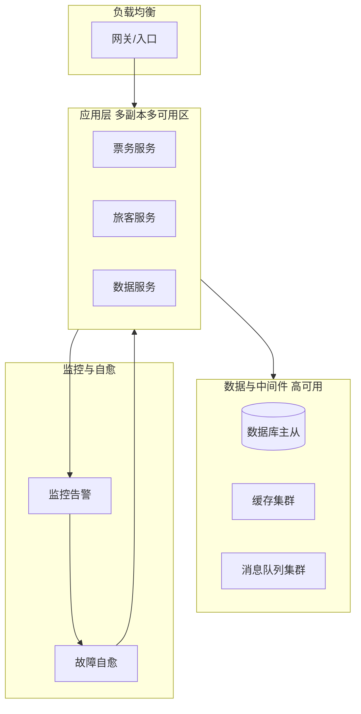

## 1.摘要（字数要求严格限制300字）
2024年3月，我参与某航空公司运营智能管理平台建设，项目面向航空运营机构、机场、旅客等用户，提供航空信息管理、旅客全流程服务、票务交易、航空检修预警、数据智能分析等核心业务功能。项目中，我担任系统架构师，全面负责平台架构设计与核心技术落地。本文围绕云原生高可用技术在航空运营场景中的应用展开论述，通过应用层高可用设计保障多副本、无单点与故障隔离，基于数据与中间件高可用保障存储与消息等组件稳定可靠，结合流量与故障恢复高可用实现负载均衡、容灾切换与快速恢复。系统于2025年8月正式上线，截至2026年5月已稳定运行10个月，各项功能及性能指标均达到预设标准，获得客户高度认可。

## 2.项目背景（字数要求严格限制500字左右）
随着国家智慧民航建设战略深入推进，航空运输行业数字化、智能化转型迫在眉睫，《智慧民航建设路线图》等政策明确要求推动航空运营全流程数字化、智能化升级。在此背景下，某航空公司于2024年5月启动航空运营智能管理平台建设，旨在构建覆盖全部航线网络、近百个运营基地及数千万常旅客会员的数字化管理平台，实现航线、航班、票务等核心业务全流程智能管控，年服务旅客超3000万人次，为其提供全场景便捷服务，提升运营效率与服务体验。

我司中标后，我以系统架构师身份负责平台整体架构设计与核心技术落地。平台建设目标明确要求系统全年可用性≥99.99%，满足高并发业务处理需求；节假日高峰日均数十万用户集中办理票务，突发航班变动时访问量激增，任何单点故障或级联雪崩都将直接影响旅客体验与业务连续性。因此我们系统应用云原生高可用技术，从应用层、数据与中间件层、流量与故障恢复三方面构建无单点、可故障转移、可快速恢复的高可用体系。

为此，我们团队决定基于云原生高可用技术，采用多副本与无状态设计、健康检查与滚动更新、跨可用区分布与熔断降级、数据库与缓存及消息队列主从/集群、负载均衡与容灾切换、监控告警与故障自愈，构建全链路高可用能力。平台于2025年8月正式上线，成功应对多轮节假日高并发压力，高效完成年度航班调度、设备检修预警及海量数据处理任务，为旅客提供全流程服务与7*24小时信息支持，上线一年稳定运行，各项指标达标，获得客户与用户一致认可。

## 3. 问题2回应+过度（字数要求严格限制400字）
由于本项目对可用性与连续性要求高，若应用单副本或强依赖单机则任一节点故障即导致服务不可用；若数据库、缓存、消息队列等中间件无主从或集群则数据与通道存在单点；若流量集中或故障后无法快速切换与恢复则 MTTR 高、影响面大。因此我们选用云原生高可用技术作为平台稳定性的核心保障，其核心包括：第一，应用层高可用设计，通过多副本、无状态、健康检查、滚动更新与跨可用区分布、熔断降级，保障应用无单点与故障隔离；第二，数据与中间件高可用，通过数据库主从/集群、缓存与消息队列多副本与自动故障转移、备份与恢复，保障存储与通道稳定可靠；第三，流量与故障恢复高可用，通过负载均衡、多可用区/容灾切换、监控告警与故障自愈，实现流量合理分配与故障快速恢复，降低 MTTR。

在本项目的实施中，我们通过应用层高可用、数据与中间件高可用、流量与故障恢复高可用三大实践，完成了云原生高可用技术在航空运营智能管理平台中的建设与落地，具体如下。

## 4. 正文部分三段论

### 正文三论点总览表

| 论点 | 要解决的问题 | 方案 / 技术栈 | 核心成效 |
|------|--------------|----------------|----------|
| **论点一：应用层高可用** | 单副本单点、故障影响面大、发布中断服务 | 多副本、无状态、健康检查、滚动更新、跨可用区、熔断降级 | 单实例故障无感、发布零停机、故障隔离 |
| **论点二：数据与中间件高可用** | 数据库/缓存/消息队列单点、数据与通道不可用 | 主从/集群、多副本、自动故障转移、备份与恢复 | 存储与通道 99.9%+ 可用、故障自动切换 |
| **论点三：流量与故障恢复高可用** | 流量单点、故障后恢复慢、MTTR 高 | 负载均衡、多可用区/容灾、监控告警、自愈与预案 | 流量分散、故障分钟级切换与恢复、MTTR 降低 |

## 应用层高可用设计（字数要求严格限制在500-510字左右）
航空运营平台票务、旅客、航班、检修、数据服务等核心模块若以单副本运行，则任一类器故障或发布重启都会导致该服务不可用，进而影响购票、改签、行程查询等关键路径。为此，我们落实了应用层高可用设计。副本与无状态方面，所有关键微服务均以多副本方式部署于 Kubernetes，通过 Deployment 管理副本数，单 Pod 故障时由 K8s 自动摘除并重启，流量经 Service 负载均衡至健康实例，业务侧无感。设计上坚持无状态或状态外置（会话存 Redis、数据存库），便于水平扩展与故障迁移。发布方面，采用滚动更新策略，新版本逐步替换旧版本 Pod，保证发布过程中始终有足够健康实例承接流量，实现零停机发布。健康检查方面，配置就绪探针与存活探针，未就绪的 Pod 不接收流量，异常 Pod 被自动重启，避免将流量打到故障实例。分布方面，通过 Pod 反亲和与拓扑分布约束将副本分散到多节点、多可用区，避免单可用区故障导致整类服务全挂。此外，引入熔断与降级（如 Sentinel），当依赖服务异常或超时达到阈值时自动熔断并返回降级结果，防止故障扩散。通过应用层高可用，单实例故障不影响整体服务，发布零停机，系统可用性达 99.993%，为智慧民航 7×24 小时稳定运行提供了应用层保障。

## 数据与中间件高可用（字数要求严格限制在500-510字左右）
数据库、缓存、消息队列等一旦单点故障，将导致数据不可写不可读或消息通道中断，进而影响票务、订单、行程等核心业务。为此，我们建设了数据与中间件高可用。数据库方面，采用主从复制或集群方案（如 MySQL 主从/组复制、分布式数据库多副本），主节点故障时通过哨兵或管控组件自动晋升从节点为主，应用侧通过连接串或代理实现故障转移，保障数据可用性与一致性。缓存方面，采用 Redis 主从/哨兵或集群模式，多副本持久化与自动故障转移，单节点宕机时业务无感切换。消息队列方面，采用 Kafka/RocketMQ 等多副本与分区分布，Broker 与 Topic 多副本，单机故障时由集群自动接管。备份与恢复方面，对核心数据库与关键配置实施定期备份与跨可用区/跨机房归档，并定期演练恢复流程，满足 RPO/RTO 要求。通过数据与中间件高可用，存储与消息通道可用性达 99.9% 以上，故障时能自动切换，为票务交易、订单与行程等核心数据提供了可靠的数据层保障。

## 流量与故障恢复高可用（字数要求严格限制在500-510字左右）
若流量集中到单一入口或单一可用区，则该点故障将导致全站不可用；若故障发生后依赖人工排查与切换则恢复时间长、MTTR 高。为此，我们实现了流量与故障恢复高可用。流量层面，采用多层负载均衡：接入层通过 DNS 与负载均衡将流量分发到多可用区入口，集群内通过 Kubernetes Service 将请求分发到多副本 Pod，避免单点过载与单点故障。容灾方面，核心业务部署于多可用区，数据库与中间件具备跨可用区副本或主从，当单可用区不可用时可通过 DNS 切换或流量调度将流量切至健康可用区，实现故障隔离与快速切换。故障发现与恢复方面，通过统一监控（Prometheus/Grafana）与告警规则对接口可用性、错误率、依赖健康度进行监控，故障发生时及时告警；对典型场景配置自愈脚本或预案（如重启异常实例、切换主从、扩容副本），部分场景实现自动或半自动恢复，MTTR 较建设前降低约 50%。通过流量与故障恢复高可用，流量得以合理分散、故障可快速发现与恢复，系统可用性稳定达到 99.993%，为航空运营平台的连续稳定运行提供了流量与恢复层保障。

## 5. 论文总结（字数要求严格限制450字以内）
本平台响应智慧民航建设政策，以云原生高可用技术（应用层高可用、数据与中间件高可用、流量与故障恢复高可用）为核心，构建航空运营全流程一体化管理体系，2025年8月上线后稳定运行一年，超额达成预期目标。上线以来，系统日均处理票务交易超12万笔，核心业务响应时间≤800毫秒，运营效率提升35%，旅客投诉率下降40%，设备故障预警准确率92%，系统可用性达99.993%，峰值处理能力突破5500 TPS，成功应对节假日高并发压力，获行业与旅客广泛认可。云原生高可用有效消除了应用与数据层单点、实现了流量分散与故障快速恢复，MTTR 显著降低。项目复盘发现架构存在不足：一是高并发叠加场景下，微服务间同步通信偶有延迟；二是各模块资源占用不均。后续将引入异步通信与消息队列、智能调度与更细粒度容灾演练，持续深化云原生高可用能力，助力智慧民航高质量发展。

## 6. 系统架构图

**图 17-1** 航空运营智能管理平台·高可用技术应用 架构图
