# 云原生 AI 大模型技术应用 极致拆解背诵版

## 1. 摘要

### 记忆单元1：项目基础信息

1. **2024年3月**，我参与某航空公司运营智能管理平台建设

2. 项目面向航空运营机构、**近百个**运营基地机场

3. 覆盖数千万常旅客会员，年均服务旅客超**3000万人次**

4. 提供航空信息管理、旅客全流程服务、票务交易、航空检修预警、数据智能分析等核心业务功能

### 记忆单元2：个人角色与论文核心论述

1. 项目中，我担任**系统架构师**，全面负责平台架构设计与核心技术落地

2. 本文围绕**云原生 AI 大模型技术**在航空运营场景中的应用展开论述

3. 通过大模型选型与云原生部署，实现推理服务化与弹性扩缩

4. 基于大模型与业务集成，赋能智能问答、辅助决策与知识检索

5. 结合大模型运维与治理，保障可用性、成本可控与安全合规

### 记忆单元3：项目落地成果

1. 系统于**2025年8月**正式上线

2. 截至**2026年5月**已稳定运行**10个月**

3. 各项功能及性能指标均达到预设标准，获得客户高度认可

---

## 2. 项目背景

### 记忆单元1：项目业务基础与原有系统痛点

1. 某航空公司需管理覆盖全部航线网络的**近百个**运营基地与机场

2. 服务数千万常旅客会员、年服务旅客超**3000万人次**

3. 为其提供票务、值机、行程查询、航班变动通知、航空检修协同等全场景服务

4. 原有多系统分散、烟囱式建设，故障影响面大、协同效率低

5. 无法满足**7×24小时**稳定可用，与节假日高并发下的智能化与高可用要求

### 记忆单元2：政策背景与项目启动目标

1. 随着国家智慧民航建设战略深入推进，航空运输行业数字化、智能化转型迫在眉睫

2. 《"十四五"民用航空发展规划》《智慧民航建设路线图》等政策明确要求

3. 推动航空运营全流程数字化、智能化升级，提升运输效率与安全水平

4. 在此背景下，该航空公司于**2024年3月**启动航空运营智能管理平台建设

5. 旨在构建覆盖全部航线网络、近百个运营基地及数千万常旅客会员的数字化管理平台

6. 实现航线、航班、票务等核心业务全流程智能管控

7. 提供全场景便捷服务，提升运营效率与服务体验

### 记忆单元3：个人职责与项目核心挑战

1. 我司中标后，我以**系统架构师**身份负责平台整体架构设计与核心技术落地

2. 平台需在航线需求预测、设备故障预警、旅客消费偏好分析等既有数据智能能力基础上

3. 引入大模型能力，支撑智能客服、规章与检修知识问答、运营辅助决策等场景

4. 我意识到，如何将 AI 大模型技术平滑引入现有的微服务体系

5. 并确保其在复杂航空业务场景下的准确性与合规性，是项目成功的关键

---

## 3. AI大模型企业级应用的核心架构设计要点

### 记忆单元1：总起句

1. 在项目建设初期，我深入分析了 AI 大模型在企业级应用中的核心挑战

2. 总结出以下三个架构设计要点及其作用

### 记忆单元2：设计要点1 动态扩容应对业务高峰

#### 核心问题

1. 大模型节点如何动态扩容，以应对业务高峰？

#### 场景与方案

1. 在航空运营场景中，节假日促销或航班大面积变动时，智能客服与问答需求会瞬时激增

2. 我们必须解决模型推理服务的弹性扩展问题，将其与现有 **K8s 容器云** 体系统一管控

#### 核心作用

1. 其作用在于实现推理能力的服务化与资源的高效利用

2. 确保在高并发下系统依然能够提供稳定的响应

### 记忆单元3：设计要点2 保障专业问题回答准确性

#### 核心问题

1. 如何确保大模型能够准确回答民航规章与检修手册等专业问题？

#### 场景与方案

1. 通用大模型虽然具备基础对话能力，但缺乏对特定行业深度知识的掌握

2. 我们通过 **RAG（检索增强生成）** 与统一业务 API 集成，将大模型与业务系统深度融合

#### 核心作用

1. 其作用是消除大模型“幻觉”，赋能智能问答与辅助决策

2. 使其产出的内容具备行业权威性与业务落地价值

### 记忆单元4：设计要点3 实现成本可控与安全合规

#### 核心问题

1. 如何在大规模应用中实现大模型的成本可控与安全合规？

#### 场景与方案

1. 大模型推理成本高昂且涉及大量旅客敏感数据

2. 我们建立了完善的运维与治理体系，通过监控限流、成本分摊、数据脱敏与审计手段，保障了系统的可持续运行

#### 核心作用

1. 其作用是确保 AI 能力的引入不会带来不可控的经济压力与法律风险

### 记忆单元5：架构设计承接句

1. 基于上述设计思路，我主持设计了平台的整体技术架构

2. 通过分层解耦与能力增强，实现了 AI 能力与航空业务的深度融合

3. 架构简图如下所示：

```mermaid
flowchart TB
  subgraph App[业务应用]
    Chat[智能客服]
    Ops[运营辅助]
    Maint[检修辅助]
  end
  subgraph API[大模型 API 层]
    Gateway[统一推理网关]
  end
  subgraph Infer[推理服务 K8s]
    LLM1[推理 Pod]
    LLM2[推理 Pod]
    Gateway --> LLM1
    Gateway --> LLM2
  end
  subgraph RAG[知识增强]
    VecDB[向量库]
    LLM1 --> VecDB
    LLM2 --> VecDB
  end
  subgraph Gov[治理]
    Monitor[监控限流]
    Audit[审计]
  end
  App --> API
  Infer --> Gov
```

1. 具体实践如下：

---

## 4. 正文部分

### 一、大模型选型与云原生部署：解决推理服务弹性与资源管理难题

#### 记忆单元1：业务需求与核心痛点

1. 在航空运营场景中，智能客服、规章问答与检修辅助等业务

2. 对大模型推理能力有着极高的实时性与稳定性要求

3. 然而，项目初期我们面临着传统部署模式的巨大挑战

4. 采用单机或虚拟机部署方式，不仅扩展周期冗长

5. 且静态的 **GPU** 资源分配方式，难以随航空业务剧烈的峰谷波动实现动态匹配

6. 峰谷波动典型场景：节假日机票大促、雷雨天气导致的航班大面积延误等

7. 最终导致业务高峰期系统响应极慢甚至宕机，而低峰期资源却大量闲置浪费

#### 记忆单元2：核心解决方案（分3步）

##### 第一步：模型选型策略

1. 针对这一痛点，我主导推进了大模型选型与云原生部署架构的全面重构

2. 首先，在模型选型上采取**“通用基座+领域适配”**策略

3. 选用高性能通用大模型作为底层支撑

4. 针对检修规程等强领域场景，通过模型微调或外挂知识库方式提升专业性

##### 第二步：容器化部署架构

1. 其次，全面实施推理服务容器化

2. 在 **Kubernetes** 集群中构建了异构 GPU 节点池

3. 利用 Service 与 Ingress 统一接入网关

4. 实现了推理能力的标准化封装与 Pod 服务化治理

##### 第三步：弹性扩缩核心机制

1. 最关键的是，我们引入了基于 **Prometheus** 自定义指标的水平自动扩缩容（HPA）机制

2. 结合 QPS、队列深度及 GPU 显存利用率

3. 实现了秒级的推理副本动态调整与冷启动优化

#### 记忆单元3：落地效果与价值

1. 这一方案的成功落地，彻底解决了大模型推理的弹性扩展难题

2. 使得算力资源能够随业务负载实时伸缩

3. 在确保高峰期平均响应时间稳定在 **800毫秒** 以内的同时

4. 将 GPU 综合利用率提升了 **45%** 以上

5. 为整个平台的智能化底座提供了坚实、高效且经济的算力支撑

6. 成功保障了春运期间千万级旅客量的智能化服务需求

---

### 二、大模型与业务集成：解决大模型“幻觉”与业务脱敏问题

#### 记忆单元1：业务价值与核心痛点

1. 大模型若仅作为独立的对话工具存在，无法深度嵌入票务交易、旅客服务及设备检修等核心业务链路

2. 其在航空场景下的实际价值将大打折扣

3. 项目初期，由于大模型与业务系统相互隔离

4. 且缺乏民航规章、技术手册等深度专业语料的支撑

5. 模型在处理航空专业问题时频繁出现“幻觉”现象

6. 或给出过于宽泛、缺乏落地参考价值的建议

7. 难以满足民航业对安全与准确的严苛标准

#### 记忆单元2：核心集成方案（分3层）

##### 第一层：接口层统一网关

1. 为此，我们系统性地开展了大模型与业务深度集成工作

2. 在接口层面，我们设计并封装了兼容主流 OpenAI 格式的统一大模型 API 网关

3. 使智能客服系统、运行监控大屏及检修移动端，能通过标准协议实现低延迟调用

##### 第二层：提示工程标准化

1. 在提示工程（Prompt Engineering）层面

2. 针对不同业务场景建立了标准化提示模板库

3. 通过 Few-shot 示例与 Chain-of-Thought 链式思考，精确约束模型的输出边界

##### 第三层：RAG闭环核心体系

1. 最核心的突破是构建了**检索增强生成（RAG）闭环体系**

2. 我们将数万份民航法律法规、飞机检修手册及历史排故工单进行向量化处理

3. 并存入分布式向量数据库

4. 在推理阶段实时检索关联知识片段并动态注入提示词

5. 确保模型输出“言之有据、查之有源”

#### 记忆单元3：落地效果与价值

1. 通过这一系列集成举措

2. 智能客服的业务问题自动闭环率从 **60%** 显著提升至 **85%** 以上

3. 领域问答的准确率突破 **90%** 关口

4. 这不仅极大缓解了一线人工客服的压力

5. 更使大模型真正转化为具备行业深度专业能力的“数字专家”

6. 为旅客及运营人员提供了精准、可靠且具备实操意义的智能化决策支持

---

### 三、大模型运维与治理：解决成本控制与数据安全合规风险

#### 记忆单元1：治理核心价值与三大挑战

1. 大模型在航空企业级应用中的长效运行

2. 很大程度上取决于运维与治理体系的精细化程度

3. 在项目演进过程中，我们面临着三大核心治理挑战

4. 挑战一：GPU 推理成本极其高昂，若缺乏按业务维度的精确计量，极易超出项目预算控制

5. 挑战二：输入输出环节可能涉及旅客身份证、行程轨迹等大量敏感隐私信息，存在严重的合规与数据泄露风险

6. 挑战三：若无完善的流量限速与配额机制，单一业务的异常请求可能瞬间拖垮整个共享算力池

#### 记忆单元2：全栈式治理体系（4大维度）

##### 维度1：全方位监控告警体系

1. 针对这些风险，我们构建了全栈式的大模型运维与治理体系

2. 在全方位监控维度，我们利用 Prometheus 与 Grafana

3. 对推理服务的 QPS、Token 吞吐量、响应延迟及 GPU 核心温度等关键指标进行实时采集

4. 并接入公司统一可观测平台实现智能告警

##### 维度2：资源治理与流控策略

1. 在资源治理层面，实施了严格的多租户配额管理与优先级流控策略

2. 按应用重要性动态分配并发上限

3. 确保值机辅助、航班调度等核心链路的绝对稳定性

##### 维度3：安全合规管控体系

1. 在安全合规方面，我们自主研发了敏感数据过滤层

2. 利用高性能正则表达式与 NLP 命名实体识别算法，对输入输出流进行实时脱敏

3. 并对所有交互行为记录全量审计日志，以满足民航监管要求

##### 维度4：精细化成本管控

1. 此外，通过 Token 级的精细化成本分摊模型

2. 实现了各业务部门的成本透明化归因

#### 记忆单元3：落地效果与价值

1. 这些治理手段的落地，使系统可用性稳定保持在 **99.99%** 以上

2. 在确保旅客隐私绝对安全的前提下，实现了 AI 运营成本的可控与透明

3. 为航空运营智能管理平台在云原生环境下的长期健康可持续运行

4. 奠定了坚实的技术与管理基石

---

## 5. 总结

### 记忆单元1：项目整体成果

1. 本平台响应智慧民航建设政策，通过云原生 AI 大模型技术的深度应用

2. 构建了航空运营全流程一体化管理体系

3. **2025年8月**上线后稳定运行**10个月**

4. 系统日均处理票务交易超**12万笔**

5. 核心业务响应时间**≤800毫秒**

6. 运营效率提升**35%**，旅客投诉率下降**40%**

7. 各项指标均超预期

### 记忆单元2：项目复盘不足

1. 项目复盘发现，在 AI 应用深度融合方面仍存在不足

2. 不足一：在业务极端峰值下，大模型推理 Pod 的冷启动速度仍有优化空间，导致瞬时响应延迟增加

3. 不足二：RAG 向量检索在海量规章手册并发查询时，存在索引命中率与检索时延的平衡挑战

### 记忆单元3：后续优化方向与收尾

1. 后续将针对性优化

2. 优化方向一：引入模型预热与镜像懒加载技术，提升扩容响应速度

3. 优化方向二：探索更高效的混合检索与重排序算法，持续优化知识检索效能

4. 最终助力智慧民航高质量发展
