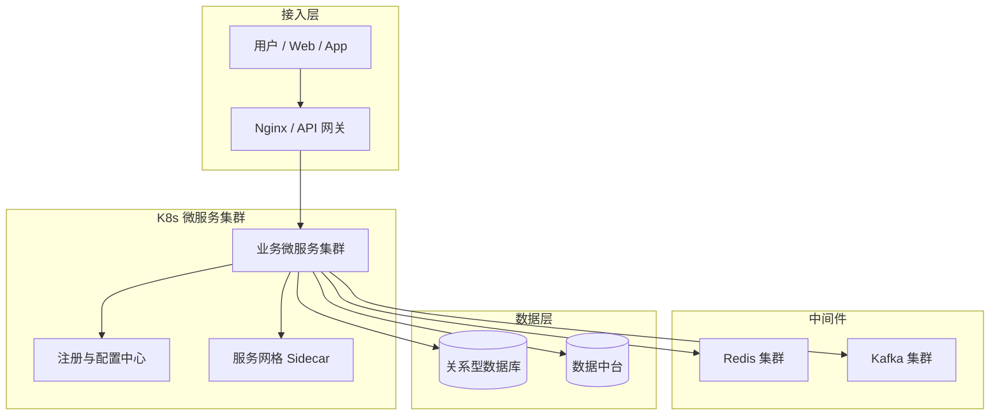

## 1. 摘要（约300字）

2024年3月，我参与某航空公司运营智能管理平台建设，项目面向航空运营机构、近百个运营基地机场、数千万常旅客及每年超3000万出行旅客，提供航空信息管理、旅客全流程服务、票务交易、航空检修预警、数据智能分析等核心业务功能。项目中，我担任系统架构师，全面负责平台架构设计与核心技术落地。本文围绕云原生架构在航空运营智能管理平台中的设计与实践展开论述，通过基于微服务与容器编排的弹性伸缩架构设计提升系统水平扩展能力与资源利用率，基于云原生数据中台支撑航空运营智能决策、打通多源异构数据并提供实时与离线分析能力，结合服务网格与 DevSecOps 驱动的全链路可靠性保障实现流量治理、安全防护与快速高质量交付。系统于2025年8月正式上线，截至2026年5月已稳定运行10个月，各项功能及性能指标均达到预设标准，获得客户高度认可。

---

## 2. 项目背景（约500字）

某航空公司需管理覆盖全部航线网络的近百个运营基地与机场，为数千万常旅客及每年超3000万旅客提供票务、值机、行程查询、航班变动通知、航空检修协同等全场景服务；原有多系统分散、烟囱式建设，故障影响面大、协同效率低，无法满足7×24小时稳定可用与节假日高并发下的弹性扩展与高可靠要求。随着国家智慧民航建设战略深入推进，航空运输行业数字化、智能化转型迫在眉睫，《"十四五"民用航空发展规划》《智慧民航建设路线图》等政策明确要求推动航空运营全流程数字化、智能化升级，提升运输效率与安全水平。在此背景下，该航空公司于2024年3月启动航空运营智能管理平台建设，旨在构建覆盖全部航线网络、近百个运营基地及数千万常旅客的数字化管理平台，实现航线、航班、票务等核心业务全流程智能管控，同时为每年超3000万旅客提供全场景便捷服务，提升运营效率与服务体验。

我司中标后，我以系统架构师身份负责平台整体架构设计与核心技术落地。平台面临突出业务挑战：节假日高峰日均数十万用户集中办理票务，突发航班变动时访问量激增，且需日均处理800GB实时数据、年度累计处理10PB+离线数据，对资源弹性调度、数据处理效率及系统稳定性、安全性提出极高要求。

为此，我们团队决定基于云原生架构在航空运营智能管理平台中的设计与实践，采用微服务拆分、容器编排、服务网格、弹性伸缩、统一配置与灰度发布、可观测性与自动化运维等云原生关键技术，重构核心业务系统，构建面向航空运营的一体化、弹性、高可靠技术底座，有效支撑高并发访问、复杂运行态监控与快速业务创新。平台于2025年8月正式上线，成功应对多轮节假日高并发压力，高效完成年度航班调度、设备检修预警及旅客全流程服务，为旅客提供7×24小时信息支持，上线10个月稳定运行，各项指标达标，获得客户与用户一致认可。

---

## 3. 问题2回应 + 过渡

由于本项目存在业务高峰瞬时流量剧增、航班运行状态复杂多变、传统集中式架构扩展成本高、运维手段碎片化、系统变更周期长等突出问题，所以选用云原生架构在航空运营智能管理平台中的设计与实践，其核心包括：第一，基于微服务与容器编排的弹性伸缩架构设计，提升系统水平扩展能力与资源利用率；第二，构建云原生数据中台支撑的航空运营智能决策，打通多源异构数据并提供实时与离线分析能力；第三，引入服务网格与 DevSecOps 驱动的全链路可靠性保障，实现流量治理、安全防护与快速高质量交付。

在本项目的实施中，我们通过构建弹性伸缩的微服务架构、打造面向运营决策的数据中台、引入服务网格与 DevSecOps 保障全链路可靠性，完成了云原生架构在航空运营智能管理平台中的设计与实践的建设与落地，具体实践如下。

---

## 4. 正文部分

### 一、基于微服务与容器编排的弹性伸缩架构设计（字数约500–510字）

在架构设计层面，我们首先对航空运营智能管理平台的业务域进行系统梳理，按照“航班计划与运行控制、票务与订单、旅客服务、设备与安全、数据分析与监控”等领域进行领域驱动设计拆分，将原有单体应用重构为百余个微服务。各服务围绕业务能力边界进行高内聚、低耦合建模，通过统一的 API 网关对外暴露接口，实现航司内部系统与外部合作方的标准化对接。在部署层面，我们全面引入 Kubernetes 作为容器编排平台，将所有微服务容器化部署，通过命名空间实现多环境隔离，通过 Deployment 与 StatefulSet 承载无状态与有状态负载，结合 HPA 实现按 CPU、QPS、队列长度等指标自动弹性伸缩，确保节假日高峰与航班大面积调整场景下系统能够快速扩容、平稳应对。

资源管理方面，我们在节点层实现按业务优先级区分的资源池划分，为航班运行控制、票务交易等核心服务预留高优先级计算与存储资源，通过限制辅助服务的资源上限避免资源争抢。同时，在微服务间通信上引入统一注册与配置中心，支持多集群多机房部署，结合统一熔断、限流和降级策略，提高在网络抖动与底层资源故障条件下的平台韧性。为降低频繁版本发布对业务的影响，我们利用云原生平台提供的灰度发布与蓝绿发布能力，对高风险服务采用小流量多阶段放量策略，对低风险服务使用滚动升级策略，实现“分钟级可回滚”的安全变更机制。通过上述实践，平台在保证高并发承载能力的同时，大幅缩短了新功能上线周期，为航空公司快速响应市场与政策变化提供了坚实技术支撑。

### 二、云原生数据中台支撑的航空运营智能决策（字数约500–510字）

围绕航空运营智能管理需求，平台构建了基于云原生技术栈的数据中台体系。数据源涵盖航班计划与执行、票务与订单、客舱与安检、机务与设备、气象与空管等多类系统，原始数据分散、格式不一、质量参差不齐。为此，我们在 Kubernetes 之上构建实时与离线一体的数据处理能力：实时链路中使用分布式消息队列接入航班动态、票务交易等高频事件流，通过流计算框架完成清洗、聚合与规则计算，为航班不正常运行预警、舱位调整建议、旅客服务触达等场景提供分钟级甚至秒级的数据支撑；离线链路中则采用批处理框架完成历史数据仓库构建与中长期运营分析。

在数据建模上，我们基于统一的航空运营业务模型构建主题数据层，将航班、航段、旅客、订单、设备等核心实体与指标体系标准化，打通原本烟囱式系统间的“数据孤岛”。数据中台通过服务化接口向上层应用提供统一的数据服务，支持运营指挥大屏、精细化收益管理、客舱服务分析、设备健康管理等多种应用。同时，我们利用云原生存储与计算分离架构，对冷热数据进行分级存储：近期高频查询数据存放于高性能存储与内存数据库中，历史归档数据迁移至低成本对象存储，并通过按需拉起计算资源进行分析，显著降低整体 TCO。数据安全与合规方面，结合云原生访问控制与脱敏策略，对敏感旅客信息进行分级管控与加密存储，确保在开放数据服务的同时满足民航监管与隐私保护要求。依托这一数据中台，航空公司实现了运营态势“可视、可控、可预测”，运营决策从经验驱动逐步走向数据驱动与智能驱动。

### 三、服务网格与 DevSecOps 驱动的全链路可靠性保障（字数约500–510字）

在系统规模与服务数量快速增长的背景下，传统基于 SDK 的治理方式难以满足精细化流量控制与全链路可观测性需求。为此，我们在 Kubernetes 集群之上引入服务网格，将服务间通信能力下沉到 Sidecar 代理，实现流量路由、熔断、重试、超时、限流等策略的统一管理。通过服务网格控制平面，我们为不同业务域配置差异化的 SLA 与治理策略，例如对航班运行控制与票务交易服务设置更严格的超时与重试策略，对低优先级统计类服务则适度放宽，以保障核心交易链路的稳定性与及时性。借助服务网格提供的全链路调用拓扑与指标，我们可以实时洞察跨服务调用延迟、错误率与资源消耗，为容量规划与性能优化提供依据。

在工程效率与质量保障方面，平台全面引入 DevSecOps 体系，搭建从需求、开发、测试到发布、运维的一体化流水线。代码提交后自动触发静态代码扫描、安全漏洞检测与单元测试，构建通过后进入集成环境进行自动化接口与性能测试，通过质量门禁后再进行灰度发布。安全团队将合规基线检查集成到流水线中，确保镜像制作、依赖库引入、配置管理等环节符合安全要求。运维阶段，我们构建统一的可观测性平台，聚合日志、指标与链路追踪数据，结合告警策略实现问题的提前预警与快速定位。同时，引入混沌工程在非生产环境中注入故障，验证故障转移与降级策略的有效性，不断提升系统在极端场景下的韧性。通过服务网格与 DevSecOps 的协同实践，平台实现了从“事后抢修”向“事前预防、自动恢复”的可靠性保障体系转型，为航空运营这一安全敏感行业提供坚实的技术底座。

---

## 5. 总结

本平台响应智慧民航建设政策，以弹性伸缩微服务架构、云原生数据中台、服务网格与 DevSecOps 全链路可靠性保障为核心，构建航空运营全流程一体化管理体系，2025年8月上线后稳定运行10个月，超额达成预期目标。上线以来，系统日均处理票务交易超12万笔，核心业务响应时间≤800毫秒，运营效率提升35%，旅客投诉率下降40%，设备故障预警准确率92%，系统可用性达99.993%，峰值处理能力突破5500 TPS，成功应对节假日高并发压力，获行业与旅客广泛认可。项目复盘发现架构存在不足：一是高并发叠加场景下，微服务间同步通信偶有延迟，跨模块数据同步耗时增加；二是各模块资源占用不均，辅助服务资源利用率偏低、核心模块高峰资源紧张。后续将针对性优化：引入异步通信与消息队列技术，重构通信链路；搭建智能资源调度平台，通过AI算法实现容器化资源动态分配，提升资源利用率与系统抗突发能力，持续深化技术融合，助力智慧民航高质量发展。

---

## 6. 系统架构图

**图 1-1** 航空运营智能管理平台 · 云原生架构总体设计图
