## 1.摘要（字数要求严格限制300字）
2024年3月，我参与某航空公司运营智能管理平台建设，项目面向航空运营机构、机场、旅客等用户，提供航空信息管理、旅客全流程服务、票务交易、航空检修预警、数据智能分析等核心业务功能。项目中，我担任系统架构师，全面负责平台架构设计与核心技术落地。本文围绕云原生可靠性设计在航空运营场景中的应用展开论述，通过硬件与软件全冗余设计消除关键单点故障，基于资源与流量故障隔离控制故障扩散，结合全栈主动监控与智能预警实现事前发现与快速恢复。系统于2025年8月正式上线，截至2026年5月已稳定运行10个月，各项功能及性能指标均达到预设标准，获得客户高度认可。

## 2.项目背景（字数要求严格限制500字左右）
随着国家智慧民航建设战略深入推进，航空运输行业数字化、智能化转型迫在眉睫，《智慧民航建设路线图》等政策明确要求推动航空运营全流程数字化、智能化升级。在此背景下，某航空公司于2024年5月启动航空运营智能管理平台建设，旨在构建覆盖全部航线网络、近百个运营基地及数千万常旅客的数字化管理平台，实现航线、航班、票务等核心业务全流程智能管控，同时为每年超3000万旅客提供全场景便捷服务，提升运营效率与服务体验。

我司中标后，我以系统架构师身份负责平台整体架构设计与核心技术落地。平台面临突出业务挑战：节假日高峰日均数十万用户集中办理票务，突发航班变动时访问量激增，且需日均处理800GB实时数据、年度累计处理10PB+离线数据，对资源弹性调度、数据处理效率及系统稳定性、安全性提出极高要求。航空运营直接关系旅客出行与航班安全，须保障 7×24 小时不间断服务，任何单点故障或故障扩散都可能造成订票失败、信息延迟或运维瘫痪，因此必须在架构层面落实可靠性设计，从被动运维转向主动防御。

为此，我们团队决定系统化开展云原生可靠性设计，从全冗余、故障隔离、主动监控三方面构建高可用体系：通过多可用区多实例与分布式存储与数据库消除单点；通过资源与流量隔离控制单服务异常的影响范围；通过 Prometheus 全栈采集与 AI 预警实现事前发现与快速处置。平台于2025年8月正式上线，成功应对多轮节假日高并发压力，高效完成年度航班调度、设备检修预警及海量数据处理任务，为旅客提供全流程服务与7*24小时信息支持，上线一年稳定运行，各项指标达标，获得客户与用户一致认可。

## 3. 问题2回应+过度（字数要求严格限制400字）
由于本项目直接面向旅客票务与航班运行，须 7×24 小时稳定运行，传统“堆机器+人工盯监控”的方式难以消除单点故障与故障扩散风险，一旦核心节点或单服务过载，易引发连锁反应；同时缺乏全栈可观测与智能预警时，故障往往在用户投诉后才被发现，恢复时间长。因此我们选用云原生可靠性设计作为平台核心保障手段，其核心包括：第一，全冗余设计，通过硬件与软件双备份（多可用区、多实例、分布式存储与数据库多副本）消除网关、应用、存储、数据库等关键单点，保障核心服务高可用与数据零丢失；第二，故障隔离，通过 Kubernetes 资源配额与限流熔断（如 Sentinel）实现资源与流量隔离，单服务高负载或异常时不影响其他服务，控制故障扩散；第三，主动监控与智能预警，通过 Prometheus 全栈采集与 AI 预测模型实现实时监控与事前预警，缩短故障发现与恢复时间。

在本项目的实施中，我们通过全冗余设计、故障隔离、以及主动监控与智能预警三大实践，完成了云原生可靠性设计在航空运营智能管理平台中的建设与落地，具体如下。

## 4. 正文部分三段论

### 正文三论点总览表

| 论点 | 要解决的问题 | 方案 / 技术栈 | 核心成效 |
|------|--------------|----------------|----------|
| **论点一：全冗余设计消除关键单点故障** | 单机、单实例、单库单存储导致任一故障即影响业务，无法满足 7×24 与数据不丢 | 多可用区部署；网关与关键服务多实例；Kubernetes 多副本跨节点调度；分布式存储多副本；数据库主从/多主或存算分离多副本 | 核心服务可用性达 99.95% 以上，读写成功率 100%，关键链路无单点，数据零丢失 |
| **论点二：故障隔离控制故障扩散** | 单服务 CPU/内存打满或流量激增会拖垮同节点或同链路其他服务，故障扩散 | Kubernetes CPU/内存 limit 与 request 做资源隔离；Sentinel 等做限流、熔断与降级；核心与辅助服务分池部署 | 单服务高负载时仅影响自身或可控范围，其他服务响应稳定，故障负载降低约 80% |
| **论点三：主动监控与智能预警** | 依赖人工盯屏、事后发现故障，恢复慢，缺乏事前预警 | Prometheus 全栈采集（节点、容器、中间件、业务指标）；Grafana 大屏；AI 模型对历史故障与指标做预测告警；7×24 全域预警 | 故障发现与恢复时间大幅缩短，预警时间从小时级降至分钟级，系统非计划宕机减少约 75% |

## 全冗余设计消除关键单点故障（字数要求严格限制在500-510字左右）
航空运营平台需保障票务、航班、旅客、检修、数据服务等 7×24 小时可用，任何网关、应用实例、存储或数据库的单点故障都可能导致部分用户无法订票或查询，甚至数据丢失。为此，我们实施硬件与软件全冗余设计，系统化消除关键单点。接入层，API 网关采用多实例部署并挂载负载均衡，单机故障时流量自动切换至其他实例；关键业务服务在 Kubernetes 上以多副本（通常≥3）部署，并利用 Pod 反亲和与多可用区分布，保证同一服务的副本分布在不同节点与可用区，单节点或单可用区故障时业务仍可继续。存储层，对象存储与分布式文件存储采用多副本策略（如 3 副本跨可用区），单盘或单机故障不影响数据可读可写；关系型数据库采用主从或多主架构，或选用存算分离的分布式数据库并配置多副本，确保单点故障时自动切换或可读可写。数据服务与运维基础数据等有状态组件采用 StatefulSet 部署并配合持久卷与多副本，避免单实例宕机导致数据不可用。通过上述设计，平台核心服务可用性达 99.95% 以上，关键链路读写成功率达 100%，未出现因单点故障导致的数据丢失或长时间不可用，为 7×24 稳定运行奠定了坚实基础。

## 故障隔离控制故障扩散（字数要求严格限制在500-510字左右）
微服务架构下，若某服务因流量突增、慢 SQL 或死循环导致 CPU、内存打满，可能拖垮同节点其他容器或整条调用链，造成故障扩散与大面积不可用。为此，我们从资源与流量两方面实施故障隔离。资源层面，在 Kubernetes 中为各服务配置 CPU、内存的 request 与 limit，确保单容器资源占用有上限，超出后由内核限制而非占满整机；核心票务、旅客、航班等服务与数据报表、导出等辅助服务分池或分命名空间部署，必要时配合节点亲和与污点将高负载与低延迟业务隔离到不同节点池。流量层面，引入 Sentinel 等流量治理组件，对核心接口配置 QPS 限流与并发线程数限制，对下游调用配置熔断与降级策略：当下游响应时间或错误率超过阈值时自动熔断，避免雪崩；降级策略保证在部分依赖不可用时仍可返回缓存或友好提示。通过上述设计，当数据服务或报表类服务出现高负载时，仅影响自身或调度查询响应时间，票务与旅客等核心服务响应时间仍稳定在 800 毫秒以内，故障影响范围可控，负载降低约 80%，实现了故障隔离与可控扩散。

## 主动监控与智能预警（字数要求严格限制在500-510字左右）
传统依赖人工盯屏与事后告警的方式难以在故障发生前发现风险，恢复时间较长。为此，我们构建了全栈主动监控与智能预警体系。采集层，使用 Prometheus 对基础设施（Node Exporter）、容器与 Kubernetes 指标、中间件（Redis、MQ、数据库）以及业务关键指标（订单量、响应时间、错误率）进行统一采集；关键业务通过埋点或 Sidecar 暴露指标，实现全栈可观测。展示层，使用 Grafana 搭建综合监控大屏，按业务域与层级展示核心服务的健康度、延迟与吞吐，便于运维与业务侧实时掌握系统状态。预警层，在阈值告警基础上引入基于历史数据的 AI 预测模型（如对 CPU、磁盘、错误率等时序做异常检测或简单预测），对潜在故障与容量瓶颈进行事前预警，异常识别率控制在可接受范围（如异常率≤15%），减少误报的同时缩短预警提前量。告警信息接入值班与工单系统，实现 7×24 全域预警与闭环处置。通过上述设计，故障发现与恢复时间大幅缩短，预警时间从原先的约 2 小时提前到约 30 分钟量级，系统非计划宕机减少约 75%，从被动运维转向主动防御，有效支撑了智慧民航对稳定运行与快速恢复的要求。

## 5. 论文总结（字数要求严格限制450字以内）
本平台响应智慧民航建设政策，以云原生可靠性设计（全冗余、故障隔离、主动监控与智能预警）为核心，构建航空运营全流程一体化管理体系，2025年8月上线后稳定运行一年，超额达成预期目标。上线以来，系统日均处理票务交易超12万笔，核心业务响应时间≤800毫秒，运营效率提升35%，旅客投诉率下降40%，设备故障预警准确率92%，系统可用性达99.993%，峰值处理能力突破5500 TPS，成功应对节假日高并发压力，获行业与旅客广泛认可。项目复盘发现架构存在不足：一是边缘或弱网场景下部分采集与注册耗时仍偏长，后续将优化边缘侧探针与注册流程；二是极端天气等外因导致的设备与链路异常，AI 预测准确率仍有提升空间。后续将深化全冗余与多活能力，优化故障隔离粒度，并持续引入更多维度的数据与算法提升预警准确率，从被动运维向主动防御与智能运维演进，助力智慧民航高质量发展。

## 6. 系统架构图

```mermaid
flowchart TB
  subgraph Access[接入层 多实例]
    LB[负载均衡] --> GW1[API 网关 1]
    LB --> GW2[API 网关 2]
  end

  subgraph App[应用层 多可用区多副本]
    GW1 --> TKT[票务服务]
    GW2 --> TKT
    GW1 --> PAXS[旅客服务]
    GW2 --> PAXS
    GW1 --> FLT[航班服务]
    GW2 --> FLT
    GW1 --> DATASVC[数据服务]
    GW2 --> DATASVC
  end

  subgraph Mid[中间件与存储 多副本]
    TKT --> R[Redis 集群]
    PAXS --> R
    FLT --> RDB[(数据库 主从多副本)]
    DATASVC --> RDB
    TKT --> MQ[消息队列 集群]
    DATASVC --> OSS[对象存储 多副本]
  end

  subgraph Monitor[主动监控与预警]
    PROM[Prometheus 全栈采集]
    GRAF[Grafana 大屏]
    ALERT[告警与 AI 预警]
  end

  App --> PROM
  Mid --> PROM
  PROM --> GRAF
  PROM --> ALERT
```

**图 10-1** 航空运营智能管理平台·云原生可靠性设计架构图
