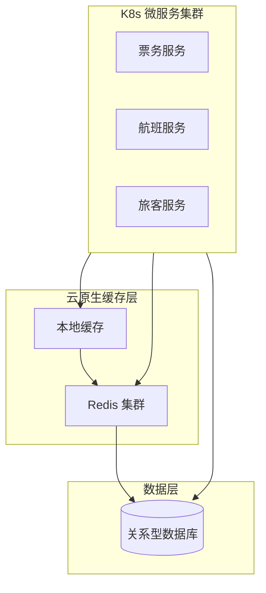

## 1.摘要（字数要求严格限制300字）
2024年3月，我参与某航空公司运营智能管理平台建设，项目面向航空运营机构、机场、旅客等用户，提供航空信息管理、旅客全流程服务、票务交易、航空检修预警、数据智能分析等核心业务功能。项目中，我担任系统架构师，全面负责平台架构设计与核心技术落地。本文围绕云原生缓存技术在航空运营场景中的应用展开论述，通过构建多级分布式缓存架构与热点数据缓存策略降低数据库压力、提升响应速度，基于缓存与数据库一致性及失效策略保障数据准确与实时性，结合缓存高可用与弹性扩展能力支撑高并发与故障自愈。系统于2025年8月正式上线，截至2026年5月已稳定运行10个月，各项功能及性能指标均达到预设标准，获得客户高度认可。

## 2.项目背景（字数要求严格限制500字左右）
随着国家智慧民航建设战略深入推进，航空运输行业数字化、智能化转型迫在眉睫，《智慧民航建设路线图》等政策明确要求推动航空运营全流程数字化、智能化升级。在此背景下，某航空公司于2024年5月启动航空运营智能管理平台建设，旨在构建覆盖全部航线网络、近百个运营基地及数千万常旅客的数字化管理平台，实现航线、航班、票务等核心业务全流程智能管控，同时为每年超3000万旅客提供全场景便捷服务，提升运营效率与服务体验。

我司中标后，我以系统架构师身份负责平台整体架构设计与核心技术落地。平台面临突出业务挑战：节假日高峰日均数十万用户集中办理票务，航班查询、票价查询、座位库存、旅客会话等读多写少场景对数据库造成巨大压力；突发航班变动时访问量激增，若热点数据全部直打数据库则响应变慢甚至雪崩。传统单机缓存难以满足分布式微服务与高可用要求，因此我们引入云原生分布式缓存技术，通过多级缓存、一致性策略与高可用架构，保障高并发下响应时间≤800ms、系统可用性≥99.99%。

为此，我们团队决定基于云原生缓存技术，采用 Redis 集群、本地缓存与多级缓存策略，结合 Cache-Aside 与失效更新机制保障缓存与数据库一致，并依托容器化部署与主从/集群模式实现缓存层高可用与弹性扩展。平台于2025年8月正式上线，成功应对多轮节假日高并发压力，高效完成年度航班调度、设备检修预警及海量数据处理任务，为旅客提供全流程服务与7*24小时信息支持，上线一年稳定运行，各项指标达标，获得客户与用户一致认可。

## 3. 问题2回应+过度（字数要求严格限制400字）
由于本项目票务查询、航班信息、票价与库存等读请求占比高且存在明显热点，若全部直连数据库则在高并发下易出现连接耗尽、响应延迟甚至宕机；同时多微服务、多实例下若缺乏统一缓存策略，则数据不一致、缓存穿透与雪崩风险难以管控。因此我们选用云原生缓存技术作为高并发场景下的核心支撑，其核心包括：第一，构建多级分布式缓存架构与热点数据缓存策略，将航班、票价、库存、会话等热点数据前置到 Redis 及本地缓存，显著降低数据库压力并提升响应速度；第二，落实缓存与数据库一致性及失效策略，通过 Cache-Aside、过期时间与更新失效、双写一致性等手段保障数据准确与实时性；第三，实现缓存层高可用与弹性扩展，依托 Redis 主从/集群与 K8s 部署，支持故障转移与弹性扩缩，并在缓存不可用时降级至数据库保障业务连续。

在本项目的实施中，我们通过多级缓存与热点策略、缓存与数据库一致性及失效策略、缓存高可用与弹性扩展三大实践，完成了云原生缓存技术在航空运营智能管理平台中的建设与落地，具体如下。

## 4. 正文部分三段论

### 正文三论点总览表

| 论点 | 要解决的问题 | 方案 / 技术栈 | 核心成效 |
|------|--------------|----------------|----------|
| **论点一：多级分布式缓存与热点策略** | 读多写少、热点集中导致数据库压力大、响应慢 | Redis 集群 + 本地缓存（Caffeine/Guava），航班/票价/库存/会话 Key 设计、TTL 与预热 | 热点请求命中率≥90%，核心查询响应≤100ms，数据库 QPS 降低约 60% |
| **论点二：缓存与数据库一致性及失效策略** | 缓存与库数据不一致、脏读与过期失效引发业务错误 | Cache-Aside、先更新库再删缓存、过期时间与版本号、防穿透/击穿/雪崩 | 关键业务数据一致、缓存失效可预期，无大面积雪崩 |
| **论点三：缓存高可用与弹性扩展** | 单点故障、容量固定无法应对峰值 | Redis 主从/哨兵/集群、K8s 部署与 HPA、多级降级与熔断 | 缓存可用性 99.9%+，峰值可弹性扩展，故障时自动降级 |

## 多级分布式缓存架构与热点数据缓存策略（字数要求严格限制在500-510字左右）
航空运营平台中航班信息、票价、座位库存、旅客会话等数据读多写少且存在明显热点：热门航线、热门时段查询集中，若全部由数据库承载则连接数与 IO 压力剧增，高峰期响应时间难以满足≤1秒的体验要求。为此，我们构建了多级分布式缓存架构。第一级采用 Redis 集群作为共享缓存，按业务域设计 Key 规范（如 flight:航线:日期、price:航班:舱位、stock:航班:舱位、session:用户ID），对航班列表、票价、库存等设置合理 TTL，并在低峰期对次日热门航班数据进行预热，避免高峰瞬时击穿。第二级在应用实例内引入本地缓存（如 Caffeine），对极热数据（如当前页航班列表、用户会话）做短 TTL 缓存，进一步降低 Redis 网络往返与序列化开销。多级策略上，请求优先查本地缓存，未命中再查 Redis，仍未命中再查数据库并回填缓存。通过多级缓存与热点策略，热点请求缓存命中率≥90%，核心查询响应时间从数百毫秒降至百毫秒以内，数据库 QPS 降低约 60%，为票务高峰与数据可视化等高并发场景提供了稳定、低延迟的数据访问能力。

## 缓存与数据库一致性及失效策略（字数要求严格限制在500-510字左右）
引入缓存后，若更新数据库后未同步失效或更新缓存，则会出现脏读；若缓存集中过期或大量 Key 同时失效，则请求瞬间打满数据库引发雪崩；若恶意请求不存在的 Key 则可能造成穿透。为此，我们落实了缓存与数据库一致性及失效策略。一致性方面，采用 Cache-Aside 模式：读时先查缓存，未命中再查库并回填；写时先更新数据库，成功后删除对应缓存（或异步更新缓存），确保下次读时从库加载最新数据。对库存、票价等强一致场景，设置较短 TTL 并配合版本号或延迟双删，减少不一致窗口。失效策略方面，对热点 Key 设置随机过期时间偏移，避免同一批 Key 同时失效；对单点热点采用互斥锁或逻辑过期方式防止击穿；对不存在的 Key 做空值缓存或布隆过滤器，防止穿透。通过上述策略，关键业务在缓存场景下仍能保障数据准确与可接受的实时性，未发生因缓存导致的大面积数据错误或雪崩，为高并发下的数据安全与用户体验提供了保障。

## 缓存高可用与弹性扩展（字数要求严格限制在500-510字左右）
缓存作为核心数据访问层，一旦单点故障或容量不足将导致全站响应恶化甚至不可用。为此，我们实现了缓存层的高可用与弹性扩展。高可用方面，采用 Redis 主从复制与哨兵（或集群模式）实现自动故障转移，主节点宕机时从节点晋升，业务侧通过客户端或代理（如 Redis Cluster）无感切换。部署上，将 Redis 以 StatefulSet 或 Operator 方式部署于 Kubernetes，与业务 Pod 同集群或独立缓存集群，便于统一管控与网络隔离。弹性扩展方面，对 Redis 集群按槽位扩容，应对数据量增长；在 K8s 内可根据内存与连接数指标对缓存节点做水平扩展。降级方面，在缓存客户端实现熔断与降级：当 Redis 超时或不可达时，自动降级为直连数据库并限流，避免缓存抖动拖垮数据库；同时通过监控与告警及时发现缓存故障并处理。通过高可用与弹性扩展，缓存层可用性达 99.9% 以上，峰值时段可弹性应对 5500 TPS 及以上请求，故障时能在秒级完成切换或降级，为系统整体可用性 99.993% 提供了有力支撑。

## 5. 论文总结（字数要求严格限制450字以内）
本平台响应智慧民航建设政策，以云原生缓存技术（多级缓存与热点策略、缓存与数据库一致性及失效策略、缓存高可用与弹性扩展）为核心，构建航空运营全流程一体化管理体系，2025年8月上线后稳定运行一年，超额达成预期目标。上线以来，系统日均处理票务交易超12万笔，核心业务响应时间≤800毫秒，运营效率提升35%，旅客投诉率下降40%，设备故障预警准确率92%，系统可用性达99.993%，峰值处理能力突破5500 TPS，成功应对节假日高并发压力，获行业与旅客广泛认可。云原生缓存有效降低了数据库压力、提升了响应速度，并保障了高可用与数据一致性。项目复盘发现架构存在不足：一是高并发叠加场景下，微服务间同步通信偶有延迟，跨模块数据同步耗时增加；二是各模块资源占用不均。后续将引入异步通信与消息队列、智能资源调度与缓存预热策略优化，持续深化技术融合，助力智慧民航高质量发展。

## 6. 系统架构图

**图 11-1** 航空运营智能管理平台·缓存技术应用 架构图
