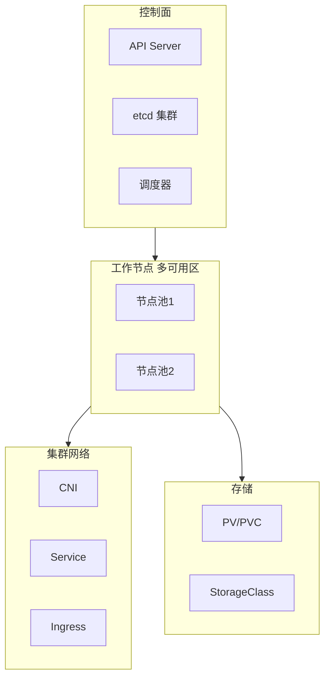

## 1.摘要（字数要求严格限制300字）
2024年3月，我参与某航空公司运营智能管理平台建设，项目面向航空运营机构、机场、旅客等用户，提供航空信息管理、旅客全流程服务、票务交易、航空检修预警、数据智能分析等核心业务功能。项目中，我担任系统架构师，全面负责平台架构设计与核心技术落地。本文围绕云原生集群技术在航空运营场景中的应用展开论述，通过集群架构与高可用设计保障控制面与数据面稳定、消除单点故障，基于集群调度与资源管理实现负载均衡与弹性扩缩，结合集群网络与存储满足服务发现、流量暴露与持久化需求。系统于2025年8月正式上线，截至2026年5月已稳定运行10个月，各项功能及性能指标均达到预设标准，获得客户高度认可。

## 2.项目背景（字数要求严格限制500字左右）
随着国家智慧民航建设战略深入推进，航空运输行业数字化、智能化转型迫在眉睫，《智慧民航建设路线图》等政策明确要求推动航空运营全流程数字化、智能化升级。在此背景下，某航空公司于2024年5月启动航空运营智能管理平台建设，旨在构建覆盖全部航线网络、近百个运营基地及数千万常旅客的数字化管理平台，实现航线、航班、票务等核心业务全流程智能管控，同时为每年超3000万旅客提供全场景便捷服务，提升运营效率与服务体验。

我司中标后，我以系统架构师身份负责平台整体架构设计与核心技术落地。平台数十个微服务均运行于 Kubernetes 集群之上，若集群控制面单点或网络、存储不可靠，则整站稳定性无从谈起；节假日高峰与突发航班变动时需集群能快速调度与扩容，且需保障服务发现、对外暴露与有状态数据的持久化。因此我们系统应用云原生集群技术，从集群架构高可用、调度与资源管理、网络与存储三方面构建稳定、可扩展的集群底座。

为此，我们团队决定基于云原生集群技术，采用多 Master 与 etcd 集群、多可用区部署、调度器与资源配额、节点池与 Cluster Autoscaler、CNI 网络与 Service/Ingress、PV/PVC 与 StorageClass，构建高可用、可调度、网络与存储完备的 Kubernetes 集群。平台于2025年8月正式上线，成功应对多轮节假日高并发压力，高效完成年度航班调度、设备检修预警及海量数据处理任务，为旅客提供全流程服务与7*24小时信息支持，上线一年稳定运行，各项指标达标，获得客户与用户一致认可。

## 3. 问题2回应+过度（字数要求严格限制400字）
由于本项目全部业务依赖 Kubernetes 集群承载，若控制面或 etcd 单点故障则集群不可用；若调度与资源管理薄弱则 Pod 无法合理分布、资源不足时无法自动扩容节点；若网络与存储不完善则服务无法互通、有状态数据难以持久化。因此我们选用云原生集群技术作为平台基础设施的核心，其核心包括：第一，集群架构与高可用设计，通过多 Master、etcd 集群与多可用区部署，保障控制面与数据面稳定、消除单点故障；第二，集群调度与资源管理，通过调度器、资源配额与限制、节点池与 Cluster Autoscaler 实现负载均衡与弹性扩缩；第三，集群网络与存储，通过 CNI 网络、Service 与 Ingress、PV/PVC 与 StorageClass 满足服务发现、流量暴露与持久化需求。

在本项目的实施中，我们通过集群架构与高可用、集群调度与资源管理、集群网络与存储三大实践，完成了云原生集群技术在航空运营智能管理平台中的建设与落地，具体如下。

## 4. 正文部分三段论

### 正文三论点总览表

| 论点 | 要解决的问题 | 方案 / 技术栈 | 核心成效 |
|------|--------------|----------------|----------|
| **论点一：集群架构与高可用** | 控制面单点、etcd 与节点故障导致整站不可用 | 多 Master、etcd 集群、多可用区、控制面与数据面分离 | 控制面与 etcd 无单点，集群可用性 99.9%+ |
| **论点二：集群调度与资源管理** | Pod 分布不均、资源不足时无法自动扩节点 | 调度器、request/limit、节点池、亲和/反亲和、Cluster Autoscaler | 负载均衡、节点分钟级扩容、资源利用率提升 |
| **论点三：集群网络与存储** | 服务发现、对外暴露、有状态数据持久化 | CNI、Service/Ingress、PV/PVC、StorageClass | 服务互通、流量暴露、数据持久化与可扩展 |

## 集群架构与高可用设计（字数要求严格限制在500-510字左右）
航空运营平台全部微服务运行于 Kubernetes 集群，若 API Server、etcd 或调度器单点故障，则集群无法接受新请求或无法调度 Pod，将导致业务不可用；若工作节点集中在同一可用区，则可用区级故障将导致大面积中断。为此，我们构建了高可用的集群架构。控制面方面，采用多 Master 架构，API Server、Controller Manager、Scheduler 均以多副本方式部署，通过负载均衡将管理请求分发到多个 Master 节点，单节点故障时其余节点继续提供服务。etcd 作为集群元数据存储，采用独立 etcd 集群（通常 3 或 5 节点），使用 Raft 协议保证数据一致与高可用，单节点或少数节点故障不影响集群可用性。工作节点按多可用区分布，将票务、旅客、数据服务等 Pod 通过 Pod 反亲和与拓扑分布约束分散到不同可用区，避免单可用区故障导致核心业务全挂。控制面与数据面分离，Master 节点仅运行控制组件，业务 Pod 仅调度到 Worker 节点，避免业务负载影响控制面稳定性。通过集群架构与高可用设计，控制面与 etcd 无单点，集群整体可用性达 99.9% 以上，为上层应用 99.993% 可用性提供了坚实的集群底座。

## 集群调度与资源管理（字数要求严格限制在500-510字左右）
数十个微服务、数百个 Pod 若集中调度到少量节点则热点突出、资源争用；若资源不足时无法自动增加节点则新 Pod 长期 Pending，影响扩容与发布。为此，我们落实了集群调度与资源管理。调度方面，为各工作负载配置合理的 resource request 与 limit，调度器按 request 进行资源预留与 Bin-pack 调度，使节点资源利用率均衡；对核心服务配置 Pod 反亲和，使同一 Deployment 的副本尽量分布到不同节点与可用区，提升可用性。节点管理方面，按业务类型划分节点池（如通用业务池、大数据任务池），通过污点与容忍度将不同负载调度到对应节点池，避免互相干扰。弹性方面，启用 Cluster Autoscaler，当因资源不足导致 Pod 无法调度时自动扩容节点，当节点空闲且无不可调度 Pod 时自动缩容，实现集群容量随负载动态调整。通过调度与资源管理，Pod 分布均衡、资源利用率提升，票务高峰时节点可在分钟级完成扩容以支撑 5500 TPS 及以上压力，为高并发与成本优化提供了调度保障。

## 集群网络与存储（字数要求严格限制在500-510字左右）
集群内多服务需通过服务名互相访问，对外需统一暴露 API；有状态服务（如数据库、缓存、消息队列）及部分业务需持久化存储，若网络与存储不完善则服务无法互通、数据无法落盘。为此，我们建设了集群网络与存储能力。网络方面，采用成熟 CNI 插件（如 Calico、Flannel）为 Pod 分配 IP、实现跨节点互通，并支持网络策略实现 Pod 间访问控制。服务发现与暴露方面，Kubernetes Service 为每组 Pod 提供稳定 ClusterIP 与 DNS 名称，集群内通过服务名访问；对外通过 Ingress 或 LoadBalancer 将流量引入集群，实现统一入口与路由。存储方面，为有状态工作负载提供 PV（持久卷）与 PVC（持久卷声明），通过 StorageClass 实现按需动态供给（如云盘、NFS），保障数据持久化与跨 Pod 重启不丢失。通过集群网络与存储，微服务间可稳定互通、对外流量可统一暴露、有状态数据可持久化并可随存储类扩展，为航空运营平台的多模块协同与数据可靠性提供了网络与存储保障。

## 5. 论文总结（字数要求严格限制450字以内）
本平台响应智慧民航建设政策，以云原生集群技术（集群架构与高可用、集群调度与资源管理、集群网络与存储）为核心，构建航空运营全流程一体化管理体系，2025年8月上线后稳定运行一年，超额达成预期目标。上线以来，系统日均处理票务交易超12万笔，核心业务响应时间≤800毫秒，运营效率提升35%，旅客投诉率下降40%，设备故障预警准确率92%，系统可用性达99.993%，峰值处理能力突破5500 TPS，成功应对节假日高并发压力，获行业与旅客广泛认可。云原生集群有效保障了控制面与数据面高可用、调度与资源弹性、网络与存储完备，为整体可用性与弹性扩展提供了集群底座。项目复盘发现架构存在不足：一是高并发叠加场景下，微服务间同步通信偶有延迟；二是各模块资源占用不均。后续将引入异步通信与消息队列、智能调度与更细粒度资源画像，持续深化云原生集群能力，助力智慧民航高质量发展。

## 6. 系统架构图

**图 15-1** 航空运营智能管理平台·集群技术应用 架构图
