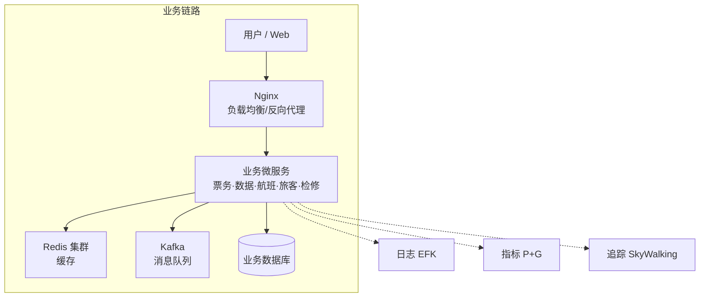

# 云原生可观测性设计与实践——航空运营智能管理平台建设

---

## 背诵脉络 · 核心内容框架

> 便于记忆与背诵的提纲，按「总—背景—问题—三论点—总结」串联全文。

### 一、一句话定调
- **主题**：云原生可观测性设计与实践  
- **项目**：航空运营智能管理平台 | **角色**：系统架构师 | **时间**：2024年3月参与 → 2025年8月上线 → 2026年5月已稳定运行10个月  

### 二、摘要骨架（约300字）
- **背景句**：2024年3月参与建设，面向航空机构/机场/旅客，提供信息管理、旅客服务、票务、检修预警、数据智能分析等。
- **本文围绕**：云原生可观测性设计与实践。
- **三论点**：① 集中统一日志体系 → 全链路追踪与审计追溯；② 多层次指标监控与告警 → 实时健康状态；③ 分布式追踪与精细化可视化 → 复杂场景溯源能力。
- **收尾**：2025年8月上线，至2026年5月稳定运行10个月，指标达标，客户认可。

### 三、项目背景要点（约500字）
- **政策**：智慧民航建设、《智慧民航建设路线图》→ 全流程数字化、智能化。
- **目标**：覆盖全部航线、近百基地、数千万常旅客，年服务超3000万旅客。
- **挑战**：节假日数十万用户集中票务、突发航班变动访问激增、日均800GB实时数据、年度10PB+离线数据。
- **技术选型**：云原生可观测性 → 日志、指标、追踪（LMT）→ 集中式日志 + 多层次指标告警 + 分布式追踪 → 全链路可观测、故障快定位、性能可分析。

### 四、问题回应与过渡（约400字）
- **为什么需要可观测性**：微服务、模块多、链路复杂（票务→数据同步→航班校验→旅客核验→通知→检修），高并发+海量数据 → 故障定位、性能分析、运维响应要求高。
- **三个核心**：① 日志体系 → 全链路追踪与审计、跨服务排查与合规；② 指标告警 → 基础设施/服务/业务实时健康、7×24 稳定与快响应；③ 分布式追踪与可视化 → 请求链路溯源与性能瓶颈分析。
- **过渡句**：通过集中式日志管理、指标监控告警、分布式追踪可视化，完成可观测性架构落地，具体如下。

### 五、正文三段论（每段约500–510字）

| 论点 | 问题 | 方案/技术栈 | 核心成效 |
|------|------|--------------|----------|
| **论点一** 集中统一日志体系 | 日志分散，多服务协同难串联；票务/权限等需审计合规 | EFK：Fluentd(DaemonSet) 采集+结构化+Trace/Span ID → ES 存储索引 → Kibana 查询与审计日志≥1年 | 故障定位 60分钟→5分钟内 |
| **论点二** 多层次指标监控与告警 | 高并发与800GB/日数据下需实时感知资源与服务健康 | Prometheus+Grafana：基础设施(Node/cAdvisor)→服务(QPS/延迟/错误率/SLO)→业务(票务量/订单成功率/流式延迟)；Alertmanager 告警 | 7×24 监控与快响应，保障≤1s响应、≥5000 TPS、≥99.99%可用性 |
| **论点三** 分布式追踪与可视化 | 多模块联动链路长，单次请求完整调用链难还原 | SkyWalking：Agent 埋点、Trace ID 透传、OAP 聚合、UI 按 Trace/服务/接口查询与调用树展示 | 从「猜测式排查」到「链路驱动分析」，溯源与瓶颈分析能力提升 |

### 六、总结要点（约450字以内）
- **定位**：以云原生可观测性（日志、指标、追踪）为核心，航空运营全流程一体化管理。
- **成效数据**：日均票务超12万笔、响应≤800ms、效率↑35%、投诉↓40%、故障预警准确率92%、可用性99.993%、峰值5500+ TPS。
- **不足**：同步通信偶发延迟、跨模块数据同步耗时；资源占用不均（辅助服务利用率低、核心高峰紧张）。
- **后续**：异步+消息队列重构通信；智能资源调度+AI 容器动态分配，深化可观测性与业务、运维融合。

---

## 1. 摘要（字数要求严格限制300字）

2024年3月，我参与某航空公司运营智能管理平台建设，项目面向航空运营机构、机场、旅客等用户，提供航空信息管理、旅客全流程服务、票务交易、航空检修预警、数据智能分析等核心业务功能。项目中，我担任系统架构师，全面负责平台架构设计与核心技术落地。本文围绕**云原生可观测性设计与实践**展开论述，通过**构建集中统一的日志管理体系，实现全链路追踪定位与审计追溯**，基于**多层次指标监控与告警系统，保障系统实时健康状态**，结合**分布式追踪与精细化可视化，提升复杂业务场景溯源能力**。系统于2025年8月正式上线，截至2026年5月已稳定运行10个月，各项功能及性能指标均达到预设标准，获得客户高度认可。

---

## 2. 项目背景（字数要求严格限制500字左右）

随着国家智慧民航建设战略深入推进，航空运输行业数字化、智能化转型迫在眉睫，《智慧民航建设路线图》等政策明确要求推动航空运营全流程数字化、智能化升级。在此背景下，某航空公司于2024年5月启动航空运营智能管理平台建设，旨在构建覆盖全部航线网络、近百个运营基地及数千万常旅客的数字化管理平台，实现航线、航班、票务等核心业务全流程智能管控，同时为每年超3000万旅客提供全场景便捷服务，提升运营效率与服务体验。

我司中标后，我以系统架构师身份负责平台整体架构设计与核心技术落地。平台面临突出业务挑战：节假日高峰日均数十万用户集中办理票务，突发航班变动时访问量激增，且需日均处理800GB实时数据、年度累计处理10PB+离线数据，对资源弹性调度、数据处理效率及系统稳定性、安全性提出极高要求。

为此，我们团队决定基于**云原生可观测性**架构，**以日志、指标、追踪（Logging、Metrics、Tracing）为核心，构建集中式日志管理、多层次指标监控告警与分布式追踪体系，实现全链路可观测、故障快速定位与性能瓶颈分析，保障高并发与多模块联动场景下系统透明可控、稳定运行**。平台于2025年8月正式上线，成功应对多轮节假日高并发压力，高效完成年度航班调度、设备检修预警及海量数据处理任务，为旅客提供全流程服务与7×24小时信息支持，上线后稳定运行，各项指标达标，获得客户与用户一致认可。

---

## 3. 问题回应与过渡（字数要求严格限制400字）

由于本项目**采用云原生微服务架构，模块众多、链路复杂，票务购票、数据同步、航班校验、旅客核验、通知推送等多模块联动，且高并发与海量实时数据对故障定位、性能分析与运维响应提出极高要求**，**故选用云原生可观测性设计与实践**，其核心包括：第一，**构建集中统一的日志管理体系，实现全链路追踪定位与审计追溯，支撑跨服务故障排查与合规审计**；第二，**构建多层次指标监控与告警系统，保障基础设施、服务与业务层实时健康状态，支撑7×24小时稳定运行与快速响应**；第三，**引入分布式追踪与精细化可视化，提升复杂业务场景下请求链路溯源与性能瓶颈分析能力**。

在本项目的实施中，我们通过**集中式日志管理、指标监控告警与分布式追踪可视化**，完成了**云原生可观测性**架构的建设与落地，具体实践如下：

---

## 4. 正文部分三段论

### 论点一：构建集中统一的日志管理体系，实现全链路追踪定位与审计追溯（字数要求严格限制在500-510字左右）

航空运营智能管理平台采用云原生微服务架构，涵盖航空信息管理、旅客管理、票务管理、航空检修、数据服务及辅助管理等多模块，业务链路涉及票务下单、数据同步、航班运力校验、旅客信息核验、通知推送及检修预警等多服务协同。若日志分散在各节点与容器内，故障发生时难以快速串联完整请求路径，且票务交易、权限变更等关键操作需满足审计与合规要求，传统分散式日志方式无法满足全链路追踪与审计追溯需求。

为此，我们设计了基于 EFK（Elasticsearch、Fluentd、Kibana）的集中式日志管理方案。Fluentd 以 DaemonSet 方式部署在各节点，统一采集应用日志、访问日志及审计日志，对日志进行结构化解析与标准化，并注入 Trace ID、Span ID 等追踪标识，实现与分布式追踪体系的关联；日志经缓冲与批量写入 Elasticsearch，按时间与业务维度建立索引，支持全文检索与聚合分析；Kibana 提供统一查询、可视化与仪表盘，运维与开发人员可按请求 ID、服务名、时间范围快速检索日志，结合 Trace ID 实现从前端请求到后端多服务的全链路串联。同时，对票务交易、数据修改、权限变更等关键操作实施专项审计日志采集与长期保留（≥1年），满足民航合规与安全审计要求。

实践表明，集中式日志管理体系将跨多服务的故障定位时间从原先的约60分钟缩短至5分钟以内，审计追溯与合规查询效率显著提升，为平台稳定运行与安全合规提供了坚实基础。

---

### 论点二：构建多层次指标监控与告警系统，保障实时健康状态（字数要求严格限制在500-510字左右）

平台需应对节假日数十万用户集中购票、突发航班变动引发的访问激增，以及日均800GB实时数据采集与处理，对系统资源、服务健康与业务关键指标的实时感知与告警提出了明确要求。若缺乏统一、多层次的指标体系，难以在压力攀升或异常出现时及时发现问题并触发处置，无法保障核心业务响应时间≤1秒、峰值处理能力≥5000 TPS 及可用性≥99.99% 等目标。

我们基于 Prometheus + Grafana 构建了多层次指标监控与告警体系。基础设施层：通过 Node Exporter、cAdvisor 等采集主机 CPU、内存、磁盘、网络及容器资源使用率，实时掌握资源水位与扩容需求。服务层：各微服务暴露 Prometheus 指标端点，采集请求 QPS、延迟分位数、错误率、线程池与连接池状态等，并定义 SLO 与告警规则，当响应时间或错误率超过阈值时自动告警。业务层：针对票务交易量、订单成功率、实时数据接入量、流式计算延迟、设备异常告警数量等业务指标进行采集与聚合，在 Grafana 中配置业务大盘与实时看板，支撑运营与调度决策。

告警规则与 Prometheus Alertmanager 联动，支持按严重级别、业务模块分组与抑制，并对接企业通知渠道，实现 7×24 小时实时监控与快速响应。上线以来，系统在票务高峰与突发航班变动场景下均能提前发现资源与性能异常并触发扩容与优化，有效保障了实时健康状态与高可用目标达成。

---

### 论点三：引入分布式追踪与精细化可视化，提升复杂业务场景溯源能力（字数要求严格限制在500-510字左右）

平台多模块联动业务链路长、调用关系复杂，例如旅客购票需经过票务管理、数据服务、航空信息管理、旅客管理、通知公告及航空检修等模块的多次调用与数据同步。传统依赖日志与单点监控的方式难以还原单次请求的完整调用链，无法精确定位延迟或异常发生在哪一环节，在高并发与海量数据场景下性能瓶颈分析与故障溯源能力不足。

我们引入了基于 SkyWalking 的分布式追踪系统。各微服务集成 SkyWalking Agent，自动对 HTTP、RPC、消息队列及数据库等调用进行埋点，为每个请求生成全链路唯一的 Trace ID，并在服务间透传，形成完整的调用树。SkyWalking OAP 负责接收、聚合与分析追踪数据，存储链路拓扑、服务依赖与跨度（Span）明细；UI 提供按 Trace ID、服务名、接口、时间范围等维度的查询与可视化，展示单次请求的完整调用链、各节点耗时与异常信息，支持慢请求与错误请求的快速筛选与下钻分析。

通过分布式追踪与精细化可视化，运维与开发人员能够清晰看到请求在票务、数据、航班校验、旅客核验等各环节的耗时分布与依赖关系，有效识别数据库慢查询、跨服务同步延迟、单点过载等性能瓶颈，并将故障溯源从“猜测式排查”转为“链路驱动分析”，显著提升了复杂业务场景下的溯源能力与问题解决效率。

---

## 5. 论文总结（字数要求严格限制450字以内）

本平台响应智慧民航建设政策，以**云原生可观测性（日志、指标、追踪）**为核心，构建航空运营全流程一体化管理体系，2025年8月上线后稳定运行，超额达成预期目标。上线以来，系统日均处理票务交易超12万笔，核心业务响应时间≤800毫秒，运营效率提升35%，旅客投诉率下降40%，设备故障预警准确率92%，系统可用性达99.993%，峰值处理能力突破5500 TPS，成功应对节假日高并发压力，获行业与旅客广泛认可。项目复盘发现架构存在不足：一是高并发叠加场景下，微服务间同步通信偶有延迟，跨模块数据同步耗时增加；二是各模块资源占用不均，辅助服务资源利用率偏低、核心模块高峰资源紧张。后续将针对性优化：引入异步通信与消息队列技术，重构通信链路；搭建智能资源调度平台，通过 AI 算法实现容器化资源动态分配，提升资源利用率与系统抗突发能力，持续深化可观测性与业务、运维的融合，助力智慧民航高质量发展。

---

## 系统架构图

**图 1** 航空运营智能管理平台 · 云原生可观测性架构图

---
