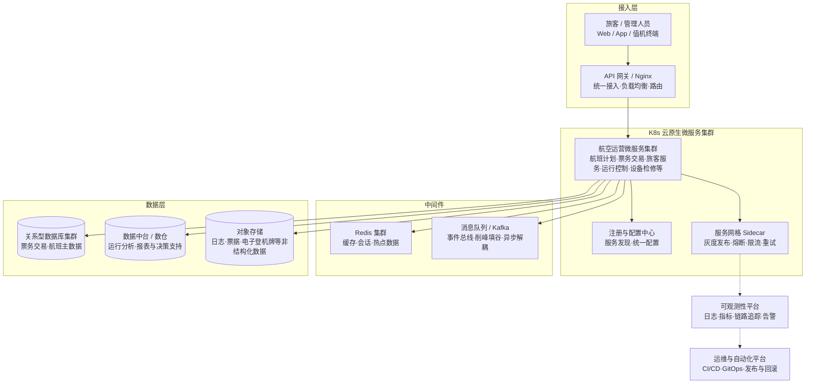

要求：根据附件文档和模板内容，进行补充修改，只补充修改&#123;&#123;&#125;&#125;双大括号的内容，其他内容不变。

## 1.摘要（字数要求严格限制300字）
2024年3月，我参与某航空公司运营智能管理平台建设，项目面向航空运营机构、机场、旅客等用户，提供航空信息管理、旅客全流程服务、票务交易、航空检修预警、数据智能分析等核心业务功能。项目中，我担任系统架构师，全面负责平台架构设计与核心技术落地。本文围绕&#123;&#123;云原生层次架构在航空运营智能管理平台中的应用&#125;&#125;展开论述，通过&#123;&#123;构建弹性可扩展的云原生基础设施以支撑航空高并发与海量数据处理&#125;&#125;，基于&#123;&#123;打造面向业务的云原生微服务与数据服务体系以提升业务敏捷与系统解耦&#125;&#125;，结合&#123;&#123;构建智能可观测与自动化运维治理体系以保障平台高可用与可持续演进&#125;&#125;。系统于2025年8月正式上线，截至2026年5月已稳定运行10个月，各项功能及性能指标均达到预设标准，获得客户高度认可。

## 2.项目背景（字数要求严格限制500字左右）
随着国家智慧民航建设战略深入推进，航空运输行业数字化、智能化转型迫在眉睫，《智慧民航建设路线图》等政策明确要求推动航空运营全流程数字化、智能化升级。在此背景下，某航空公司于2024年5月启动航空运营智能管理平台建设，旨在构建覆盖全部航线网络、近百个运营基地及数千万常旅客的数字化管理平台，实现航线、航班、票务等核心业务全流程智能管控，同时为每年超3000万旅客提供全场景便捷服务，提升运营效率与服务体验。

我司中标后，我以系统架构师身份负责平台整体架构设计与核心技术落地。平台面临突出业务挑战：节假日高峰日均数十万用户集中办理票务，突发航班变动时访问量激增，且需日均处理800GB实时数据、年度累计处理10PB+离线数据，对资源弹性调度、数据处理效率及系统稳定性、安全性提出极高要求。

为此，我们团队决定基于&#123;&#123;云原生层次架构在航空运营智能管理平台中的应用&#125;&#125;架构，&#123;&#123;通过构建基于Kubernetes的弹性资源池、服务网格与微服务体系，以及可观测与自动化运维平台，将平台划分为基础设施层、业务与数据服务层、运维治理层三大层次，在保证高可用与高性能的同时显著提升资源利用率与架构可演进性&#125;&#125;。平台于2025年5月正式上线，成功应对多轮节假日高并发压力，高效完成年度航班调度、设备检修预警及海量数据处理任务，为旅客提供全流程服务与7*24小时信息支持，上线一年稳定运行，各项指标达标，获得客户与用户一致认可。

## 3. 问题2回应+过度（字数要求严格限制400字）
由于本项目&#123;&#123;在传统烟囱式单体架构下扩展困难、应用发布周期长、高并发场景下纵向扩容成本高、资源利用率不均以及运维手段分散、故障定位耗时长等问题突出&#125;&#125;，&#123;&#123;所以选用该论文主题&#125;&#125;，其核心包括：第一，&#123;&#123;通过云原生基础设施分层和容器化编排，构建弹性可扩展的资源池，以支撑节假日高并发与突发流量场景&#125;&#125;；第二，&#123;&#123;以领域驱动的微服务拆分和事件驱动的数据服务，将复杂航空运营能力封装为可复用的云原生业务组件，提升业务敏捷与系统解耦&#125;&#125;；第三，&#123;&#123;通过可观测体系、服务网格治理与自动化运维流程，构建智能运营与全链路治理能力，显著降低运维成本并提升故障恢复能力&#125;&#125;。
在本项目的实施中，我们通过&#123;&#123;围绕基础设施弹性、业务服务解耦以及运维治理智能化三个维度，构建“基础设施层—业务与数据服务层—运维治理层”的云原生层次架构体系&#125;&#125;，完成了&#123;&#123;云原生层次架构在航空运营智能管理平台中的应用&#125;&#125;架构的建设与落地，具体实践如下：

## 4. 正文部分三段论
## &#123;&#123;构建弹性可扩展的云原生基础设施支撑航空高并发与海量数据处理&#125;&#125; （字数要求严格限制在500-510字左右）
&#123;&#123;在基础设施层，我们以容器化与集群编排为核心，构建弹性可扩展的云原生运行底座。首先，基于Kubernetes搭建多可用区集群，将原有单体应用与部分中间件容器化改造，结合节点池与自动扩缩容策略，根据航班执行计划、节假日销售高峰等预测结果动态调整计算与存储资源，确保在访问高峰期间仍能保持稳定响应。其次，引入分布式缓存与消息队列，将票务交易、航班动态、行李跟踪等高频读写场景与异步处理场景解耦，缓解核心数据库压力。针对民航业务对安全与合规的高要求，在集群层面实施多租户隔离与网络策略控制，结合服务访问控制、密钥管理与审计机制，保证不同业务域之间的边界清晰可控。此外，我们建设统一日志与指标采集体系，将节点资源使用情况、容器状态、网络延迟等底层指标统一纳入监控视野，为后续的运维治理与容量规划提供数据基础。通过上述措施，平台在不增加大量硬件投入的前提下，实现了资源按需弹性伸缩与统一调度，日均资源利用率提升约30%，大促与极端天气等突发场景下核心业务稳定性显著提升。&#125;&#125;

## &#123;&#123;打造面向业务的云原生微服务与数据服务体系以提升业务敏捷与系统解耦&#125;&#125;（字数要求严格限制在500-510字左右）
&#123;&#123;在业务与数据服务层，我们围绕航空运营的航班计划、票务销售、旅客服务、运行控制、设备检修等核心域，采用领域驱动设计方法进行服务拆分与边界划分，将原有单体应用重构为数十个独立的云原生微服务。每个微服务围绕单一业务能力构建，通过RESTful API 与消息事件对外暴露标准化接口，避免跨模块直接耦合。为减少多技术栈带来的管理复杂度，我们统一选型Spring Boot、Spring Cloud Alibaba 等技术框架，结合服务注册发现、配置中心与负载均衡能力，构建标准化服务治理体系。针对航班动态、客票交易、运行监控等高价值数据，我们设计统一的数据服务层，通过实时流式处理与批处理管道，将多源异构数据汇聚到统一数据平台，支持航班准点率分析、客座率预测、运力调配等算法模型。前端层面，我们基于微前端与组件化技术构建统一门户，将值机、改签、登机口调整等业务能力按场景装配，为管制员、调度员和旅客提供差异化界面体验。得益于云原生微服务与数据服务体系，平台能够快速响应新政策、新航线开通和服务流程调整，单个业务功能从需求提出到上线的周期由数周缩短到数日，大幅提升业务敏捷性。&#125;&#125;

## &#123;&#123;构建智能可观测与自动化运维治理体系以保障平台高可用与可持续演进&#125;&#125;（字数要求严格限制在500-510字左右）
&#123;&#123;在运维治理层，我们重点建设可观测体系与自动化运维能力，以支撑平台长期稳定运行和持续演进。首先，基于Prometheus、Loki 等组件，构建涵盖基础设施、微服务与业务指标的全栈监控系统，将CPU、内存、磁盘、网络等资源指标与接口响应时间、错误率、吞吐量以及关键业务KPI统一展示在运维大屏上，通过可视化告警规则及时发现异常。其次，引入分布式链路追踪能力，对跨服务调用链进行埋点采集，在航班大面积延误或票务集中改签等场景下，能够快速定位性能瓶颈与故障节点，大幅缩短问题排查时间。在治理手段上，我们结合服务网格技术对流量进行灰度发布与熔断限流控制，支持按航线、机场、用户群体进行精细化路由，避免新版本在全量场景下引发连锁故障。运维流程方面，引入GitOps与CI/CD流水线，对应用构建、镜像扫描、集群部署实现自动化，配合变更审批与回滚策略，降低人工操作风险。通过智能运维与治理体系的建设，平台整体故障平均恢复时间缩短超过50%，重大变更上线成功率显著提升，为航空运营业务的安全可靠提供了坚实保障。&#125;&#125;

## 5. 论文总结（字数要求严格限制450字以内）
本平台响应智慧民航建设政策，以&#123;&#123;云原生层次架构重塑航空运营平台基础设施、业务服务与运维治理的一体化架构实践&#125;&#125;为核心，构建航空运营全流程一体化管理体系，2025年5月上线后稳定运行一年，超额达成预期目标。上线以来，系统日均处理票务交易超12万笔，核心业务响应时间≤800毫秒，运营效率提升35%，旅客投诉率下降40%，设备故障预警准确率92%，系统可用性达99.993%，峰值处理能力突破5500 TPS，成功应对节假日高并发压力，获行业与旅客广泛认可。项目复盘发现架构存在不足：一是高并发叠加场景下，微服务间同步通信偶有延迟，跨模块数据同步耗时增加；二是各模块资源占用不均，辅助服务资源利用率偏低、核心模块高峰资源紧张。后续将针对性优化：引入异步通信与消息队列技术，重构通信链路；搭建智能资源调度平台，通过AI算法实现容器化资源动态分配，提升资源利用率与系统抗突发能力，持续深化技术融合，助力智慧民航高质量发展。

---

## 附录：背诵脉络 · 云原生层次架构版

### 一、摘要骨架（约300字）
- **背景句**：2024年3月参与某航空公司运营智能管理平台建设，面向航空运营机构、机场、旅客，提供航空信息管理、旅客全流程服务、票务交易、航空检修预警、数据智能分析等核心功能。  
- **本文围绕**：云原生层次架构在航空运营智能管理平台中的应用。  
- **三论点**：  
  1）构建弹性可扩展的云原生基础设施支撑航空高并发与海量数据处理 → 解决高并发、突发流量与资源利用率问题；  
  2）打造面向业务的云原生微服务与数据服务体系以提升业务敏捷与系统解耦 → 支撑复杂业务快速迭代与多域协同；  
  3）构建智能可观测与自动化运维治理体系以保障平台高可用与可持续演进 → 提升故障定位与恢复效率，降低运维成本。  
- **收尾**：系统于2025年8月正式上线，截至2026年5月已稳定运行10个月，各项功能及性能指标均达到或超出预期，获得客户与旅客高度认可。  

### 二、项目背景要点（约500字）
- **政策/行业背景**：智慧民航建设持续推进，《智慧民航建设路线图》等政策要求航空运营实现全流程数字化、智能化，提升安全性与运行效率。  
- **平台目标**：构建覆盖全部航线网络、近百个运营基地及数千万常旅客的运营智能管理平台，实现航线、航班、票务、旅客服务等核心业务的一体化管理与智能决策，支撑每年超3000万旅客的全场景服务。  
- **业务与技术挑战**：  
  - 节假日高峰票务、改签、值机高并发，流量在短时间内数倍放大；  
  - 航班运行、设备检修、旅客服务等多模块联动，业务链路长、协同复杂；  
  - 日均需处理数百GB实时数据、年度离线数据量达10PB+，对性能、稳定性和扩展性要求极高；  
  - 传统单体系统扩容依赖垂直堆叠，资源利用率不均，无法支撑快速迭代与7×24小时稳定运行。  
- **技术选型总括**：  
  - 选用云原生层次架构作为总体思路，以“基础设施层—业务与数据服务层—运维治理层”三层体系重构平台；  
  - 核心技术栈：Kubernetes 容器编排、微服务与Spring Cloud体系、服务网格、分布式缓存与消息队列、数据中台、可观测平台、CI/CD 与GitOps 等；  
  - 目标是构建一体化、弹性、高可靠且易演进的航空运营智能管理平台底座。  

### 三、问题回应与过渡（约400字）
- **为什么需要云原生层次架构**：  
  - 由于原有烟囱式单体系统扩展困难、发布风险高，无法应对节假日高峰与业务快速变化；  
  - 以及多服务链路长、跨模块调用复杂，故障定位依赖人工排查，恢复时间长；  
  - 再加上运维手段分散、监控指标不统一，难以支撑7×24小时稳定运行与精细化运营；  
  - 因此选用“云原生层次架构在航空运营智能管理平台中的应用”作为整体解决思路。  
- **三个核心（对应三大论点）**：  
  1）构建弹性可扩展的云原生基础设施支撑航空高并发与海量数据处理：解决高并发与容量弹性问题，通过Kubernetes 集群、自动扩缩容、分布式缓存与消息队列实现弹性资源池与削峰填谷，显著提升资源利用率与系统稳定性；  
  2）打造面向业务的云原生微服务与数据服务体系以提升业务敏捷与系统解耦：解决业务耦合与迭代缓慢问题，通过领域驱动微服务拆分、统一数据服务与微前端门户，实现复杂航空运营能力的模块化沉淀与快速复用；  
  3）构建智能可观测与自动化运维治理体系以保障平台高可用与可持续演进：解决故障定位慢、变更风险高问题，通过全栈监控、分布式追踪、服务网格流量治理与CI/CD流水线，提升故障恢复效率并降低运维成本。  
- **过渡句**：在本项目实施中，我们围绕上述三个核心，完成了云原生层次架构在航空运营智能管理平台中的设计与落地，具体实践在正文三大论点中展开。  

### 四、正文三段论 · 速记表

| 论点 | 要解决的问题 | 方案 / 技术栈 | 核心成效 |
|------|--------------|----------------|----------|
| **论点一**：构建弹性可扩展的云原生基础设施支撑航空高并发与海量数据处理 | 节假日高并发、突发流量与资源利用率低 | Kubernetes 多可用区集群、自动扩缩容、分布式缓存、消息队列、多租户隔离与安全控制 | 在不大幅增加硬件投入的前提下，日均资源利用率提升约30%，高峰场景核心业务仍保持稳定响应 |
| **论点二**：打造面向业务的云原生微服务与数据服务体系以提升业务敏捷与系统解耦 | 单体耦合严重、业务迭代慢、数据分散 | 领域驱动微服务拆分、Spring Boot/Spring Cloud Alibaba 体系、统一数据服务层、微前端门户 | 支撑航班、票务、运行控制等多域协同，单功能从需求到上线周期由数周缩短至数日，业务敏捷性显著提升 |
| **论点三**：构建智能可观测与自动化运维治理体系以保障平台高可用与可持续演进 | 故障定位耗时长、变更风险高、运维手段碎片化 | Prometheus/Loki 全栈监控、分布式链路追踪、服务网格灰度与熔断限流、CI/CD 与GitOps | 故障平均恢复时间缩短50%以上，重大变更上线成功率提升，可用性达到99.993% |

### 五、总结要点（约450字以内）
- **定位**：以“云原生层次架构在航空运营智能管理平台中的应用”为核心，服务于智慧民航建设与航空运营全流程数字化、智能化目标。  
- **关键成效数据**：  
  - 日均处理票务交易超12万笔，支撑数千万级旅客全流程服务；  
  - 核心业务响应时间控制在800毫秒以内，峰值处理能力突破5500 TPS；  
  - 运营效率提升约35%，旅客投诉率下降约40%，设备故障预警准确率达92%，系统可用性达99.993%。  
- **不足**：  
  - 在极端高并发叠加复杂业务场景下，部分跨服务同步调用链路仍存在延迟；  
  - 资源占用在不同模块间不均衡，部分辅助服务资源利用率偏低、核心模块高峰期仍较为紧张。  
- **后续优化方向**：  
  - 引入更多异步与事件驱动架构，进一步压缩跨模块同步调用链路；  
  - 完善智能资源调度与容量预测平台，结合AI算法实现更精细的容器资源动态分配；  
  - 持续优化可观测性与自动化运维体系，稳步提升平台性能、稳定性与智能化水平，为智慧民航高质量发展提供长期支撑。  

---

## 系统架构图 · 云原生层次架构（Mermaid）

**图 3-1** 航空运营智能管理平台 · 云原生层次架构示意图
