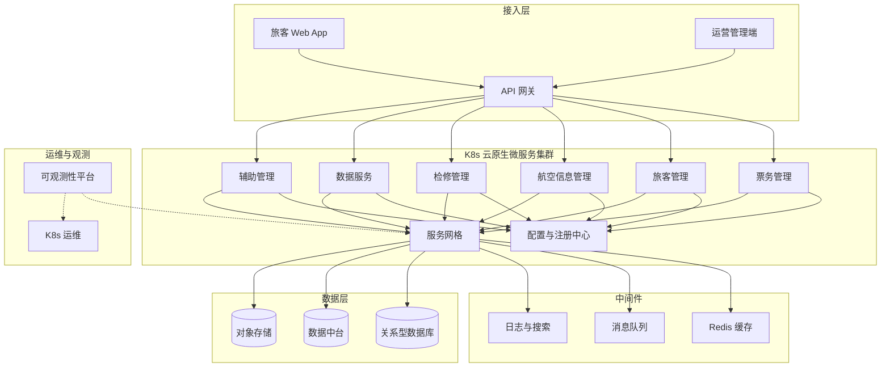

## 1. 摘要（约300字）

2024年3月，我参与某航空公司运营智能管理平台建设，项目面向航空运营机构、近百个运营基地机场，服务数千万常旅客会员、年服务旅客超3000万人次，提供航空信息管理、旅客全流程服务、票务交易、航空检修预警、数据智能分析等核心业务功能。项目中，我担任系统架构师，全面负责平台架构设计与核心技术落地。本文围绕云原生云计算运维架构展开论述，通过构建基于 Kubernetes 的弹性云原生基础设施保障高并发场景下资源弹性编排与核心业务稳定运行，基于打造 DevOps 驱动的自动化运维与持续交付体系大幅缩短版本发布与环境交付周期，结合落地全栈可观测与智能运维闭环能力实现故障快速发现与自愈。系统于2025年8月正式上线，截至2026年5月已稳定运行10个月，各项功能及性能指标均达到预设标准，获得客户高度认可。

---

## 2. 项目背景（约500字）

某航空公司需管理覆盖全部航线网络的近百个运营基地与机场，服务数千万常旅客会员、年服务旅客超3000万人次，为其提供票务、值机、行程查询、航班变动通知、航空检修协同等全场景服务；原有多系统分散、烟囱式建设，故障影响面大、协同效率低，无法满足7×24小时稳定可用与节假日高并发下的弹性扩展与运维智能化要求。随着国家智慧民航建设战略深入推进，航空运输行业数字化、智能化转型迫在眉睫，《"十四五"民用航空发展规划》《智慧民航建设路线图》等政策明确要求推动航空运营全流程数字化、智能化升级，提升运输效率与安全水平。在此背景下，该航空公司于2024年3月启动航空运营智能管理平台建设，旨在构建覆盖全部航线网络、近百个运营基地及数千万常旅客会员的数字化管理平台，实现航线、航班、票务等核心业务全流程智能管控，年服务旅客超3000万人次，为其提供全场景便捷服务，提升运营效率与服务体验。

我司中标后，我以系统架构师身份负责平台整体架构设计与核心技术落地。平台面临突出业务挑战：节假日高峰日均数十万用户集中办理票务，突发航班变动时访问量激增，且需日均处理800GB实时数据、年度累计处理10PB+离线数据，对资源弹性调度、数据处理效率及系统稳定性、安全性提出极高要求；传统运维方式依赖人工脚本与固定容量配置，扩容周期长、跨环境一致性难以保障，故障排查依赖人工收集日志，难以满足高可用与安全合规要求。

为此，我们团队决定基于云原生云计算运维架构，综合引入容器化、Kubernetes 编排、微服务治理、服务网格、分布式缓存、自动扩缩容、统一配置管理与全栈监控告警等技术，构建“应用云原生化、资源弹性化、运维智能化”的一体化平台。平台于2025年8月正式上线，成功应对多轮节假日高并发压力，高效完成年度航班调度、设备检修预警及海量数据处理任务，为旅客提供全流程服务与7×24小时信息支持，上线10个月稳定运行，各项指标达标，获得客户与用户一致认可。

---

## 3. 问题2回应 + 过渡

由于本项目业务高峰访问量剧增、系统模块众多、数据链路复杂，传统运维方式依赖人工脚本与固定容量配置，扩容周期长、跨环境一致性难以保障，故障排查依赖人工登录多台服务器收集日志，既影响恢复时效，也难以满足日益严格的服务可用性与安全合规要求；同时历史单体或烟囱式系统在节假日高并发场景下易出现局部瓶颈、资源利用率不均，运维团队被动“救火”，缺乏面向业务视角的统一运维平台，所以选用云原生云计算运维架构作为平台建设的总体技术路线，其核心包括：第一，基于 Kubernetes 的弹性资源编排与微服务治理，保障高并发场景下核心业务稳定运行；第二，构建 DevOps+CI/CD 自动化运维体系，大幅缩短版本发布与环境交付周期；第三，打造以日志、指标、链路为一体的可观测与智能运维体系，实现故障快速发现与自愈。

在本项目的实施中，我们通过弹性云原生基础设施、自动化运维流水线以及全栈可观测与智能运维能力的协同构建，完成了云原生云计算运维架构的建设与落地，具体实践如下。

---

## 4. 正文部分

### 正文三论点总览表

| 论点 | 要解决的问题 | 方案 / 技术栈 | 核心成效 |
|------|--------------|----------------|----------|
| **论点一：基于 Kubernetes 的弹性云原生基础设施** | 传统集中式部署扩展困难、资源利用率低，高并发时易出现局部瓶颈与服务不可用 | 业务全面容器化，K8s 多环境多可用区集群，节点池分组、服务发现与负载均衡、HPA/VPA 自动扩缩容、集中配置与密钥管理、服务网格与网关治理 | 分钟级弹性扩缩容，资源利用率提升约30%，高峰期间稳定响应 |
| **论点二：DevOps 驱动的自动化运维与持续交付体系** | 版本发布依赖人工脚本，环境不一致、回滚困难，发布窗口长且变更风险高 | 端到端 CI/CD 与 GitOps，统一代码托管与分支策略，自动化构建、测试与安全扫描，镜像仓库与蓝绿/金丝雀发布、一键回滚 | 发布周期由周级缩短为天级/日级，线上变更故障率下降60%以上 |
| **论点三：全栈可观测与智能运维闭环能力** | 多服务链路长、故障定位困难，告警噪声多、缺乏统一运维视图，难以支撑 7×24 小时稳定运行 | 指标、日志、链路三位一体可观测平台，集中日志、分布式链路追踪、业务大屏、智能告警与自愈策略，容量预测与异常检测 | MTTR 缩短50%以上，系统可用性稳定达到99.993%，票务高峰与异常场景提前预警与自动化处置 |

### 一、基于 Kubernetes 的弹性云原生基础设施设计与实践（字数约500–510字）

在基础设施层面，我们首先推动平台核心业务全面容器化改造，将航空信息管理、票务管理、旅客管理、检修管理、数据服务、辅助管理等模块拆分为百余个微服务单元，并统一部署于 Kubernetes 集群之上。集群按照生产、预生产、测试多环境隔离布局，结合多可用区部署与节点池分组策略，将面向外部旅客访问的互联网服务、面向内部运营人员的管理服务以及离线大数据任务分别放置在不同节点池中，通过污点与容忍度、亲和与反亲和规则，保证关键业务优先获得计算与存储资源。为支撑节假日高并发，我们引入 HPA/VPA 自动扩缩容机制，基于 CPU、内存与自定义 QPS 指标动态调整 Pod 副本数；配合服务发现与负载均衡，实现无感知横向扩展，在购票高峰时核心票务服务实例数可在数分钟内从几十扩展到数百。配置管理上，引入集中配置中心与密钥管理服务，实现环境参数、限流阈值、外部依赖地址的动态下发与灰度调整。网络层面，结合 Ingress 网关与服务网格，对外暴露统一入口，并通过熔断、限流、重试等策略增强系统鲁棒性。通过上述设计，平台在保障高可用的前提下，将资源利用率提升约30%，为上层应用与运维体系奠定了弹性基础。

### 二、DevOps 驱动的自动化运维与持续交付体系构建（字数约500–510字）

在运维流程层面，我们围绕“快速交付、稳定上线、可追溯回滚”的目标，构建了端到端 DevOps 与 CI/CD 体系。首先，统一代码托管与分支治理策略，引入基于主干开发的分支模型，通过代码评审与自动化检查保障变更质量。流水线层面，开发提交代码后自动触发编译、单元测试、静态代码扫描、安全扫描与镜像构建，将合格镜像推送至企业镜像仓库；随后流水线自动完成部署包生成与版本标记，实现制品全流程可追踪。部署阶段，利用 GitOps 思想，将期望状态以声明式方式存储在配置仓库，由自动化控制器持续对比集群实际状态与期望状态，完成蓝绿发布与金丝雀灰度发布，避免人工登录服务器执行脚本带来的风险。变更窗口内，运维人员可基于流水线一键完成多集群、多环境的联动发布，并在发布前后自动对关键接口进行回归验证与性能基线比对。如发布后监控指标异常，系统可在分钟级触发自动回滚到上一个稳定版本。通过该体系，版本发布周期由原来的数周缩短到数天甚至按日发布，线上变更故障率下降超过60%，为航空运营业务创新提供了高频迭代能力。

### 三、全栈可观测与智能运维闭环能力建设（字数约500–510字）

在可观测与智能运维方面，我们搭建了覆盖“指标、日志、链路”的三位一体监控体系，并在此基础上构建智能告警与自愈机制。指标层面，通过 Prometheus 等组件采集集群节点、容器、数据库、中间件及关键业务接口的核心指标，结合告警规则与阈值动态调优，实现对 CPU、内存、磁盘、连接数、响应时间等的实时监控，并在大屏上刻画票务交易 TPS、在线用户数、座位占用率等业务指标，帮助运营团队从业务视角感知系统健康度。日志层面，建设集中化日志平台，将应用日志、访问日志、安全审计日志统一采集、清洗与存储，支持按航班号、订单号、旅客ID等关键字段秒级检索，大幅缩短问题定位时间。链路追踪层面，引入分布式调用链分析，对跨服务请求链路进行可视化展示，识别高延迟节点与潜在瓶颈。基于这些可观测数据，我们训练异常检测模型与容量预测模型，实现对票务高峰的提前预警及对部分典型故障场景的自动化处置，如自动扩容、重启异常实例、切换主备节点等。通过构建从监控、告警、诊断到处置的闭环，平台平均故障恢复时间降低50%以上，系统可用性稳定达到99.993%，有效支撑了航空运营业务的安全与连续性。

---

## 5. 总结

本平台响应智慧民航建设政策，以云原生云计算运维架构（弹性云原生基础设施、DevOps 自动化运维与持续交付、全栈可观测与智能运维闭环）为核心，构建航空运营全流程一体化管理体系，2025年8月上线后稳定运行10个月，超额达成预期目标。上线以来，系统日均处理票务交易超12万笔，核心业务响应时间≤800毫秒，运营效率提升35%，旅客投诉率下降40%，设备故障预警准确率92%，系统可用性达99.993%，峰值处理能力突破5500 TPS，成功应对节假日高并发压力，获行业与旅客广泛认可。项目复盘发现架构存在不足：一是高并发叠加场景下，微服务间同步通信偶有延迟，跨模块数据同步耗时增加；二是各模块资源占用不均，辅助服务资源利用率偏低、核心模块高峰资源紧张。后续将针对性优化：引入异步通信与消息队列技术，重构通信链路；搭建智能资源调度平台，通过AI算法实现容器化资源动态分配，提升资源利用率与系统抗突发能力，进一步结合服务网格细粒度流量治理与零信任安全架构，持续深化云原生云计算运维能力，为智慧民航高质量发展提供更加坚实的数字底座。

---

## 6. 系统架构图

**图 4-1** 航空运营智能管理平台·云原生云计算运维 架构图
