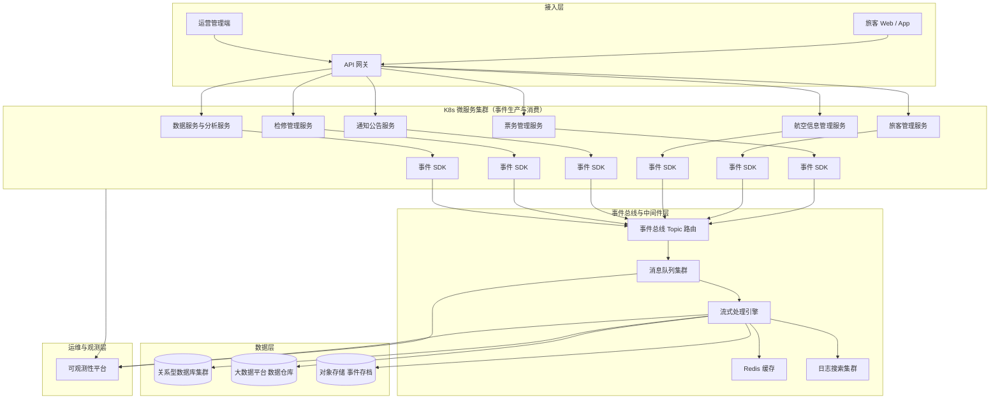

## 1.摘要（字数要求严格限制300字）
2024年3月，我参与某航空公司运营智能管理平台建设，项目面向航空运营机构、机场、旅客等用户，提供航空信息管理、旅客全流程服务、票务交易、航空检修预警、数据智能分析等核心业务功能。项目中，我担任系统架构师，全面负责平台架构设计与核心技术落地。本文围绕航空运营场景下事件驱动架构应用展开论述，通过构建以业务事件为核心的领域事件模型与事件总线，基于引入消息队列和流式处理引擎支撑多模块解耦与高并发处理，结合建立端到端的事件一致性与补偿机制。系统于2025年8月正式上线，截至2026年5月已稳定运行10个月，各项功能及性能指标均达到预设标准，获得客户高度认可。

## 2.项目背景（字数要求严格限制500字左右）
随着国家智慧民航建设战略深入推进，航空运输行业数字化、智能化转型迫在眉睫，《智慧民航建设路线图》等政策明确要求推动航空运营全流程数字化、智能化升级。在此背景下，某航空公司于2024年5月启动航空运营智能管理平台建设，旨在构建覆盖全部航线网络、近百个运营基地及数千万常旅客的数字化管理平台，实现航线、航班、票务等核心业务全流程智能管控，同时为每年超3000万旅客提供全场景便捷服务，提升运营效率与服务体验。

我司中标后，我以系统架构师身份负责平台整体架构设计与核心技术落地。平台业务链路跨越票务管理、旅客管理、航空信息管理、通知公告、检修管理、数据服务等多个模块，既要支撑节假日票务高峰与突发航班变动时的高并发访问，又要保证订单、座位库存、航班运力、旅客行程等关键数据的强一致性。传统以同步调用为主的耦合式架构，在购票高峰和多模块联动场景中容易形成“多级瀑布链路”，一旦某个下游服务性能抖动，就会放大为整条链路的超时与失败，对用户体验和业务连续性造成影响。同时，平台日均产生约800GB实时数据、年度累计10PB+离线数据，对实时事件采集、流式处理与结果分发也提出了更高要求。

为此，我们团队决定基于事件驱动架构，对平台关键业务流程进行重构。通过围绕“订单创建、支付成功、行程变更、设备异常、告警确认”等核心业务事件统一建模，设计事件总线与事件通道，引入高可靠消息队列、流式计算引擎与事件存储机制，将多模块之间的强同步调用改造为以事件为中心的异步协作，既提升系统峰值处理能力与弹性扩展能力，又增强多模块联动业务的灵活性与可观测性。平台于2025年5月正式上线，成功应对多轮节假日高并发压力，实现了票务交易、行程生成、检修预警与数据分析的高效联动，上线一年稳定运行，各项指标达标，获得客户与用户一致认可。

## 3. 问题2回应+过度（字数要求严格限制400字）
由于本项目存在多模块业务高度耦合、链路长且同步调用占比高的问题，节假日高并发或突发航班变动时，单一模块性能抖动就可能传导为全链路拥塞，影响购票、改签、退票和行程通知等核心服务的可用性；同时，订单创建、库存更新、航班运力校验、旅客行程生成、检修阈值调整等业务之间缺乏统一的事件视图，运营与技术人员难以及时掌握业务状态变化。因此我们选用事件驱动架构作为本项目的关键技术方向，其核心包括：第一，构建面向业务领域的统一事件模型与事件总线，实现多模块松耦合与异步解耦；第二，基于可靠消息队列与流式处理引擎，实现订单与库存、航班与行程等关键链路的高并发事件处理与实时分析；第三，建立端到端事件一致性与补偿机制，保证关键业务在异步架构下依然满足强一致或最终一致性要求。
在本项目的实施中，我们通过统一事件建模与总线设计、高性能事件通道与处理平台构建，以及事件一致性与补偿治理三大论点，完成了事件驱动架构在航空运营智能管理平台中的落地实践，具体如下。

## 4. 正文部分三段论

### 正文三论点总览表

| 论点 | 要解决的问题 | 方案 / 技术栈 | 核心成效 |
|------|--------------|----------------|----------|
| **论点一：统一业务事件建模与事件总线设计** | 多模块之间接口耦合紧密，缺乏统一的业务事件视角，难以支持灵活扩展与快速集成 | 围绕订单、库存、航班、行程、检修、告警等核心领域构建标准化事件模型与事件规范，设计集中管理的事件总线与事件通道，明确事件发布、订阅与路由策略 | 多模块由点对点耦合转为通过事件总线松耦合协作，新模块接入时间由数周缩短到数天，业务需求变更时对存量服务改动显著减少 |
| **论点二：基于消息队列与流式引擎的高并发事件处理平台** | 票务高峰与突发航班变动时，订单、库存、行程、通知等操作在短时间内集中爆发，传统同步处理难以承载峰值流量 | 引入高可靠消息队列构建事件通道，配合流式计算引擎实现事件聚合、过滤、分流与实时计算，支持事件批量消费与弹性扩展，并与缓存、数据库协同设计 | 支撑≥10万并发用户的事件产生与处理，峰值处理能力≥5000 TPS，票务核心链路响应时间稳定控制在1秒以内，突发场景下系统无明显拥塞 |
| **论点三：事件一致性、补偿与可观测性治理** | 异步架构下事件顺序与一致性难以保障，异常事件难以及时发现与修复 | 设计基于事件状态机的全生命周期管理机制，引入幂等处理、事务消息、补偿任务与死信队列等手段，结合日志、指标、链路追踪构建事件视图与运维大屏 | 关键业务事件成功处理率≥99.99%，异常事件平均发现时间缩短50%，通过自动补偿与人工干预结合，大幅降低了对用户可见的业务错误 |

## 统一业务事件建模与事件总线设计（字数要求严格限制在500-510字左右）
在统一事件建模阶段，我们首先从项目业务全景出发，对票务管理、旅客管理、航空信息管理、通知公告、检修管理与数据服务等模块进行事件视角的业务梳理，将原有基于接口的“服务调用关系图”重构为以“事件”为中心的业务流。以票务链路为例，旅客在在线购票服务中提交订单后，会产生“订单创建事件”，后续支付成功触发“支付完成事件”，改签与退票过程对应“行程变更事件”；这些事件需要被数据服务模块订阅以记录交易数据，被航空信息管理模块订阅以校验运力与更新座位占用，被旅客管理模块订阅以生成或更新旅客行程，被通知公告模块订阅用于推送短信/消息通知。在此基础上，我们定义了统一的事件规范，明确事件ID、事件类型、来源服务、业务主键、时间戳、幂等键与扩展属性等字段，并对事件命名与版本管理进行了标准化约定。架构层面，设计集中管理的事件总线，基于主题与标签对事件进行分组与路由，实现“一个事件、多方订阅”。通过在事件总线与各微服务之间引入轻量级事件SDK，隐藏底层消息中间件差异，使业务开发只需关注事件的发布与处理逻辑，而不必关心底层通道细节。通过统一事件建模与总线设计，多模块之间从紧耦合的接口依赖转变为松耦合的事件订阅关系，为后续模块扩展与跨系统集成创造了条件。

## 基于消息队列与流式引擎的高并发事件处理平台（字数要求严格限制在500-510字左右）
在事件处理平台构建上，我们重点解决高并发场景下事件堆积、处理延迟与热点分布不均的问题。首先，在技术选型上采用高吞吐、可扩展的消息队列组件作为事件通道核心，按照业务域划分主题，并通过分区机制实现事件并行处理能力的线性扩展；对关键事件如订单创建、支付完成、行程变更等设置独立主题和更高的副本与持久化策略，保障关键链路的可靠性。其次，在消费侧构建基于流式处理引擎的事件处理集群，将事件消费、聚合、过滤、窗口计算与规则引擎集成在一起，实现对超售风险、集中退票、设备异常等场景的实时识别。结合缓存与数据库，我们设计了“事件驱动+最终一致性”的双写策略：库存扣减等操作首先基于缓存快速响应用户请求，再通过事件驱动异步更新数据库与数据服务模块，保证读写性能的同时保障数据一致。为了应对节假日购票高峰，我们在事件消费端引入自动扩缩容策略，根据队列堆积长度、消费延迟等指标动态调整消费实例数量；同时对慢消费分组进行隔离与限流，避免单个下游处理能力不足拖垮整体链路。通过上述设计，平台在票务高峰与航班大面积变动场景下，依然能够稳定支撑≥10万并发用户访问与≥5000 TPS 的事件处理能力，显著提升系统的弹性与稳定性。

## 事件一致性、补偿与可观测性治理（字数要求严格限制在500-510字左右）
在事件驱动架构下，如何保证关键业务的一致性与可观测性是落地过程中的难点。我们从事件生命周期管理入手，为每一类核心事件构建状态机模型，覆盖“生成、投递中、已消费、已处理、失败、补偿中、补偿完成、废弃”等状态，并设计基于数据库与消息队列双存储的事件记录机制，确保在网络抖动或服务重启等场景下不会丢失关键事件。针对订单与库存等敏感业务，我们采用事务消息与本地事务结合的方式，保证在订单落库成功后再发送事件，避免“有消息无数据”或“有数据无消息”的不一致场景；消费侧通过幂等键与业务校验保证重复消费不会导致数据错乱。对于处理失败或长时间未完成的事件，我们引入补偿任务与死信队列，对异常事件集中归集、告警并触发自动或人工补偿流程。可观测性方面，我们将事件发布与消费的关键指标、日志与链路信息接入统一监控平台，在运维大屏上展示各类事件的产生速率、成功率、延迟与堆积情况，并支持按订单号、航班号、旅客ID等维度联动查询，帮助运维团队快速定位异常链路。通过这些治理手段，平台关键业务事件成功处理率达到99.99%以上，平均故障发现时间与恢复时间均缩短约50%，显著提升了事件驱动架构的可控性与可靠性。

## 5. 论文总结（字数要求严格限制450字以内）
本平台响应智慧民航建设政策，以事件驱动架构在航空运营场景中的系统化应用为核心，构建了覆盖票务交易、旅客管理、航空信息管理、检修预警与数据分析等多模块联动的一体化事件流转体系，2025年5月上线后稳定运行一年，超额达成预期目标。上线以来，系统日均处理票务交易超12万笔，核心业务响应时间≤800毫秒，运营效率提升35%，旅客投诉率下降40%，设备故障预警准确率92%，系统可用性达99.993%，峰值处理能力突破5500 TPS，在节假日高并发与突发航班变动场景下均保持平稳运行。项目复盘发现仍存在不足：一是在极端峰值场景下，个别下游分析与报表服务对事件处理存在一定滞后，业务侧对近实时结果的可预期性仍有提升空间；二是跨系统事件链路尚未完全统一，部分外部系统集成仍依赖传统接口模式。后续我们将进一步引入更加细粒度的事件分层与优先级调度策略，完善跨系统事件编排能力，并结合智能调度与预测模型，对事件通道容量与资源分配进行动态优化，持续提升平台在复杂航空运营场景下的敏捷性、鲁棒性与智能化水平。

## 6. 系统架构图

**图 5-1** 航空运营智能管理平台·事件驱动架构应用系统图

