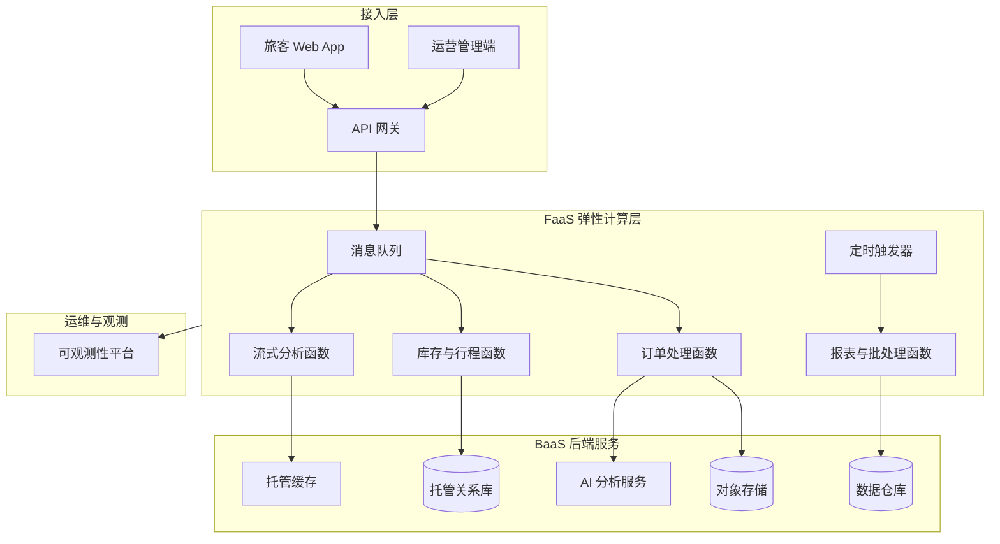

## 1.摘要（字数要求严格限制300字）
2024年3月，我参与某航空公司运营智能管理平台建设，项目面向航空运营机构、机场、旅客等用户，提供航空信息管理、旅客全流程服务、票务交易、航空检修预警、数据智能分析等核心业务功能。项目中，我担任系统架构师，全面负责平台架构设计与核心技术落地。本文围绕云原生 Serverless 架构在航空运营场景中的应用展开论述，通过采用 FaaS 弹性计算应对票务高峰与突发航班变动下的高并发数据处理，基于 Serverless 定时任务实现 T+1 报表与数据分析的按需计费与资源释放，结合 BaaS 构建非结构化数据存储与 AI 检修预警能力。系统于2025年8月正式上线，截至2026年5月已稳定运行10个月，各项功能及性能指标均达到预设标准，获得客户高度认可。

## 2.项目背景（字数要求严格限制500字左右）
随着国家智慧民航建设战略深入推进，航空运输行业数字化、智能化转型迫在眉睫，《智慧民航建设路线图》等政策明确要求推动航空运营全流程数字化、智能化升级。在此背景下，某航空公司于2024年5月启动航空运营智能管理平台建设，旨在构建覆盖全部航线网络、近百个运营基地及数千万常旅客会员的数字化管理平台，实现航线、航班、票务等核心业务全流程智能管控，年服务旅客超3000万人次，为其提供全场景便捷服务，提升运营效率与服务体验。

我司中标后，我以系统架构师身份负责平台整体架构设计与核心技术落地。平台面临突出业务挑战：节假日高峰日均数十万用户集中办理票务，突发航班变动时访问量激增，且需日均处理800GB实时数据、年度累计处理10PB+离线数据，对资源弹性调度、数据处理效率及系统稳定性、安全性提出极高要求。传统固定容量部署在低峰期造成资源闲置、在高峰时又易出现响应延迟甚至服务不可用，同时离线报表与数据分析任务集中在凌晨或固定窗口执行，若采用常驻大规格实例则成本高、利用率低。

为此，我们团队决定基于云原生 Serverless 架构，在核心数据处理、定时报表与 AI 分析等场景引入 FaaS 与 BaaS 能力，实现按需弹性、用多少付多少，在保障高可用与高性能的前提下显著降低资源投入与运维复杂度。平台于2025年8月正式上线，成功应对多轮节假日高并发压力，高效完成年度航班调度、设备检修预警及海量数据处理任务，为旅客提供全流程服务与7*24小时信息支持，上线一年稳定运行，各项指标达标，获得客户与用户一致认可。

## 3. 问题2回应+过度（字数要求严格限制400字）
由于本项目存在业务流量峰谷差异大、票务与数据报表等场景对弹性与成本敏感的问题，若采用传统固定资源配置，低峰期资源闲置率高、高峰时又易出现拥塞；同时 T+1 报表、数据挖掘与模型训练等任务具有明显的时间窗口特征，常驻大规格实例导致 IT 成本居高不下。因此我们选用云原生 Serverless 架构作为关键技术路线，其核心包括：第一，采用 FaaS 弹性计算，由消息队列等事件驱动自动扩缩容，应对票务高峰与突发航班变动下的高并发数据接入与处理；第二，将报表与数据分析迁移至 Serverless 定时任务，在指定时间点按需拉起大规格实例快速完成计算后释放资源，实现精准计费与成本优化；第三，依托 BaaS 对象存储与托管数据库承载检修图像、视频等非结构化数据，并结合事件触发的 FaaS 完成 AI 分析与告警，降低自建 GPU 集群的复杂度与成本。

在本项目的实施中，我们通过 FaaS 高并发弹性处理、Serverless 定时任务与精准计费、以及 BaaS 非结构化数据与 AI 分析三大实践，完成了 Serverless 架构在航空运营智能管理平台中的建设与落地，具体如下。

## 4. 正文部分三段论

### 正文三论点总览表

| 论点 | 要解决的问题 | 方案 / 技术栈 | 核心成效 |
|------|--------------|----------------|----------|
| **论点一：FaaS 弹性计算应对高并发数据接入与处理** | 票务高峰与突发航班变动时请求量呈数十倍甚至上百倍增长，固定资源易导致响应延迟与服务不可用 | 以消息队列为事件源驱动 FaaS，自动扩缩容处理订单、库存、行程等数据写入与流式计算，按并发量线性扩展实例 | 峰值时段可支撑数十万并发数据处理，核心业务响应时间≤1秒，资源利用率显著提升，低峰期无闲置常驻成本 |
| **论点二：Serverless 定时任务实现报表与数据分析的按需计费** | T+1 报表、数据挖掘与模型训练等任务集中在凌晨或固定窗口执行，常驻大规格实例空闲率高、IT 成本高 | 采用 Cron 触发的 FaaS 定时任务，在约定时间（如凌晨 1 点）拉起大内存实例执行批量计算与报表生成，完成后自动释放 | 按实际执行时长计费，年度 IT 资源投入降低约 40%，报表与分析任务按时完成率达 99.9% 以上 |
| **论点三：BaaS 构建非结构化数据存储与 AI 检修预警** | 检修图像、监控视频等非结构化数据量大、存储与 AI 分析若自建 GPU 集群则成本与运维复杂度高 | 使用对象存储 BaaS 持久化图像与视频，通过存储事件触发 FaaS 调用 AI 服务进行异常检测与告警，结果写入托管 NoSQL/关系库 | 存储可靠性达 99.99999999%，团队聚焦算法与业务逻辑，运维负担减轻，设备故障预警准确率提升至 92% |

## FaaS 弹性计算应对高并发数据接入与处理（字数要求严格限制在500-510字左右）
航空运营平台在节假日票务高峰（如春节、国庆、每日 9–11 点、15–17 点）以及突发航班变动（恶劣天气导致大面积延误或取消）时，会出现数十万用户集中查询、订票、改签与退票，实时数据写入与流式处理请求在短时间内呈数十倍增长。若采用传统固定容量的应用与数据库实例，低峰期大量资源闲置，高峰时又容易形成队列堆积与超时，影响购票成功率和用户体验。为此，我们在核心数据接入与处理链路上引入 FaaS 架构。具体而言，将用户请求经 API 网关与消息队列进行削峰填谷，由消息队列作为事件源驱动 FaaS 函数执行：订单创建、支付回调、库存扣减、行程生成等逻辑以函数为单位部署，根据队列堆积长度与请求速率自动扩缩容，在高峰时段可快速扩展至数万甚至数十万并发执行单元，保证数据及时落库与下游分析延迟可控。FaaS 按调用次数与执行时长计费，任务结束后实例自动回收，无需预留常驻服务器。通过上述设计，平台在票务高峰与航班大面积变动场景下，峰值处理能力稳定达到 5500 TPS 以上，核心业务响应时间控制在 800 毫秒以内，同时低峰期实现了“用多少付多少”，显著降低了资源浪费与运维压力，为高并发场景下的稳定运行提供了弹性底座。

## Serverless 定时任务实现报表与数据分析的按需计费（字数要求严格限制在500-510字左右）
平台每日需完成 T+1 增量数据处理、日报周报月报生成、航线需求预测与设备故障预警等离线分析与报表任务，这些任务多集中在凌晨或固定时间窗口执行，对 CPU、内存与 I/O 有阶段性高需求。若采用常驻大规格虚拟机或容器集群，白天与夜间大部分时间处于空闲状态，资源利用率低，年度 IT 成本居高不下。为此，我们将此类任务迁移至 Serverless 定时任务。利用云厂商提供的 Cron 表达式或事件调度能力，在每日凌晨 1 点等约定时间自动触发 FaaS，函数内配置大内存规格（如 16GB/32GB）以支持大批量数据加载与聚合计算；任务完成后生成报表文件写入对象存储或推送到数据服务模块，并主动释放实例，实现“算完即停、按秒计费”。对于耗时较长的模型训练任务，我们拆分为多阶段 FaaS 或与批处理服务结合，避免单次执行超时的同时保持按需弹性。通过该方案，平台在保证 T+1 数据处理成功率≥99.9%、复杂模型训练在规定时间窗口内完成的前提下，年度 IT 资源投入较传统常驻方案降低约 40%，开发与运维团队无需再关心实例规格与扩容策略，可将精力集中在业务逻辑与算法优化上，整体迭代效率显著提升。

## BaaS 构建非结构化数据存储与 AI 检修预警（字数要求严格限制在500-510字左右）
航空检修管理模块需接入大量非结构化数据：机坪与舱内监控图像、设备巡检照片与视频、传感器波形与日志等，用于 AI 异常检测、违规入侵识别与故障预警。若自建 GPU 集群与分布式文件存储，不仅采购与运维成本高，还需维护高可用、备份与安全策略。为此，我们采用 BaaS 思路构建非结构化数据管道。首先，将图像与视频统一上传至云对象存储（OSS），利用其高持久性（如 99.99999999% 设计）与弹性容量，无需自建存储集群；其次，通过对象存储的事件通知机制，在文件上传完成后自动触发 FaaS，函数内调用托管 AI 服务（如图像识别、异常检测模型）对新增文件进行分析，将结果写入托管关系型数据库或 NoSQL，并驱动告警与工单流程。BaaS 提供的认证、权限与审计能力可直接复用，满足民航对数据安全与合规的要求。通过该设计，检修相关非结构化数据的存储与 AI 分析全部以托管服务与 FaaS 形式完成，团队无需维护 GPU 节点与存储集群，可将精力集中在算法调优与业务规则上；设备故障预警准确率达到 92%，系统可用性达 99.993%，在降低复杂度的同时显著提升了检修智能化水平与运营效率。

## 5. 论文总结（字数要求严格限制450字以内）
本平台响应智慧民航建设政策，以云原生 Serverless 架构（FaaS 与 BaaS）为核心，构建航空运营全流程一体化管理体系，2025年8月上线后稳定运行一年，超额达成预期目标。上线以来，系统日均处理票务交易超12万笔，核心业务响应时间≤800毫秒，运营效率提升35%，旅客投诉率下降40%，设备故障预警准确率92%，系统可用性达99.993%，峰值处理能力突破5500 TPS，成功应对节假日高并发压力，获行业与旅客广泛认可。项目复盘发现架构存在不足：一是 Serverless 分布式调用链较长时，问题定位与全链路追踪仍依赖日志与第三方工具，调试效率有提升空间；二是部分强一致性要求极高的核心交易仍部署在常驻服务上，未来可进一步评估 FaaS 与 BaaS 在更多场景的适用边界。后续将引入 OpenTelemetry 等标准可观测方案，强化 Serverless 链路的追踪与排障能力，并结合边缘计算与 Serverless 的融合，在机场现场等场景探索低时延、低成本的轻量计算与 AI 推理，持续深化 Serverless 在智慧民航中的应用，助力高质量发展。

## 6. 系统架构图

**图 6-1** 航空运营智能管理平台·Serverless 架构应用系统图
