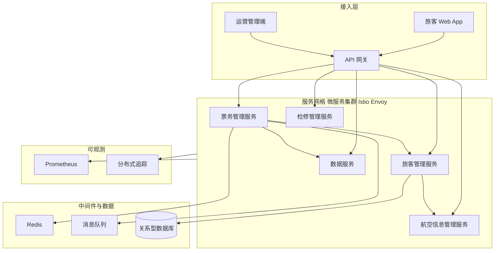

## 1.摘要（字数要求严格限制300字）
2024年3月，我参与某航空公司运营智能管理平台建设，项目面向航空运营机构、机场、旅客等用户，提供航空信息管理、旅客全流程服务、票务交易、航空检修预警、数据智能分析等核心业务功能。项目中，我担任系统架构师，全面负责平台架构设计与核心技术落地。本文围绕云原生服务网格在航空运营场景中的应用展开论述，通过基于 Istio 与 Envoy 的流量治理与全链路可观测，基于 mTLS 实现服务间零信任安全通信，结合授权策略与生产链路真实流量分析支撑故障排查与访问控制。系统于2025年8月正式上线，截至2026年5月已稳定运行10个月，各项功能及性能指标均达到预设标准，获得客户高度认可。

## 2.项目背景（字数要求严格限制500字左右）
随着国家智慧民航建设战略深入推进，航空运输行业数字化、智能化转型迫在眉睫，《智慧民航建设路线图》等政策明确要求推动航空运营全流程数字化、智能化升级。在此背景下，某航空公司于2024年5月启动航空运营智能管理平台建设，旨在构建覆盖全部航线网络、近百个运营基地及数千万常旅客的数字化管理平台，实现航线、航班、票务等核心业务全流程智能管控，同时为每年超3000万旅客提供全场景便捷服务，提升运营效率与服务体验。

我司中标后，我以系统架构师身份负责平台整体架构设计与核心技术落地。平台采用容器化与 Kubernetes 编排，将航空信息管理、票务管理、旅客管理、检修管理、数据服务、辅助管理等拆分为百余个微服务，面临突出业务挑战：节假日高峰日均数十万用户集中办理票务，突发航班变动时访问量激增，且需日均处理800GB实时数据、年度累计处理10PB+离线数据，对资源弹性调度、数据处理效率及系统稳定性、安全性提出极高要求。微服务数量多、调用链路长，传统方式下流量管控、安全加固与故障排查分散在各应用内，难以统一治理与观测。

为此，我们团队决定引入云原生服务网格架构，基于 Istio 与 Envoy 实现东西向流量的统一代理、熔断限流、灰度发布与分布式追踪，结合 mTLS 与服务授权策略保障服务间安全，支撑生产链路真实流量分析与故障快速定位。平台于2025年8月正式上线，成功应对多轮节假日高并发压力，高效完成年度航班调度、设备检修预警及海量数据处理任务，为旅客提供全流程服务与7*24小时信息支持，上线一年稳定运行，各项指标达标，获得客户与用户一致认可。

## 3. 问题2回应+过度（字数要求严格限制400字）
由于本项目微服务众多、调用链路复杂，若在应用内各自实现熔断、重试、观测与加密，则改造成本高、策略不一致，且生产环境真实流量与调用关系难以统一分析，故障排查依赖多系统捞日志、对 Trace ID 困难；同时服务间若仅依赖网络隔离与明文通信，无法满足民航对身份认证与传输安全的要求。因此我们选用云原生服务网格作为分布式微服务治理与安全的基础设施，其核心包括：第一，基于 Istio 与 Envoy 的流量治理与可观测，实现熔断限流、灰度发布、指标采集与分布式追踪（如 X-B3-TraceId），支撑生产链路真实流量分析与稳定性保障；第二，启用 mTLS 实现服务间双向认证与加密通信，构建零信任内网；第三，通过授权策略（Authorization Policy）细化服务间访问控制，并结合可观测数据支撑故障排查与审计。

在本项目的实施中，我们通过服务网格流量治理与可观测、mTLS 服务间安全、以及授权策略与生产流量分析三大实践，完成了云原生服务网格在航空运营智能管理平台中的建设与落地，具体如下。

## 4. 正文部分三段论

### 正文三论点总览表

| 论点 | 要解决的问题 | 方案 / 技术栈 | 核心成效 |
|------|--------------|----------------|----------|
| **论点一：基于 Istio 与 Envoy 的流量治理与全链路可观测** | 微服务间调用链长、流量策略分散，生产环境真实流量与延迟难以统一观测，灰度与熔断难以统一实施 | 引入 Istio 服务网格，以 Envoy 为 Sidecar 代理东西向流量，配置虚拟服务与目标规则实现灰度、熔断与重试；集成 Prometheus 采集指标、分布式追踪传递 X-B3-TraceId | 流量策略统一下发、无需改业务代码，生产链路可观测性显著提升，核心业务响应时间≤800ms，服务可靠性提升至 99.9% 以上 |
| **论点二：mTLS 实现服务间零信任安全通信** | 服务间明文或单方认证无法满足民航对传输安全与身份可信的要求，内网被突破后易横向扩散 | 在服务网格内全域启用 mTLS，由 Istio 自动签发与轮换证书，服务间通信强制双向认证与加密 | 服务间通信全部加密、身份可辨，满足安全合规要求，未发生因传输或身份导致的重大安全事件 |
| **论点三：授权策略与生产链路真实流量分析支撑故障排查** | 服务间访问边界不清、故障定位依赖多系统对日志，缺乏基于身份的访问控制与统一追踪 | 配置 Authorization Policy 按服务与身份限制访问范围；结合 Prometheus 与分布式追踪对生产流量做实时分析与历史回溯 | 访问控制细粒度可配置，故障排查时间缩短约 50%，生产链路真实流量可复现、可分析 |

## 基于 Istio 与 Envoy 的流量治理与全链路可观测（字数要求严格限制在500-510字左右）
航空运营平台将票务、旅客、航班、检修、数据服务等拆分为百余个微服务，部署于 Kubernetes 集群，服务间调用链长、依赖关系复杂。若在各应用内分别实现熔断、限流、重试与超时控制，不仅开发与运维成本高，策略也难以统一，且生产环境真实流量、延迟与错误率缺乏统一视图，灰度发布与故障隔离难以精细化实施。为此，我们引入云原生服务网格，采用 Istio 作为控制面、Envoy 作为数据面 Sidecar 代理，对所有东西向服务间流量进行透明拦截与治理。业务 Pod 注入 Envoy Sidecar 后，出站请求与入站请求均经 Envoy 转发，无需修改业务代码即可在网格内统一配置虚拟服务（VirtualService）与目标规则（DestinationRule），实现按比例灰度、按版本路由、熔断、重试与超时策略。可观测方面，Envoy 自动上报请求量、延迟、错误率等指标至 Prometheus，并透传分布式追踪头（如 X-B3-TraceId），与现有追踪后端对接后，可在单一界面按请求查看跨服务的完整调用链，支撑生产链路真实流量分析。通过上述设计，平台在节假日高并发与突发航班变动场景下，通过网格级熔断与限流有效隔离故障实例，核心业务响应时间稳定在 800 毫秒以内，服务可靠性提升至 99.9% 以上，灰度发布与策略变更均可通过配置下发完成，显著降低了运维复杂度并提升了系统可观测性。

## mTLS 实现服务间零信任安全通信（字数要求严格限制在500-510字左右）
民航行业对数据安全与身份可信要求高，旅客信息、票务与检修数据在微服务间流转时，若采用明文或仅网关侧 TLS，一旦内网被突破，攻击者可窃听或伪造服务间请求，造成数据泄露与越权访问。为此，我们在服务网格内全域启用 mTLS（双向 TLS），由 Istio 集成的证书管理机制为各服务自动签发、轮换工作负载身份证书，Envoy Sidecar 在建立连接时完成双向认证与加密，业务容器无需自行集成 TLS 逻辑。策略上，通过 PeerAuthentication 资源将网格内模式设置为 STRICT，确保服务间通信强制 mTLS；证书过期前由控制面自动续期，避免人工维护带来的遗漏。在此基础上，服务身份与 Kubernetes 服务账号、命名空间绑定，形成“谁在调用谁”的可信身份链。通过该方案，平台内所有微服务间流量均经加密且身份可辨，满足民航对传输安全与零信任内网的要求，上线以来未发生因服务间传输或身份伪造导致的重大安全事件，同时运维侧无需在各应用中重复配置证书与加密逻辑，降低了安全实施的复杂度与人为差错风险。

## 授权策略与生产链路真实流量分析支撑故障排查（字数要求严格限制在500-510字左右）
在服务网格落地前，服务间访问边界多依赖网络策略或应用内白名单，粒度粗、变更成本高，且一旦出现异常调用或故障，运维需在多套系统中按时间、IP 或实例捞日志，对 Trace ID 困难，生产链路真实流量难以复现与分析。为此，我们利用 Istio 的授权策略（Authorization Policy）对服务间访问进行细粒度控制：按来源服务（Principal）、目标服务、路径与方法配置 ALLOW/DENY 规则，例如仅允许票务服务访问订单与库存相关接口、禁止未授权服务访问旅客敏感接口，实现“最小权限”访问。授权策略与 mTLS 身份结合，确保策略基于可信身份生效。故障排查方面，依托网格内 Prometheus 指标与分布式追踪（X-B3-TraceId），我们对生产链路真实流量进行实时监控与历史查询，可快速定位高延迟或高错误率的服务与实例，并结合调用链还原单次请求的完整路径，大幅缩短故障定位时间。实践表明，引入服务网格后，典型故障排查时间缩短约 50%，生产链路真实流量分析成为日常运维与容量规划的重要依据，访问控制与可观测能力协同提升，为智慧民航平台的稳定与安全运行提供了坚实支撑。

## 5. 论文总结（字数要求严格限制450字以内）
本平台响应智慧民航建设政策，以云原生服务网格（Istio/Envoy）的流量治理、mTLS 安全与授权策略为核心，构建航空运营全流程一体化管理体系，2025年8月上线后稳定运行一年，超额达成预期目标。上线以来，系统日均处理票务交易超12万笔，核心业务响应时间≤800毫秒，运营效率提升35%，旅客投诉率下降40%，设备故障预警准确率92%，系统可用性达99.993%，服务可靠性提升至99.9%以上，峰值处理能力突破5500 TPS，成功应对节假日高并发压力，获行业与旅客广泛认可。项目复盘发现架构存在不足：一是服务网格引入后调用链多一跳，在极端高并发下对延迟敏感路径仍有优化空间；二是部分第三方与遗留系统尚未接入网格，仍依赖网关与网络层策略。后续将针对性优化：对关键路径做连接池与超时调优，并逐步将更多服务纳入网格统一治理；结合 OpenTelemetry 等标准可观测体系深化追踪与指标分析，持续提升服务网格在智慧民航场景下的稳定性与可运维性，助力高质量发展。

## 6. 系统架构图

**图 7-1** 航空运营智能管理平台·云原生服务网格架构图
