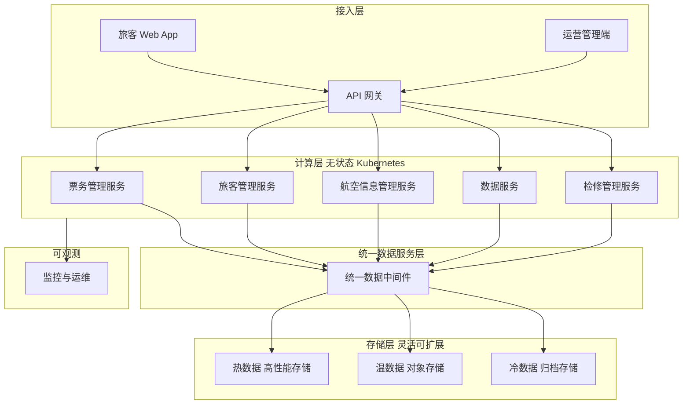

## 1.摘要（字数要求严格限制300字）
2024年3月，我参与某航空公司运营智能管理平台建设，项目面向航空运营机构、机场、旅客等用户，提供航空信息管理、旅客全流程服务、票务交易、航空检修预警、数据智能分析等核心业务功能。项目中，我担任系统架构师，全面负责平台架构设计与核心技术落地。本文围绕云原生存储计算分离模式在航空运营场景中的应用展开论述，通过构建可独立扩展的灵活存储层与热冷数据分级策略降低存储成本，基于 Kubernetes 无状态计算与弹性伸缩提升计算资源利用率与高可用，结合统一数据服务层保障存储与计算解耦后的数据一致性与开发效率。系统于2025年8月正式上线，截至2026年5月已稳定运行10个月，各项功能及性能指标均达到预设标准，获得客户高度认可。

## 2.项目背景（字数要求严格限制500字左右）
随着国家智慧民航建设战略深入推进，航空运输行业数字化、智能化转型迫在眉睫，《智慧民航建设路线图》等政策明确要求推动航空运营全流程数字化、智能化升级。在此背景下，某航空公司于2024年5月启动航空运营智能管理平台建设，旨在构建覆盖全部航线网络、近百个运营基地及数千万常旅客的数字化管理平台，实现航线、航班、票务等核心业务全流程智能管控，同时为每年超3000万旅客提供全场景便捷服务，提升运营效率与服务体验。

我司中标后，我以系统架构师身份负责平台整体架构设计与核心技术落地。平台面临突出业务挑战：节假日高峰日均数十万用户集中办理票务，突发航班变动时访问量激增，且需日均处理800GB实时数据、年度累计处理10PB+离线数据，对资源弹性调度、数据处理效率及系统稳定性、安全性提出极高要求。传统存算一体架构下，存储与计算绑定扩容导致成本高、利用率低，热数据与历史归档混存难以按访问频率优化，且多业务对同一数据的访问缺乏统一入口，存在数据孤岛与重复建设。

为此，我们团队决定采用云原生存储计算分离架构，以独立可扩展的存储池承载多类型数据并实施热温冷分级，以无状态计算节点配合 Kubernetes 弹性伸缩应对峰谷流量，以统一数据服务层屏蔽底层存储与计算差异、保障一致性与高可用。平台于2025年8月正式上线，成功应对多轮节假日高并发压力，高效完成年度航班调度、设备检修预警及海量数据处理任务，为旅客提供全流程服务与7*24小时信息支持，上线一年稳定运行，各项指标达标，获得客户与用户一致认可。

## 3. 问题2回应+过度（字数要求严格限制400字）
由于本项目数据种类多、体量大（实时约800GB/日、离线累计10PB+），传统存算耦合架构下扩容须同步增加计算与存储，低峰期计算资源闲置、存储又因热冷数据混存导致高性能盘占用高、成本居高不下；同时票务、旅客、航班、检修、数据服务等多模块对同一批数据的访问分散在各应用内，缺乏统一数据视图与访问规范，数据一致性与开发效率难以保障。因此我们选用存储计算分离模式作为平台核心架构方向，其核心包括：第一，构建灵活可扩展的存储层，基于对象存储与分级策略实现热数据、温数据、冷数据分层存放与生命周期管理，独立扩容存储容量并降低整体存储成本；第二，采用无状态计算节点与 Kubernetes 弹性伸缩，使计算资源按负载动态扩缩容，提升利用率与可用性；第三，建设统一数据服务层（统一数据中件），对外提供一致的数据访问 API 与领域模型，保障解耦后的数据一致性、高可用与开发效率。

在本项目的实施中，我们通过灵活存储与分级策略、弹性计算与无状态伸缩、以及统一数据服务层三大实践，完成了存储计算分离架构在航空运营智能管理平台中的建设与落地，具体如下。

## 4. 正文部分三段论

### 正文三论点总览表

| 论点 | 要解决的问题 | 方案 / 技术栈 | 核心成效 |
|------|--------------|----------------|----------|
| **论点一：灵活存储与热温冷数据分级策略** | 存储与计算绑定扩容、热冷数据混存导致高性能存储占用高、成本高，历史数据与日志归档缺乏规范 | 采用对象存储与块/文件存储组合，按数据温度与访问频率分级：热数据（实时监控、近期交易）存高性能存储，温数据存标准对象存储，冷数据（超期日志、归档）存低成本冷存储，并配置生命周期自动迁移 | 存储容量独立扩展，整体存储成本降低约 25%，数据可靠性≥99.999%，满足备份与归档合规要求 |
| **论点二：无状态计算与 Kubernetes 弹性伸缩** | 计算与存储耦合导致扩容不灵活，峰谷差异大时资源利用率低、高峰又易出现性能瓶颈 | 业务应用无状态化改造，计算层与存储解耦，基于 Kubernetes 与 HPA 按 CPU/内存或自定义 QPS 指标动态扩缩容 Pod，配合 PVC 挂载共享存储 | 计算资源利用率从约 33% 提升至 70% 以上，服务可用性达 99.95% 以上，峰值时段可快速扩容应对 5500+ TPS |
| **论点三：统一数据服务层保障一致性与开发效率** | 多业务直连多种存储导致接口不一、重复开发，解耦后数据一致性与高可用难以统一保障 | 建设统一数据服务层（API 网关 + 数据中台/统一数据中间件），对外提供统一 RESTful API 与领域模型，屏蔽底层存储类型与拓扑，实现安全、一致的数据访问与审计 | 各业务通过统一接口访问数据，开发效率提升约 40%，数据一致性与高可用由平台统一保障 |

## 灵活存储与热温冷数据分级策略（字数要求严格限制在500-510字左右）
航空运营平台日均产生约 800GB 实时数据、年度累计离线数据达 10PB+，涵盖航班动态、票务交易、设备运行、旅客操作、检修记录及日志与备份等。若采用存算一体或单一存储池，高性能盘会被大量低频访问的历史数据占用，成本高且扩展不灵活；同时民航对核心数据备份与归档有明确保留周期要求，需对热、温、冷数据实施差异化存储与生命周期管理。为此，我们构建了与计算解耦的灵活存储层。存储形态上，引入对象存储作为主存储底座，支持容量独立横向扩展，并配合块存储满足数据库等低延迟场景、文件存储满足共享目录等需求。数据分级方面，按数据温度与访问频率制定策略：热数据（如近 7 天实时监控、当日票务与行程）保留在高性能 SSD 或高 IOPS 块存储，保障查询与报表的响应时延；温数据（如近 3 个月交易与航班数据）迁移至标准对象存储，兼顾成本与访问性能；冷数据（如超 1 年的历史归档、日志与备份）迁移至低成本冷存储或归档存储，并配置生命周期规则自动执行迁移与过期删除。通过上述设计，存储容量可独立于计算节点扩容，整体存储成本较混存方案降低约 25%，数据可靠性达 99.999% 以上，同时满足民航对数据保留与归档的合规要求，为上层弹性计算与统一数据服务提供了稳定、可扩展的存储基础。

## 无状态计算与 Kubernetes 弹性伸缩（字数要求严格限制在500-510字左右）
平台在节假日票务高峰与突发航班变动时负载呈数倍甚至数十倍增长，若计算与存储强绑定，扩容须同步增加磁盘与主机，周期长且低峰期大量计算资源闲置、利用率低。为此，我们将业务应用进行无状态化改造，使计算层与存储层解耦：会话与缓存外置至 Redis 等集中式组件，持久化数据全部落盘至共享存储或远端数据库，单机不再本地绑定数据盘扩容。计算资源由 Kubernetes 统一调度，通过 Horizontal Pod Autoscaler（HPA）基于 CPU、内存或自定义指标（如 QPS、队列堆积长度）动态调整 Pod 副本数；高峰时票务、旅客、数据服务等关键应用可在数分钟内从十余个实例扩展到数十甚至上百个，低峰时自动缩容释放资源。有状态组件的存储需求通过 PVC 挂载分布式存储或对象存储网关满足，保证计算节点可随时扩缩、替换而不影响数据持久性。通过该方案，计算资源利用率从改造前的约 33% 提升至 70% 以上，服务可用性达 99.95% 以上，峰值处理能力稳定达到 5500 TPS，在保障核心业务响应时间≤800 毫秒的同时，显著降低了资源浪费与运维复杂度，为存储计算分离架构提供了弹性、高可用的计算底座。

## 统一数据服务层保障一致性与开发效率（字数要求严格限制在500-510字左右）
存储与计算分离后，若各业务服务直接对接多种存储类型与实例，则接口不统一、重复开发多，且跨库跨存储的一致性、权限与审计难以集中管控。为此，我们建设了统一数据服务层（统一数据中件），对上提供一致的数据访问能力与领域模型。架构上，通过 API 网关与统一数据中间件对外暴露 RESTful API，按业务域划分接口（如订单、旅客、航班、检修、报表等），屏蔽底层是关系库、对象存储还是大数据平台；服务网格与网关负责认证、鉴权与限流，确保访问安全可审计。例如，文件与附件上传统一通过 `/api/v1/file/upload` 等接口写入对象存储，各业务无需各自集成存储 SDK；关键业务数据通过统一数据服务读写，由中间件保障事务边界内的一致性与高可用（主从、多副本）。领域模型与接口规范统一后，前端与中台开发无需关心存储拓扑，开发效率提升约 40%，数据一致性、备份与恢复由平台统一保障，满足了智慧民航对数据共享、安全与可追溯的要求，完成了存储计算分离模式下“存得稳、算得动、用得好”的最后一环。

## 5. 论文总结（字数要求严格限制450字以内）
本平台响应智慧民航建设政策，以云原生存储计算分离模式（灵活存储、弹性计算、统一数据服务）为核心，构建航空运营全流程一体化管理体系，2025年8月上线后稳定运行一年，超额达成预期目标。上线以来，系统日均处理票务交易超12万笔，核心业务响应时间≤800毫秒，运营效率提升35%，旅客投诉率下降40%，设备故障预警准确率92%，系统可用性达99.993%，峰值处理能力突破5500 TPS，成功应对节假日高并发压力，获行业与旅客广泛认可。项目复盘发现架构存在不足：一是数据生命周期目前主要按时间与访问频率分级，未来可结合业务语义与 AIOps 做更智能的冷热识别与自动分层；二是跨存储、跨引擎的全局事务与一致性在部分复杂场景仍依赖应用层补偿。后续将深化存储计算协同优化，探索基于业务语义的全生命周期数据管理与智能存储调度，并持续完善统一数据服务在安全、合规与多引擎协同方面的能力，助力智慧民航高质量发展。

## 6. 系统架构图

**图 8-1** 航空运营智能管理平台·存储计算分离架构图
