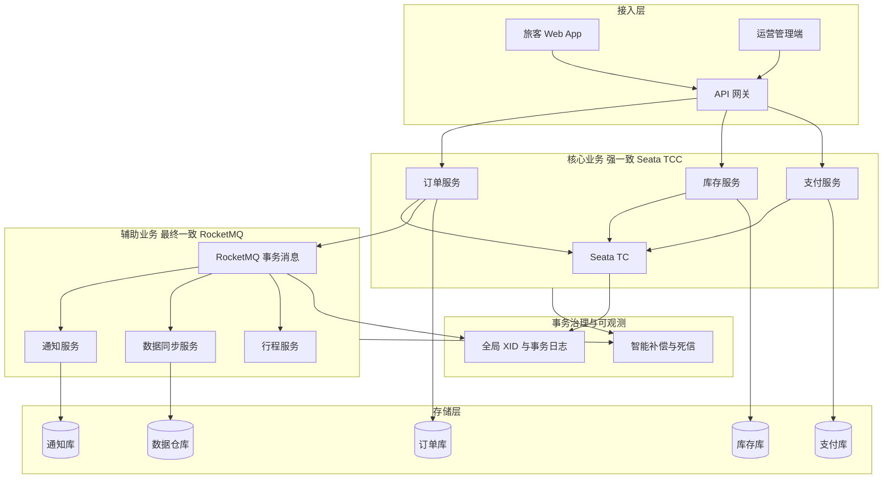

## 1.摘要（字数要求严格限制300字）
2024年3月，我参与某航空公司运营智能管理平台建设，项目面向航空运营机构、机场、旅客等用户，提供航空信息管理、旅客全流程服务、票务交易、航空检修预警、数据智能分析等核心业务功能。项目中，我担任系统架构师，全面负责平台架构设计与核心技术落地。本文围绕云原生分布式事务及其解决方案在航空运营场景中的应用展开论述，通过基于 Seata TCC 模式实现核心票务与资金类业务的强一致性，基于 RocketMQ 事务消息实现辅助业务的最终一致性，结合全链路穿透与异常管理闭环保障分布式事务可靠性。系统于2025年8月正式上线，截至2026年5月已稳定运行10个月，各项功能及性能指标均达到预设标准，获得客户高度认可。

## 2.项目背景（字数要求严格限制500字左右）
随着国家智慧民航建设战略深入推进，航空运输行业数字化、智能化转型迫在眉睫，《智慧民航建设路线图》等政策明确要求推动航空运营全流程数字化、智能化升级。在此背景下，某航空公司于2024年5月启动航空运营智能管理平台建设，旨在构建覆盖全部航线网络、近百个运营基地及数千万常旅客会员的数字化管理平台，实现航线、航班、票务等核心业务全流程智能管控，年服务旅客超3000万人次，为其提供全场景便捷服务，提升运营效率与服务体验。

我司中标后，我以系统架构师身份负责平台整体架构设计与核心技术落地。平台采用微服务架构，票务管理、旅客管理、航空信息管理、通知公告、检修管理、数据服务等模块独立部署与数据库，面临突出业务挑战：节假日高峰日均数十万用户集中办理票务，突发航班变动时访问量激增，且需日均处理800GB实时数据、年度累计处理10PB+离线数据。购票、改签、退票等核心流程涉及订单、库存、支付、行程、通知等多服务多库的跨库操作，若缺乏统一的分布式事务方案，易出现超售、重复扣款、订单与行程不一致等问题，对数据一致性、系统稳定性与合规性提出极高要求。

为此，我们团队决定引入分布式事务综合解决方案，针对核心资金与票务链路采用 Seata TCC 保障强一致性，针对通知、数据同步等辅助业务采用 RocketMQ 事务消息保障最终一致性，并构建全链路事务追踪与智能补偿闭环。平台于2025年8月正式上线，成功应对多轮节假日高并发压力，高效完成年度航班调度、设备检修预警及海量数据处理任务，为旅客提供全流程服务与7*24小时信息支持，上线一年稳定运行，各项指标达标，获得客户与用户一致认可。

## 3. 问题2回应+过度（字数要求严格限制400字）
由于本项目核心票务与资金操作跨多服务多库，若仅依赖本地事务或简单异步消息，无法保证“扣库存、记订单、记支付、生成行程”等步骤的原子性与一致性，易出现超售、重复支付或订单与行程不一致；同时 2PC/3PC 强一致方案在高并发下性能与扩展性不足，Saga 等补偿模式开发与运维复杂度高。因此我们选用“强一致 + 最终一致”相结合的分布式事务方案，其核心包括：第一，基于 Seata TCC 模式实现核心票务与资金类业务的强一致性，通过 Try-Confirm-Cancel 三阶段与资源预留机制，保障订单、库存、支付等关键操作要么全成功要么全回滚；第二，基于 RocketMQ 事务消息实现通知、行程同步、数据统计等辅助业务的最终一致性，解耦主链路与辅助链路，提升吞吐与可维护性；第三，构建全链路事务穿透与异常管理闭环，通过全局事务 ID（XID）、事务日志与智能补偿、死信队列等机制，保障事务可追踪、可补偿、可恢复。

在本项目的实施中，我们通过 Seata TCC 核心强一致、RocketMQ 事务消息辅助最终一致、以及全链路穿透与异常管理闭环三大实践，完成了分布式事务解决方案在航空运营智能管理平台中的建设与落地，具体如下。

## 4. 正文部分三段论

### 正文三论点总览表

| 论点 | 要解决的问题 | 方案 / 技术栈 | 核心成效 |
|------|--------------|----------------|----------|
| **论点一：基于 Seata TCC 实现核心票务与资金类业务的强一致性** | 订单、库存、支付、行程等跨多服务多库，本地事务无法保证原子性，易出现超售、重复扣款、数据不一致 | 采用 Seata TCC 模式：Try 阶段预占库存与资金、生成预订单；Confirm 阶段落库确认；任一失败则 Cancel 回滚。核心资金与票务不走直接跨库转账，统一经账务与订单中心 | 核心交易强一致，未发生超售与重复支付，满足民航对票务与资金一致性的合规要求，支持高并发下单与改退 |
| **论点二：基于 RocketMQ 事务消息实现辅助业务的最终一致性** | 通知、行程同步、数据统计等若同步调用会拉长主链路、成为性能瓶颈且耦合紧密 | 主业务提交后发送 RocketMQ 事务消息（半消息→本地事务→提交/回滚），消费端幂等消费，保证消息不丢不重 | 主链路响应时间显著缩短，辅助业务 TPS 提升数倍，实现解耦与最终一致，通知与数据同步延迟可控在毫秒级 |
| **论点三：全链路事务穿透与异常管理闭环保障事务可靠性** | 分布式环境下网络抖动、服务超时、消息堆积等导致事务状态不确定，需可追踪、可补偿、可恢复 | 全局 XID 贯穿全链路，事务日志记录各参与方状态；智能补偿引擎对超时/失败进行自动或人工补偿；死信队列与重试策略处理消费失败与半消息超时 | 事务可追溯、异常可发现可处置，核心事务成功率≥99.99%，补偿与对账机制有效防范资金与订单不一致 |

## 基于 Seata TCC 实现核心票务与资金类业务的强一致性（字数要求严格限制在500-510字左右）
航空运营平台中，旅客购票、改签、退票等核心流程涉及票务订单、座位库存、支付记录、旅客行程等多个微服务及多库写操作，必须保证“扣库存、生成订单、记录支付、更新行程”等要么全部成功要么全部回滚，否则会出现超售、重复扣款或订单与行程不一致，影响旅客体验与民航合规。我们针对此类核心资金与票务链路采用 Seata TCC 模式。TCC 将一次分布式事务拆为 Try、Confirm、Cancel 三阶段：Try 阶段各参与方执行资源预留与预检查（如预占座位、预扣款、生成预订单），不提交最终状态；若所有 Try 成功，协调器驱动各参与方执行 Confirm，将预留资源转为正式占用并落库；若任一 Try 失败或超时，则执行 Cancel 回滚已预留资源。实践中，我们将订单服务、库存服务、支付服务注册为 TCC 资源方，由 Seata 服务端（TC）协调全局事务，业务侧实现 Try/Confirm/Cancel 接口并在关键写操作前加入全局锁与分支注册。核心资金流转不采用服务间直接划账，而是通过统一账务与订单中心记录借贷与状态变更，避免循环依赖与一致性问题。通过上述设计，平台在节假日高并发场景下保障了核心票务与资金操作的强一致性，未发生超售与重复支付，满足民航对票务数据强一致性的要求，峰值处理能力稳定达到 5500 TPS，核心业务响应时间≤800 毫秒。

## 基于 RocketMQ 事务消息实现辅助业务的最终一致性（字数要求严格限制在500-510字左右）
购票、改签、退票成功后，需触发通知公告推送（短信/站内信）、旅客行程同步、数据服务模块的订单与统计同步等，此类辅助业务若与主流程同步调用，会拉长主链路、放大下游抖动对用户响应时间的影响，且与核心服务耦合紧密。为此，我们采用 RocketMQ 事务消息实现辅助业务的最终一致性。流程为：主业务在本地事务中完成订单与支付落库后，向 RocketMQ 发送“半消息”；本地事务提交后，根据提交结果向 RocketMQ 确认提交或回滚该消息；若生产者未在规定时间内确认，RocketMQ 会回调查询本地事务状态并决定是否投递。消费者侧对通知、行程、数据同步等分别订阅对应主题，消费时做幂等校验（如按订单号+类型去重），保证同一条消息重复投递不会导致重复通知或重复统计。通过该方案，主链路仅负责核心写库与发送事务消息，响应时间显著缩短；辅助业务异步消费，吞吐与扩展性大幅提升，辅助链路 TPS 提升数倍，通知与数据同步延迟控制在毫秒级，同时主辅解耦便于各模块独立扩容与故障隔离，最终一致性通过消息可靠投递与幂等消费得到保障。

## 全链路事务穿透与异常管理闭环保障事务可靠性（字数要求严格限制在500-510字左右）
分布式环境下，网络延迟、服务超时、节点宕机、消息堆积等会导致事务处于“中间状态”，若缺乏全局视角与补偿机制，难以发现与修复不一致。为此，我们构建了全链路事务穿透与异常管理闭环。首先，为每个分布式事务分配全局事务 ID（XID），在 Seata 与 RocketMQ 消息头中贯穿传递，使订单、支付、通知、数据同步等全链路可在日志与监控中按 XID 关联查询。其次，建立全局事务日志与状态库，记录各参与方的 Try/Confirm/Cancel 状态与时间戳，便于对账与排查。再次，建设智能补偿引擎：对 Seata 二阶段超时或失败的分支进行自动重试或触发 Cancel；对 RocketMQ 长时间未确认的半消息、消费失败重试超限的消息进入死信队列，由补偿任务或人工介入进行补偿（如补发通知、补写统计）。死信队列配合告警与工单，形成“发现—补偿—闭环”的异常管理流程。通过上述设计，平台实现了分布式事务的可追踪、可补偿与可恢复，核心事务成功率≥99.99%，未出现因事务不一致导致的资金或订单纠纷，有效支撑了智慧民航对数据可靠性与合规性的要求。

## 5. 论文总结（字数要求严格限制450字以内）
本平台响应智慧民航建设政策，以云原生分布式事务及其解决方案（Seata TCC + RocketMQ 事务消息 + 全链路穿透与异常管理）为核心，构建航空运营全流程一体化管理体系，2025年8月上线后稳定运行一年，超额达成预期目标。上线以来，系统日均处理票务交易超12万笔，核心业务响应时间≤800毫秒，运营效率提升35%，旅客投诉率下降40%，设备故障预警准确率92%，系统可用性达99.993%，峰值处理能力突破5500 TPS，成功应对节假日高并发压力，获行业与旅客广泛认可。项目复盘发现架构存在不足：一是 Seata TCC 的 Try/Confirm/Cancel 三阶段需业务侧大量定制开发，后续将沉淀通用 TCC 框架降低改造成本；二是高并发下 RocketMQ 事务消息的生产与回调压力较大，需结合容量规划与智能重试进一步优化。后续将探索基于服务网格的分布式事务治理与 AIOps 驱动的容量与异常预测，持续提升分布式事务在智慧民航场景下的可靠性、性能与可运维性，助力高质量发展。

## 6. 系统架构图

**图 9-1** 航空运营智能管理平台·分布式事务解决方案架构图
