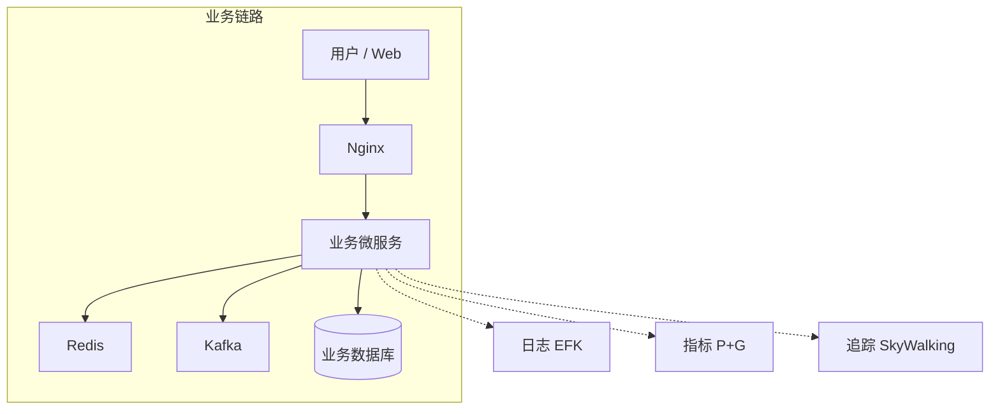

# 航空运营智能管理平台 · 可观测性产品需求设计文档

> 基于论文《云原生可观测性设计与实践——航空运营智能管理平台建设》整理的产品需求设计文档，用于需求追溯与实现对照。

---

## 1. 文档信息

| 项目 | 说明 |
|------|------|
| 产品名称 | 航空运营智能管理平台 · 可观测性体系 |
| 项目背景 | 智慧民航建设、航空运营全流程数字化与智能化 |
| 需求来源 | 论文《云原生可观测性设计与实践——航空运营智能管理平台建设》 |
| 文档类型 | 产品需求设计文档（PRD） |
| 关联文档 | [论文背诵版：云原生可观测性设计与实践](/论文背诵版/云原生/2.云原生可观测性设计与实践-航空运营智能管理平台-论文) |

---

## 2. 产品概述与背景

### 2.1 业务背景

- 政策驱动：国家智慧民航建设战略、《智慧民航建设路线图》要求航空运营全流程数字化、智能化。
- 平台定位：覆盖全部航线网络、近百个运营基地、数千万常旅客，年服务超 3000 万旅客的数字化管理平台。
- 核心业务：航空信息管理、旅客全流程服务、票务交易、航空检修预警、数据智能分析等。

### 2.2 业务挑战（为何需要可观测性）

- 高并发：节假日日均数十万用户集中票务，突发航班变动时访问量激增。
- 海量数据：日均约 800GB 实时数据，年度 10PB+ 离线数据。
- 架构复杂：云原生微服务架构，多模块联动（票务→数据同步→航班校验→旅客核验→通知→检修），链路长、调用关系复杂。
- 运维诉求：故障快速定位、性能瓶颈分析、7×24 稳定运行、审计与合规（票务/权限等）。

### 2.3 可观测性建设目标

以**日志（Logging）、指标（Metrics）、追踪（Tracing）**为核心，构建：

1. **集中式日志管理**：全链路追踪定位与审计追溯。
2. **多层次指标监控与告警**：基础设施、服务、业务层实时健康状态，快速响应。
3. **分布式追踪与可视化**：请求链路溯源与性能瓶颈分析。

---

## 3. 用户与干系人

| 角色 | 说明 | 可观测性诉求 |
|------|------|----------------|
| 运维人员 | 平台运维、故障处理、容量规划 | 统一查日志、看指标、看链路，快速定位与扩容 |
| 开发人员 | 微服务开发与联调 | 按 Trace/服务/接口查调用链与日志，性能分析 |
| 运营/调度 | 业务运营与航班调度 | 业务大盘、票务量、订单成功率、实时看板 |
| 安全/合规 | 审计与合规 | 审计日志长期保留、关键操作可追溯 |
| 航空机构/机场/旅客 | 业务用户 | 间接受益于系统稳定与快速问题修复 |

---

## 4. 功能需求

### 4.1 集中统一日志体系

| 需求 ID | 需求描述 | 验收标准 |
|---------|----------|----------|
| L-01 | 集中采集各节点、容器内应用日志、访问日志、审计日志 | 无分散落盘日志依赖，统一入口采集 |
| L-02 | 日志结构化解析与标准化，并注入 Trace ID、Span ID | 可与分布式追踪按 Trace 关联查询 |
| L-03 | 按时间与业务维度建立索引，支持全文检索与聚合分析 | 支持按请求 ID、服务名、时间范围检索 |
| L-04 | 统一查询与可视化（仪表盘） | 运维/开发可按条件快速检索并查看 |
| L-05 | 票务交易、数据修改、权限变更等关键操作审计日志专项采集与长期保留 | 审计日志保留 ≥1 年，满足民航合规与安全审计 |

**技术方案概要**：EFK（Fluentd DaemonSet 采集 + 结构化 + Trace/Span ID 注入 → Elasticsearch 存储索引 → Kibana 查询与审计）。

### 4.2 多层次指标监控与告警

| 需求 ID | 需求描述 | 验收标准 |
|---------|----------|----------|
| M-01 | 基础设施层指标采集 | 主机 CPU、内存、磁盘、网络及容器资源使用率（如 Node Exporter、cAdvisor） |
| M-02 | 服务层指标采集 | 各微服务暴露指标端点：QPS、延迟分位数、错误率、线程池/连接池状态等 |
| M-03 | 服务层 SLO 与告警 | 响应时间、错误率超过阈值时自动告警 |
| M-04 | 业务层指标采集与展示 | 票务交易量、订单成功率、实时数据接入量、流式计算延迟、设备异常告警数量等 |
| M-05 | 业务大盘与实时看板 | Grafana 等配置业务大盘，支撑运营与调度决策 |
| M-06 | 告警规则与通知 | 按严重级别、业务模块分组与抑制，对接企业通知渠道，7×24 实时监控与快速响应 |

**技术方案概要**：Prometheus 采集 + Grafana 可视化 + Alertmanager 告警。

### 4.3 分布式追踪与精细化可视化

| 需求 ID | 需求描述 | 验收标准 |
|---------|----------|----------|
| T-01 | 各微服务自动埋点（HTTP、RPC、消息队列、数据库等） | 无需业务手写埋点即可生成 Span |
| T-02 | 全链路唯一 Trace ID 及服务间透传 | 单次请求形成完整调用树 |
| T-03 | 链路数据聚合与存储 | 链路拓扑、服务依赖、Span 明细可查询 |
| T-04 | 按 Trace ID、服务名、接口、时间范围查询与可视化 | 单次请求完整调用链、各节点耗时与异常信息 |
| T-05 | 慢请求与错误请求快速筛选与下钻 | 支持从列表下钻到具体 Span/日志 |

**技术方案概要**：SkyWalking Agent 埋点 + OAP 聚合 + UI 查询与调用树展示。

---

## 5. 非功能需求

### 5.1 性能与容量

| 指标 | 目标 |
|------|------|
| 核心业务响应时间 | ≤ 1s（论文实践 ≤800ms） |
| 峰值处理能力 | ≥ 5000 TPS（论文实践 5500+ TPS） |
| 日志检索与指标查询 | 支持高并发查询，不阻塞业务 |

### 5.2 可用性与稳定性

| 指标 | 目标 |
|------|------|
| 系统可用性 | ≥ 99.99%（论文实践 99.993%） |
| 可观测组件自身 | 高可用部署，避免单点；采集与传输不影响业务主路径 |

### 5.3 合规与安全

- 审计日志保留 ≥1 年，满足民航合规与安全审计。
- 日志与追踪数据访问控制、敏感信息脱敏（若适用）。

### 5.4 运维与可维护性

- 故障定位：跨多服务故障定位时间从约 60 分钟缩短至 5 分钟内（论文实践）。
- 7×24 实时监控与告警，快速响应与扩容。

---

## 6. 约束与假设

- 平台已采用云原生微服务架构，技术栈可集成 Agent/Exporter（如 SkyWalking Agent、Prometheus 指标端点）。
- 基础设施支持 DaemonSet 部署（如 Fluentd）、中心化存储（如 Elasticsearch）与查询端（如 Kibana）。
- 组织具备运维与开发使用日志、指标、追踪工具的流程与权限划分。

---

## 7. 验收标准与成功指标（摘要）

| 维度 | 目标/指标 |
|------|-----------|
| 故障定位 | 跨服务故障定位时间 ≤ 5 分钟 |
| 业务性能 | 响应 ≤1s，峰值 ≥5000 TPS，可用性 ≥99.99% |
| 审计合规 | 关键操作审计日志保留 ≥1 年，可追溯 |
| 运维效率 | 7×24 监控与告警，从「猜测式排查」转为「链路驱动分析」 |

---

## 8. 附录

### 8.1 可观测性与业务链路关系（架构示意）

### 8.2 术语

- **LMT**：Logging、Metrics、Tracing（日志、指标、追踪）。
- **EFK**：Elasticsearch、Fluentd、Kibana。
- **P+G**：Prometheus、Grafana。
- **SLO**：Service Level Objective（服务级别目标）。

---

*文档基于论文《云原生可观测性设计与实践——航空运营智能管理平台建设》整理，用于产品需求管理与实现对照。*
