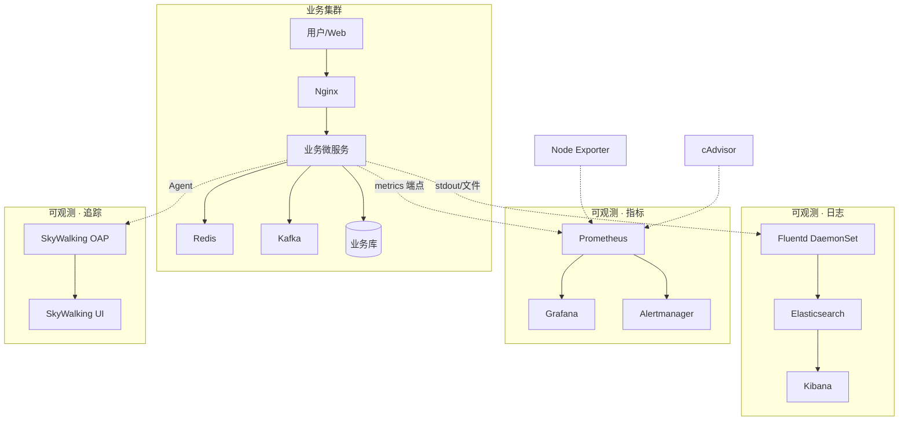

# 航空运营智能管理平台 · 可观测性架构技术设计方案

> 依据[产品需求设计文档](./产品需求设计文档-航空运营智能管理平台可观测性)编制的架构与技术设计，用于实现落地与需求追溯。

---

## 1. 文档信息与需求追溯

| 项目 | 说明 |
|------|------|
| 文档类型 | 架构技术设计方案 |
| 对应 PRD | [产品需求设计文档 - 航空运营智能管理平台可观测性](./产品需求设计文档-航空运营智能管理平台可观测性) |
| 需求范围 | L-01～L-05（日志）、M-01～M-06（指标）、T-01～T-05（追踪）及非功能需求 |

---

## 2. 总体架构

### 2.1 技术选型总览

| 能力域 | 技术栈 | 对应需求 | 说明 |
|--------|--------|----------|------|
| 日志 | EFK（Elasticsearch + Fluentd + Kibana） | L-01～L-05 | 集中采集、结构化、Trace 关联、检索与审计 |
| 指标 | Prometheus + Grafana + Alertmanager | M-01～M-06 | 基础设施/服务/业务指标、SLO 告警、大盘与通知 |
| 追踪 | Apache SkyWalking（Agent + OAP + UI） | T-01～T-05 | 自动埋点、Trace 透传、链路聚合与可视化 |

### 2.2 架构图

### 2.3 设计原则

- **与业务解耦**：采集侧 DaemonSet/Agent/Exporter，不侵入业务主路径；中心组件独立部署。
- **高可用**：Elasticsearch、Prometheus、SkyWalking OAP 等采用多副本/集群，避免单点。
- **可扩展**：日志与指标按时间/业务分索引或分片，支持水平扩展与保留策略（含审计 ≥1 年）。

---

## 3. 日志体系架构设计（对应 L-01～L-05）

### 3.1 组件职责

| 组件 | 角色 | 需求映射 |
|------|------|----------|
| Fluentd | 日志采集、解析、标准化、Trace ID/Span ID 注入、缓冲与转发 | L-01, L-02 |
| Elasticsearch | 存储、按时间与业务维度索引、全文检索与聚合 | L-03 |
| Kibana | 统一查询、仪表盘、审计日志检索 | L-04, L-05 |

### 3.2 部署与数据流

- **Fluentd**：以 **DaemonSet** 部署于业务集群各节点，采集节点上所有 Pod 的容器 stdout/stderr 及挂载的日志文件（应用日志、访问日志、审计日志），实现 L-01 集中采集。
- **解析与标准化**：通过 Fluentd 插件（如 `parser`、`record_transformer`）对日志格式进行解析，统一字段命名（如 `timestamp`、`level`、`message`、`service`、`trace_id`、`span_id`）。Trace/Span ID 可从日志内容中解析或由应用在日志中打印，Fluentd 提取后写入 ES，满足 L-02。
- **Elasticsearch**：
  - 索引策略：按日或按周建索引（如 `logs-app-YYYY.MM.DD`），按业务或服务可建独立索引（如 `logs-audit-*`），便于保留策略与检索，满足 L-03。
  - 审计日志单独索引，保留期 ≥1 年，满足 L-05。
- **Kibana**：配置 Index Pattern、Saved Search、Dashboard，支持按请求 ID、服务名、时间范围、Trace ID 检索，满足 L-04、L-05。

### 3.3 关键配置要点

- Fluentd 输出到 ES 时使用 bulk API，合理设置 buffer 与 flush 间隔，避免对业务 I/O 造成压力。
- 审计类日志在 Fluentd 中通过 tag 或字段路由到独立索引，并配置 ILM（Index Lifecycle Management）或 Curator 实现 ≥1 年保留。
- 敏感字段（若需）在 Fluentd 或 ES ingest 中做脱敏处理，满足非功能中的安全要求。

### 3.4 高可用与容量

- Elasticsearch 集群多节点、分片副本 ≥1；Fluentd 单节点故障仅影响该节点日志，不影响其他节点。
- 按日均 800GB 级日志量规划 ES 集群容量与冷热分层（可选），保证检索性能与成本平衡。

---

## 4. 指标监控与告警架构设计（对应 M-01～M-06）

### 4.1 组件职责

| 组件 | 角色 | 需求映射 |
|------|------|----------|
| Node Exporter / cAdvisor | 基础设施与容器指标采集 | M-01 |
| 业务微服务 | 暴露 Prometheus 指标端点（QPS、延迟、错误率、线程池/连接池等） | M-02 |
| Prometheus | 拉取、存储、告警规则计算 | M-02, M-03, M-06 |
| Grafana | 仪表盘、业务大盘、实时看板 | M-04, M-05 |
| Alertmanager | 告警分组、抑制、静默、对接通知渠道 | M-06 |

### 4.2 分层指标设计

- **基础设施层（M-01）**：Node Exporter 采集主机 CPU、内存、磁盘、网络；cAdvisor 采集容器 CPU、内存、网络等。Prometheus 通过 scrape 拉取。
- **服务层（M-02, M-03）**：各微服务集成 Prometheus Client，暴露 `/metrics`，提供请求 QPS、延迟分位数（如 p99）、错误率、线程池/连接池使用率等。Prometheus 配置 SLO 告警规则（如响应时间 >1s、错误率 >0.01%），满足 M-03。
- **业务层（M-04, M-05）**：业务指标通过自定义 Counter/Gauge 暴露（票务交易量、订单成功率、实时接入量、流式延迟、设备异常告警数等），或在 Prometheus 中通过 Recording Rule 聚合。Grafana 配置业务大盘与实时看板，满足 M-05。

### 4.3 部署与数据流

- **Prometheus**：中心化部署（或联邦），配置 `scrape_configs` 拉取各 Exporter 与业务 /metrics；存储采用本地 TSDB 或远程写（如 Thanos/Cortex）按需扩展。告警规则在 Prometheus 中配置，触发后推送 Alertmanager。
- **Alertmanager**：按严重级别、业务模块做 `group_by`，配置 `inhibit`、`silence`，对接企业钉钉/企业微信/邮件等，满足 M-06 的 7×24 告警与快速响应。
- **Grafana**：数据源指向 Prometheus，配置基础设施、服务、业务三层仪表盘，满足 M-04、M-05。

### 4.4 高可用与性能

- Prometheus 多副本或通过 Thanos 等实现高可用与长期存储；Alertmanager 集群模式防单点。
- 采集与告警计算不占用业务资源；Grafana 查询不影响 Prometheus 抓取与写入。

---

## 5. 分布式追踪架构设计（对应 T-01～T-05）

### 5.1 组件职责

| 组件 | 角色 | 需求映射 |
|------|------|----------|
| SkyWalking Agent | 无侵入/低侵入埋点，HTTP/RPC/MQ/DB 自动插桩，Trace ID 透传 | T-01, T-02 |
| SkyWalking OAP | 接收、聚合、分析追踪数据，存储拓扑与 Span | T-03 |
| SkyWalking UI | 按 Trace ID、服务、接口、时间查询，调用链与耗时展示，慢/错请求筛选 | T-04, T-05 |

### 5.2 部署与数据流

- **Agent**：以 Java Agent 或 sidecar 方式与业务 Pod 一起部署，自动对 HTTP、RPC、Kafka、JDBC 等调用生成 Span，并在跨进程调用时透传 Trace ID/Span ID，满足 T-01、T-02。
- **OAP**：接收 Agent 上报的 segment/span，聚合为 Trace，生成服务拓扑与依赖关系，写入存储（如 Elasticsearch 或 H2/MySQL）。满足 T-03。
- **UI**：查询 OAP 接口，按 Trace ID、服务名、接口、时间范围检索，展示完整调用树、各节点耗时与异常，支持慢请求与错误请求筛选与下钻，满足 T-04、T-05。

### 5.3 与日志的关联

- 业务日志中打印 Trace ID（或由 Agent 注入 MDC），Fluentd 解析后写入 ES 同一字段。在 Kibana 中可按 Trace ID 关联日志与在 SkyWalking UI 中查看的链路，实现「链路驱动分析」。

### 5.4 高可用与容量

- OAP 集群多节点，后端存储使用 ES 时复用日志 ES 集群或独立集群，按采样率与保留天数规划容量。
- Agent 上报失败时本地缓冲与重试，不阻塞主业务。

---

## 6. 非功能设计对照

| 非功能项 | 设计措施 |
|----------|----------|
| 性能/不阻塞业务 | 日志异步采集与缓冲；指标拉取由 Prometheus 主动拉；追踪 Agent 异步上报。 |
| 可用性 ≥99.99% | ES、Prometheus、OAP 多副本/集群；Alertmanager 集群；无单点。 |
| 审计保留 ≥1 年 | 审计日志独立索引，ILM/Curator 保留 ≥1 年。 |
| 访问控制与脱敏 | Kibana/Grafana/SkyWalking UI 接入统一认证与权限；日志/追踪敏感字段脱敏。 |

---

## 7. 实施与集成要点

- **统一 Trace ID**：建议在网关或入口服务生成 Trace ID，经 HTTP Header 或 RPC 上下文传递；Agent 与业务日志统一使用该 ID，便于日志与追踪串联。
- **发布与配置**：Fluentd、Prometheus、Grafana、Alertmanager、SkyWalking 的配置建议版本化管理，与业务发布解耦，支持灰度与回滚。
- **容量与监控**：对可观测组件自身做监控（如 Prometheus 抓取延迟、ES 索引延迟、OAP 接收延迟），确保可观测体系稳定。

---

## 8. 附录：需求 ID 与方案映射表

| 需求 ID | 方案要点 |
|---------|----------|
| L-01 | Fluentd DaemonSet 采集节点/容器日志，统一入口 |
| L-02 | Fluentd 解析 + record_transformer 注入/提取 trace_id、span_id |
| L-03 | ES 按时间/业务建索引，Kibana Index Pattern 与检索 |
| L-04 | Kibana Dashboard 与 Saved Search |
| L-05 | 审计日志独立索引 + ILM 保留 ≥1 年 |
| M-01 | Node Exporter + cAdvisor + Prometheus scrape |
| M-02 | 业务 /metrics + Prometheus scrape |
| M-03 | Prometheus alerting rules（延迟、错误率） |
| M-04 | 业务自定义指标 + Recording Rule + Grafana |
| M-05 | Grafana 业务大盘与看板 |
| M-06 | Alertmanager 分组/抑制 + 通知渠道 |
| T-01 | SkyWalking Agent 自动埋点 |
| T-02 | Agent 透传 Trace ID/Span ID |
| T-03 | OAP 聚合 + ES/DB 存储 |
| T-04 | SkyWalking UI 按 Trace/服务/接口/时间查询 |
| T-05 | UI 慢请求/错误筛选与下钻 + 与 Kibana 按 Trace ID 联动 |

---

*本方案对应[产品需求设计文档](./产品需求设计文档-航空运营智能管理平台可观测性)，用于架构评审与实现落地。*
